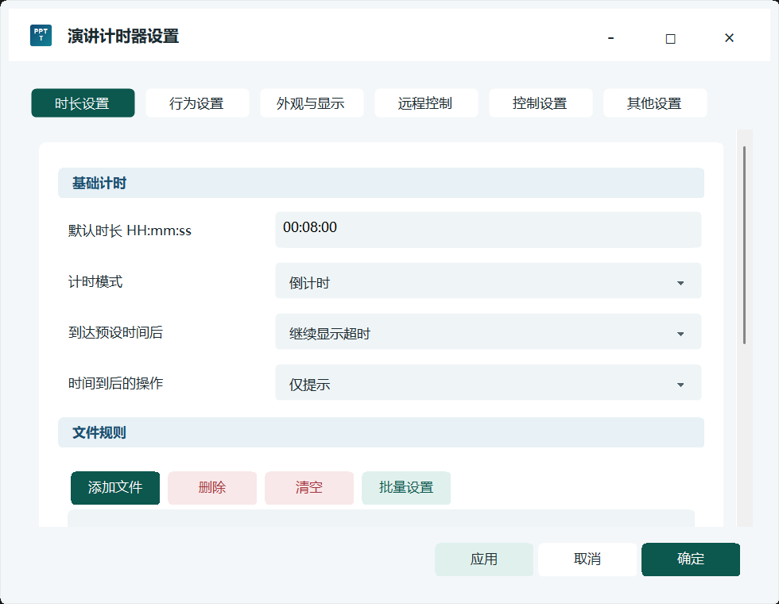
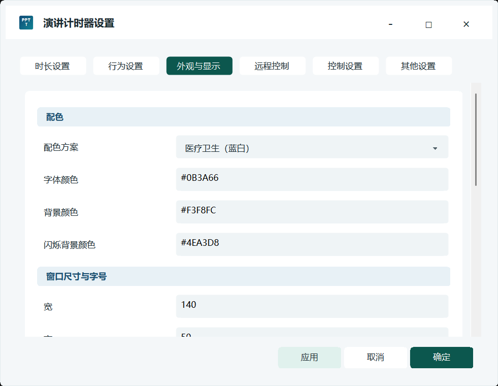
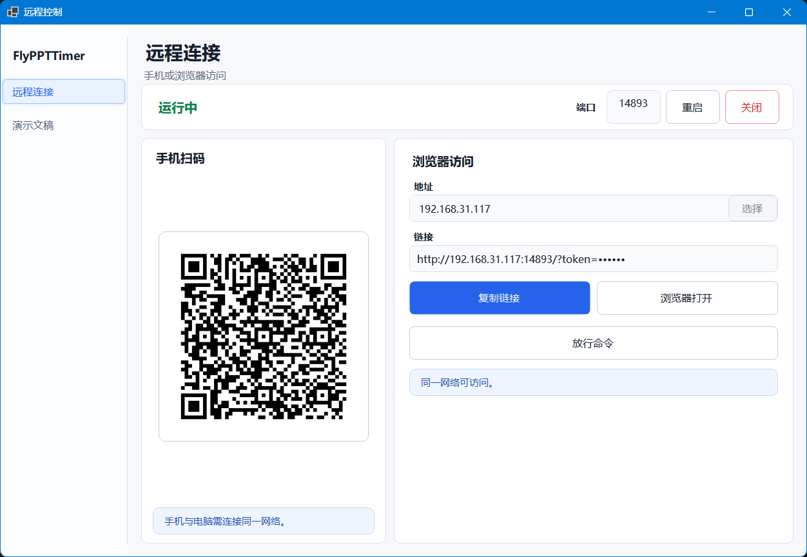
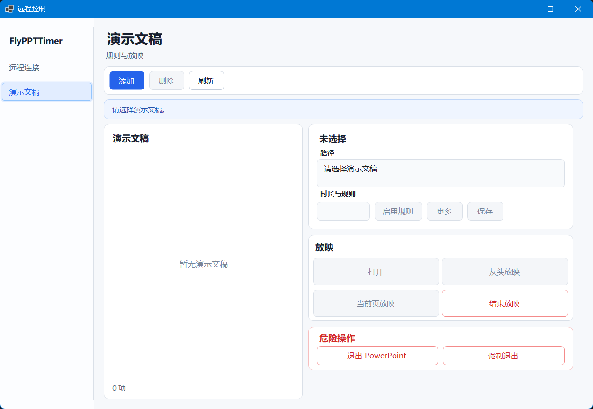
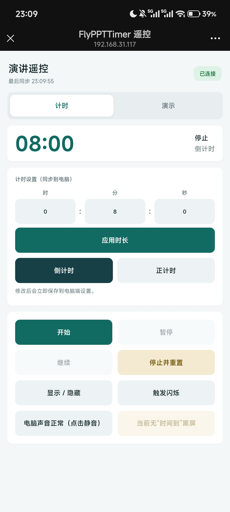
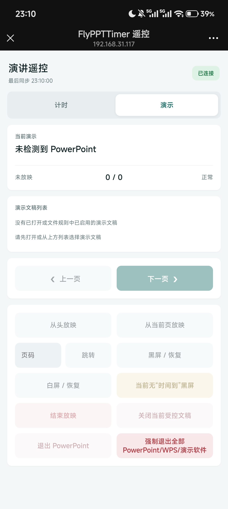
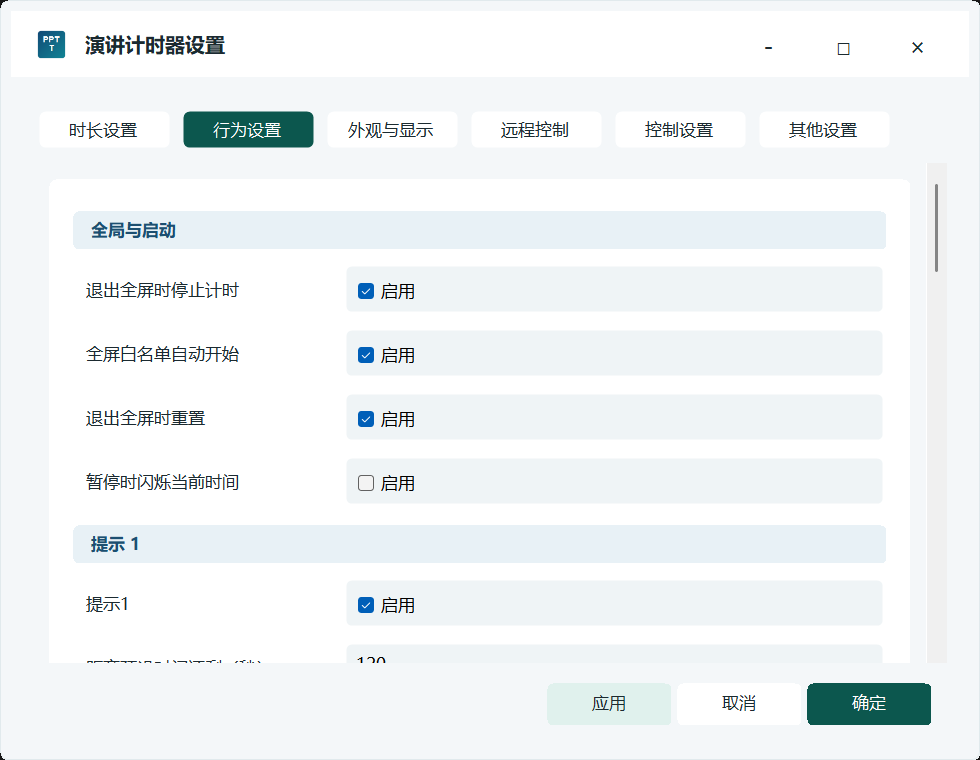

# FlyPPTTimer

<p align="center">
  
</p>

<p align="center">
  <strong>为演讲、教学、会议和医疗汇报准备的 Windows 演示计时器</strong><br>
  PowerPoint / WPS 联动 · 手机局域网遥控 · 正计时与倒计时 · 多显示器悬浮显示
</p>

<p align="center">
  <a href="https://github.com/Hona-Cao/FlyPPTTimer/releases/latest"></a>
  <a href="https://github.com/Hona-Cao/FlyPPTTimer/actions/workflows/windows-ci.yml"></a>
  
  
  <a href="LICENSE"></a>
</p>

FlyPPTTimer 是一款开源、免费、无需云端账户的 Windows 演示计时工具。它把清晰的悬浮时间、演示文稿规则、到时提醒和手机遥控集中在一个应用中，适合 PPT 汇报、培训授课、课堂演示、会议发言以及护理和医疗科室例会等场景。

当前版本为 **v0.20.2**。

代码仓库：[GitHub（主仓库）](https://github.com/Hona-Cao/FlyPPTTimer) · [Gitee（中国大陆镜像）](https://gitee.com/hona-cao/fly-ppttimer)。两个平台均提供正式版下载；中国大陆用户可优先使用 Gitee。

## 下载

| 版本 | 适合人群 | GitHub | Gitee（中国大陆推荐） |
|---|---|---|---|
| 安装版 | 希望通过安装程序完成部署的普通用户 | [下载 v0.20.2 安装版](https://github.com/Hona-Cao/FlyPPTTimer/releases/download/v0.20.2/FlyPPTTimer-v0.20.2-setup-win-x64.exe) | [下载 v0.20.2 安装版](https://gitee.com/hona-cao/fly-ppttimer/releases/download/v0.20.2/FlyPPTTimer-v0.20.2-setup-win-x64.exe) |
| 便携版 | 希望解压即用、配置随程序保存的用户 | [下载 v0.20.2 便携版](https://github.com/Hona-Cao/FlyPPTTimer/releases/download/v0.20.2/FlyPPTTimer-v0.20.2-portable-win-x64.zip) | [下载 v0.20.2 便携版](https://gitee.com/hona-cao/fly-ppttimer/releases/download/v0.20.2/FlyPPTTimer-v0.20.2-portable-win-x64.zip) |

校验文件：[安装版 SHA-256](https://github.com/Hona-Cao/FlyPPTTimer/releases/download/v0.20.2/FlyPPTTimer-v0.20.2-setup-win-x64.exe.sha256) · [便携版 SHA-256](https://github.com/Hona-Cao/FlyPPTTimer/releases/download/v0.20.2/FlyPPTTimer-v0.20.2-portable-win-x64.zip.sha256) · [GitHub Release](https://github.com/Hona-Cao/FlyPPTTimer/releases) · [Gitee 发行版](https://gitee.com/hona-cao/fly-ppttimer/releases)

> v0.20.2 限制手机端切页手势的水平触发角度，纵向滚动不再容易误切换“计时 / 演示”模块；继续使用压缩自包含单文件，无需预装 .NET。

> 目前提供 Windows x64 版本。Windows 首次运行或启用远程控制时，可能询问是否允许访问网络；如需手机遥控，请仅允许“专用网络”并确保手机和电脑连接同一局域网。

## 界面预览

| 计时与文件规则 | 外观与显示 |
|---|---|
|  |  |

| 电脑端远程连接 | 电脑端演示控制 |
|---|---|
|  |  |

<p align="center">
  
  &nbsp;&nbsp;
  
</p>

<details>
<summary>查看更多：提示与行为设置</summary>

<p align="center">
  
</p>

</details>

## 能做什么

### 计时与到时处理

- 支持倒计时和正计时，以及开始、暂停、继续、停止和重置。
- 默认计时窗口为 100×35、微软雅黑 18 号粗体；文字始终在窗口中水平、垂直居中。
- 窗口尺寸或文字宽度变化时，以“默认点位 + 微调”为固定中心原点向四周调整，避免时间显示不全。
- 倒计时到零后可选择停止，或继续以另一种颜色显示已超出的时间。
- 到时后可仅提示、全屏黑屏显示“时间到”，或退出当前放映。
- 提示 1、提示 2 和计时结束可分别配置语音/提示音与闪烁；自选音频会复制到应用自己的存储目录。

### PowerPoint、WPS 与文件规则

- 可为不同演示文稿保存独立时长、计时方式和启用状态。
- 支持勾选多条文件规则后批量修改时长和正/倒计时方式。
- FlyPPTTimer 打开的受控文稿使用只读方式；外部打开的文稿也可按“最后打开优先”逐个静默关闭。
- 支持从头放映、从当前页放映、上一页、下一页、跳页、黑屏、白屏和结束放映。
- 放映结束、黑屏到时动作和计时状态之间保持同步。
- 针对 WPS 外层演示窗口进行识别和首次显示最大化处理。

### 手机或浏览器遥控

- 手机无需安装 App，在浏览器中扫描二维码即可使用。
- 手机端可以调整计时时长、切换正计时/倒计时，并同步保存到电脑；修改全局时长时可选择是否同步全部文件规则。
- “计时”和“演示”页面既可点击标签切换，也可跟随手指平滑左右滑动；只有明确的横向手势才切页，纵向滚动保持原页面。
- 支持显示/隐藏计时窗口、触发闪烁、控制电脑主音量静音。
- “计时”和“演示”页面都可以退出“时间到”黑屏。
- 手机端实时显示连接、计时、静音、演示和命令执行状态。
- 远程链接使用随机 token；“断开所有设备”后旧链接和旧二维码立即失效。

### 显示、配色与可靠性

- 使用 Per-Monitor V2 DPI，适配 100%、125%、150% 等缩放比例。
- 支持多显示器、九宫格默认点位、百分比微调和计时窗口位置重置。
- 远程控制窗口支持标准/紧凑响应式布局，并记忆显示器、位置、大小和最大化状态。
- 默认采用医疗卫生蓝白配色，同时提供教育、商务、科技和高对比预设。
- 配置采用原子写入和备份恢复；日志按日期及大小轮转。
- 可在设置中选择是否在启动时检测新版本，也可从系统托盘手动检测；自动检测默认关闭。
- 安装版确认后可下载安装更新并保留现有配置，绿色便携版则打开 Release 页面供用户自行选择文件。
- 单实例运行，并捕获 UI、后台任务和未处理异常。

## 三步开始使用

1. 下载并安装，或解压便携版后运行 `FlyPPTTimer.exe`。
2. 右键计时窗口或托盘图标打开“设置”，按需要调整时长、提示、配色和显示位置。
3. 需要手机遥控时打开“远程控制”，让手机与电脑连接同一网络，然后扫码访问。

首次启动会在程序目录生成：

- `FlyPPTTimer.config.json`：设置与文件规则。
- `logs/app-日期.log`：运行与错误日志。

升级安装版不会主动覆盖现有用户配置。重要活动前仍建议提前打开演示文稿、扫码连接并进行一次完整彩排。

## 兼容性说明

| 能力 | Microsoft PowerPoint | WPS 演示 | 其他全屏程序 |
|---|---:|---:|---:|
| 全屏时自动联动计时 | 支持 | 支持顶层窗口识别 | 可通过白名单识别 |
| 打开演示文稿 | 支持 | 支持 | 不适用 |
| 从头/当前页放映 | 支持 | 取决于 WPS 兼容接口 | 不适用 |
| 翻页、跳页、黑白屏 | 支持 | 取决于 WPS 兼容接口 | 不适用 |
| 只读受控与逐个静默关闭 | 支持，包含外部打开的文稿 | 按实际检测能力提供 | 不适用 |

WPS 不同版本暴露的兼容接口可能不同，程序会显示实际检测到的能力，不会把未确认的操作伪装为可用。

## 局域网与隐私

- FlyPPTTimer 不依赖云端账户，不会主动上传演示文稿内容。
- 配置、文件规则、自选提示音和日志默认保存在本机。
- 远程控制仅用于同一局域网；请勿将端口转发到公网，也不要公开仍然有效的二维码或完整 token。
- Clash、TUN、代理和常见虚拟网卡地址不会作为推荐扫码地址；优先选择真实 Wi-Fi 或以太网局域网地址。
- 日志、截图和 Issue 中可能包含演示文稿路径，公开前请先检查并移除敏感信息。

## 快捷键

默认快捷键包括：

- `F3`：开始/暂停。
- `F4`：停止/重置。
- `F5`：显示/隐藏计时窗口。

其余控制可在设置窗口中查看和调整。设置窗口本身通过鼠标从计时窗口或托盘菜单打开。

## 从源码构建

环境要求：Windows 10/11、.NET 8 SDK、PowerShell。生成正式安装包还需要 Inno Setup 6（`winget install --id JRSoftware.InnoSetup --exact`）。

```powershell
powershell -NoProfile -ExecutionPolicy Bypass -File .\build.ps1
```

也可以直接使用仓库本地 SDK：

```powershell
.\.dotnet\dotnet.exe restore
.\.dotnet\dotnet.exe build src\FlyPPTTimer\FlyPPTTimer.csproj -c Release
.\.dotnet\dotnet.exe test tests\FlyPPTTimer.Tests\FlyPPTTimer.Tests.csproj -c Release
```

## 项目故事

FlyPPTTimer 由 **曹虎男** 发起并从零开发。作者毕业于南京大学医学院护理专业，目前就职于江苏省人民医院宿迁医院。在工作实践中发现了演讲计时、演示控制和台下远程调整的实际需求，因此逐步将这个想法实现为本项目。

希望它能让大家的演讲、教学、会议和医疗汇报更加从容，也欢迎有兴趣的朋友参与测试、提出建议或共同开发。祝大家使用愉快！

- 联系邮箱：[`caohunan@smail.nju.edu.cn`](mailto:caohunan@smail.nju.edu.cn)
- 问题与建议：[GitHub Issues](https://github.com/Hona-Cao/FlyPPTTimer/issues)
- 参与开发：[CONTRIBUTING.md](CONTRIBUTING.md)
- 完整版本记录：[CHANGELOG.md](CHANGELOG.md)

## 赞赏与支持

如果 FlyPPTTimer 帮你节省了准备和控场时间，欢迎在**完全自愿、量力而行**的前提下请我喝杯咖啡。你的支持将用于持续测试、适配和维护；无论是否赞赏，软件的免费使用和开源功能都不会受到影响。

<p align="center">
  
  &nbsp;&nbsp;&nbsp;
  
</p>

<p align="center">支付宝 · 微信</p>

## 参与贡献

欢迎提交 Issue 和 Pull Request。UI 问题请附上系统版本、屏幕分辨率、缩放比例和脱敏截图；PowerPoint/WPS 问题请同时说明软件版本及复现步骤。完整指南见 [CONTRIBUTING.md](CONTRIBUTING.md)。

## License

FlyPPTTimer 使用 [MIT License](LICENSE) 开源。你可以在保留版权和许可证声明的前提下使用、修改和分发本项目。

Copyright © 2026 Cao Hunan（曹虎男）
