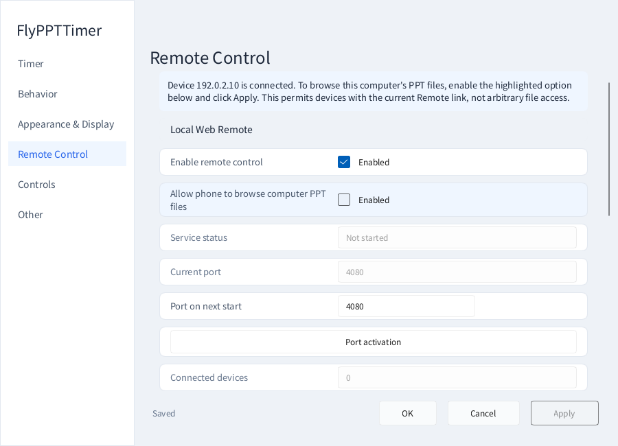
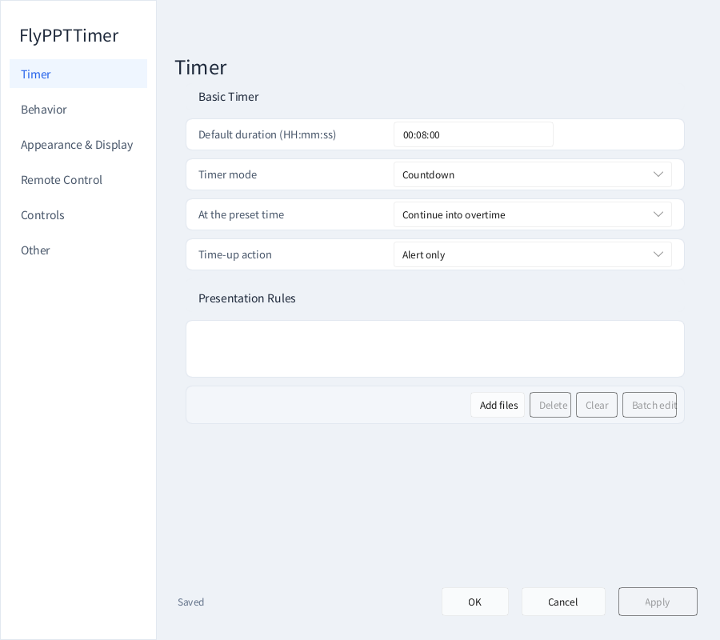
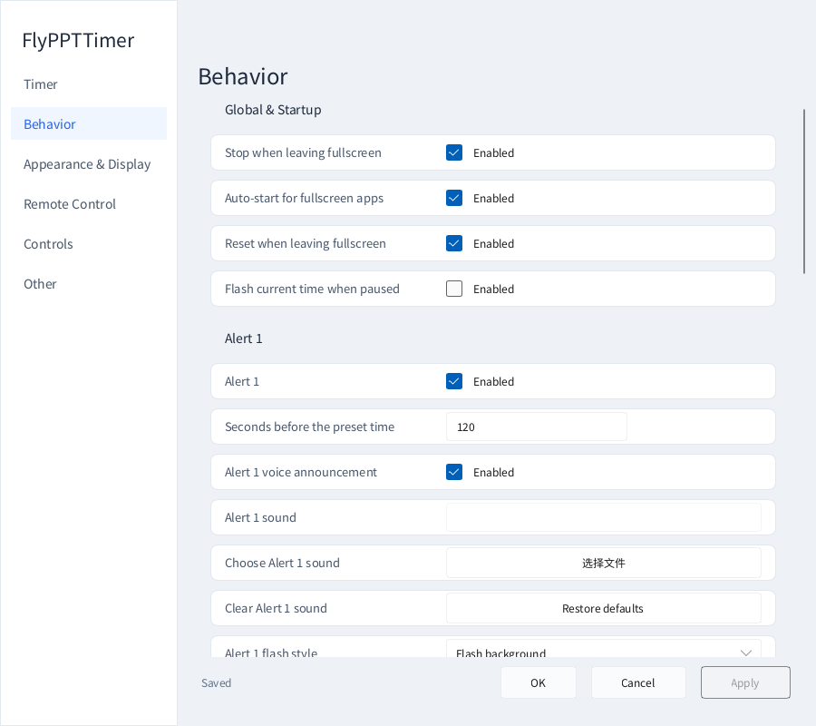
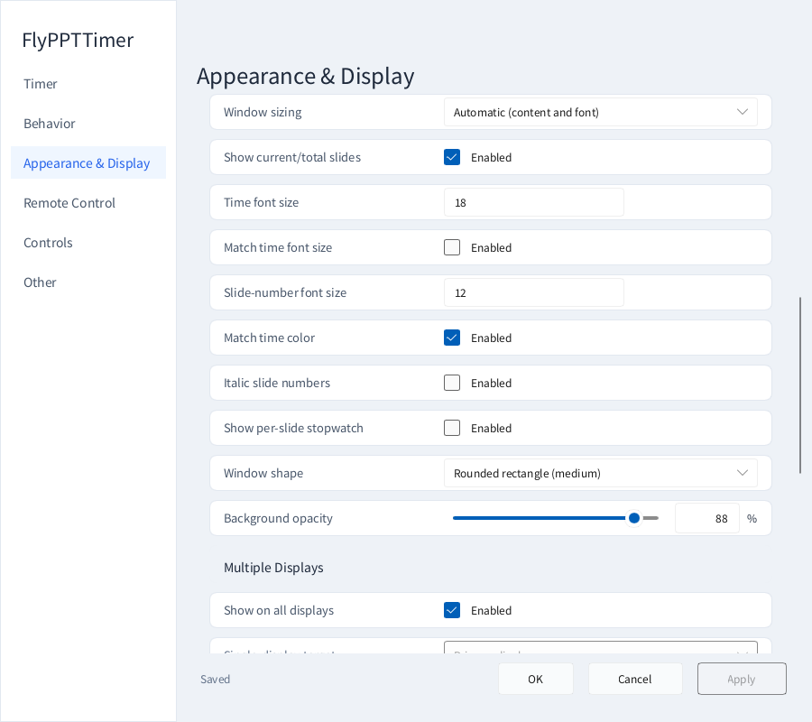
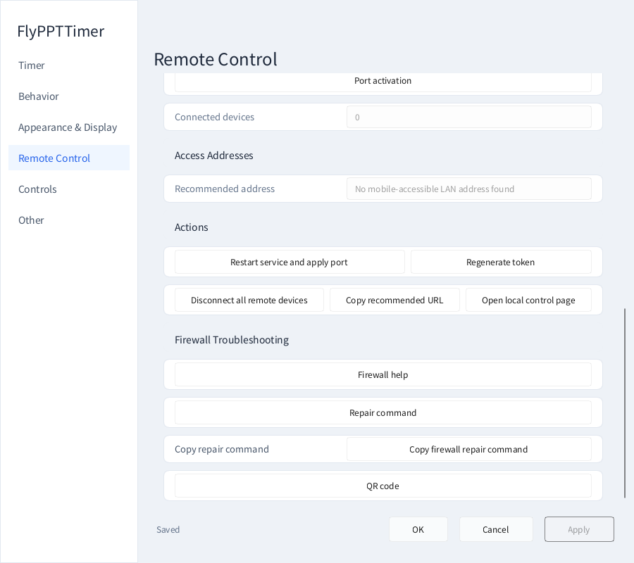
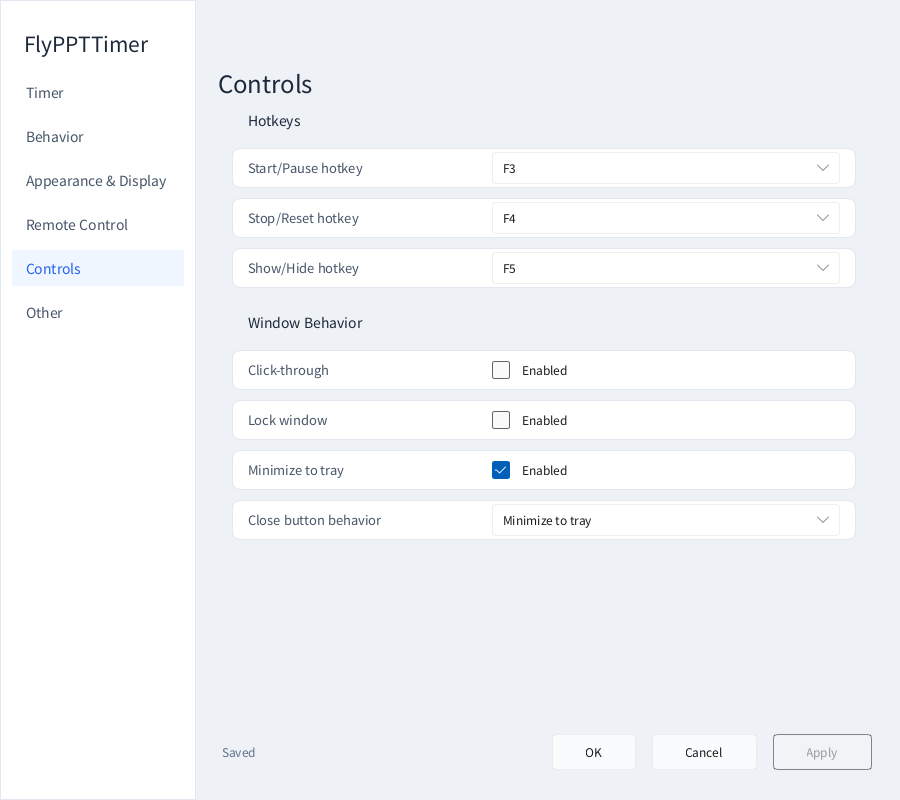
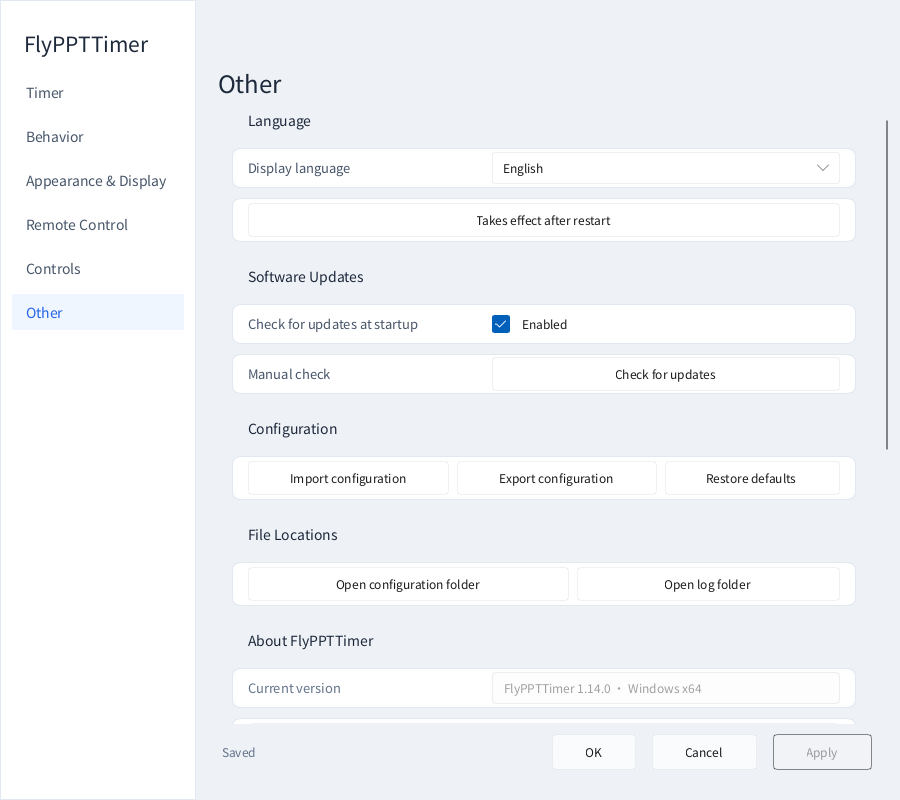
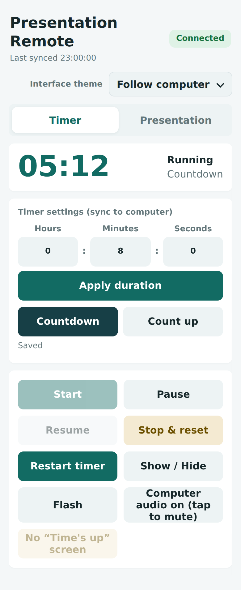
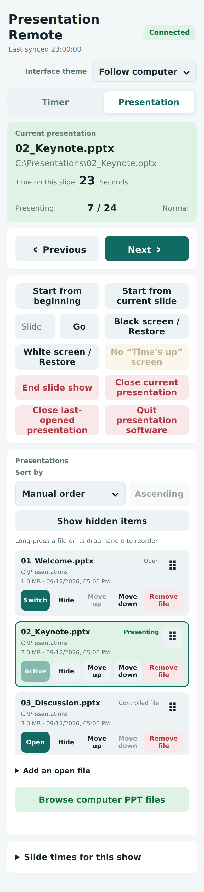

# FlyPPTTimer — PowerPoint / WPS Presentation Timer and Phone Remote

**English** · [简体中文](README.zh-CN.md) · [Complete user guide](docs/USER_GUIDE.en.md)

**A free, open-source Windows PPT timer for talks, teaching, meetings, and thesis defenses.** Display a countdown, elapsed time, and slide numbers above your presentation, and control the timer and slide show from a phone browser. No timers or macros need to be added to individual slides.

**Guide updated for v1.14.1; latest public Release remains v1.14.0.** For Windows 10/11 x64; .NET is not required. Standalone timing works without Office. Slide numbers and presentation control require compatible desktop PowerPoint or WPS Presentation. The phone only needs a browser.

## Contents

[Download](#download) · [v1.14.1 workflow](#v1141) · [Quick start](#quick-start) · [Settings](#settings) · [Phone remote](#phone) · [FAQ](#faq) · [Complete guide](docs/USER_GUIDE.en.md)

## Download and install

The public links below still download **v1.14.0**, not v1.14.1. The delivered v1.14.1 build is recorded with its packages in [Actions](https://github.com/Hona-Cao/FlyPPTTimer/actions/runs/34992459836); downloads may require sign-in and artifact retention is limited. Its [source commit](https://github.com/Hona-Cao/FlyPPTTimer/commit/6e8bd3aeaec7ae8c247e09b535157db7f490047a) is permanent. This documentation update does not publish a new Release.

**For users in mainland China, use the [Gitee Releases page](https://gitee.com/hona-cao/fly-ppttimer/releases).** Gitee is the mainland mirror; synchronization can lag, so check the version shown there. If GitHub is directly accessible from your network, the GitHub package links are also provided below.

| Edition | Mainland China | GitHub | Instructions |
|---|---|---|---|
| Portable | [Gitee Releases — choose Portable](https://gitee.com/hona-cao/fly-ppttimer/releases) | [FlyPPTTimer-v1.14.0-portable-win-x64.zip](https://github.com/Hona-Cao/FlyPPTTimer/releases/download/v1.14.0/FlyPPTTimer-v1.14.0-portable-win-x64.zip) | Extract everything into a writable folder and run `FlyPPTTimer.exe`. Keep the DLLs beside it. Suitable for occasional use or a USB drive. |
| Setup | [Gitee Releases — choose Setup](https://gitee.com/hona-cao/fly-ppttimer/releases) | [FlyPPTTimer-v1.14.0-setup-win-x64.zip](https://github.com/Hona-Cao/FlyPPTTimer/releases/download/v1.14.0/FlyPPTTimer-v1.14.0-setup-win-x64.zip) | Extract and run the installer inside. Suitable for regular use on one computer. |

## v1.14.1: connection guidance, a compact timer, and exact screen edges

**These changes apply to the delivered v1.14.1 build.** With public v1.14.0, open the permission setting manually; it does not navigate there automatically.

**Connect the phone → desktop Settings opens at Remote Control → check the highlighted “Allow phone to browse computer PPT files” option → click Apply → use Presentation → Browse computer PPT files on the phone.** Checking the box without applying is not authorization. Timing and slide navigation do not require file-browsing permission.

| Change | How to use it |
|---|---|
| Direct permission guidance | A new phone connection opens the permission setting when browsing is disabled. Existing permission, polling and reconnecting from an already announced address do not repeatedly reopen it. Connection alone grants nothing; this is not a per-device permission switch. |
| Compact timer | Less space between rows and around the text, without shrinking fonts or changing the left-stopwatch/right-page arrangement. Choose automatic sizing; saved custom dimensions remain unchanged. |
| Exact zero-offset edges | Top-center with both offsets at 0% aligns the actual window top to the screen top. Bottom-center aligns its bottom to the screen bottom—not to the taskbar's upper edge. Change saved nonzero offsets to 0 and Apply for this behavior. |

[Illustrated authorization steps](docs/USER_GUIDE.en.md#file-access) · [Compact timer and edge placement](docs/USER_GUIDE.en.md#edge-placement)

## New in 1.14.0: slide stopwatch and phone file browsing

Enable **Settings → Appearance → Show slide stopwatch**, then Apply. A fixed row below the main timer shows elapsed seconds on the left and slide numbers on the right. The idle placeholders are `00` and `-/-`. The stopwatch follows the slide-number font by default; custom size and color are available.

On the phone, navigation and slideshow buttons now come **before** the file list. Expand **Slide times for this show** to review accumulated seconds for each visited slide. Returning to a slide adds to its total; a new show starts a new record. These are session-only slideshow dwell times, independent of the main timer's pause state.

To add a file from the audience, enable **Allow phone to browse computer PPT files** in desktop Remote settings. Open **Presentation → Browse computer PPT files** on the phone, navigate folders, and choose **Add to list**. Only local folders and `.ppt / .pptx / .pptm` files are listed. There is no file download, deletion, upload or network-share browser. Adding a file does not open it.

The **update window** now shows complete, scrollable release notes and can be resized. Startup checks are on by default, use available GitHub/Gitee stable releases, and only prompt for a newer version. ZIP updates open the release download page.

[Detailed instructions and illustrations](docs/USER_GUIDE.en.md#v1140)

## Quick start

1. Run the program. The floating timer appears. **F3** starts/pauses and **F4** stops/resets.
2. Right-click the timer or notification-area icon → **Settings → Timer**. Enter `00:08:00` for eight minutes, choose Countdown, and click Apply.
3. For different speaking allowances, add PPT files under Presentation Rules, set each duration/mode, and save.
4. Connect the phone and computer to the same network. Open Remote Control from the context menu and scan the live QR code.
5. On the phone's Presentation page, open a listed file and start the slide show from the beginning or current slide.

For standalone timing, only the first two steps are needed. The default is an **eight-minute countdown**, with overtime available. The floating timer appears whenever the application starts; **F5** shows/hides it during the session.

## Settings: what each page does

Open Settings by right-clicking the floating timer or its notification-area icon.

**Apply** saves and keeps Settings open. **OK** saves and closes Settings. **Cancel** discards unapplied changes. The footer indicates unsaved changes. Appearance changes preview immediately but still need Apply or OK to be saved.

| Page | Main purpose |
|---|---|
| [Timer](#settings-timer) | Default duration, countdown/count-up, overtime, time-up actions, and per-file rules. |
| [Behavior](#settings-behavior) | Fullscreen automatic timing, paused-time flashing, two advance alerts, time-up alerts, and overtime colors. |
| [Appearance & Display](#settings-appearance) | Theme, timer colors, sizing, slide-number layout, corners, opacity, displays, and position. |
| [Remote Control](#settings-remote) | Service, ports, connected devices, addresses, connection credentials, and firewall tools. |
| [Controls](#settings-controls) | Function keys, click-through, position locking, tray minimization, and close behavior. |
| [Other](#settings-other) | Language, update checks, configuration import/export, defaults, file locations, and project information. |

### 1. Timer

**Basic Timer** chooses the duration for a session. Enter hours:minutes:seconds: `00:03:00` for three minutes or `00:15:00` for fifteen. Countdown runs toward zero; Count up shows elapsed time. Both can use the preset duration for reminders.

**Time-up action** can alert only, show a full-screen Time's up message, or end the slide show. For an overrun that remains visible, combine Continue into overtime with Alert only. The other two actions end the show and stop/reset the timer.

**Presentation Rules** assigns each `.ppt`, `.pptx`, or `.pptm` its own duration and mode. Enable the rule and save it. Use Ctrl/Shift selection for batch editing. Removing a rule does not delete the PPT file.

[Duration fields, time-up effects, and file-rule instructions](docs/USER_GUIDE.en.md#timer)

### 2. Behavior

**Global & Startup** controls automatic start for recognized fullscreen applications and stop/reset when leaving fullscreen. Turn automatic start off for fully manual timing. Flash current time when paused makes a paused session easier to recognize.

**Alert 1, Alert 2, and Time Up** are independent groups. Advance alerts use seconds remaining: `120` in an eight-minute talk gives a reminder after six minutes; `30` gives another reminder in the final half-minute.

Each group supports speech, a custom short sound, text/background/border flashing, flash intervals, and an overall flash duration. For a silent reminder, turn speech off, clear the custom sound, and retain flashing. Overtime text/background colors and prefix distinguish a talk that has overrun.

[Illustrated guide to all three alert groups, sound, flash timing, and overtime](docs/USER_GUIDE.en.md#behavior)

### 3. Appearance & Display

| Feature | How to use it |
|---|---|
| Theme and colors | Choose System, Light, or Dark for the interface. Timer text, background, and flash colors are separate; use a color picker or a hexadecimal value. |
| Automatic/custom sizing | Automatic fits the content and fonts. Custom reveals Width and Height; leave room for larger fonts. |
| Time and slide numbers | Slide-number size/color can match the time or be independent. Slide numbers are fixed below the main time on the right, with optional slide seconds on the left. Default slide-number size is 12. |
| Shape and opacity | Rectangle or small/medium/large corners. Background opacity is 0–100%; drag, hover-wheel by one percentage point, or type a precise value. |
| Multiple displays | Put small timers on all displays or one selected display. Use a separate extended screen for a large full-screen moderator timer. |
| Position | Choose one of nine anchors. In v1.14.1 zero-offset Top/Bottom-center aligns the actual top/bottom window edge to the full screen. Positive offsets move right/down; drag/reset remains available. |

Enable an extended display in Windows before selecting full-screen timing. It occupies the target screen, so avoid choosing the audience's slide-show display unintentionally.

[Step-by-step colors, sizing, slide numbers, opacity, multi-display and position guide](docs/USER_GUIDE.en.md#appearance)

### 4. Remote Control

For computer-file access, follow the [illustrated connection and authorization steps](docs/USER_GUIDE.en.md#file-access). Check the permission **on the computer** and Apply; phone connection alone does not approve it.

Enable remote control and save to see the service state, current port, and connected-device count. After editing Port on next start, use Restart remote service and apply port, then reconnect the phone.

Copy recommended URL opens the control page on a same-network device. Open local control page uses this computer's browser. Regenerate token and Disconnect all remote devices invalidate the previous connection information; use the new QR code or URL afterward.

For a connection problem, confirm the network and service first, then inspect the firewall. The copy-command button provides a firewall rule to review and run for the current port. Do not disable the firewall or expose the control port to the public internet.

[Ports, every service action, and phone connection instructions](docs/USER_GUIDE.en.md#remote)

### 5. Controls

Select F1–F12 for the three main shortcuts: **F3 Start/Pause, F4 Stop/Reset, F5 Show/Hide** by default. F7 triggers flashing; F8 toggles the computer's main audio output mute.

**Click-through** sends clicks through the timer to the presentation behind it. **Lock window** prevents accidental dragging. Use the notification-area icon to open Settings when click-through is enabled.

Minimize to tray hides the minimized Settings window in the notification area. Close button behavior determines whether closing the timer exits the application or hides it to the tray. OK in Settings simply saves and closes Settings.

[Complete shortcut table and window-behavior guide](docs/USER_GUIDE.en.md#controls)

### 6. Other

**Language** offers System, English, or Simplified Chinese; save and restart when prompted. **Update checks** are on by default at startup and compare GitHub/Gitee stable releases. Full release notes are scrollable.

**Export configuration** backs up settings and rules. **Import configuration** restores them. **Restore defaults** starts a fresh setup. JSON does not include presentations or custom audio files; copy the PPT files and `alert-sounds` separately when moving computers.

**File locations** opens configuration or logs. Lower down, view the current version, project and author information, or open GitHub/Gitee and send email.

[Backups, file locations, upgrading, and uninstalling](docs/USER_GUIDE.en.md#other)

## Phone remote: Timer and Presentation

Connect both devices to the same Wi-Fi, or connect the computer to the phone's hotspot. Right-click the timer → Remote Control and scan the live QR code on the computer.

**Timer:** set duration and mode, start/pause/resume, stop/reset, restart timing, show/hide the timer, flash, or toggle computer mute.

**Presentation:** open a listed document, start from the beginning/current slide, navigate or jump to a slide, use black/white screens, and end the show. Sort, long-press drag, hide, or restore documents. Removing a list item does not delete its file.

Swipe horizontally to switch pages. Vertical swipes scroll the document list first and continue onto the outer page at its boundaries; short lists scroll with the page directly.

Desktop Remote's Presentations page edits rules; the phone/browser Presentation page runs slide shows and changes slides. [Phone guide](docs/USER_GUIDE.en.md#phone)

## FAQ

**Connected but unable to browse computer files?** Connection and browsing permission are separate. In v1.14.1 the computer opens the highlighted option; check it and click Apply. [Step-by-step guide](docs/USER_GUIDE.en.md#file-access)

**Still too large or not flush at 0%?** Confirm v1.14.1 is running, use the intended anchor, set both offsets to zero and Apply. Choose Automatic sizing for the tighter content-sized window. [Sizing and placement](docs/USER_GUIDE.en.md#edge-placement)

**Phone cannot connect?** Check that the service is running and both devices are on the same network, then scan again. Guest networks may block device-to-device access; check VPNs and the current port's Windows Firewall rule. [Troubleshooting](docs/USER_GUIDE.en.md#faq)

**Cannot drag or click the timer?** Open Controls from the notification-area icon and check Lock window and Click-through.

**How do I save a changed value?** Enter or clicking outside finishes the edit. Apply or OK saves it. Cancel discards unapplied previews.

**Full-screen timer unavailable?** Set the external monitor to Extend rather than Duplicate in Windows display settings.

**How do I upgrade?** Export configuration, back up sounds, and exit. Run the setup wizard or extract the complete portable package and migrate personal configuration and `alert-sounds`. [Instructions](docs/USER_GUIDE.en.md#other)

## Help and project resources

[Full English guide](docs/USER_GUIDE.en.md) · [中文教程](docs/USER_GUIDE.zh-CN.md) · [Report an issue](https://github.com/Hona-Cao/FlyPPTTimer/issues) · [Changelog](CHANGELOG.md) · [Development-stage records](docs/development/README.md) · [Build and contribute](docs/BUILDING.md)

Include the version, steps, and relevant screenshots when asking for help. Remove connection tokens, private file paths, and sensitive presentation content. Settings and rules stay on the computer; local-network control does not require a cloud account. Update checks and opening websites use the internet.

[MIT License](LICENSE). Third-party components retain their respective licenses.
