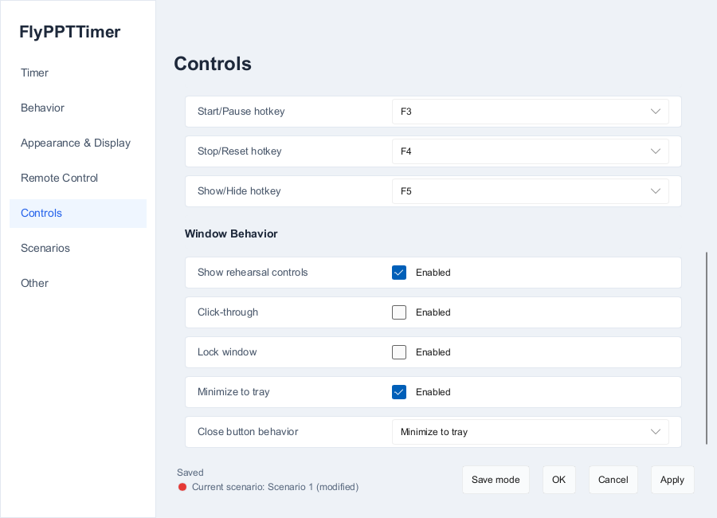
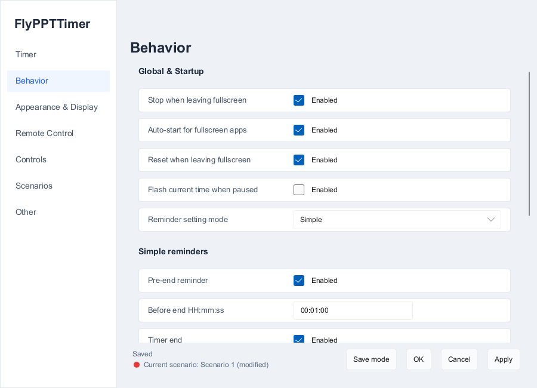
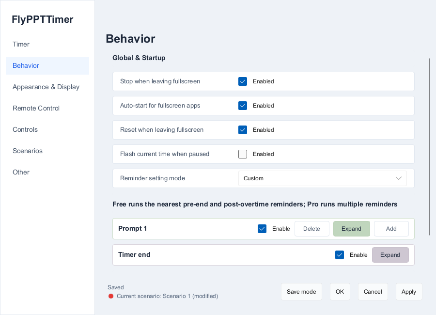
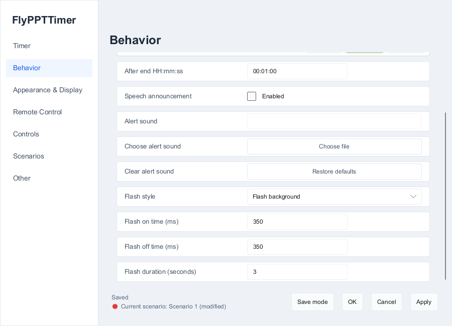
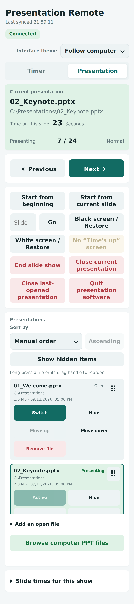
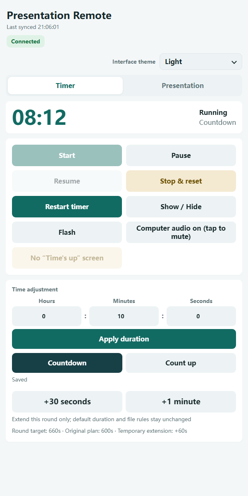
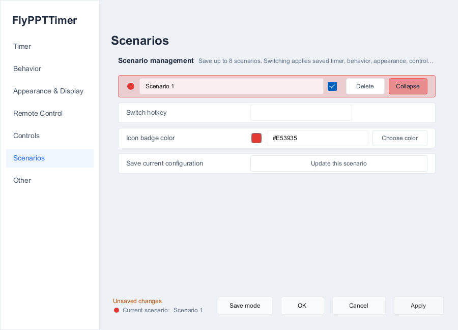
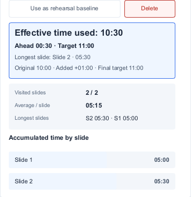
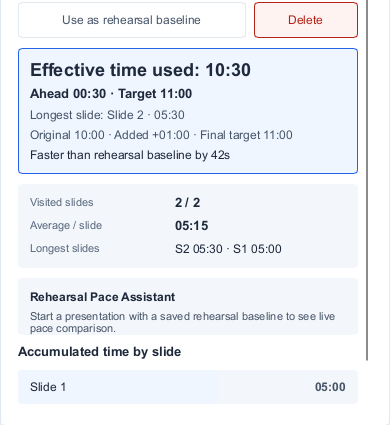
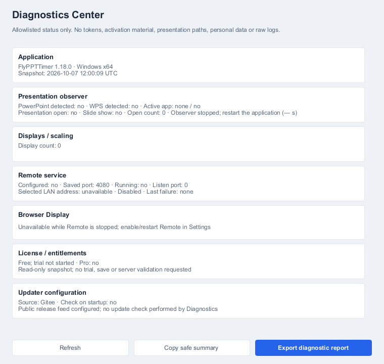

# FlyPPTTimer

### Presentation timing, without breaking your flow.

A Windows presentation timer and control companion for **Microsoft PowerPoint** and **WPS Presentation**.

**[Download](https://github.com/Hona-Cao/FlyPPTTimer/releases/latest)** · **[User Guide](docs/USER_GUIDE.en.md)** · **[简体中文](README.zh-CN.md)**

Current version: **v1.18.0** · [Release notes and upgrade guidance](docs/RELEASE_NOTES_v1.18.0.md)

## Download FlyPPTTimer

**[Download from GitHub](https://github.com/Hona-Cao/FlyPPTTimer/releases/latest)** · [Gitee mirror](https://gitee.com/hona-cao/fly-ppttimer/releases)

Choose the **Windows x64** package that suits your setup:

| Package | Best for | Getting started |
|---|---|---|
| **Portable** | Keeping the app in a folder you choose | Extract the ZIP to a writable folder and launch FlyPPTTimer. |
| **Setup** | A regular installation on your presentation PC | Extract the Setup package and run the included installer. |

Both editions provide the same timer features. **Free covers everyday local presentation timing**; optional Pro features and the explicitly started seven-day trial are explained [below](#free-and-pro).

Upgrading? Back up your configuration and custom alert sounds first. Follow the [user guide](docs/USER_GUIDE.en.md) to keep your settings, and use the [v1.18.0 SHA256 checksums](docs/SHA256SUMS_v1.18.0.txt) to verify the matching downloaded package.

## Why FlyPPTTimer?

A thesis defense, a five-minute pitch, a classroom session: each needs a different pace. FlyPPTTimer keeps the timing close to the presentation, with controls you can prepare before you step on stage.

- **Keep your attention on the talk.** A compact desktop overlay puts remaining or elapsed time within view, with slide numbers and current-slide seconds when a compatible slideshow is active.
- **Prepare once, present with confidence.** Set reminders, choose a monitor and save a scenario for the next defense, competition or meeting.
- **Make the next rehearsal better.** Review recorded slide time, find the slides that took longest and see how the talk compares with its target.

## From rehearsal to the live presentation

### 1. Keep time and slide progress in view

Choose **countdown**, **count up** or **unlimited elapsed timing**. The floating timer can stay on top of your desktop; adjust its font, colors, opacity and position to suit your slides and viewing distance.

With compatible desktop **Microsoft PowerPoint** or **WPS Presentation**, the overlay can also show **current slide / total slides** and the **seconds spent on the current visit to a slide**. Returning to a slide starts a new visit counter; accumulated slide time remains useful for later review.

Presentation integration also supports per-deck timing rules and configurable automatic start, stop and reset around fullscreen presentations. You can still run the timer independently when you do not need slideshow integration.

For a five-minute introduction followed by a fifteen-minute keynote, assign each deck its own duration instead of changing the default between speakers.

  
   
  <em>Actual PPT slideshow with the timer at the top center. This is the placement used for this presentation; customize the monitor, anchor and offsets for your setup. The Chinese slide is shared with the Chinese documentation.</em>

**Local timing, slide information and presentation rules are available in Free.**

### 2. Rehearse with controls beside the timer

During practice, a quick pause or restart should be easy to reach. Enable **Settings → Controls → Show rehearsal controls** to reveal a compact menu when you hover near the timer.

  
   
  <em>Opt in to rehearsal controls here; the setting is off by default.</em>

<table>
  <tr>
    <td width="50%" align="center"></td>
    <td width="50%" align="center"></td>
  </tr>
  <tr>
    <td align="center"><strong>Menu retracted: main time, current-slide seconds and slide number</strong></td>
    <td align="center"><strong>Menu expanded: Reset, Restart, Pause and Resume</strong></td>
  </tr>
</table>

<em>Top-area crops of actual screenshots, captured at different timer moments. Click either crop to view its complete slideshow screenshot.</em>

| Control | What it does |
|---|---|
| **Reset** | Clears elapsed time and stops the round. |
| **Restart** | Clears elapsed time and starts a new round. |
| **Pause / Resume** | Pauses a running round or continues a paused round. |

The menu retracts about **700 ms** after you leave both the timer and menu. A **2 DIP** gap keeps it visually separate, and showing it does not move or shrink the timer body. It follows the timer's appearance and fits beside it, including on the left near a screen's right edge.

This is a **Free** feature. With **mouse click-through enabled**, the menu stays hidden and cannot be clicked. Global shortcuts remain useful for hands-off operation.

### 3. Get reminders that fit your talk

Use **Simple** for a straightforward reminder before the endpoint, at time up and after overtime begins. Shared sound, background flash and speech options keep setup short.

Use **Custom** when you want to edit reminder points and their effects in detail. The two profiles save independently: switching modes does not overwrite the other profile.

<table>
  <tr>
    <td width="50%" align="center">
      
    </td>
    <td width="50%" align="center">
      
    </td>
  </tr>
  <tr>
    <td align="center"><strong>Simple: quick setup</strong></td>
    <td align="center"><strong>Custom: detailed control</strong></td>
  </tr>
</table>

Fresh installations start with **Simple**. Existing configurations keep **Custom** so their detailed reminders are retained.

Need a cue after the talk runs over? Configure a post-overtime reminder, allow timing to **continue into overtime** and choose **Alert only** as the time-up action. It fires only after the endpoint has actually passed while the timer is running.

  
   
  <em>Set the after-end offset and effects for an overtime reminder.</em>

Free runs the enabled Custom reminder **nearest the endpoint on each side**, plus the time-up reminder. Pro runs multiple enabled Custom points. Extra saved points are retained when Pro is unavailable.

While running or paused, switching reminder profiles or applying **any scenario**, including the current one, asks you to confirm a fresh round. Cancel keeps the current round; confirm clears elapsed time and reminder/slide feedback, then keeps the running or paused state.

### 4. Control the presentation from your phone (Pro)

Open **Remote Control** on the PC, then connect a phone browser on the same trusted local network. **No phone app is required.** The connection screen prioritizes setup guidance and service status; technical options sit under **Advanced details**.

**Pro browser Remote** provides timer commands and presentation controls, including previous/next slide, starting or ending a slideshow, jumping to a page and black/white screen controls. You can also manage the controlled presentation list and inspect slide timing.

<table>
  <tr>
    <td width="50%" align="center"><strong>Slide navigation · sample decks</strong></td>
    <td width="50%" align="center"><strong>Temporary timer extension · sample data</strong></td>
  </tr>
  <tr>
    <td width="50%" align="center" valign="top">
      
    </td>
    <td width="50%" align="center" valign="top">
      
    </td>
  </tr>
</table>

*Static browser UI examples: the retained presentation page shows navigation; the v1.18.0 isolated timer example shows temporary extension.*

Browsing local PPT files from the phone requires **separate permission on the PC**. Connect only trusted devices and keep the connection QR code and full Remote URL private.

**Pro Remote** can add **+30 seconds / +1 minute (+60 seconds)** to a running or paused finite round. Additions accumulate; a paused round stays paused. These commands leave the saved duration, scenarios and per-deck rules unchanged. Reset or restart clears added time; stopped, finished and unlimited rounds cannot be extended.

For a separate browser-based timer screen, **Browser Display (Pro)** supplies a view without presentation-control buttons. If the connection drops, it keeps the last valid display and retries automatically.

See the [Free / Pro comparison](#free-and-pro) and [connection guide](docs/USER_GUIDE.en.md) before choosing this workflow.

### 5. Put the right timer on each screen

Use a compact overlay for the speaker and a **dedicated fullscreen timer** for a moderator or confidence monitor. Select the target **monitor**, choose one of **nine anchor positions** and fine-tune offsets, size and opacity.

The dedicated big-screen view can show time alone or include slide metadata. Choose its screen deliberately so it fits your presentation setup.

**Scenarios** save a working setup: timing, reminders, appearance, displays, controls and presentation rules. Keep a defense setup ready, then switch to a competition or classroom setup without rebuilding each setting.

  
   
  <em>Saved scenarios for repeat use; this retained screenshot shows the scenario settings.</em>

| Example scenario | A setup you might save |
|---|---|
| **Defense** | Eight-minute countdown, advance reminder, compact speaker overlay |
| **Competition** | Five-minute countdown, overtime reminder, fullscreen moderator timer |
| **Classroom** | Unlimited count up, slide information, selected display placement |

Free includes one available scenario and local multi-display output. Pro enables additional scenarios. Applying a scenario during a running or paused round requires fresh-round confirmation on the desktop, including requests made from the phone.

### 6. Learn from the completed presentation

Open **Presentation Review** after a slideshow to see **effective time used**: the sum of valid recorded slide time. Revisited slides accumulate. This measure comes from slide records rather than the wall-clock span between starting and finishing.

The summary compares effective time with the **final target**, highlights the longest accumulated slide and retains detailed slide statistics and history. With a temporary extension, it shows **original plan + added time + final target**. Unlimited rounds omit target comparison.

  
   
  <em>See how the completed talk compares with its final time allowance.</em>

**Base Review is Free.** For repeated practice, Pro lets you explicitly select a review of the **same presentation** as a rehearsal baseline. Its comparison uses the effective time of both runs; it is separate from the final-target comparison.

  
   
  <em>Compare a later run with a selected rehearsal baseline.</em>

A baseline is never chosen automatically. Standalone timer practice does not create a slideshow Review record.

### 7. Troubleshoot with a safe diagnostic report

Open **Settings → Other → Diagnostics Center**, or use its tray entry, to check app, presentation observer, display, Remote, Browser Display, license-summary and updater status.

  
   
  <em>Inspect status, copy a safe summary or export a diagnostic report.</em>

**Copy safe summary** and **Export diagnostic report** include only allowed status fields. They omit Remote tokens, activation data, presentation paths/content, raw configuration and logs. Refreshing Diagnostics does not start a trial or contact licensing/update services.

Use the report when asking for help with detection or connectivity. Review any additional screenshots before sharing them.

## Free vs Pro

Start with Free for everyday local timing. Choose Pro when your workflow needs phone operation, more saved setups or rehearsal comparisons.

| Feature | Free | Pro |
|---|---|---|
| Countdown, count up, unlimited timing and overtime | Included | Included |
| Slide numbers, current-slide seconds and per-deck rules | Included | Included |
| Local overlays, monitor placement and fullscreen timer | Included | Included |
| Optional hover rehearsal menu | Included | Included |
| Simple / Custom reminders | Simple; nearest enabled Custom pre-end and post-overtime point, plus time up | Multiple enabled Custom points |
| Saved scenarios | One available scenario | Additional scenarios, up to eight |
| Base Presentation Review and Diagnostics Center | Included | Included |
| Phone Remote and Browser Display | Requires Pro | Included |
| Remote +30 / +60 seconds for the current finite round | Requires Pro | Included |
| Selected rehearsal baseline and pace comparison | Requires Pro | Included |

Extra stored Pro reminder points and scenarios remain saved when Pro is unavailable; they become available again with Pro.

The **seven-day trial starts only after explicit confirmation**. See **Settings → Other → Pro License** for the current activation and purchase options.

## Quick start

1. **Download** a Windows x64 package [above](#download), then extract Portable or run the Setup installer.
2. **Launch FlyPPTTimer** and open Settings. Choose a duration, timing mode and your preferred reminder profile.
3. **Place the timer** on the monitor you will use; adjust its appearance and enable rehearsal controls if useful.
4. **Start a practice round.** Default shortcuts: **F3** starts, pauses or resumes; **F4** stops and resets. Start a compatible PowerPoint/WPS slideshow for slide-aware timing.
5. **Prepare the live setup.** Save a scenario, check your display placement and reminders, and connect Remote if you use Pro phone control.

The [complete English guide](docs/USER_GUIDE.en.md) walks through presentation rules, display placement, controls, Remote and troubleshooting.

## Frequently asked questions

**Does it work without Office?**

Yes, standalone timing works without Office. Slide information and presentation control require a compatible desktop PowerPoint or WPS Presentation installation on Windows 10/11 x64.

**Portable or Setup—and will an update keep my settings?**

Use Portable for a folder-based installation or Setup for an installed copy. Back up your configuration and alert sounds before upgrading. For Portable, follow the guide when transferring them; avoid replacing personal settings with the new package's defaults. Existing configurations retain Custom reminders and saved shape choices.

**Why will my phone not connect, and is Remote safe to share?**

Phone and PC must be on a reachable, trusted local network; check firewall access and network isolation. Keep QR codes and authenticated connection URLs private. Local file browsing needs separate PC permission. Do not expose the service to the public internet.

**Why is the hover menu missing?**

It is off by default. Enable Show rehearsal controls and apply the setting. Mouse click-through hides the menu completely; use configured hotkeys or disable click-through to interact with it.

**Can an unexpired trial resume offline after restarting the app?**

Restarting still requires **online reconfirmation**. The original seven-day period does not reset. Do not rely on offline trial recovery after a restart.

## Compatibility

- **Windows 10 / Windows 11, x64.**
- Standalone timing needs no presentation software.
- Slideshow integration requires compatible desktop **Microsoft PowerPoint** or **WPS Presentation**.
- Remote uses a modern browser on a device with local-network access to the PC.

Check the presentation software, displays and network you plan to use during rehearsal.

## Technology

The desktop app is built with **Rust + Slint** and native Windows integration. Remote and Browser Display are browser interfaces served by the PC.

The top badges describe the current application. This public repository also contains release material and documentation.

## Documentation and support

| Resource | Link |
|---|---|
| User guides | [English](docs/USER_GUIDE.en.md) · [简体中文](docs/USER_GUIDE.zh-CN.md) |
| v1.18.0 release notes | [English](docs/RELEASE_NOTES_v1.18.0.md) · [简体中文](docs/RELEASE_NOTES_v1.18.0.zh-CN.md) |
| Download verification | [v1.18.0 SHA256 checksums](docs/SHA256SUMS_v1.18.0.txt) |
| Bugs and feature requests | [GitHub Issues](https://github.com/Hona-Cao/FlyPPTTimer/issues) |
| Legal information | [License](LICENSE) · [Third-party notices](THIRD_PARTY_NOTICES.md) · [Brand policy](TRADEMARKS.md) |

For feedback, include the app, Windows and PowerPoint/WPS versions, reproduction steps and a safe Diagnostics summary if relevant. Remove private content, live QR codes and Remote URLs from screenshots.

For privacy, distinguish a safe diagnostic report from other material you choose to share. Enabling phone file browsing exposes folder and PPT names to devices with a valid Remote connection; grant that access only when needed.

## Star History

If FlyPPTTimer is useful in your presentation workflow, starring the repository makes it easier to find again and helps show how the project is growing.

<a href="https://www.star-history.com/?repos=Hona-Cao%2FFlyPPTTimer&type=date&legend=top-left">
  <picture>
    <source media="(prefers-color-scheme: dark)" srcset="https://api.star-history.com/chart?repos=Hona-Cao/FlyPPTTimer&type=date&theme=dark&legend=top-left">
    <source media="(prefers-color-scheme: light)" srcset="https://api.star-history.com/chart?repos=Hona-Cao/FlyPPTTimer&type=date&legend=top-left">
    
  </picture>
</a>
