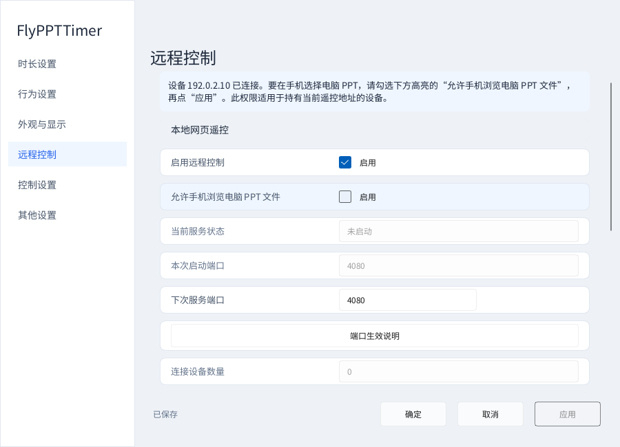
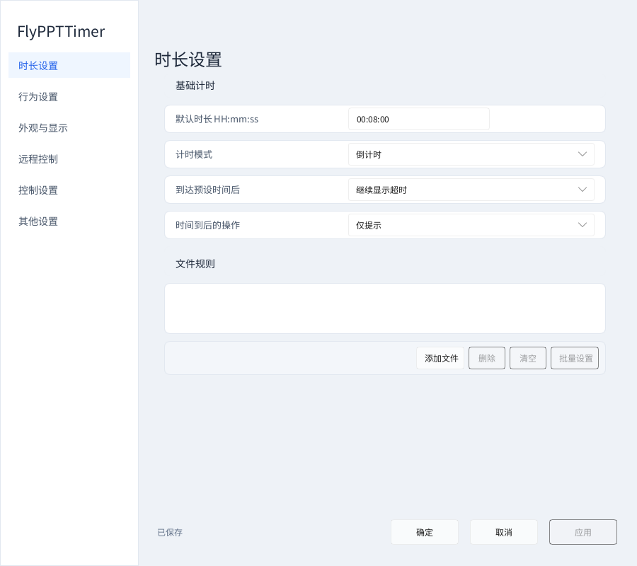
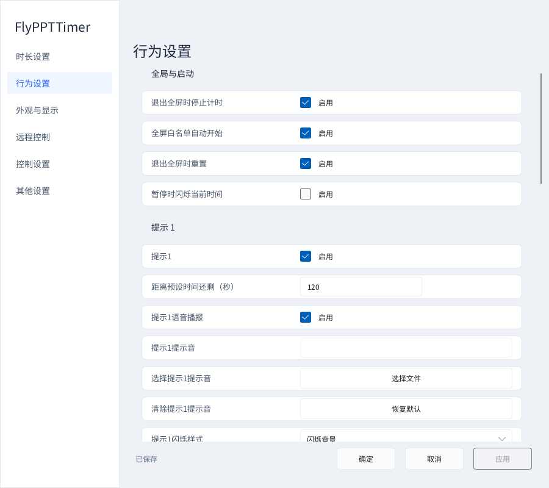
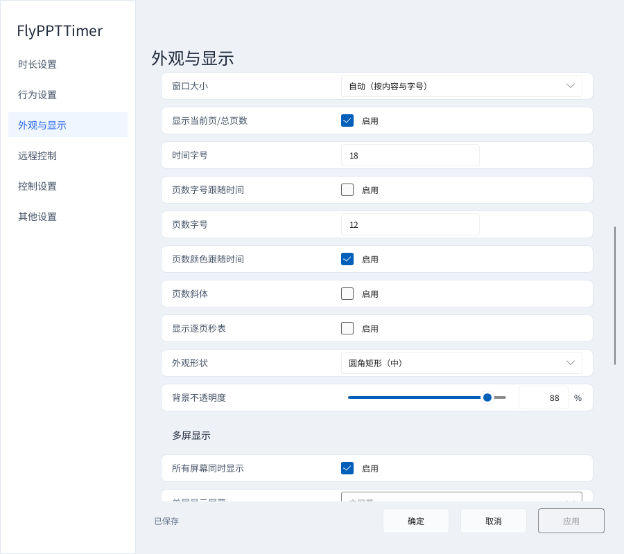
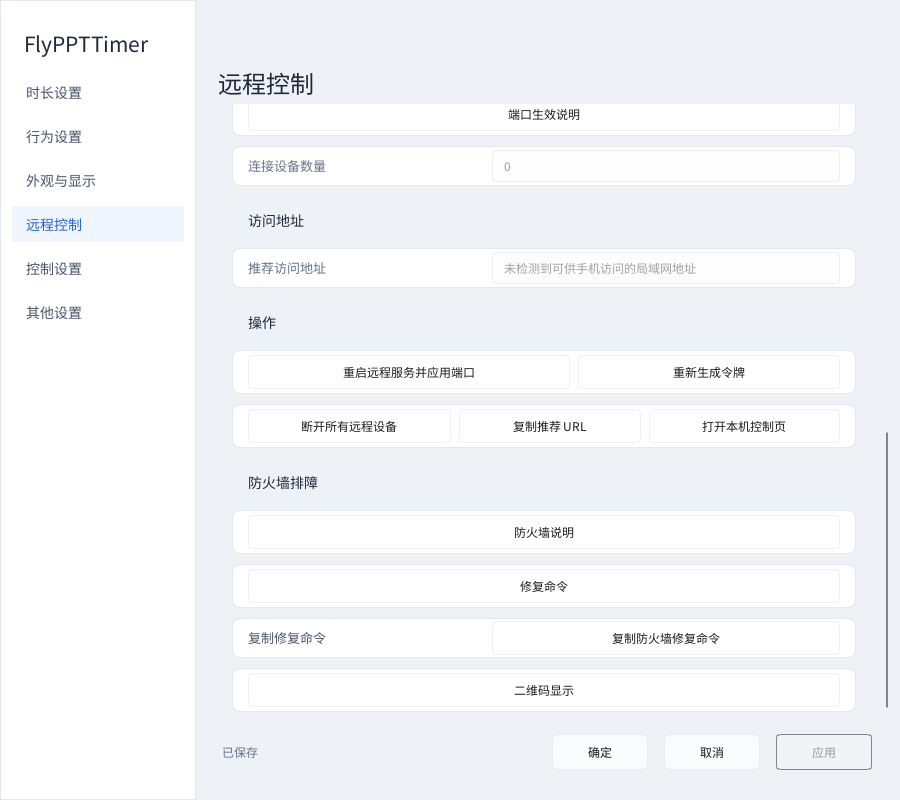
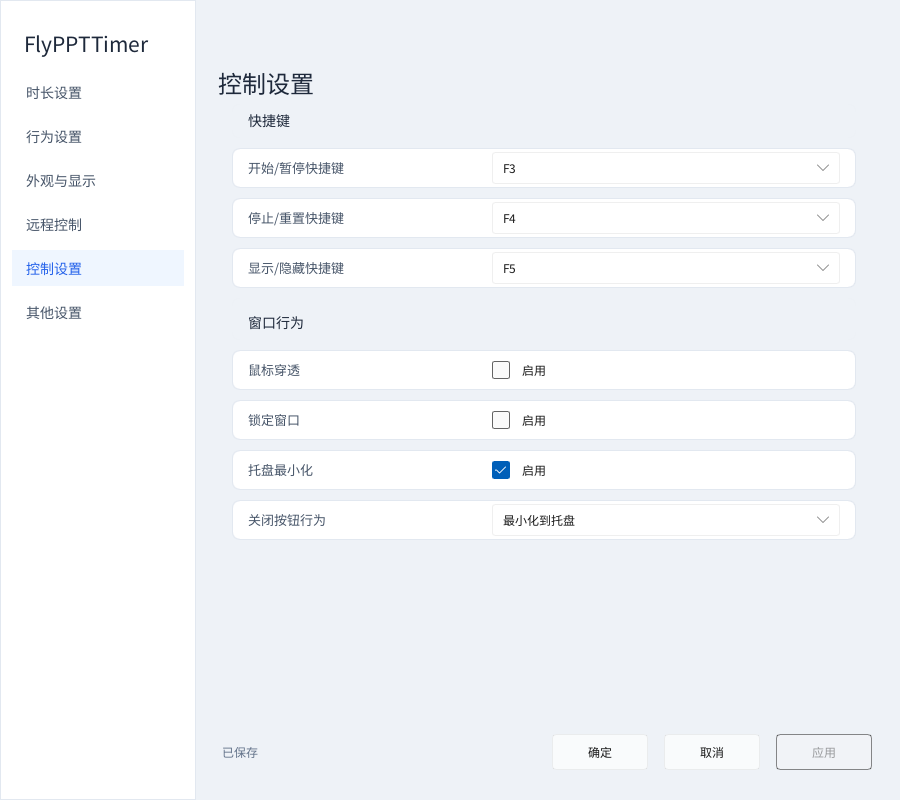
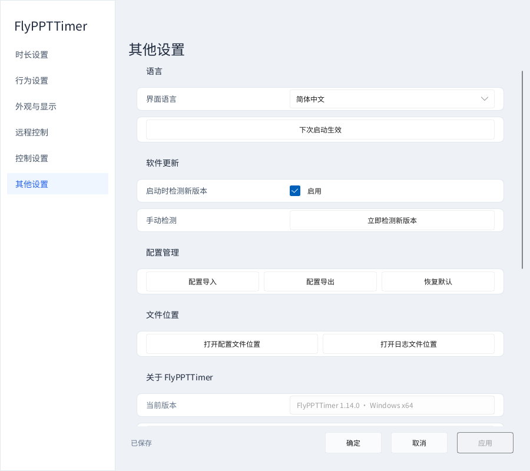
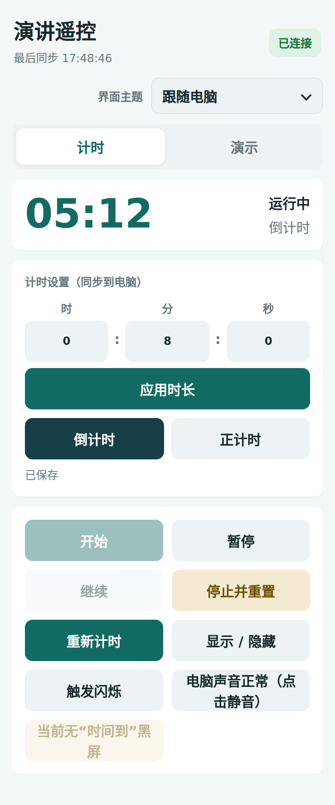
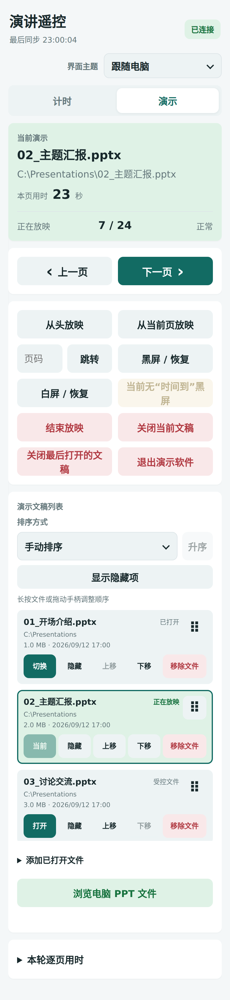

# FlyPPTTimer — PPT 计时器、PowerPoint / WPS 演讲倒计时与手机遥控

[English](README.md) · **简体中文** · [完整使用教程](docs/USER_GUIDE.zh-CN.md)

**免费、开源的 Windows 演示计时工具。** 显示倒计时、正计时和 PPT 页数，用手机浏览器控制演示与时间。适合会议发言、论文答辩、课堂教学、培训和多人轮流演讲，无需往每张幻灯片里插入计时器。

**当前正式版：v1.14.1。** 支持 Windows 10 / 11 x64，无需安装 .NET。独立计时不需要 Office；页数识别和放映控制需要桌面版 PowerPoint 或 WPS 演示。手机无需安装 App。

## 导航

[下载与安装](#download) · [v1.14.1 新用法](#v1141) · [快速开始](#quick-start) · [六个设置模块](#settings) · [手机遥控](#phone) · [常见问题](#faq) · [完整教程](docs/USER_GUIDE.zh-CN.md)

## 下载与安装

以下下载均为 **v1.14.1**：直接发布之前已交付的便携版和安装版 ZIP，没有重新编译或重新打包。网上图文教程已更新；为保持安装包原样，包内文档保留构建时的版本。

**中国大陆用户建议从 [Gitee 发布页](https://gitee.com/hona-cao/fly-ppttimer/releases/tag/v1.14.1) 下载。** Gitee 是本项目的国内镜像；镜像同步可能有延迟，请以页面实际版本为准。如果当前网络可以正常访问 GitHub，也可以使用右侧的 GitHub 直链。

| 版本 | 中国大陆下载 | GitHub 下载 | 使用方式 |
|---|---|---|---|
| 便携版 | [Gitee 发布页（选择便携版）](https://gitee.com/hona-cao/fly-ppttimer/releases/tag/v1.14.1) | [FlyPPTTimer-v1.14.1-portable-win-x64.zip](https://github.com/Hona-Cao/FlyPPTTimer/releases/download/v1.14.1/FlyPPTTimer-v1.14.1-portable-win-x64.zip) | 完整解压到可写文件夹，运行 `FlyPPTTimer.exe`，保留旁边的 DLL。适合临时使用或放在 U 盘里。 |
| 安装版 | [Gitee 发布页（选择安装版）](https://gitee.com/hona-cao/fly-ppttimer/releases/tag/v1.14.1) | [FlyPPTTimer-v1.14.1-setup-win-x64.zip](https://github.com/Hona-Cao/FlyPPTTimer/releases/download/v1.14.1/FlyPPTTimer-v1.14.1-setup-win-x64.zip) | 解压后运行安装程序，按向导安装。适合日常固定使用。 |

## v1.14.1：连接后授权、紧凑浮窗与贴边定位

**v1.14.1 用户按下面的新流程操作。** v1.14.0 的用户仍需手动进入授权设置，不会自动跳转。

**手机扫码成功 → 电脑自动打开“设置 → 远程控制” → 勾选高亮的“允许手机浏览电脑 PPT 文件” → 点击“应用” → 手机“演示 → 浏览电脑 PPT 文件”。** 勾选但未应用，手机仍没有权限；仅需翻页、计时的用户可以不授权。

| 变化 | 怎样用 |
|---|---|
| 自动定位授权入口 | 尚未授权时，新手机连接会引导到上图；已授权、持续刷新或同一地址短暂重连不会反复弹出。它不自动授权，也不是单独给某一台手机设置权限。 |
| 计时窗口更紧凑 | 两行和四周留白缩小，原字号、左秒表／右页数保留。尺寸模式选“自动”才能随内容收紧；已保存的手动宽高不会被覆盖。 |
| 0% 真正贴边 | “上中”且两项偏移为 0%，窗口上边与屏幕顶边重合；“下中”时下边与屏幕底边重合。指整块屏幕，不是任务栏上方。已有非零偏移需自行改为 0 并应用。 |

[按步骤看授权图解](docs/USER_GUIDE.zh-CN.md#file-access) · [看紧凑浮窗与贴边设置](docs/USER_GUIDE.zh-CN.md#edge-placement)

## 1.14.0 新功能：逐页秒表与手机选文件

**逐页秒表**：打开“设置 → 外观与显示 → 显示逐页秒表”，点击应用。主时间下方固定一行：左边是当前页已讲的秒数，右边是 PPT 页数。没有文稿时显示 `00` 和 `-/-`，不会等到开始放映才突然挤出第二行。秒表默认跟随页数字号，也可独立调字号、颜色或随主时间变色。

手机“演示”页现在把翻页和放映按钮放在文件列表前面。下方的 **“本轮逐页用时”** 可查看各页累计秒数；返回同一页会继续累计，新一轮放映重新记录，记录只保留在本次运行中。小秒表计的是放映停留时间，暂停主计时不暂停它。

**手机浏览电脑 PPT**：在电脑“设置 → 远程控制”开启“允许手机浏览电脑 PPT 文件”并应用（v1.14.1 可在连接后自动到达此处），再在手机“演示 → 浏览电脑 PPT 文件”中进入文件夹，点文件右侧“加入列表”。只显示本地文件夹和 `.ppt / .pptx / .pptm`，不提供下载、删除、上传或网络共享浏览；加入后再自行选择打开或放映。

**更新窗口**支持拉大、换行和滚动，不再截断更新说明。启动检测默认开启，只在有新版本时弹出；没有更新或暂时联网失败不会打断工作。检测 GitHub 与 Gitee 可用正式版本，ZIP 更新进入发布页下载。

[完整新功能图解与操作说明](docs/USER_GUIDE.zh-CN.md#v1140)

## 快速开始

1. 运行程序，计时浮窗自动显示。**F3** 开始／暂停，**F4** 停止重置。
2. 右键浮窗或通知区图标 → **设置 → 时长设置**。八分钟填 `00:08:00`，选倒计时，点“应用”。
3. 需要每份文稿使用不同时长时，在“文件规则”添加 PPT，填写各自时长和模式并保存。
4. 手机和电脑连接同一网络，从电脑右键菜单打开“远程控制”，用手机扫描实时二维码。v1.14.1 尚未开放文件浏览时会在电脑引导授权；仅遥控计时或已有文稿不必开放浏览。
5. 在手机“演示”页打开文稿，再选“从头放映”或“从当前页放映”。

只需要独立计时，完成前两步即可。默认是 **8 分钟倒计时**。每次启动都会显示计时浮窗，本次运行中按 **F5** 可显示／隐藏。

## 六个设置模块

打开方式：**右键计时浮窗或任务栏通知区图标 → 设置**。

**应用**保存但不关闭；**确定**保存并关闭设置；**取消**放弃未应用的修改。底栏显示是否有未保存内容。外观可实时预览，满意后仍需应用或确定。

| 页面 | 主要用途 |
|---|---|
| [时长设置](#settings-timer) | 默认时长、计时模式、超时、到时动作、每份 PPT 的规则。 |
| [行为设置](#settings-behavior) | 全屏自动计时、暂停闪烁、两组提前提醒、到时提醒和超时样式。 |
| [外观与显示](#settings-appearance) | 主题、配色、尺寸、页数排版、圆角、不透明度、多屏和位置。 |
| [远程控制](#settings-remote) | 服务开关、端口、连接设备、访问地址和连接管理。 |
| [控制设置](#settings-controls) | 快捷键、鼠标穿透、窗口锁定、托盘和关闭行为。 |
| [其他设置](#settings-other) | 语言、更新、配置导入导出、恢复默认、配置与日志位置。 |

### 1. 时长设置

**基础计时**决定一轮讲多久。输入格式为“小时:分钟:秒”：三分钟是 `00:03:00`，十五分钟是 `00:15:00`。倒计时从预设时长减到零；正计时从零累计，两种模式都可以按预设时长提醒。

**时间到后的操作**有三种：仅提示、黑屏显示“时间到”、退出放映。需要继续显示超时，选“继续显示超时”并配合“仅提示”。黑屏或退出放映会结束放映，并停止重置计时。

**文件规则**让每份文稿有自己的时长和模式。添加 `.ppt / .pptx / .pptm` 后编辑并启用规则；Ctrl／Shift 多选可以批量设置。删除规则不会删除磁盘上的 PPT。

[详细了解时长、到时动作、文件规则和批量设置](docs/USER_GUIDE.zh-CN.md#timer)

### 2. 行为设置

**全局与启动**控制进入符合条件的全屏演示时是否自动开始，以及退出时是否停止、重置。只想手动计时，可以关闭自动开始；开启“暂停时闪烁当前时间”，能清楚区分暂停状态。

**提示 1、提示 2、计时结束**是三组独立提醒。提前量填写“还剩多少秒”：八分钟报告填 `120`，会在讲到六分钟时提醒；第二组填 `30`，会在最后半分钟提醒。

每组可以使用语音、自选短音频、文字／背景／边框闪烁，并调整闪现、隐藏间隔和总持续时间。只要无声提醒时，关闭语音、清除自选声音，保留闪烁。超时文字颜色、背景和前缀用于突出超时读数。

[查看三组提醒的全部参数、音频和闪烁设置截图](docs/USER_GUIDE.zh-CN.md#behavior)

### 3. 外观与显示

| 功能 | 使用方法 |
|---|---|
| 界面主题、配色 | 界面可跟随系统或选浅色／深色；浮窗文字、背景、闪烁颜色单独设置，支持选色和颜色值输入。 |
| 自动／自定义尺寸 | 自动按内容和字号调整；选自定义后填写宽高。调大字号时留足空间。 |
| 时间与页数 | 页数字号和颜色可跟随时间，也可独立设置；支持斜体。页数固定在主时间下方右对齐；逐页秒表固定在同一行左侧。默认页数字号 12。 |
| 形状、不透明度 | 直角或小／中／大圆角。背景不透明度 0–100%，支持拖动、悬停滚轮每格 1 个百分点、右侧精确输入。 |
| 多屏、大屏 | 普通浮窗显示在全部屏幕或指定一屏；扩展屏可以单独全屏显示大字计时。 |
| 位置微调 | 水平、垂直偏移默认均为 0；居中点按完整屏幕宽度计算。v1.14.1 上中／下中 0% 对齐真实窗口与完整屏幕的上／下边缘，不再预留固定边距。非零偏移正数向右／向下，也可拖动或重置位置。 |

大屏计时需要在 Windows 中启用扩展显示，会占满所选屏幕。为主持人设置专用屏时，注意不要误选观众的 PPT 显示屏。

[查看配色、页数、透明度、多屏、大屏与位置分段图解](docs/USER_GUIDE.zh-CN.md#appearance)

### 4. 远程控制

文件浏览不知道在哪里允许？先看[连接后的授权三步图解](docs/USER_GUIDE.zh-CN.md#file-access)。需在电脑勾选并应用，不是在手机批准。

启用遥控并保存后，可查看服务状态、当前端口和连接数量。修改“下次服务端口”后，点击“重启远程服务并应用端口”，再让手机重新连接。

“复制推荐 URL”用于同网设备访问；“打开本机控制页”用于在电脑浏览器操作。“重新生成令牌”和“断开所有远程设备”会使原连接信息失效，之后使用新的二维码或地址。

连接失败时先确认同网、服务已启动，再检查当前端口的 Windows 防火墙许可。软件提供防火墙命令复制功能；复制本身不改变系统设置。

[查看所有遥控操作按钮和手机连接步骤](docs/USER_GUIDE.zh-CN.md#remote)

### 5. 控制设置

三个主要快捷键可选择 F1–F12：默认 **F3 开始／暂停、F4 停止重置、F5 显示／隐藏**。F7 触发闪烁，F8 切换电脑主输出静音。

**鼠标穿透**让点击穿过浮窗，操作后面的 PPT；**锁定窗口**防止误拖动。开启穿透后，可从通知区图标进入设置。

“托盘最小化”让设置窗口最小化时收进通知区；“关闭按钮行为”决定关闭计时浮窗时退出程序还是收起到托盘。设置窗口的“确定”只保存并关闭设置。

[查看完整快捷键表和窗口行为说明](docs/USER_GUIDE.zh-CN.md#controls)

### 6. 其他设置

**语言**可选跟随系统、English、简体中文，保存后按提示重启。**软件更新**默认启动检测，也可手动检查；兼查 GitHub 与 Gitee，完整更新说明可滚动阅读。

**配置导出**备份设置与文件规则，**配置导入**恢复配置，**恢复默认**重新开始设置。导出的 JSON 不包含文稿和自选音频；搬电脑时还要复制 PPT 和 `alert-sounds`。

**文件位置**提供配置和日志入口。页面下方可查看版本、项目与作者信息，或打开项目网站和发送邮件。

[查看备份、文件位置、升级和卸载方法](docs/USER_GUIDE.zh-CN.md#other)

## 手机遥控

手机和电脑接入同一 Wi-Fi，或让电脑连接手机热点。右键计时器 → **远程控制**，扫描自己电脑上的实时二维码。

**计时页**可设置时长和模式，开始、暂停、继续、停止重置、重新计时，显示／隐藏浮窗，触发闪烁和控制电脑静音。

**演示页**可打开列表中的文稿，从头或当前页放映，翻页、跳页、黑屏／白屏与恢复、结束放映；文件可以排序、长按拖动、隐藏与恢复。移除列表项目不会删除磁盘文件。

左右滑动切换计时／演示，上下滑动先滚动文件列表，到边界后继续滚动页面。电脑 Remote 的“演示文稿”页用于规则管理；放映按钮在手机／浏览器的“演示”页。[完整手机教程](docs/USER_GUIDE.zh-CN.md#phone)

## 常见问题

**已连上手机，为什么还不能选电脑文件？** 遥控连接和文件浏览是两项权限。v1.14.1 会把电脑设置切到高亮开关，勾选后还要点“应用”。[逐步操作](docs/USER_GUIDE.zh-CN.md#file-access)

**0% 仍不贴边／窗口仍很大？** 先确认运行 v1.14.1，选择正确点位、把两个偏移归零并应用；尺寸要随内容收紧时改选“自动”。[定位与尺寸](docs/USER_GUIDE.zh-CN.md#edge-placement)

**手机连不上？** 确认服务启动、两台设备同网并重新扫码，再检查访客网络隔离、VPN 和防火墙端口许可。[连接排查](docs/USER_GUIDE.zh-CN.md#faq)

**浮窗点不到或拖不动？** 从通知区打开控制设置，检查鼠标穿透和锁定窗口。

**输入的数值怎样保存？** 回车或点击其他位置结束输入，再点击应用或确定保存；取消放弃未应用的预览。

**大屏选项灰色？** 在 Windows 显示设置中启用扩展屏，而不是复制屏。

**如何升级？** 先备份配置和提示音并退出。安装版运行安装向导；便携版完整解压后迁移个人配置及 `alert-sounds`。[升级步骤](docs/USER_GUIDE.zh-CN.md#other)

## 帮助与项目资料

[完整中文教程](docs/USER_GUIDE.zh-CN.md) · [English guide](docs/USER_GUIDE.en.md) · [反馈问题](https://github.com/Hona-Cao/FlyPPTTimer/issues) · [版本记录](CHANGELOG.md) · [开发阶段文档](docs/development/README.md) · [构建与贡献](docs/BUILDING.md)

反馈问题时提供版本、操作步骤和相关截图，遮住连接信息、私人路径和敏感文稿内容。设置和规则保存在本机，局域网遥控无需云账户；检查更新和打开网站需要联网。

[MIT License](LICENSE)。第三方组件保留各自许可。
