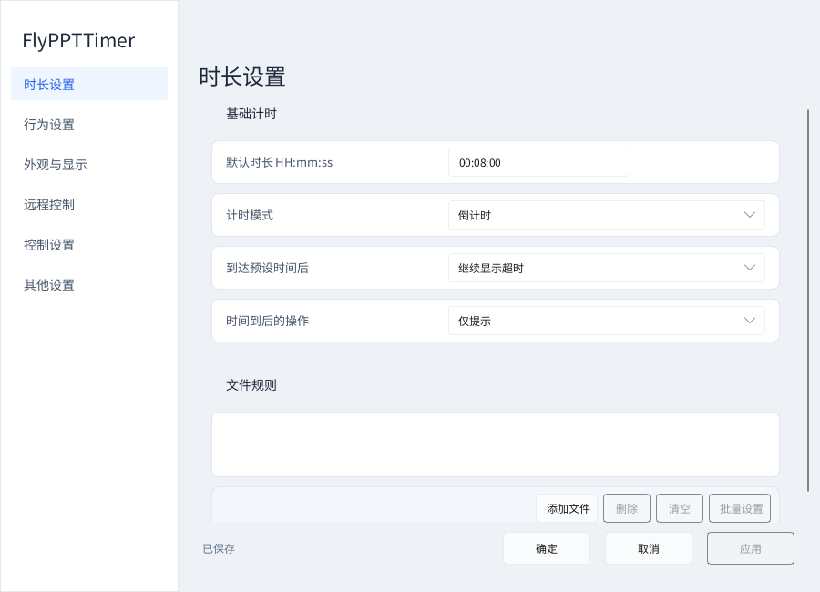
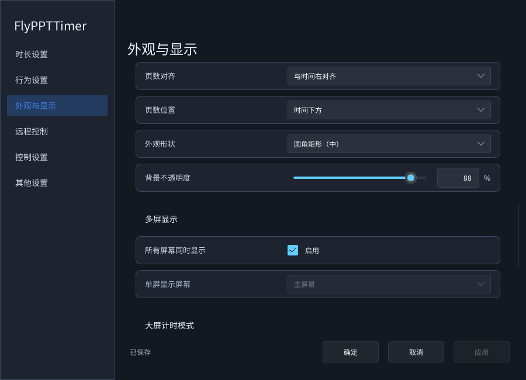
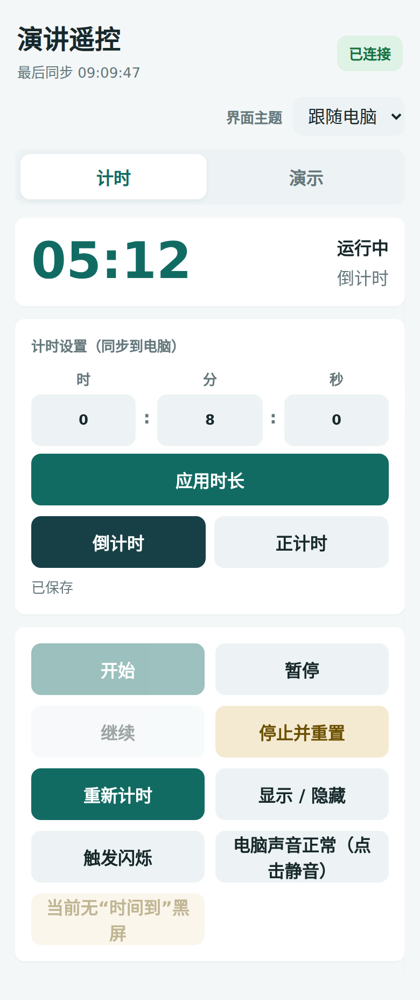
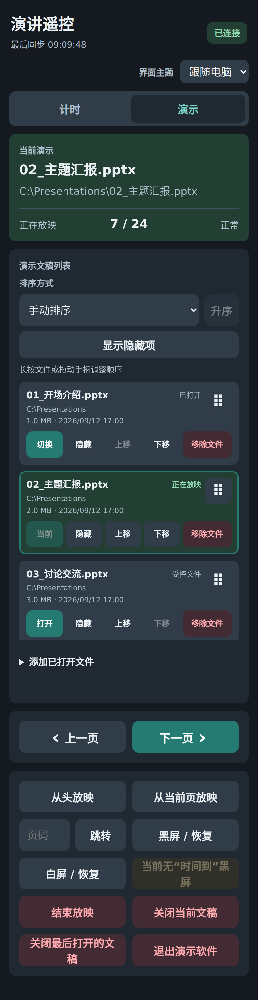

# FlyPPTTimer — PPT 计时器、PowerPoint / WPS 演讲倒计时与手机遥控

[English](README.md) · **简体中文** · [中文详细教程](docs/USER_GUIDE.zh-CN.md) · [English user guide](docs/USER_GUIDE.en.md)

<p align="center">
  
</p>

**免费、开源的 Windows 演示计时工具。** 用一个悬浮计时器显示倒计时、正计时和当前页数，再用手机浏览器控制计时与 PowerPoint / WPS 演示。适合会议发言、论文答辩、课堂教学、培训、临床病例汇报和多人轮流演讲，不用逐页往 PPT 里插入倒计时。

[](https://github.com/Hona-Cao/FlyPPTTimer/releases/latest)
[](https://github.com/Hona-Cao/FlyPPTTimer/actions/workflows/windows-ci.yml)
[](#下载-v1131)
[](docs/BUILDING.md)
[](LICENSE)

**当前版本：v1.13.1。** 桌面程序已重构为 Rust + Slint。旧版 v0.30.2 的 .NET 构建说明、旧界面截图，不再代表本版用法。[版本更新](CHANGELOG.md) · [从 UX、RC 到正式版的开发记录](docs/DEVELOPMENT_HISTORY.md)

## 下载 v1.13.1

| 版本 | 下载 | 怎么使用 |
|---|---|---|
| 便携版 ZIP | [FlyPPTTimer-v1.13.1-portable-win-x64.zip](https://github.com/Hona-Cao/FlyPPTTimer/releases/download/v1.13.1/FlyPPTTimer-v1.13.1-portable-win-x64.zip) | **完整解压**到可写文件夹，双击 `FlyPPTTimer.exe`。不要只复制 EXE，旁边的 DLL 也要保留。 |
| 安装版 ZIP | [FlyPPTTimer-v1.13.1-setup-win-x64.zip](https://github.com/Hona-Cao/FlyPPTTimer/releases/download/v1.13.1/FlyPPTTimer-v1.13.1-setup-win-x64.zip) | 解压后运行里面的安装 EXE，选择中文或英文，按向导安装。适合日常固定使用。 |

[打开本版 Release 页面](https://github.com/Hona-Cao/FlyPPTTimer/releases/tag/v1.13.1) · [所有版本](https://github.com/Hona-Cao/FlyPPTTimer/releases)

支持目标为 **Windows 10 / 11 x64**。两个包均带有所需的应用本地 Microsoft VC 运行库，v1.13.1 **不需要安装 .NET**。演示联动需要电脑安装兼容的桌面版 PowerPoint 或 WPS 演示；独立计时不需要 Office。手机只需浏览器，不用安装手机 App。

Release 上传的文件只有上述两个 ZIP；页面中的 Source code 是 GitHub 自动生成的源码归档，不是运行软件所需的下载项。

## 三分钟开始使用

1. **先跑起来。** 双击程序后会出现小计时浮窗。按 **F3** 开始／暂停，按 **F4** 停止并重置。
2. **设置这次要讲多久。** 右键计时器或任务栏通知区图标 → **设置 → 时长设置**。八分钟写 `00:08:00`，选“倒计时”或“正计时”，点击“应用”。
3. **不同文件用不同时间。** 在同页“文件规则”里点“添加文件”，选择 `.ppt / .pptx / .pptm`，为每份文稿设置时长、模式并保存。这里只登记规则，不会修改 PPT 文件内容。
4. **手机连接电脑。** 右键 → **远程控制**。电脑和手机连同一个 Wi-Fi，或电脑连接手机热点，再用手机扫描窗口里的二维码。使用窗口给出的电脑地址，不要改成热点的网关地址。
5. **开始演示。** 手机切到“演示”页，在受控列表选择文件并“打开”，再点“从头放映”或“从当前页放映”。默认会在进入符合条件的全屏演示时自动开始计时。

只用独立计时，不必添加 PPT，也不必连接手机。设置完成后点“确定”只是关闭设置；要完全退出软件，请用托盘菜单里的“退出”。

## 本版界面

### 电脑：时长、文件规则与外观设置





### 电脑 Remote：连接入口与紧凑文件列表


### 手机：计时控制与演示文稿控制

<p>
  
  
</p>

图片来自 **v1.13.1 实际 GUI 的渲染**，不是概念图。电脑图使用本版生产界面和回调的离屏渲染，文档专用构建显式选择中文字体以解决构建机缺字；该临时构建不进入发布包。手机图由本版原始网页在手机尺寸视口中生成。文件名、路径、连接状态是说明用示例，不包含有效的个人连接令牌。[截图来源与重新生成方法](docs/media/v1.13.1/README.md)

## 功能与入口

| 你要做什么 | 去哪里操作 |
|---|---|
| 演讲倒计时、会议正计时 | 设置时长与模式；开始、暂停、继续、停止重置、重新计时；超时后可继续显示或停止。[计时说明](docs/USER_GUIDE.zh-CN.md#计时控制) |
| 多位讲者各用不同时间 | “文件规则”为每份 PPT 保存时长、模式和启用状态；支持 Ctrl／Shift 多选及批量设置。[文件规则](docs/USER_GUIDE.zh-CN.md#文件规则与批量设置) |
| 浮窗同时显示时间与页数 | 调整时间字号、独立页数字号、页数颜色、上下位置和对齐方式；自动／自定义尺寸。[外观设置](docs/USER_GUIDE.zh-CN.md#浮窗外观与百分比调整) |
| 提前提醒或时间到提醒 | 两组提前提示、一组到时提示；语音、自选音频、文字／背景／边框闪烁、全屏“时间到”或退出放映。[提醒设置](docs/USER_GUIDE.zh-CN.md#提前提醒与时间到操作) |
| 用手机翻 PPT | 同一局域网中扫码，用浏览器打开／切换文稿、从头或当前页放映、翻页、跳页、黑白屏、结束放映。[手机遥控](docs/USER_GUIDE.zh-CN.md#手机与浏览器遥控) |
| 调整演示文件出场顺序 | 按名称、大小、修改时间排序；长按拖动；隐藏、恢复或移出受控列表。[手机列表管理](docs/USER_GUIDE.zh-CN.md#手机文稿列表排序与滑动) |
| 投影屏与讲者屏分别显示 | 普通浮窗可显示在所有屏幕或指定屏幕，扩展屏可启用大屏计时器。[多屏用法](docs/USER_GUIDE.zh-CN.md#多显示器与大屏计时) |
| 使用暗黑模式或英文界面 | 桌面跟随系统／浅色／深色，手机可单独选择；中文／英文／跟随系统语言。[主题与语言](docs/USER_GUIDE.zh-CN.md#主题与语言) |
| 搬电脑、升级、找日志 | 导入／导出配置，恢复默认，打开配置和日志目录。[配置与升级](docs/USER_GUIDE.zh-CN.md#配置备份升级与卸载) |

**电脑 Remote 和手机 Remote 分工不同。** 电脑“演示文稿”页用于管理文件规则；打开文稿、翻页、黑白屏等操作在手机／浏览器“演示”页，不必在电脑窗口寻找同一组放映按钮。

## 几个重要默认值

全新配置默认 **8 分钟倒计时**。页数默认显示，**不跟随时间字号**，使用独立字号 **12**，在**时间下方、右对齐**。浮窗按内容自动确定大小，也可切成自定义尺寸。主题默认跟随系统。

**每次启动，计时浮窗都会重新显示。** 隐藏只对本次运行有效，按 F5 可切回显示。复用旧配置时，已有的个人配色、字号、时长等明确设置不会被新默认值强行覆盖。

三个主要快捷键可在“设置 → 控制设置”更改：

| 快捷键 | 默认操作 |
|---|---|
| F3 | 开始／暂停，暂停后可继续 |
| F4 | 停止并重置 |
| F5 | 显示／隐藏普通计时浮窗 |

闪烁、静音、加减时长和预设时长等其他默认键位见[完整快捷键表](docs/USER_GUIDE.zh-CN.md#快捷键)。

## 常见疑问

**这是 PowerPoint 插件吗？** 不是。这是独立 Windows 软件，不必给每张幻灯片插入计时器，也不需要往 PPT 里放宏。

**没有 PowerPoint 能用吗？** 可以单独计时。PPT 页码识别与演示控制需要兼容的桌面 PowerPoint／WPS。PDF、网页演示不等于受控 PPT，不能从 PPT 文件选择器加入。

**手机连不上怎么办？** 先重新扫码、确认同网，再排查访客 Wi-Fi 隔离、代理／VPN 和 Windows 防火墙对当前端口的许可。不要直接关闭防火墙。[按顺序排查](docs/USER_GUIDE.zh-CN.md#排查常见问题)

**“移除文件”会不会删掉我的 PPT？** 不会。它移除的是受控列表成员资格，不删除磁盘文件，也不关闭已打开文稿。“关闭文稿”是另一项操作，使用前注意未保存内容。

**滑块一动就保存了吗？** 不是。拖动时实时预览；悬停滚轮每格变化 1 个百分点，右侧可以输入精确值。点击“应用／确定”才保存，“取消”放弃。输入框光标退出只表示编辑结束，不代表已经保存。

**软件深色了，文件选择窗口为什么还是浅色？** Windows 自带的文件选择、颜色等对话框跟随操作系统主题，不由本软件强行换肤。

**旧版本怎样升级？** 先退出旧版并备份配置及 `alert-sounds`。安装版保留已有配置；便携版把配置和自选提示音复制到新目录。文件规则中的路径必须在新电脑上仍然存在。[迁移教程](docs/USER_GUIDE.zh-CN.md#配置备份升级与卸载)

**程序里“检测新版本”能看到这次 GitHub 发布吗？** 已验收的 v1.13.1 内置检测源仍为 **Gitee**。GitHub 发布不表示 Gitee 已同步；请以本页的 GitHub 下载为准。本次安装版为 ZIP，解压后手动运行安装器。

## 隐私与使用边界

计时和局域网遥控不需要云账户。设置、文件规则、自选提示音和日志保存在电脑本地，软件不会主动上传演示文稿内容；检查更新和打开项目链接需要互联网。

遥控地址和二维码含有访问令牌。请只在**可信局域网**使用，不要公开有效二维码、完整连接地址，不要把控制端口映射到公网。发日志前检查文件路径。关闭／退出演示软件可能丢失未保存修改，先在 Office 内保存。

## 持续开发记录

v1.13.1 将实际的 V1 开发历史带入 `main`，保留 UX 阶段、RC1／RC2、RC3.1、RC3.2、RC3.3、RC3.3.1、RC3.4 及 v1.13.1 的原始提交和日期。

[按阶段阅读开发时间线](docs/DEVELOPMENT_HISTORY.md) · [完整版本更新](CHANGELOG.md) · [原始实现与验证报告](docs/v1/CODEX_RESULT.md)

本版已验收程序的自动测试结果为 **90 通过、3 项依赖环境的测试忽略**，忽略项不算通过。GUI 渲染图不等于实机测试；维护者在实际使用后已批准 v1.13.1 正式发布。

## 开发与参与

当前程序使用 **Rust 1.92.0、Slint 1.17.1、Windows MSVC 工具链**。仓库保留旧 C# 源码用于历史追溯；构建 V1 不要再用旧版 .NET 打包命令。

```powershell
rustup toolchain install 1.92.0 --profile minimal --component rustfmt,clippy
cargo +1.92.0 test --locked
cargo +1.92.0 build --release --locked
```

完整步骤见[构建与打包](docs/BUILDING.md)、[贡献说明](CONTRIBUTING.md)。反馈问题请提供软件版本、Windows／Office 版本、显示缩放、操作步骤和去除隐私信息的截图：[GitHub Issues](https://github.com/Hona-Cao/FlyPPTTimer/issues)。

项目由 **曹虎男（Hunan Cao）** 发起。邮箱：[caohunan@smail.nju.edu.cn](mailto:caohunan@smail.nju.edu.cn)。

## 赞赏

欢迎 Star、反馈问题、完善文档、参与开发。赞赏完全自愿，不影响免费使用，也不会解锁额外功能。

<p>
  
  
</p>

## 开源许可

[MIT License](LICENSE)。Copyright © 2026 Cao Hunan（曹虎男）。第三方组件保留各自许可。
