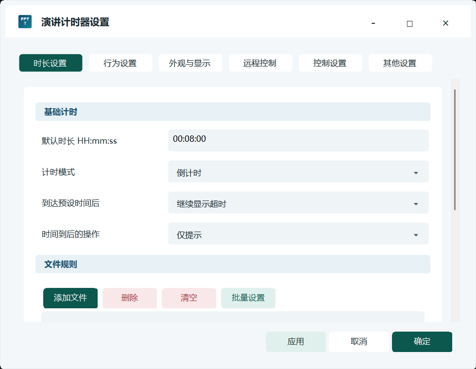
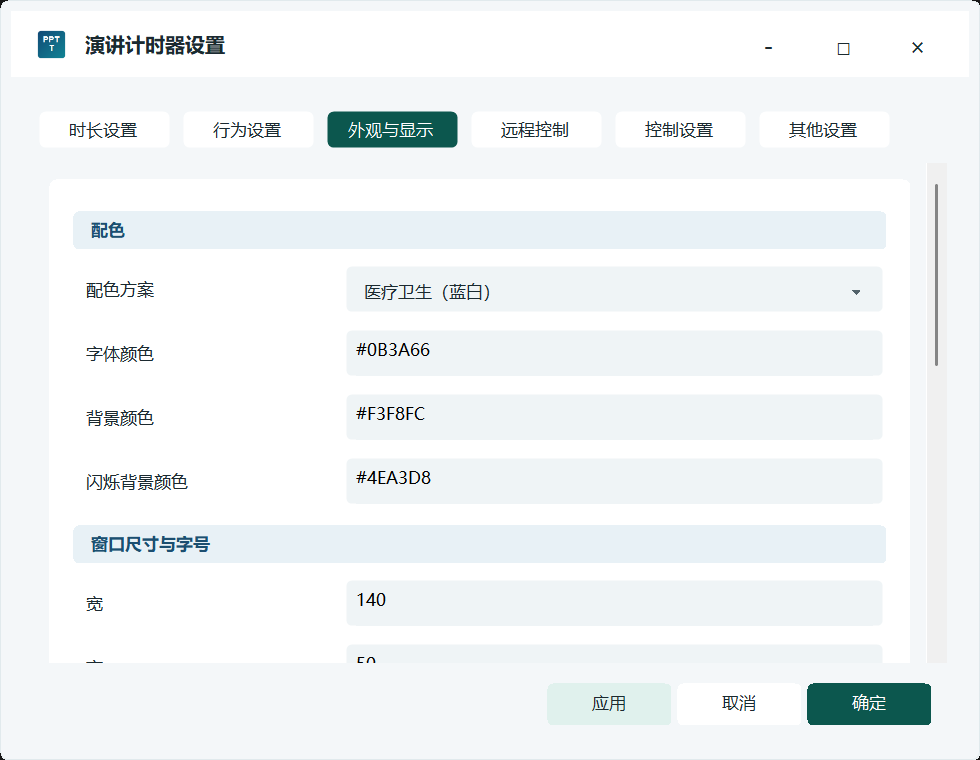
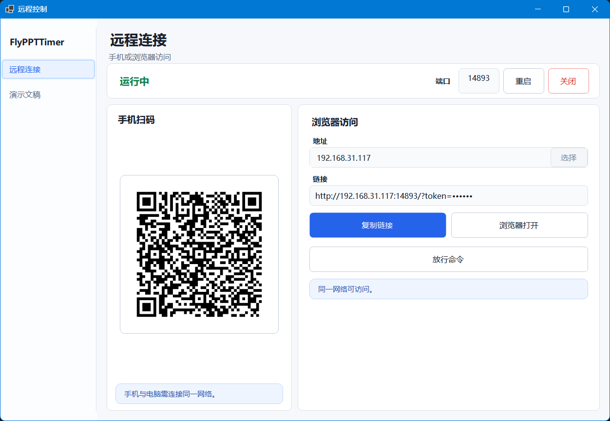
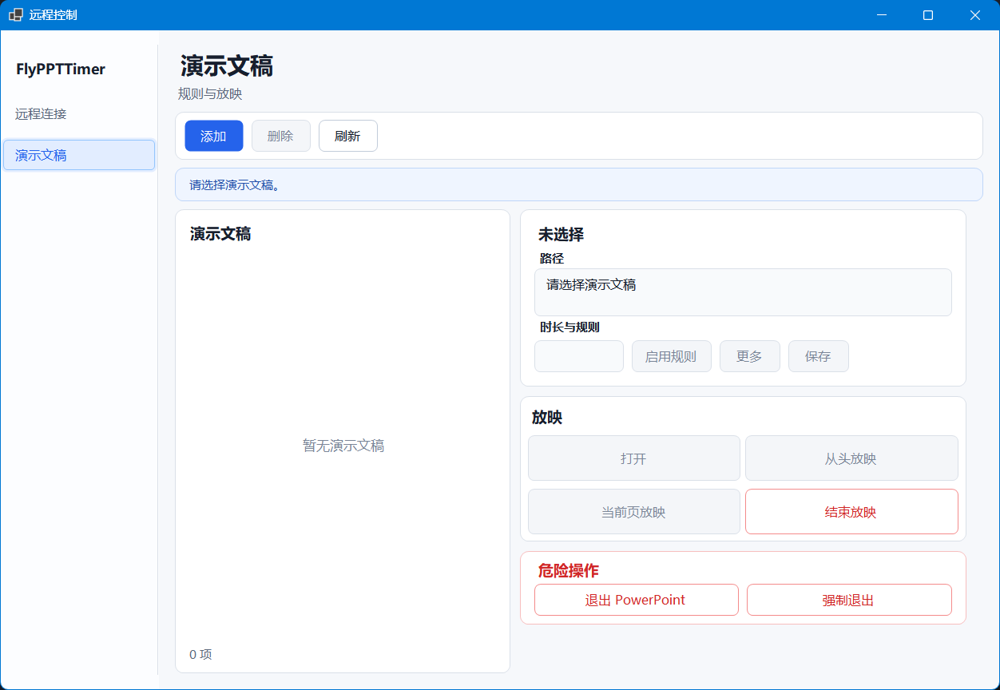
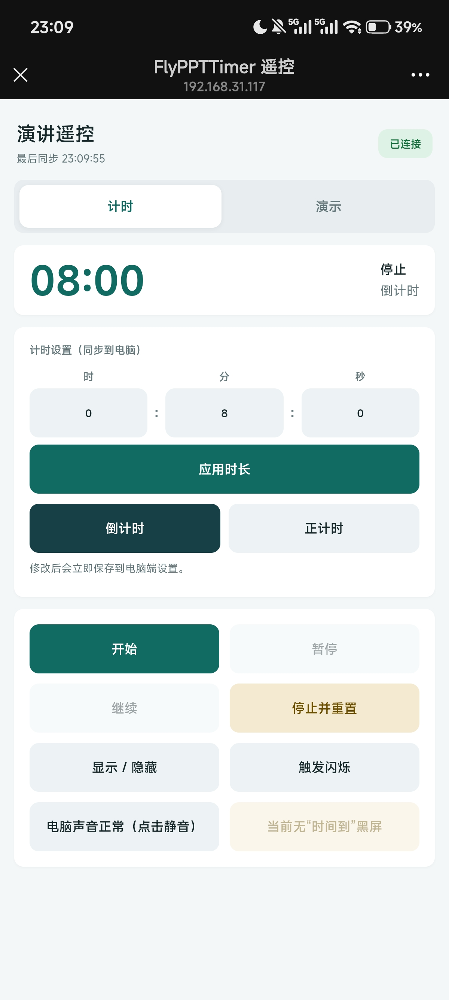
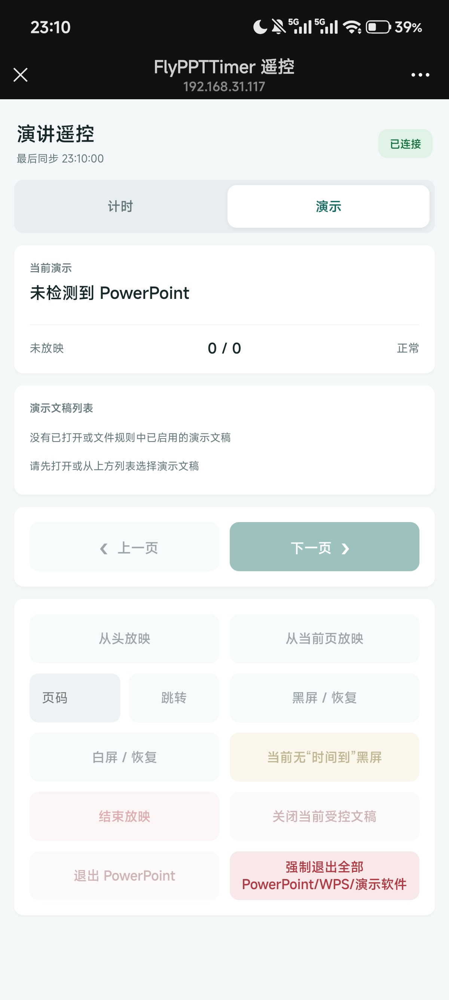

# FlyPPTTimer

[English](README.md) | **简体中文**

<p align="center">
  
</p>

<p align="center">
  <strong>适用于 Windows 的演示计时与远程控制工具</strong><br>
  PowerPoint / WPS · 手机与浏览器遥控 · 正计时与倒计时 · 多屏计时
</p>

<p align="center">
  <a href="https://github.com/Hona-Cao/FlyPPTTimer/releases/latest"></a>
  <a href="https://github.com/Hona-Cao/FlyPPTTimer/actions/workflows/windows-ci.yml"></a>
  
  
  <a href="LICENSE"></a>
</p>

FlyPPTTimer 把悬浮计时、演示文稿独立规则、局域网遥控、到时提醒和多屏显示整合在一个桌面应用中。软件免费、开源，不需要云端账户。

当前最新版本为 **v0.30.2**。历次版本变化见 [CHANGELOG.md](CHANGELOG.md)。

## 适用场景

- 演讲、学术会议、答辩和公开发言
- 课堂教学、培训和工作坊
- 会议、典礼、辩论和各类限时活动
- 医疗、护理和临床病例汇报
- 使用独立大屏计时器的招聘、面试和考核现场
- 需要助手在台下通过手机控制计时或演示文稿的活动

## 下载

| 版本 | 适合人群 | GitHub | Gitee |
|---|---|---|---|
| 安装版 | 常规 Windows 安装、创建快捷方式和后续应用内更新 | [下载 v0.30.2 安装版](https://github.com/Hona-Cao/FlyPPTTimer/releases/download/v0.30.2/FlyPPTTimer-v0.30.2-setup-win-x64.exe) | [Gitee v0.30.2 发布版](https://gitee.com/hona-cao/fly-ppttimer/releases/tag/v0.30.2) |
| 便携版 | 解压即用，配置保存在程序旁边 | [下载 v0.30.2 便携版](https://github.com/Hona-Cao/FlyPPTTimer/releases/download/v0.30.2/FlyPPTTimer-v0.30.2-portable-win-x64.zip) | [Gitee v0.30.2 发布版](https://gitee.com/hona-cao/fly-ppttimer/releases/tag/v0.30.2) |

[GitHub 全部发布版](https://github.com/Hona-Cao/FlyPPTTimer/releases) · [Gitee 全部发布版](https://gitee.com/hona-cao/fly-ppttimer/releases)

当前提供 Windows 10/11 x64 版本，安装包和便携包均已包含所需的 .NET 运行环境。

- 安装程序会读取 Windows 显示语言，并允许在安装前选择 English 或简体中文。
- 便携版首次启动时自动跟随 Windows 显示语言。
- 使用安装版升级时会保留现有配置。

## 界面预览

| 计时与文件规则 | 外观与显示 |
|---|---|
|  |  |

| 远程连接 | 演示文稿控制 |
|---|---|
|  |  |

<p align="center">
  
  &nbsp;&nbsp;
  
</p>

## 功能

### 计时与提醒

- 支持倒计时和正计时
- 支持开始、暂停、继续、停止、重置和立即重新计时
- 可设置常用时长和演示文稿独立时长
- 倒计时到零后可停止，也可用另一种颜色继续显示超时时间
- 两次提前提醒和一次计时结束提醒
- 支持语音、自定义音频、闪烁、全屏“时间到”画面或自动结束放映
- 悬浮计时窗口可调整尺寸、字体、颜色、透明度和形状
- 不需要普通计时窗口时，可关闭显示并继续使用后台计时

### PowerPoint、WPS 与文件规则

- 受支持的演示进入或离开全屏时自动联动计时
- 每个演示文稿可保存独立的时长、计时方式和启用状态
- 可批量修改多条演示文稿规则
- 支持打开文稿、从头放映、当前页放映、翻页、跳页、黑屏、白屏和结束放映
- “关闭当前文档”和“关闭最后打开的文档”分别提供
- FlyPPTTimer 管理的文稿以只读方式打开
- 自动检测 WPS 演示的可用能力，不支持的操作保持禁用

### 手机或浏览器遥控

- 手机无需安装 App
- 扫描二维码，或在手机、平板和另一台电脑上打开局域网地址
- 控制计时、时长、计时方式、窗口显示、闪烁和电脑静音
- 按当前文稿规则立即重新计时；没有独立规则时使用全局时长
- 浏览文稿、开始放映、切换页面、黑白屏、结束放映和关闭当前文档
- 手机和浏览器根据设备系统语言自动显示中文或英文
- 每次安装使用独立访问 token，并可一键断开所有远程设备

### 多屏与大屏计时

- 普通计时窗口可显示在单个屏幕或所有屏幕
- 九宫格默认点位和水平、垂直百分比微调
- 适配 Windows 常见缩放比例和不同显示器 DPI
- 独立的大屏计时器是可调整尺寸的标准窗口，支持最小化和最大化
- 大屏计时器仅用于扩展屏，不会占用主屏幕
- 适合招聘、面试、考试、培训教室和舞台倒计时

### 桌面控制与可靠性

- 支持 English、简体中文和“跟随系统”
- 修改语言后重启生效，不会覆盖计时设置和文件规则
- 全局快捷键可控制计时、窗口显示、闪烁、静音、计时方式和时长预设
- 设置窗口和远程控制窗口可随尺寸及显示缩放调整布局
- 配置原子写入、备份恢复、本地日志轮转和单实例运行
- 可选择是否检查更新，默认不在启动时自动检查

## 快速使用

### 基础计时

1. 安装 FlyPPTTimer，或解压便携版。
2. 运行 `FlyPPTTimer.exe`。
3. 右键计时窗口或托盘图标，打开“设置”。
4. 设置默认时长、计时方式、提醒、配色和显示位置。
5. 按 `F3` 开始或暂停，按 `F4` 停止并重置。

### 使用演示文稿规则

1. 打开“设置 → 时长设置”。
2. 添加 PowerPoint 或 WPS 演示文稿。
3. 设置独立时长和计时方式，然后启用规则。
4. 从远程控制窗口打开或放映，也可以直接在 PowerPoint/WPS 中正常放映。

### 使用手机遥控

1. 从托盘菜单打开“远程控制”。
2. 让手机和电脑连接同一 Wi-Fi、以太网局域网，或使用手机/电脑热点建立局域网。
3. 扫描二维码。
4. 在浏览器页面中控制计时和演示文稿。

首次启用远程控制时，Windows 可能询问是否允许网络访问。需要遥控时仅允许专用网络。

### 使用大屏计时器

1. 连接扩展显示器。
2. 打开“设置 → 外观与显示 → 大屏计时模式”。
3. 启用大屏计时器并选择扩展屏。
4. 按现场需要移动、缩放、最小化或最大化大屏窗口。

## 兼容性

| 能力 | Microsoft PowerPoint | WPS 演示 | 其他全屏程序 |
|---|---:|---:|---:|
| 全屏时自动联动计时 | 支持 | 支持顶层窗口识别 | 可通过白名单识别 |
| 打开演示文稿 | 支持 | 支持 | 不适用 |
| 从头/当前页放映 | 支持 | 取决于当前 WPS 接口 | 不适用 |
| 翻页、跳页、黑白屏 | 支持 | 取决于当前 WPS 接口 | 不适用 |
| 只读受控与按需关闭 | 支持 | 检测到能力时提供 | 不适用 |

WPS 不同版本开放的接口并不完全相同。FlyPPTTimer 只启用当前电脑上实际检测到的操作。

## 本地文件

- `FlyPPTTimer.config.json`：设置和演示文稿规则
- `logs/`：本地运行与错误日志
- `alert-sounds/`：自选提示音的本地副本

安装版升级会保留已有配置。重要活动前，建议在现场设备上完整测试演示文稿、显示位置、声音和手机连接。

## 默认快捷键

| 按键 | 操作 |
|---|---|
| `F3` | 开始或暂停 |
| `F4` | 停止并重置 |
| `F5` | 显示或隐藏普通计时窗口 |

其他快捷键可在设置中查看和修改。

## 隐私与网络安全

- 不需要云端账户。
- FlyPPTTimer 不会上传演示文稿内容。
- 设置、规则、自选提示音和日志保存在本机。
- 远程控制用于可信局域网，并通过访问 token 验证。
- 不要把远程控制端口映射到公网。
- 不要公开仍然有效的二维码、完整远程地址或 token。
- 分享日志和截图前，请检查文件路径等本地信息。

## 从源码构建

需要 Windows 10/11、PowerShell 和 .NET 8 SDK。生成安装包还需要 Inno Setup 6。

```powershell
powershell -NoProfile -ExecutionPolicy Bypass -File .\build.ps1
powershell -NoProfile -ExecutionPolicy Bypass -File .\package_release.ps1
```

运行测试：

```powershell
dotnet test tests\FlyPPTTimer.Tests\FlyPPTTimer.Tests.csproj -c Release
```

## 项目

FlyPPTTimer 由 **曹虎男** 发起。作者毕业于南京大学医学院护理专业，目前就职于江苏省人民医院宿迁医院。项目来自教学、会议和临床工作中对可靠计时与台下演示控制的实际需求。

- 联系邮箱：[caohunan@smail.nju.edu.cn](mailto:caohunan@smail.nju.edu.cn)
- 问题与建议：[GitHub Issues](https://github.com/Hona-Cao/FlyPPTTimer/issues)
- 参与开发：[CONTRIBUTING.md](CONTRIBUTING.md)
- 版本记录：[CHANGELOG.md](CHANGELOG.md)

欢迎 Star、提交 Issue、参与测试、完善文档或提交 Pull Request。

## 赞赏

如果 FlyPPTTimer 帮你节省了准备和控场时间，可以在完全自愿、量力而行的前提下请作者喝杯咖啡。无论是否赞赏，软件的免费使用和开源功能都不会受到影响。

<p align="center">
  
  &nbsp;&nbsp;&nbsp;
  
</p>

<p align="center">支付宝 · 微信</p>

## License

FlyPPTTimer 使用 [MIT License](LICENSE) 开源。

Copyright © 2026 Cao Hunan（曹虎男）
