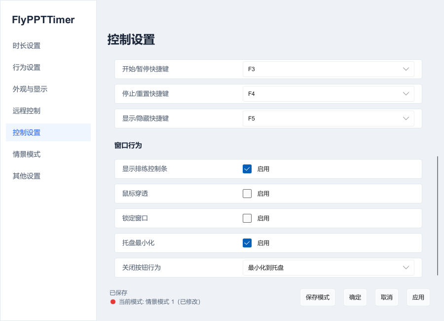
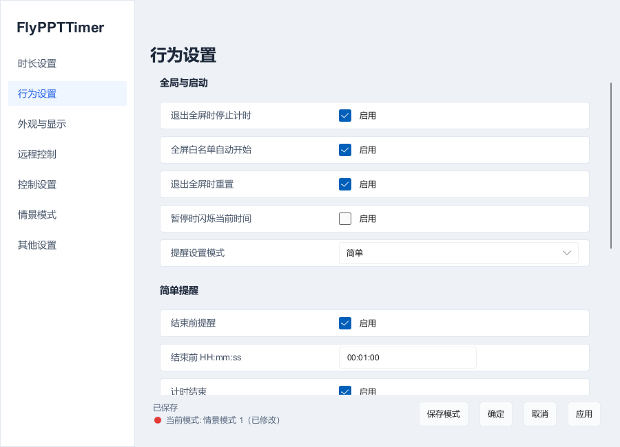
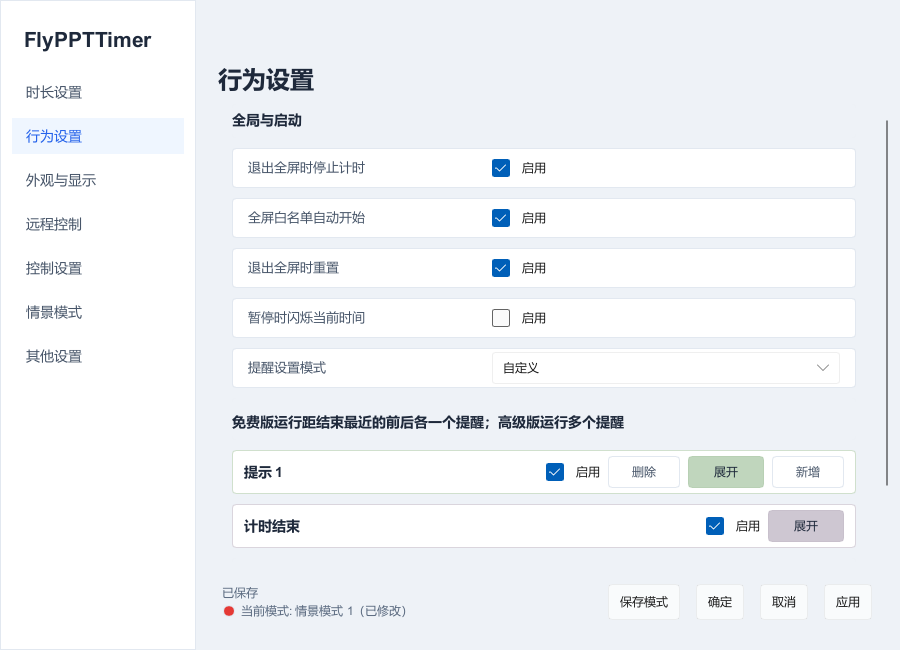
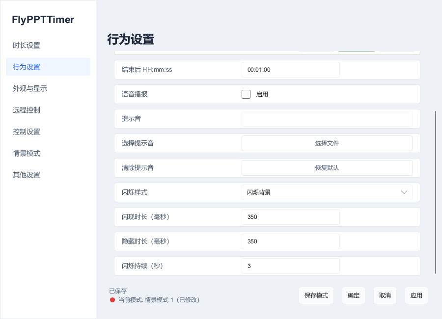
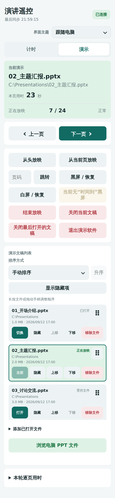
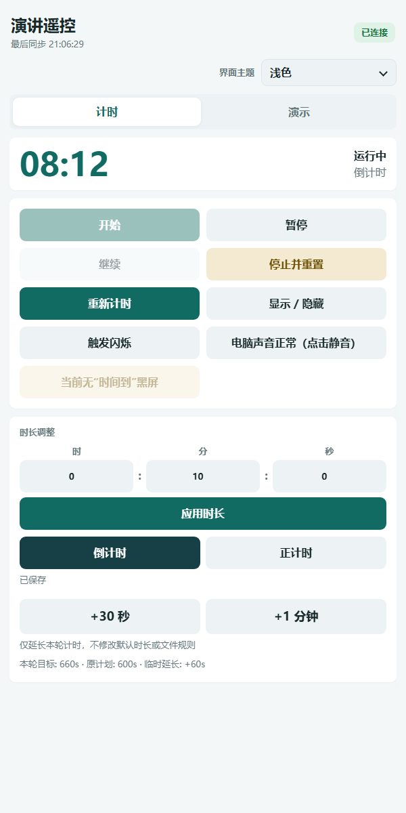
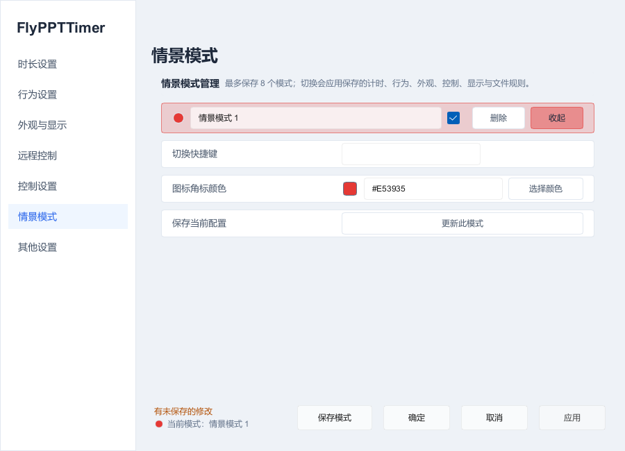
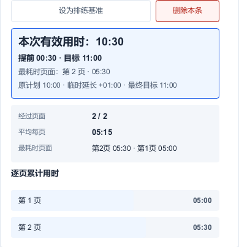
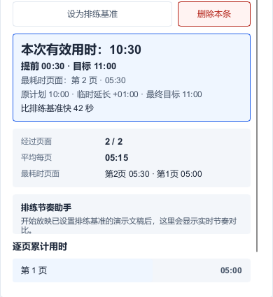
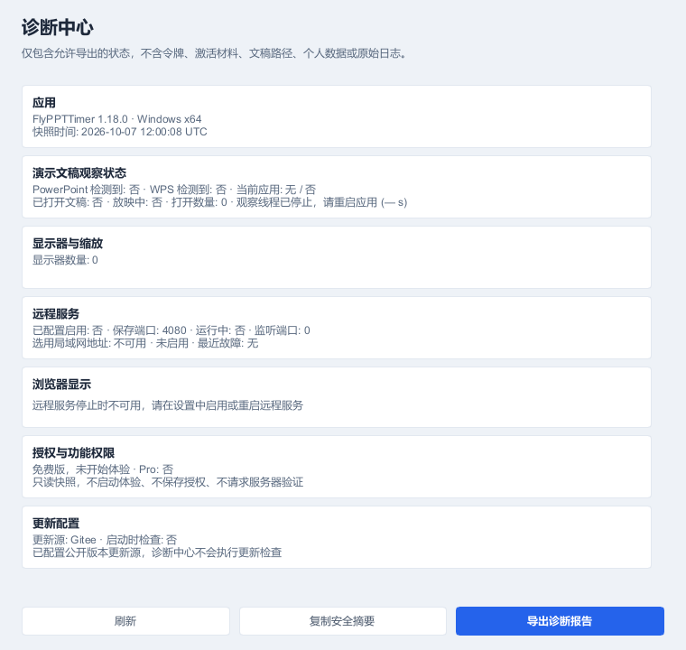

# FlyPPTTimer

### 专注演讲，把时间交给 FlyPPTTimer。

面向 **Microsoft PowerPoint** 与 **WPS 演示** 的 Windows 演示计时与现场控制工具。

**[下载最新版](https://github.com/Hona-Cao/FlyPPTTimer/releases/latest)** · **[完整教程](docs/USER_GUIDE.zh-CN.md)** · **[English](README.md)**

当前版本：**v1.18.0** · [更新说明与升级指引](docs/RELEASE_NOTES_v1.18.0.zh-CN.md)

## 下载 FlyPPTTimer

**[从 Gitee 下载](https://gitee.com/hona-cao/fly-ppttimer/releases)** · [GitHub 下载](https://github.com/Hona-Cao/FlyPPTTimer/releases/latest)

选择适合你的 **Windows x64** 发布包：

| 发布包 | 适合谁 | 开始使用 |
|---|---|---|
| **Portable 便携版** | 希望把程序放在自己选择的文件夹中 | 将 ZIP 解压到可写文件夹，启动 FlyPPTTimer。 |
| **Setup 安装版** | 希望在演示电脑上常规安装 | 解压 Setup 发布包，运行其中的安装程序。 |

两种版本提供相同的计时功能。**Free 满足日常本地演示计时需求**；可选 Pro 功能与需主动确认开启的七日试用见[下方对照](#free-and-pro)。

升级前，请先备份配置和自定义提示音。按[用户指南](docs/USER_GUIDE.zh-CN.md)保留原有设置，并用 [v1.18.0 SHA256 校验清单](docs/SHA256SUMS_v1.18.0.txt)核对对应的下载包。

## 为什么选择 FlyPPTTimer？

论文答辩、五分钟路演、培训课堂，需要的节奏各不相同。FlyPPTTimer 把计时放在演示现场真正需要的位置，让你在上台前准备好提醒与控制方式。

- **把注意力留给内容。** 紧凑桌面浮窗随时显示剩余或已用时间；兼容的幻灯片放映中，还能查看页码和当前页停留秒数。
- **准备一次，反复使用。** 配好提醒、选好显示器，把整套设置保存为情景模式，留给下次答辩、比赛或会议。
- **让下一次排练更有依据。** 复盘逐页记录，找到耗时最长的页面，了解整场演示与目标时长的差距。

## 从排练到正式演示

### 1. 时间与演示进度，随时看得见

按需要选择**倒计时、正计时或无限正计时**。悬浮计时器可以置于桌面上层；字体、颜色、透明度与位置都能调整，适应不同幻灯片和观看距离。

配合兼容的桌面版 **Microsoft PowerPoint** 或 **WPS 演示**，浮窗还可显示**当前页 / 总页数**和**当前一次停留在本页的秒数**。返回同一页时，本次停留秒表重新开始；逐页累计用时则可用于后续复盘。

演示联动还支持每份文稿的独立计时规则，以及围绕全屏演示设置自动开始、停止和重置。不需要联动时，也可以独立使用计时器。

例如，五分钟开场之后接十五分钟主题汇报，可以分别为两份文稿保存时长，不必在换人时修改默认值。

  
   
  <em>真实 PPT 放映画面：计时器位于顶部中间。这里只是本次演示的位置，可按显示器、定位与偏移设置自定义。</em>

**本地计时、页码信息与文稿规则均可在 Free 中使用。**

### 2. 在计时器旁边，轻松控制排练

练习时，暂停一下或重新开始都应随手可及。在**设置 → 控制设置 → 显示排练控制条**中启用后，鼠标靠近计时器即可显示紧凑菜单。

  
   
  <em>在这里开启排练控制；该选项默认关闭。</em>

<table>
  <tr>
    <td width="50%" align="center"></td>
    <td width="50%" align="center"></td>
  </tr>
  <tr>
    <td align="center"><strong>菜单收起：主时间、当前页秒数与页码</strong></td>
    <td align="center"><strong>菜单展开：重置、重新开始、暂停与继续</strong></td>
  </tr>
</table>

<em>真实截图的顶部局部裁切；两张拍摄于不同计时时刻。点击局部图可查看对应完整放映画面。</em>

| 控制 | 作用 |
|---|---|
| **Reset（重置）** | 清空已用时间，停止本轮。 |
| **Restart（重新开始）** | 清空已用时间，开始新一轮。 |
| **Pause / Resume（暂停 / 继续）** | 暂停正在运行的一轮，或继续已暂停的一轮。 |

鼠标离开计时器和菜单约 **700 ms** 后，菜单自动收起。它与计时器间隔 **2 DIP**，显示时不移动或缩小计时器主体；外观随计时器适配，靠近屏幕右边缘时可显示在左侧。

这是 **Free 免费功能**。开启**鼠标穿透**时，菜单完全隐藏且不可点击；需要不碰鼠标操作时，可以使用全局快捷键。

### 3. 提醒方式，按你的演讲来设

想快速配好提醒，可以选择 **Simple（简单）**：设置结束前、到时和超时后的提示，共用提示音、背景闪烁与语音选项。

需要逐条编辑提醒点及效果时，选择 **Custom（自定义）**。两套配置独立保存，切换模式不会覆盖另一套设置。

<table>
  <tr>
    <td width="50%" align="center">
      
    </td>
    <td width="50%" align="center">
      
    </td>
  </tr>
  <tr>
    <td align="center"><strong>Simple：快速设置</strong></td>
    <td align="center"><strong>Custom：详细控制</strong></td>
  </tr>
</table>

全新安装默认使用 **Simple**；已有配置保留 **Custom**，延续原有详细提醒设置。

超时后仍需要一次提示？设置到期后的提醒时间，允许计时**继续超时**，并将到时动作设为**仅提示**。只有计时器正在运行、且确实越过结束时间后，超时提醒才会触发。

  
   
  <em>为超时后的提醒设置时间间隔和提示效果。</em>

Free 在结束前、超时后各运行一个**距结束时间最近的已启用 Custom 提醒点**，并保留到时提醒；Pro 可运行多个已启用的 Custom 提醒点。Pro 不可用时，多余已存提醒仍会保留。

正在运行或暂停时，切换提醒模式或应用**任意情景模式**，包括当前情景，都需要确认开始新一轮。取消则保留本轮；确认会清空已用时间及提醒、逐页反馈，再保持原来的运行或暂停状态。

### 4. 用手机控制演示（Pro）

在电脑打开**远程控制**，让手机在同一可信局域网中用浏览器连接。**手机无需安装专用 App。** 连接界面优先展示操作指引与服务状态，技术选项收在**高级详情**中。

**Pro 浏览器遥控**提供计时命令与演示控制，包括上一页 / 下一页、开始或结束放映、跳转页码及黑屏 / 白屏。还可以管理受控文稿列表、查看逐页用时。

<table>
  <tr>
    <td width="50%" align="center"><strong>文稿翻页 · 示例文稿</strong></td>
    <td width="50%" align="center"><strong>计时临时延长 · 示例数据</strong></td>
  </tr>
  <tr>
    <td width="50%" align="center" valign="top">
      
    </td>
    <td width="50%" align="center" valign="top">
      
    </td>
  </tr>
</table>

*浏览器 UI 静态示例：沿用演示页展示翻页，v1.18.0 隔离计时样例展示临时加时。*

用手机浏览本机 PPT 文件，需要在**电脑端另行授权**。只连接可信设备，并妥善保管连接二维码和完整 Remote 地址。

**Pro Remote** 支持为正在运行或暂停的有限时长一轮临时增加 **+30 秒 / +1 分钟（+60 秒）**。可累计加时，暂停中的计时仍保持暂停；这些操作不修改默认时长、情景模式或文稿规则。重置、重新开始会清除加时；停止、已结束及无限计时不能加时。

需要单独的浏览器计时画面时，**Browser Display（浏览器显示，Pro）** 提供不带演示控制按钮的显示页面。连接中断时保留最后有效画面，并自动尝试重连。

启用前，可以查看 [Free / Pro 对照](#free-and-pro)和[连接指南](docs/USER_GUIDE.zh-CN.md)，准备适合现场的控制方式。

### 5. 让每块屏幕显示合适的时间

演讲者可以看紧凑浮窗，主持人或返看屏则使用**专用全屏大屏计时器**。选择目标 **Monitor（显示器）**、**九宫格定位**，再微调偏移、大小和透明度。

专用大屏可仅显示主时间，也可开启页码等演示信息。请明确选择它所在的屏幕，让显示方式适合你的演示布局。

**情景模式**可保存整套工作设置：计时、提醒、外观、多屏、控制和文稿规则。提前备好答辩方案，再切换到比赛或课堂方案，无须逐项重新配置。

  
   
  <em>保存方案，供下次复用；沿用截图展示情景模式设置。</em>

| 示例情景 | 可以保存的配置 |
|---|---|
| **答辩** | 八分钟倒计时、提前提醒、紧凑演讲者浮窗 |
| **比赛** | 五分钟倒计时、超时提醒、主持人全屏计时 |
| **课堂** | 无限正计时、页码信息、指定屏幕与位置 |

Free 提供一个可用情景及本地多屏显示，Pro 可使用更多情景。运行或暂停时应用情景，需要在桌面确认开始新一轮；手机发起的切换也遵循此规则。

### 6. 用演示复盘，改进下一次表现

放映结束后打开 **Presentation Review（演示复盘）**，查看**本次有效用时**：有效逐页记录的累计时间，重复访问同一页会累加。这个数值来自页面记录，而非开始到结束之间的时钟跨度。

摘要将有效用时与**最终目标**比较，标出累计耗时最长的页面，并保留逐页详情和历史记录。有临时加时的一轮，还会列出**原计划 + 临时延长 + 最终目标**；无限计时不显示目标比较。

  
   
  <em>看清本次演示与最终时间额度的差距。</em>

**基础复盘免费可用。** 反复练习同一份文稿时，Pro 可让你主动选择该文稿的一次复盘作为**排练基准**。基准比较使用两次演示的有效用时，与最终目标比较分别计算。

  
   
  <em>选择一次排练记录，比较后续演示的有效用时。</em>

程序不会自动选择基准。只运行独立计时器的练习，不会生成幻灯片放映复盘记录。

### 7. 用安全诊断报告，帮助定位问题

打开**设置 → 其他设置 → 诊断中心**，或使用托盘入口，查看应用、演示观察器、显示器、Remote、Browser Display、授权摘要及更新器状态。

  
   
  <em>查看状态，复制安全摘要，或导出诊断报告。</em>

**复制安全摘要**与**导出诊断报告**只包含白名单中的状态字段，不包含 Remote token、激活资料、文稿路径与内容、原始配置及日志。刷新诊断不会开启试用，也不会联系授权或更新服务。

反馈识别或连接问题时，可以附上报告；若另外提供截图，请先检查其中的内容。

## Free 与 Pro

日常本地计时可以从 Free 开始；需要手机操作、更多情景或排练对照时，再选择 Pro。

| 功能 | Free | Pro |
|---|---|---|
| 倒计时、正计时、无限计时与超时显示 | 包含 | 包含 |
| 页码、当前页秒数与文稿独立规则 | 包含 | 包含 |
| 本地浮窗、显示器定位与全屏大屏 | 包含 | 包含 |
| 可选排练悬停菜单 | 包含 | 包含 |
| Simple / Custom 提醒 | Simple；结束前、超时后各一个最近的已启用 Custom 点，加到时提醒 | 多个已启用 Custom 提醒点 |
| 已保存情景 | 一个可用情景 | 更多情景，最多八个 |
| 基础演示复盘与诊断中心 | 包含 | 包含 |
| 手机 Remote 与 Browser Display | 需要 Pro | 包含 |
| Remote 当前有限时长一轮 +30 / +60 秒 | 需要 Pro | 包含 |
| 主动选择排练基准与节奏比较 | 需要 Pro | 包含 |

Pro 不可用时，额外已存提醒点和情景仍会保留；Pro 恢复可用后，可以继续使用。

**七日试用仅在主动确认后开始。** 当前激活及购买入口位于**设置 → 其他设置 → Pro 授权**。

## 快速开始

1. **下载发布包。** 从[上方下载入口](#download)选择 Windows x64 版本，解压 Portable，或运行 Setup 安装程序。
2. **启动 FlyPPTTimer。** 打开设置，选择时长、计时方式和提醒模式。
3. **摆好计时器。** 选择要使用的显示器，调整外观；需要时开启排练控制。
4. **先练习一轮。** 默认 **F3** 开始、暂停或继续，**F4** 停止并重置；启动兼容的 PowerPoint / WPS 放映，使用演示联动。
5. **准备正式现场。** 保存情景，检查屏幕位置与提醒；使用 Pro 手机遥控时，再连接 Remote。

[完整中文指南](docs/USER_GUIDE.zh-CN.md)提供文稿规则、屏幕定位、控制方式、Remote 与故障排查步骤。

## 常见问题

**不装 Office 也能用吗？**

可以独立计时。页码与演示控制需要在 Windows 10/11 x64 上安装兼容的桌面版 PowerPoint 或 WPS 演示。

**选便携版还是安装版？升级能保留设置吗？**

希望按文件夹管理时选 Portable，常规安装时选 Setup。升级前备份配置与提示音；便携版按指南转移文件，避免用新包默认配置覆盖个人设置。已有配置保留 Custom 提醒和已保存的形状选择。

**手机为什么连不上？Remote 地址可以分享吗？**

手机和电脑需要处于可互通的可信局域网，检查防火墙放行与网络隔离。连接二维码和带授权信息的地址应保密；浏览本地文件还需电脑端另行授权。不要把服务暴露到公网。

**为什么看不到排练悬停菜单？**

它默认关闭，请启用“显示排练控制条”并应用设置。鼠标穿透会完全隐藏菜单；可使用已配置的快捷键，或关闭鼠标穿透后再点击操作。

**未到期的试用，重启后能离线继续吗？**

重启后仍需要**联网重新确认**，原七日期限不会重置。请勿依赖重启后的离线试用恢复。

## 兼容性

- **Windows 10 / Windows 11，x64。**
- 独立计时不需要安装演示软件。
- 放映联动需要兼容的桌面版 **Microsoft PowerPoint** 或 **WPS 演示**。
- Remote 使用现代浏览器，设备需能通过局域网访问电脑。

排练时，请检查正式现场要使用的演示软件、显示器与网络。

## 技术

桌面应用使用 **Rust + Slint** 构建，并结合 Windows 原生能力。Remote 与 Browser Display 是由电脑提供的浏览器界面。

顶部徽章描述当前应用的技术；本公开仓库同时包含发布资料与文档。

## 文档与支持

| 资料 | 入口 |
|---|---|
| 用户指南 | [简体中文](docs/USER_GUIDE.zh-CN.md) · [English](docs/USER_GUIDE.en.md) |
| v1.18.0 更新说明 | [简体中文](docs/RELEASE_NOTES_v1.18.0.zh-CN.md) · [English](docs/RELEASE_NOTES_v1.18.0.md) |
| 下载校验 | [v1.18.0 SHA256 校验清单](docs/SHA256SUMS_v1.18.0.txt) |
| Bug 与功能建议 | [GitHub Issues](https://github.com/Hona-Cao/FlyPPTTimer/issues) |
| 法律资料 | [软件许可](LICENSE) · [第三方声明](THIRD_PARTY_NOTICES.md) · [品牌政策](TRADEMARKS.md) |

反馈时，请附上应用、Windows 与 PowerPoint / WPS 版本、复现步骤；必要时提供安全诊断摘要。截图中请移除私人内容、真实二维码及 Remote 地址。

保护隐私时，请分别检查安全诊断报告与自行附加的其他资料。开启手机文件浏览后，拥有有效 Remote 连接的设备可查看文件夹和 PPT 名称；仅在需要时授予这项权限。

## Star History

如果 FlyPPTTimer 对你的演示工作流有帮助，可以给仓库一个 Star，方便以后找到，也能直观看到项目一路成长的轨迹。

<a href="https://www.star-history.com/?repos=Hona-Cao%2FFlyPPTTimer&type=date&legend=top-left">
  <picture>
    <source media="(prefers-color-scheme: dark)" srcset="https://api.star-history.com/chart?repos=Hona-Cao/FlyPPTTimer&type=date&theme=dark&legend=top-left">
    <source media="(prefers-color-scheme: light)" srcset="https://api.star-history.com/chart?repos=Hona-Cao/FlyPPTTimer&type=date&legend=top-left">
    
  </picture>
</a>
