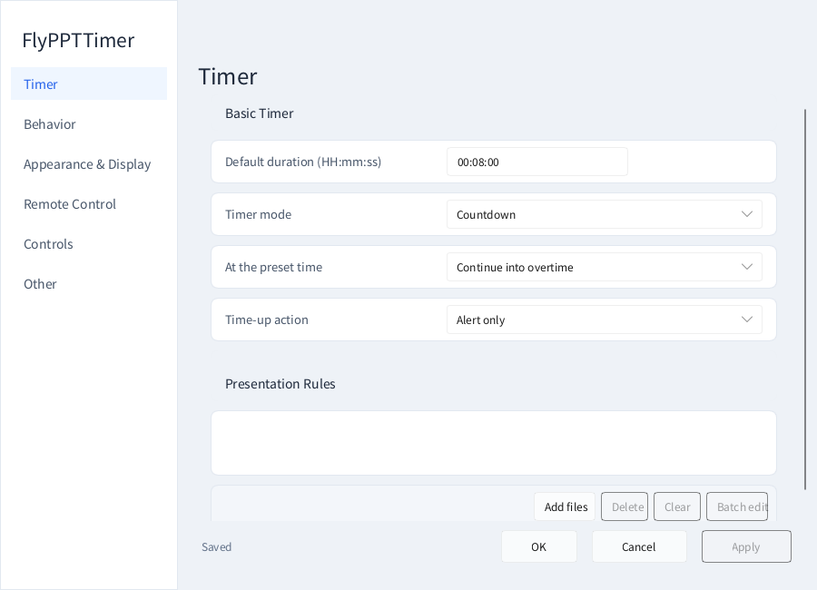
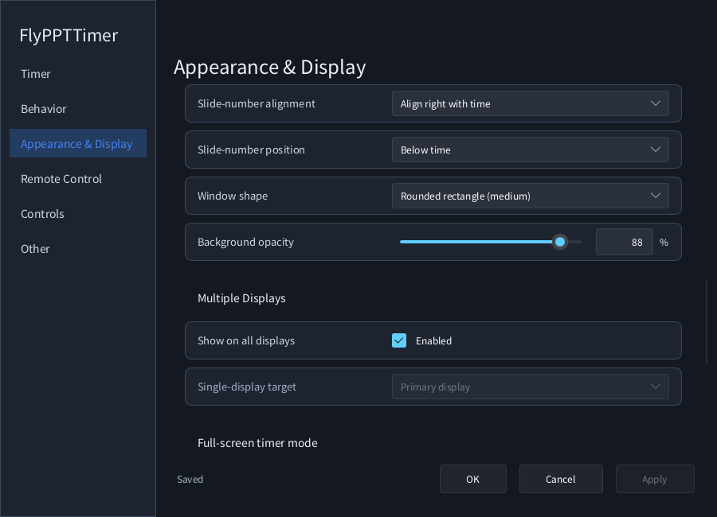
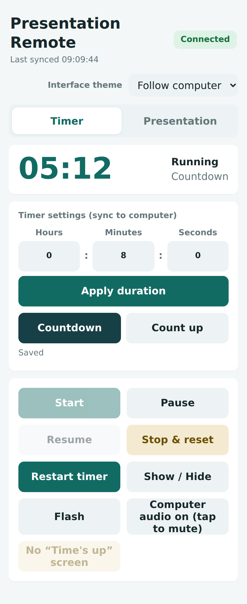
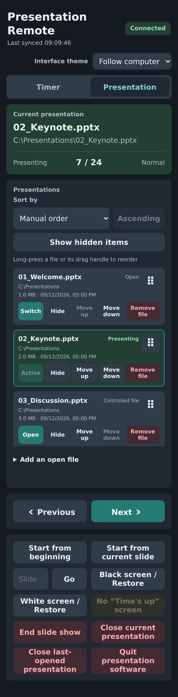
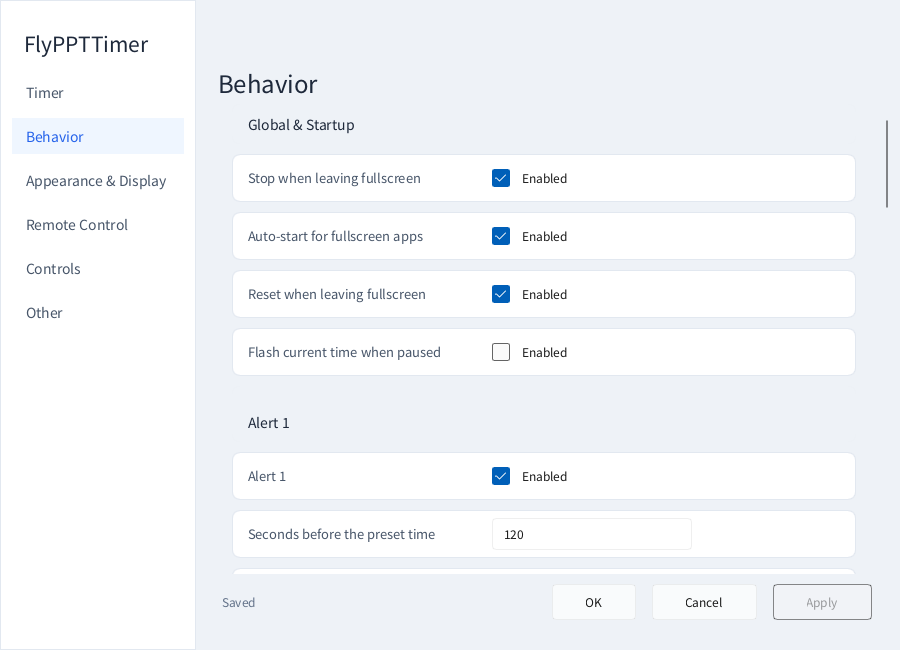
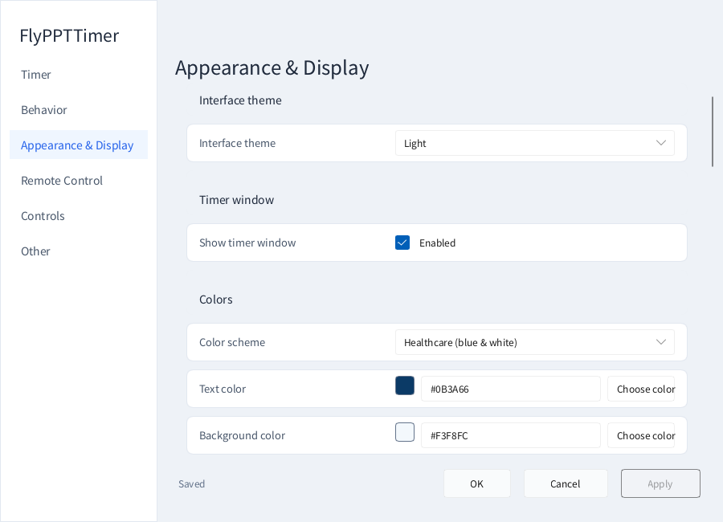
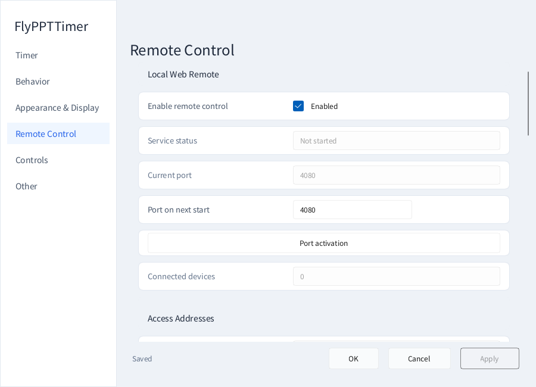
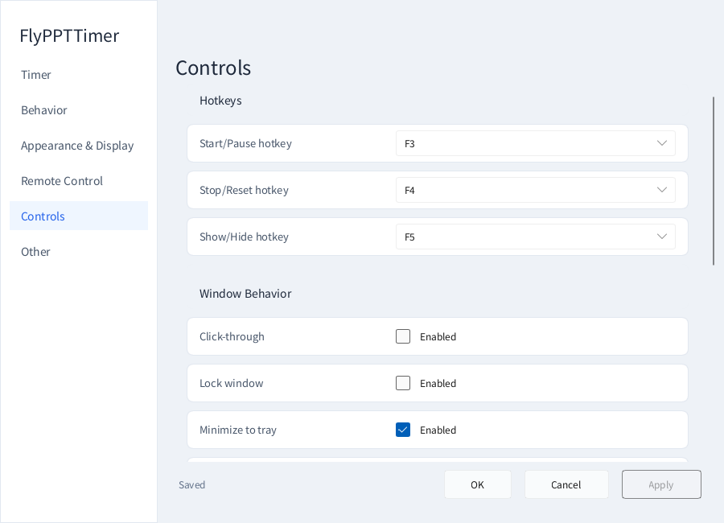
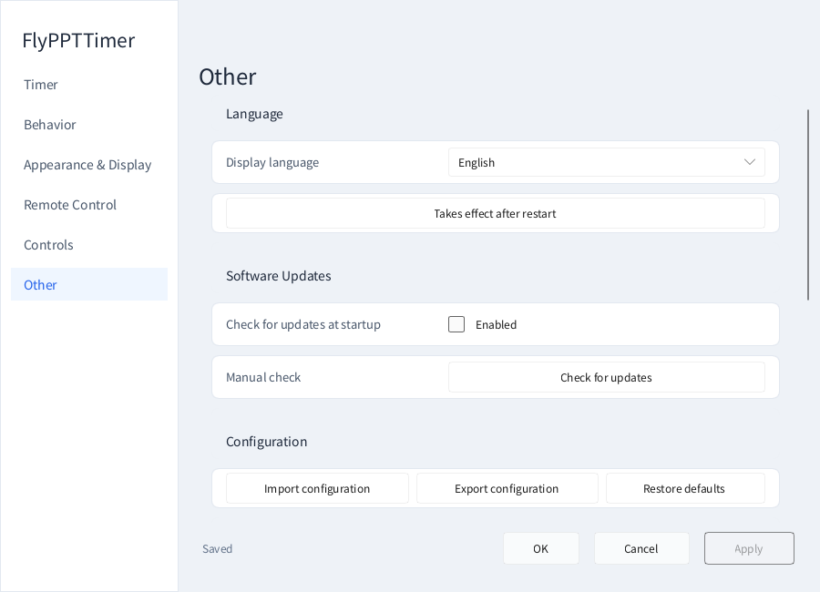

# FlyPPTTimer v1.13.1 — complete user guide

[Project home](../README.md) · [简体中文](USER_GUIDE.zh-CN.md) · [Changelog](../CHANGELOG.md)

This guide describes the Windows x64 **v1.13.1** application, its desktop Settings and Remote windows, and its phone/browser remote. A *presentation rule* is a timer/control-list record; it does not modify slides. Screenshots and build instructions for the old .NET v0.30.2 application are not the current interface.

## Contents

[Install and start](#install-and-start) · [Timer controls](#timer-controls) · [Presentation rules](#presentation-rules) · [Alerts and time-up actions](#alerts-and-time-up-actions) · [Appearance and percentage controls](#appearance-and-percentage-controls) · [Multiple displays](#multiple-displays) · [Phone and browser remote](#phone-and-browser-remote) · [Organize the mobile presentation list](#organize-the-mobile-presentation-list) · [Themes and language](#themes-and-language) · [Keyboard shortcuts](#keyboard-shortcuts) · [Configuration and upgrading](#configuration-and-upgrading) · [Troubleshooting](#troubleshooting) · [Example workflows](#example-workflows)

## Install and start

### Choose a package

The **portable ZIP** is useful for occasional use or a removable folder. Extract the entire `FlyPPTTimer-v1.13.1-portable-win-x64.zip` into a writable folder, then launch `FlyPPTTimer.exe`. Do not run it inside an archive preview and do not copy just the EXE: keep its accompanying Microsoft runtime DLLs.

The **setup ZIP** is convenient for a regularly used PC. Extract `FlyPPTTimer-v1.13.1-setup-win-x64.zip`, run the installer EXE inside, choose English or Simplified Chinese, and follow the wizard. The default installation is per-user in the local application-data directory, with an optional desktop shortcut. Normal installation does not require administrator privileges.

Both editions contain the same accepted application executable and the required app-local VC runtime libraries. **.NET is not required.** GitHub's automatically generated “Source code” archives are for developers, not ready-to-run applications. The target platform is Windows 10/11 x64. Presentation integration requires a compatible desktop PowerPoint or WPS Presentation installation; standalone timing does not require Office.

### Understand the windows

| Interface | Purpose | Where to open it |
|---|---|---|
| Small timer overlay | Time above other content, with slide numbers when available | Appears at startup |
| Settings | Duration, rules, alerts, appearance, displays, remote, controls, language, configuration | Right-click the timer or notification-area icon → Settings |
| Desktop Remote | Connection URL/QR code and presentation-rule management | Same context menu → Remote Control |
| Browser Remote | Timer and presentation control from a phone or browser | Scan the QR code or open the copied full URL |

The tray icon may be under the taskbar's hidden-icons arrow. Settings and desktop Remote can coexist. Closing Settings is not quitting the application; use **Exit** in the tray menu to stop it completely.

### Editing, previewing and saving

**Apply** saves without closing Settings. **OK** saves and closes it. **Cancel** discards unapplied edits and restores the applied appearance. The footer distinguishes saved settings from unsaved changes; returning a value to its saved value clears that change.

Appearance controls can preview the timer while you edit. A preview is not necessarily a saved configuration. Enter or a click outside a single-line editor finishes input and removes the blinking insertion cursor; **finishing input is not the same as clicking Apply**.

Import/reset configuration, regenerate token and restart service are explicit action buttons, not ordinary draft fields. Some apply immediately or display confirmation; read their dialogs before proceeding.

## Timer controls

### Duration and mode

Open **Settings → Timer**. Use `HH:mm:ss`: three minutes is `00:03:00`, eight minutes is `00:08:00`, one hour is `01:00:00`. Select a mode and Apply.

**Countdown** counts toward zero; **Count up** starts from zero and shows elapsed time. The preset duration still provides the target for reminders and time-up handling in count-up mode. Choose whether reaching the target stops timing or continues into overtime. Overtime colors and the prefix are configurable under Behavior.

A new configuration starts with an eight-minute countdown and allows overtime. Timing uses elapsed time; no slide macros, inserted countdown objects or special deck animations are needed.

### What each action does

| Action | Meaning |
|---|---|
| Start / Resume | Begin timing, or continue existing paused progress |
| Pause | Stop accumulating elapsed time temporarily |
| Stop and reset | Stop the current round and return to its initial display |
| Restart | Start a new round instead of resuming the paused one |
| Show / Hide | Change the small overlay's visibility; does not mean stop timing |
| Flash | Give a visual prompt without editing the presentation |
| Mute | Toggle the PC's main audio output mute, **not just this application** |

F3 controls Start/Pause, F4 Stop/Reset, and F5 Show/Hide by default. The phone timer page also provides the main controls. Not every action has a default keyboard binding; menus and browser controls remain available.

### Automatic fullscreen behavior

Behavior contains separate controls for auto-starting with whitelisted fullscreen applications, stopping when leaving fullscreen, and resetting when leaving fullscreen. They are enabled by default. Normally, entering a supported PowerPoint/WPS show starts timing, and leaving it stops/resets the timer according to these settings.

Disable automatic start for manual-only timing. Disable reset on exit when preserving the final reading matters. The configuration whitelist also includes some browser and PDF-reader processes; that does **not** mean PDF files can be added to the PowerPoint control list.

## Presentation rules

### Different time limits for different files

For a three-minute welcome, eight-minute keynote and five-minute discussion:

1. Open **Settings → Timer → Presentation Rules**, then Add file.
2. Select one or more `.ppt`, `.pptx` or `.pptm` files in the modern Windows picker. Use the address bar or normal system navigation. There is no “All files” fallback.
3. Select a rule, enter its duration and mode, and choose whether the timing rule is enabled.
4. Apply/OK in Settings, or use Save when editing through desktop Remote.

Rules identify files by their **full path**. Identically named files in different folders are different presentations. Moving or renaming a file requires updating its list entry. Adding a rule neither edits slide content nor starts a slide show.

### Multi-select and batch editing

Click one row, Ctrl-click separate rows, or Shift-click a range. Use Batch settings to give the selection one duration and mode, confirm, then save the window. In a conference, set ten minutes for everyone first and change the invited speaker separately.

Desktop Remote shows aligned File name / File path, Duration and Mode columns, with two lines for each file's name/path and its enabled state. It is a management page, **not a duplicate of the phone's slide-show control panel**.

### Disable, hide, remove and close are different

| Operation | Effect |
|---|---|
| Disable a timing rule | Stop using its duration/mode override; not the same as revoking control-list membership |
| Hide on the phone | Temporarily remove it from the normal visible mobile list; it remains controlled and can be restored |
| Delete rule / Remove file | Remove control-list/rule membership; never delete the file on disk |
| Close presentation | Close an open document in the presentation application; unrelated to deleting a rule |

Edits to different fields from Settings and Remote are merged where possible. Save one group of changes deliberately rather than editing the same parameter in several windows simultaneously.

## Alerts and time-up actions

Open **Settings → Behavior**. Reminder 1, Reminder 2 and Time up can be configured independently.

| Setting | Explanation |
|---|---|
| Seconds before the target | `120` means two minutes remaining; `30` means thirty seconds |
| Speech | Speak a reminder using installed Windows speech/output facilities |
| Sound file / Choose file | Choose `.mp3`, `.wav`, `.wma` or `.m4a`; playback uses native Windows audio |
| Restore default for a sound | Clear that reminder's custom sound, not reset the entire application |
| Flash style | None, text, background, solid border, or border plus background |
| Flash on/off time | Each visible/hidden interval in milliseconds; `350` means 0.35 seconds |
| Flash duration | Total visual reminder duration in seconds |

Reminder 1 is enabled at 120 seconds by default. Reminder 2 is disabled initially, with a 30-second threshold. The time-up prompt is enabled. Imported sounds are copied into the local `alert-sounds` folder; include it when moving your configuration. Individual custom-sound playback is capped, so a long recording is not a reliable way to deliver a complete announcement. Speech is handled separately.

The time-up **action**, selected on the Timer page, is separate from sound configuration:

**Alert only** does not interrupt the deck. **Black screen with “Time's up”** is this application's opaque fullscreen overlay, not a small card. **End slide show** ends presentation mode but is not the same as closing the document or quitting Office.

Use Escape or the explicit browser dismiss action to clear the time-up overlay. This is different from the browser's Black/White screen controls, which temporarily change the **presentation application's show screen**. Rehearse on the real projector and speakers before an event.

## Appearance and percentage controls

Open **Settings → Appearance & Display**. Choose a built-in medical blue/white, education blue/gold, business graphite/blue, technology dark/cyan, or high-contrast black/red scheme, then customize as needed. Exposed color settings provide a visual picker and HEX input, for example `#F3F8FC`.

### Size, time and slide numbers

| Option | How it behaves |
|---|---|
| Automatic sizing | Measures time/slide content and font sizes; width/height fields are hidden |
| Custom sizing | Uses explicitly saved width/height; does not silently grow, so undersized dimensions can clip |
| Time font size | Changes the main time readout |
| Match page font to time | Use the same size; disable for an independent slide-number size |
| Match page color to time | Use time color; disable for a separate slide-number color |
| Italic / alignment / position | Page-number italic styling, left/center/right alignment, and above/below placement |

New defaults display slide numbers at independent size **12**, **below** the time and **right-aligned**. No active presentation means actual slide information may be unavailable. App theme changes do not overwrite custom timer colors.

### Corner shapes

Choose rectangular, small, medium or large rounded corners. Rounded radii are approximately 3/7/14 logical pixels and scale with display density. The old “small” rounding retains its appearance but is now named “medium”; the newly added small option is genuinely smaller.

### Drag, wheel, or enter exact percentages

Opacity runs from 0–100%; horizontal and vertical position offsets from −50% to 50%. Higher opacity means less transparency. At 0%, the overlay can be hard to locate; recover it through Settings or the tray.

Drag the slider for a live preview. Hover over its track and turn the mouse wheel for **one percentage point per notch**, such as 88% to 89%, not a relative 1% multiplication. Click the adjacent number to type a value. Enter or focus loss finishes and normalizes the entry. Opacity uses integers; position offsets retain 0.1% precision. Apply saves; Cancel restores unapplied previews.

### Position, lock and click-through

Nine anchor positions cover the screen's corners, edge centers and center; percentage offsets fine-tune them. You can also drag an unlocked, non-click-through small overlay. Use Reset timer position to recover an inconvenient placement.

Position locking prevents accidental dragging. Mouse click-through sends pointer interaction to the content underneath. If enabled, clicking the overlay itself no longer works as an editing method; use the tray or keyboard to turn click-through off. Hiding is session-only: the next launch shows the timer again.

## Multiple displays

Configure displays in Windows first, then choose a display mode in Appearance & Display.

**Show on all screens** mirrors small overlays across displays. Turn it off to select a single display.

**Fullscreen / big-screen timer** dedicates an extended display to a large timer. It requires Windows **Extend**, not Duplicate. While active, that display is excluded from the small overlays; turning it off restores eligible small overlays.

A common arrangement is a projector for slides and a separate monitor for a moderator's large timer. Check display names, scaling and output placement on the actual equipment. Seeing the timer on the laptop does not establish what the audience's screen shows.

## Phone and browser remote

### Connect for the first time

1. Start FlyPPTTimer on the PC and open desktop Remote → Connection.
2. Put phone and PC on the same trusted LAN: the same Wi-Fi router, or connect the PC to the phone's hotspot.
3. Confirm the service is running. Scan the QR code or use Copy access URL and open that complete URL in the phone browser.
4. Wait for Connected, then try pausing/resuming the timer before controlling a deck.

Use the PC's current network address, **not the phone hotspot's gateway or `127.0.0.1`**. QR and copied URL correspond to the same service. After changing networks, use the new current address. Visible token masking is intentional; do not manually enter a URL containing masking dots.

### Port, token and service controls

The saved fixed port, normally 4080, is reused. If unavailable, a free port is selected and saved, changing the URL. After editing the next-service port, choose Restart and apply port and reconnect the phone.

The URL token is a control credential. Do not publish real QR codes or token-bearing links. Regenerate token changes the access credential; Disconnect devices revokes current remote sessions/connections. Reconnect using the current access information.

The remote does not require a cloud account and does not upload presentation content, but it is an ordinary HTTP LAN service, not an encrypted public meeting service. Use trusted networks, stop the service when unnecessary, and do not expose it through public port forwarding.

### Timer page

The timer page shows time/status and controls start, pause/resume, reset, restart, show/hide, flash and computer mute. Edit hours/minutes/seconds and apply a new duration. When asked whether to update only the global duration or synchronize rules as well, choose deliberately: do not overwrite every speaker's timing unintentionally.

### Presentation page

Choose Open or Switch on a controlled file before starting its show. Opening attempts to maximize and activate the target document's editor; it does **not** automatically start a show. Reopening an already running presentation should not obscure its show with an editor window.

| Control | Function |
|---|---|
| From beginning | Start this deck at its first slide |
| From current slide | Start at the application's current slide |
| Previous / Next | Navigate the active controlled slide show |
| Slide number + Go | Jump to a valid slide number |
| Black / Restore and White / Restore | Temporarily black/white the show, then restore it; no slide edits |
| End show | Leave show mode, keeping the document open |
| Close current presentation | Close the current controlled document in the presentation application |
| Close last-opened presentation | Close the document last opened under this application's management |
| Quit presentation software | Quit safely identifiable managed presentation processes; mixed/uncontrolled documents can cause refusal |

**Save in PowerPoint/WPS before closing or quitting. Unsaved edits may be lost.** Remove file, End show and Quit Office are deliberately different operations. When a control is disabled, read the current status rather than repeatedly submitting operations.

Not every document open in Office is automatically controlled. Add a document to the list before expecting remote access to it.

## Organize the mobile presentation list

Sort manually, by name, size or modified time, with ascending/descending directions. Name order is numeric-aware, so item 2 precedes item 10. Size/time are file metadata; unavailable metadata sorts last.

Long-press a row or use its drag handle to reorder, or use Move up/Move down. Dropping submits the new order; a normal quick vertical swipe scrolls instead. Moving manually switches the list into manual order.

Horizontal swipes in the list switch Timer/Presentation just as elsewhere outside active input controls. Vertical movement first scrolls the file list, then chains to the whole page at its boundary. Short lists that fit do not trap page scrolling.

Hide temporarily removes an item from the normal mobile view; Show hidden lets you restore it. Add open file offers detected open documents—it is **not phone-to-PC file upload**. Remove file asks for confirmation and removes rule/control membership, without deleting a disk file, saving it, or closing the Office document.

## Themes and language

Desktop Appearance & Display offers System, Light and Dark. The theme covers Settings, desktop Remote and application-owned dialogs. Windows-provided file/color dialogs retain the OS's theme behavior.

The phone's theme selector follows the PC by default, with a local light/dark override. Browser language determines the mobile UI language; it does not have to match the desktop's selection.

Choose System, English or Simplified Chinese in desktop Other settings. Language changes require restart; the confirmation saves and restarts. Settings opens again afterward. OK/Cancel then closes Settings only, leaving the timer/tray/remote service running.

## Keyboard shortcuts

| Default key | Action |
|---|---|
| F3 | Start / pause / resume |
| F4 | Stop and reset |
| F5 | Show / hide small timer overlays |
| F7 | Flash |
| F8 | Toggle the PC main output's mute |
| Ctrl+Alt+Up / Down | Add / subtract a minute |
| Ctrl+Alt+1 / 2 / 3 / 4 / 5 | 3 / 5 / 8 / 10 / 15-minute presets |
| Escape | Dismiss this app's time-up blackout; PowerPoint can also process Escape |

The three main function keys can be changed to F1–F12 in Controls. Other bindings live in `Controls.Hotkeys` in the configuration and do not all have GUI editors. If another application or Windows owns a combination, choose another; on laptops the Fn key may be needed to send a function key.

Minimize to tray and close-button behavior determine how supported window actions are handled. Use the explicit tray Exit command when you need to stop the entire application.

## Configuration and upgrading

### What stays on the PC

| Data | Default location / shortcut |
|---|---|
| Settings and rules | `FlyPPTTimer.config.json` beside the EXE; Other → Open configuration location |
| Logs | Local `logs` folder; Open log location |
| Imported alert audio | Local `alert-sounds` folder |
| Configuration export | JSON file selected through Export configuration |

Exporting settings does not bundle every deck and audio file. On another computer, copy the relevant presentations and `alert-sounds`, and check absolute file paths in rules. After import, confirm timing, displays and connection details. Back up before restoring defaults.

### Upgrade a portable installation

Exit the old process completely, extract the new ZIP to a new folder, copy your personal configuration and imported sounds, and launch/check the new version. Do not overwrite your saved configuration with the package defaults or omit the runtime DLLs. v1.13.1 keeps explicit preferences but always restores startup visibility.

Old v0.30.2 JSON can be imported; keep a backup and check paths, displays, reminders and new page-number options. Automatic sizing, big-screen and mobile-list behavior has evolved; consult the [development history](DEVELOPMENT_HISTORY.md).

For an installed edition, run the new installer into the same installation directory. Existing configuration is not replaced by the default file. Uninstalling can retain personal settings; export before manually cleaning remaining data. For portable removal, exit and delete the portable folder yourself.

### GitHub downloads versus in-app updates

**The accepted application's updater still queries the Gitee release channel and recognizes standalone installer EXEs.** This GitHub release provides only the requested two ZIPs and does not publish to Gitee. Check for updates in the app therefore does not imply it has checked this GitHub release or can automatically install the setup ZIP. Download from [GitHub Releases](https://github.com/Hona-Cao/FlyPPTTimer/releases/latest), extract, and run the installer manually. Startup update checks are disabled by default.

## Troubleshooting

| Symptom | Check first |
|---|---|
| Cannot find the timer after launch | v1.13.1 shows it at startup; check 0% opacity, custom dimensions, target monitor and saved placement. Use tray Settings to reset position and verify you ran the new EXE |
| Cannot click or drag the timer | Turn off click-through or position lock from the tray |
| Missing/incorrect slide numbers | Enable slide numbers; check compatible presentation app, document and target. Standalone timing has no deck slide information |
| Setting changes disappear | Check unsaved footer; finishing input is not Apply, and Cancel discards previews |
| QR cannot connect | Scan your live desktop QR, not the documentation screenshot; verify a PC LAN address reachable from the phone |
| Phone connection fails | Same LAN, service running, correct current port; check guest-network/client isolation, VPN, adapters and Windows inbound rules. Rescan after network changes |
| Timer works but slides do not | Add the target deck to the controlled list; check desktop PowerPoint/WPS state and permissions. Browser-only Office is not desktop COM integration |
| Empty file list | Add and save rules on the PC, or use Add open file. Launching Office does not enroll every document |
| Removed file stays open | List removal never closes or deletes it; save and use Close presentation when necessary |
| Big-screen controls unavailable | Requires an extended display, not duplicated output |
| No reminder sound | Check reminder switches, path, output device, volume/mute and Windows speech; F8 mutes the PC's main output |
| Settings reopens after a language change | Expected restart behavior; OK should close Settings, not the application |
| Runtime DLL missing | Re-extract the complete ZIP or reinstall; never fetch random DLLs from unofficial sites |
| Windows questions the downloaded executable | Download from this repository's release and verify version/source; do not disable security software or ignore a malware finding |

The copied firewall command may require administrator rights. **Do not switch the firewall off.** Allow only the necessary application/port on appropriate trusted networks. This application is not a public remote desktop service.

For [issue reports](https://github.com/Hona-Cao/FlyPPTTimer/issues), include app/Windows/PowerPoint/WPS versions, steps, expected/actual result and relevant logs or screenshots. Remove tokens, live QR codes, personal paths and sensitive presentation contents.

## Example workflows

**Eight-minute thesis presentation.** Set countdown to eight minutes, Reminder 1 to two minutes remaining, and Alert only. Register the deck, put the overlay on the speaker display, and reset with F4 before the show.

**Several speakers.** Add all decks, batch-assign a default duration, then adjust special talks. Sort by agenda on the phone. Hide completed entries instead of removing them when you will reuse the same list.

**Off-stage moderator.** Use the phone timer page to pause/resume or flash a prompt without touching the deck. Reminder audio plays on the PC's output, not the phone speaker.

**Dedicated large timer screen.** Enable Extend in Windows and select a moderator-facing monitor for fullscreen timing. Do not select the audience's presentation display unless replacing slides there with a full timer is intentional.

Before an event, check the file order, per-file duration, actual displays, speakers and phone connection. Documentation describes features; your specific equipment and network still need a final rehearsal.

## Settings page gallery

These show the top of each settings page. Scroll within the application for additional fields; the instructions above explain their meaning.

Behavior / 行为设置

Appearance / 外观与显示

Remote / 远程控制

Controls / 控制设置

Other / 其他设置

