# FlyPPTTimer User Guide

[Home](../README.md) · [简体中文](USER_GUIDE.zh-CN.md)

For **v1.16.0 public release / Windows 10 and 11 x64**. [Download and install](../README.md#download).

Use FlyPPTTimer as a standalone speaking timer or with desktop PowerPoint/WPS to show slide numbers, use a different duration for each presentation, and control your talk from a phone browser. This guide follows the seven Settings pages, then covers phone controls and everyday maintenance.

## Contents

[v1.14.1 illustrated workflow](#v1141) · [Connection and authorization](#file-access) · [Compact timer](#compact-timer) · [Zero-offset edges](#edge-placement)

[Getting started](#start) · [Saving settings](#save) · [1. Timer](#timer) · [2. Behavior](#behavior) · [3. Appearance & Display](#appearance) · [4. Remote Control](#remote) · [5. Controls](#controls) · [6. Scenarios](#scenarios) · [7. Other](#other) · [Phone controls](#phone) · [Troubleshooting](#faq)

## v1.16.0 workflow improvements

- **Scenarios:** use **Save mode** in the Settings footer to name and save the currently applied configuration. Rows are newest-first and collapsed by default; select, confirm deletion, or expand them directly. Expanded details keep name, switch hotkey, badge color, and snapshot-update controls. The footer shows the active scenario and switching briefly highlights the timer border with its color.
- **Presentation opener:** Windows system default remains the default. You can explicitly select a validated Microsoft PowerPoint or WPS Presentation executable; desktop and phone-initiated opens use the same preference.
- **Phone Remote:** Exit presentation application is available whenever a known PowerPoint/WPS presentation process is running, even with no deck open. Controlled-deck checks and confirmation remain. Remote polling/dispatch intervals are reduced for quicker LAN feedback.

## v1.15.0 complete feature guide

### Default slide stopwatch and time-only big screen

Fresh configurations enable the slide stopwatch. The ordinary overlay reserves its second row from startup: `00` at lower left is current-slide dwell seconds and `-/-` at lower right is the slide placeholder. During a show these update normally; revisiting a slide adds to the phone's accumulated table while the overlay's current visit restarts at `00`.

The dedicated big-screen timer now has a separate purpose: **fresh configurations show main time only**. Enable the big-screen metadata option under Appearance & Display only when that fullscreen display also needs slide numbers and per-slide seconds. This does not change the ordinary overlay.

### Unlimited timing for teaching and open sessions

**Unlimited**, beside Default duration, is a distinct mode. Once applied it:

- forces Count up from zero and does not allow Countdown;
- has no effective target, hiding/disabling target and time-up actions;
- does not run the two advance reminders, end reminder, or overtime styling for that round;
- ignores ±1 minute and 3/5/8/10/15-minute presets while unlimited is active;
- keeps presentation rules stored so they resume after Unlimited is disabled.

This is useful for open-ended teaching, discussion, or elapsed-time tracking. It is not implemented as a fake very-large user-visible duration.

### Scenarios: save a complete working setup

Scenarios sits between Controls and Other. Up to eight snapshots store timer, behavior/alerts, appearance, displays, controls and presentation rules. Language, update source and Remote credentials stay outside snapshots so a business-mode switch does not alter maintenance/security settings.

**Save:** configure and Apply the working state first, then use **Save mode** in the Settings footer. Enter a name and confirm (or press Enter). New scenarios appear newest first and collapsed by default.

**Maintain:** expand a row to rename it, assign a global switch hotkey, change its badge color, or overwrite the saved snapshot from the current configuration. Delete from the row itself and confirm; deleting a scenario never deletes PPT files.

**Switch:** select a scenario from its row, its global hotkey, the tray/timer scenario submenu, or the phone Timer page. The footer shows the active scenario and color; the timer border briefly uses that color after a switch, and the application/tray badge dot is larger. The scenario submenu remains present even when no scenarios are saved.

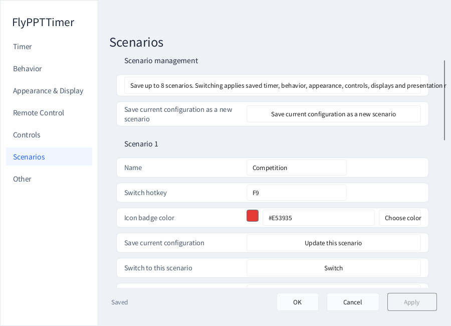

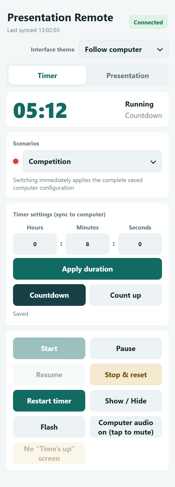

Examples you can create include Competition, Recruiting with big screen enabled in its snapshot, or Speaker Reminder with the ordinary overlay limited to the primary screen. They are examples, not mandatory built-in presets.

### Update source and automatic installation

Choose **Gitee** or **GitHub** under Other → Software Updates. With no saved source, the application reads the Windows geographic-region setting: CN (mainland China) selects Gitee; other regions select GitHub. It does not query GPS or precise IP location, and a later explicit user choice is retained.

When a newer stable version exists, the dialog shows the complete release notes from that selected source. Choose **Download and install**:

| Edition | Automatic update path |
|---|---|
| Installed | Download `setup-win-x64.zip` → extract in a temporary directory → exit current process → run the installer silently → restart FlyPPTTimer. |
| Portable | Download `portable-win-x64.zip` → extract → exit → replace application files in place → preserve `FlyPPTTimer.config.json` and `alert-sounds` → restart. |

This is an **in-app automatic update**, not an in-memory hot patch with the current process kept alive. Normal network access and write permission are still required; save unsaved PowerPoint/WPS work before updating.

## v1.14.1 illustrated instructions

This section describes the public v1.14.1 release. Check your actual version in Settings before following the new permission workflow.

### Allow computer PPT browsing after the phone connects

**Connecting to Remote and allowing file browsing are separate.** The additional browsing switch exposes folder/PPT names and is off by default. Leave it off when you only need timing or slide navigation.

**Step 1 — Connect, then look at the computer.** Scan the live desktop Remote QR code on the same network and wait for Connected. When browsing is not yet allowed, Settings opens at Remote Control with the browsing option highlighted. The notice shows the connection address; it is not a password or an approval button.

**Step 2 — Check the switch and click Apply.** Select **Allow phone to browse computer PPT files**. The footer now indicates unsaved changes; the phone still lacks permission. Click **Apply** to save. **OK** saves and closes Settings. Enter, hiding the window, or simply dismissing the notice is not Apply.

**Step 3 — Confirm it is saved and return to the phone.** After Apply, the box stays selected, the footer shows Saved and the connection notice clears. Normal phone polling obtains the new permission. Open **Presentation → Browse computer PPT files**. If an already-open browser panel still shows its permission message, close and reopen that panel.

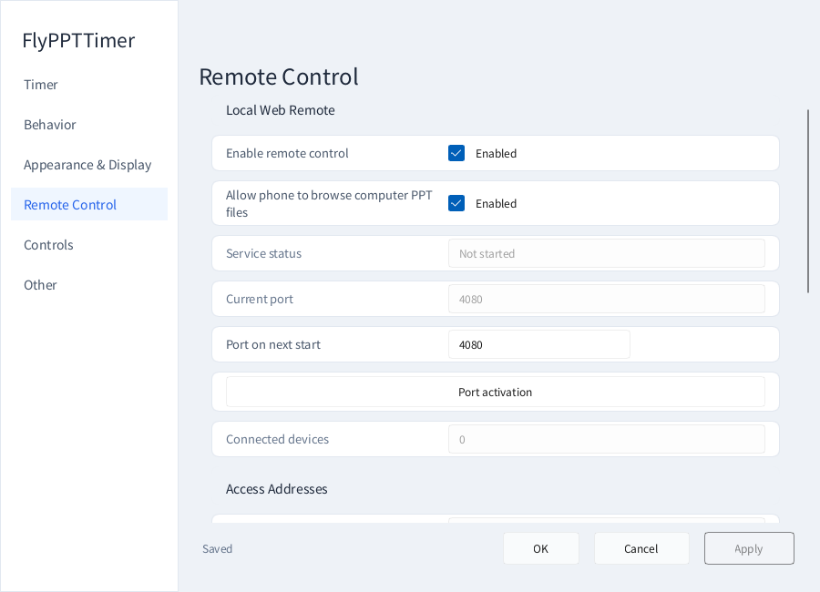

**Step 4 — Find and add a PPT.** Open Home or a local drive, navigate folders and filter the current folder's names. Use **Add to list** beside the file, then close the browser and open/start it from the controlled list. Existing entries are not duplicated.

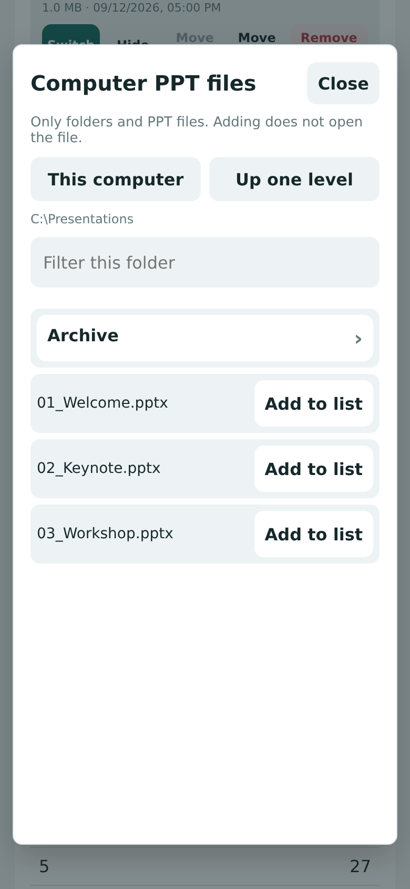

The phone file browser is unchanged from v1.14.0, so that production-web rendering is retained above. The desktop authorization illustrations in this section are newly captured from v1.14.1.

**Decline or revoke:** do not check the box to decline. To revoke later, uncheck it in desktop Settings → Remote Control and Apply. This stops future folder browsing; it does not delete existing rules or close an open presentation.

**The checkbox does not grant access only to the phone named in the notice.** It remains a shared permission for devices holding the current valid Remote URL/token. It allows local folder navigation and adding PPT files—not arbitrary downloads, deletion, editing or network-share access. Keep live QR codes and full control URLs private.

#### When the authorization page does not open automatically

| Situation | What to do |
|---|---|
| The computer is still running v1.14.0 | Open Settings → Remote Control manually and Apply the permission. Automatic guidance starts with v1.14.1. |
| Browsing is already allowed | No repeated prompt is needed. Browse directly from the phone. |
| This phone was already announced | A connection IP is announced once per service session; refreshing or briefly reconnecting does not keep interrupting a presentation. Open Settings manually when needed. |
| The web page opened but is not connected | First establish an authenticated connection; check the current QR, network and service. |
| You opened the local control page on the PC | Loopback access is not treated as a new phone connection. Authorize manually if needed. |
| The phone still asks for permission | Confirm that you clicked Apply, connected to the intended computer, and reopened the browser panel after saving. |

Restarting the service or regenerating the token resets the connection-notice record. A changed network address can also produce another prompt; this is not permanent device identity. Existing unsaved Settings edits are preserved when the page changes. Apply also saves other pending edits in that Settings window, so check them first.

The same steps in dark mode

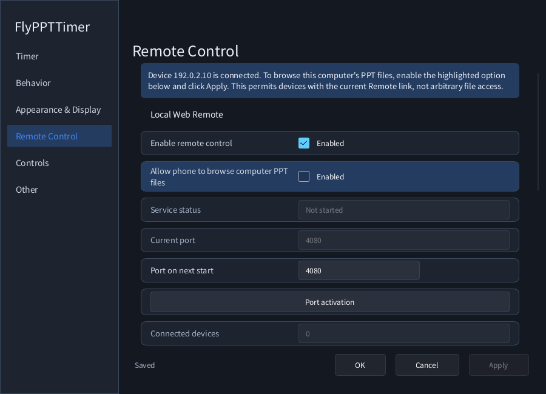

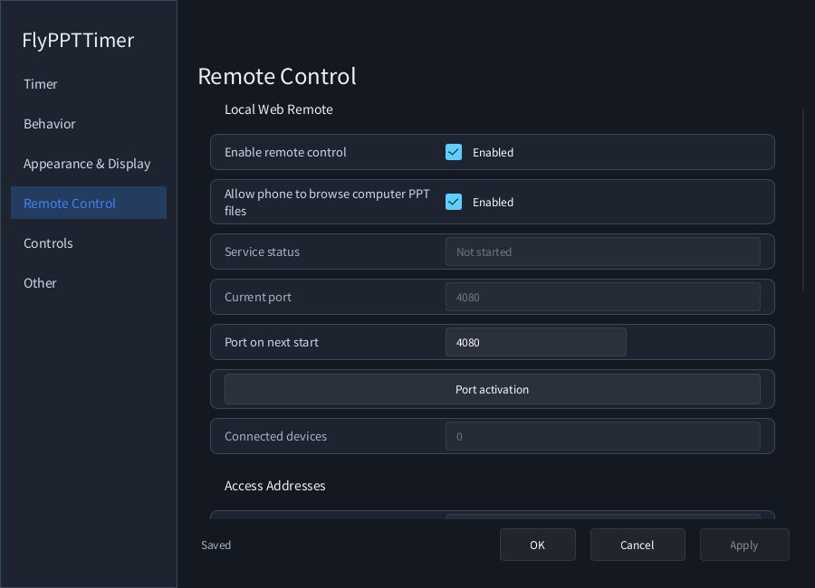

### Make the timer compact without shrinking its text

In **Settings → Appearance & Display**, choose **Automatic** sizing and Apply. v1.14.1 reduces the gap between the main time and its lower row, and the outer padding. Your font sizes and left-stopwatch/right-page arrangement remain unchanged.

| Idle, with stopwatch and slide numbers enabled | Slideshow example |
|---|---|
| 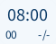 | 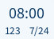 |

These are production GUI renders using example state, not a promise of the same physical pixel dimensions at every display scale. Saved custom width/height is not overwritten. If the new version still looks large, check whether Custom sizing is selected before assuming the compact layout did not apply.

### Make top-center and bottom-center flush at 0%

Under the appearance position settings, choose the target display/display mode and anchor, set **both horizontal and vertical offsets to 0%**, and Apply:

| Anchor | Zero-offset result in v1.14.1 |
|---|---|
| Top-center | Horizontally centered; the actual window top touches the screen top. |
| Bottom-center | Horizontally centered; the actual window bottom touches the screen bottom. |
| Top-left/top-right and bottom-left/bottom-right | Both corresponding window edges align with the screen edges. |
| Center | The whole window is centered horizontally and vertically. |

The calculation uses actual window dimensions, not an assumed 140×50 rectangle. Font changes, automatic resizing and DPI changes therefore use the real edges. Secondary monitors with negative coordinates use their own bounds.

**Screen means the full display, not the work area above the taskbar.** Bottom-center at 0% can overlap the taskbar region. To add an inward margin, use a small positive vertical offset at the top or a small negative offset at the bottom. Positive moves right/down; negative moves left/up.

Nonzero offsets still use the display work area's dimensions as the percentage scale. Upgrading does not zero your saved offsets, and dragging records an offset too. To restore flush positioning, choose the anchor, set both offsets to zero and Apply; use Reset timer position when necessary.

## Shared 1.14 features: slide timing, computer file browsing, and full update notes

### Enable the slide stopwatch

Choose **Settings → Appearance → Show slide stopwatch**, then Apply. It is optional and off in a fresh configuration; ordinary slide numbers remain on. Enable either or both.

A fixed row below the main timer places **slide seconds on the left and slide numbers on the right**. The old slide-number alignment and above/below choices are removed. The stopwatch follows the slide-number size by default. Turn off the font-follow switch for a custom size. Its color follows the main timer unless you disable that switch and pick a custom color.

Before a presentation can be read, enabled fields show `00` and `-/-`. Automatic sizing reserves the row from startup, rather than revealing a clipped extra row only after slideshow detection. Use automatic sizing when increasing fonts; a deliberately tiny fixed window can still be too small.

### Current visit versus accumulated slide time

The stopwatch counts seconds during an actual slideshow: `09`, `65`, `123`, without changing to minutes/seconds. Moving to a different slide resets the current-visit display to zero. It measures slideshow dwell time independently of the main timer; pausing the main timer does not pause it.

Expand **Presentation → Slide times for this show** on the phone for per-slide totals. Spending 20 seconds on slide 1 and returning for 10 seconds gives a 30-second total, while the floating stopwatch shows the current visit's 10 seconds.

Ending the show retains the last table and resets the small display to `00`. A new show or a different presentation starts a new record. Records are session-only, not written into the PPT, and not automatically exported. Valid slideshow/page information is required; missing samples are not filled with guessed time.

### Add a computer PPT from the phone

1. Connect through the computer Remote QR code on the same trusted local network.
2. Check **Allow phone to browse computer PPT files** on the computer, then Apply. In v1.14.1 an unapproved phone connection opens this highlighted setting automatically. In v1.14.0, or when no new notice appears, open **Settings → Remote Control** manually. The permission remains off by default.
3. On the phone, open **Presentation → Browse computer PPT files** below the controlled list.
4. Choose Home or a local disk and open folders. **Up one level** returns to the parent; **This computer** returns to drive roots.
5. Filter searches names in the current folder only, not the whole disk. Only directories and `.ppt / .pptx / .pptm` files appear.
6. Choose **Add to list** beside a PPT. Existing entries are not duplicated. Close the browser and then open/select/start the file from the controlled list.

New entries use the global duration and mode and append to the list. Adding does not open the file, start a show, change existing rules or modify the original presentation.

This is not remote desktop or file transfer. It provides no arbitrary download, upload, delete, rename, editing or network-share access. It uses the existing Remote token: anyone holding a valid QR URL can see folder/PPT names while this permission is on. Use trusted networks/devices, never forward the port to the public internet, and disable the permission after use if it is no longer needed.

### Mobile layout and consistent selectors

Navigation and slideshow-management buttons now precede the file list. Existing list scrolling, scroll chaining and long-press reordering remain available.

Theme, sorting and available-file selectors share the same rounded shape, palette, animation and light/dark styling. Click outside or press Escape to dismiss; with a keyboard, use arrows, Home, End and Enter.

### Complete release notes and startup checks

Startup update checks are on by default. The first migration from a configuration older than 1.14 enables the preference once; later explicit choices in 1.14 are preserved.

Checks run off the UI thread, compare available GitHub/Gitee stable releases and prompt only for a newer version. No-update and temporary connectivity failures stay silent on startup; manual checks still report their result. When mirrors differ, the newer reachable stable version is selected.

The update window can be resized. Its complete release body wraps and scrolls, with fixed action buttons; the old 600-character limit is gone. ZIP releases open their download page. Extract the package and run the installer or migrate the portable edition. No update installs without confirmation.

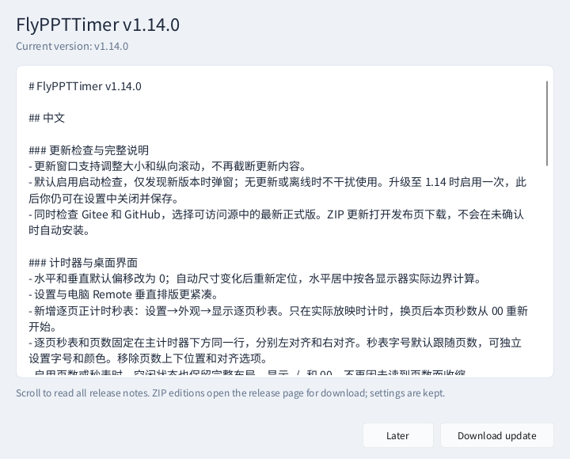

### Positioning and spacing

New horizontal/vertical offsets default to **0%**. Center anchors use the full width of each monitor, including when a side taskbar reduces its work area. Auto-size changes re-center the timer, and DPI/negative monitor coordinates are accounted for. **In v1.14.1, zero aligns the actual window edge to the full screen edge**; the old fixed edge padding no longer applies. See [edge placement](#edge-placement).

Existing custom offsets remain. To use the new position, choose a centered anchor, set both offsets to zero and Apply; reset the timer position if needed. Settings and desktop Remote reduce vertical whitespace while keeping usable input/button targets.

## Getting started

### Download and install

Download the current v1.14.1 portable or setup ZIP from the [download links](../README.md#download).

Choose an edition from [GitHub Releases](https://github.com/Hona-Cao/FlyPPTTimer/releases/latest) or [Gitee Releases](https://gitee.com/hona-cao/fly-ppttimer/releases).

| Edition | Best for | How to use it |
|---|---|---|
| `portable-win-x64.zip` | Occasional use, USB drives, different computers | Extract the complete ZIP into a writable folder and run `FlyPPTTimer.exe`. Keep the accompanying DLL files. |
| `setup-win-x64.zip` | Regular use on one computer | Extract the ZIP, run the installer EXE, choose the installation language and location, and follow the wizard. |

.NET is not required. Standalone timing does not require Office. Slide numbers and presentation control require a compatible desktop installation of PowerPoint or WPS Presentation. The phone only needs a browser.

### Your first timer

1. Start FlyPPTTimer. A floating timer appears.
2. Right-click the timer or its notification-area icon and open **Settings**.
3. On **Timer**, enter `00:08:00`, choose **Countdown**, and click **Apply**.
4. Press **F3** to start or pause. Press **F4** to stop and reset.
5. For phone control, open **Remote Control** from the context menu, connect the phone and computer to the same network, and scan the QR code.

You can use the timer without adding a presentation or connecting a phone. The notification-area icon may be inside the taskbar's hidden-icons menu.

### Which window should I use?

| Interface | Purpose |
|---|---|
| Floating timer | Shows the time and available slide numbers; drag it to a convenient position. |
| Settings | Configures durations, alerts, appearance, displays, remote access, shortcuts, and language. |
| Desktop Remote Control | Shows the connection address and QR code; its Presentations page manages file rules. |
| Phone/browser control page | Controls timing, opens presentations, runs slide shows, changes slides, and manages presentation order. |

## Saving settings

| Action | Result |
|---|---|
| Apply | Saves changes and keeps Settings open. |
| OK | Saves changes and closes Settings; the timer keeps running. |
| Cancel | Discards changes that have not been applied and closes Settings. |
| Enter or clicking outside an input | Ends that edit. Click Apply or OK to save it. |

The footer shows when there are **unsaved changes**. Fonts, colors, position, opacity, and other appearance settings can preview immediately. Cancel restores the last applied state.

Buttons such as Import configuration, Restore defaults, and Regenerate token perform specific actions, rather than simply editing a field for later saving. Their effects are explained in the relevant sections below.

## 1. Timer: choose how long a talk should run

### Basic Timer

| Setting | What it does | Example or recommendation |
|---|---|---|
| Default duration (HH:mm:ss) | The duration used when no enabled presentation rule supplies another value. | Enter `00:03:00` for three minutes, `00:08:00` for eight minutes, or `01:00:00` for an hour. |
| Timer mode | Countdown decreases from the chosen duration; Count up increases from zero. | Use countdown for a strict speaking allowance and count-up to show elapsed time. Count-up can still trigger alerts at the preset duration. |
| At the preset time | Stops timing or continues into overtime. | Continue into overtime when the speaker may need a little extra time. |
| Time-up action | Alerts only, shows a full-screen Time's up message, or ends the slide show. | Start with Alert only unless the event requires automatic interruption. |

**Overtime and the time-up action work together.** To keep showing overtime, choose **Continue into overtime** and **Alert only**. The other two actions end the slide show and stop/reset the timer instead of continuing overtime.

| Time-up action | Effect |
|---|---|
| Alert only | Uses the alerts configured on Behavior. Timing stops or continues according to At the preset time. |
| Black screen with Time's up | Ends the current slide show, stops/resets timing, and displays a full-screen Time's up message. Dismiss it with Esc or the corresponding phone control. |
| End slide show | Ends the slide show and stops/resets timing. The document remains open in the presentation application. |

### Presentation Rules: a different allowance for each file

For example, give the introduction three minutes, the main talk fifteen minutes, and the discussion five minutes, without repeatedly changing the default duration.

1. Under Presentation Rules, click **Add files** and select one or more `.ppt`, `.pptx`, or `.pptm` files.
2. Select a rule, set its duration and countdown/count-up mode, and enable it.
3. Click **Apply** or **OK**.
4. When using that presentation, its enabled rule takes precedence over the default duration and mode.

Rules identify files by their full paths. Identical filenames in different folders are separate files. Add the new path after moving or renaming a document.

| List action | Purpose |
|---|---|
| Add files | Registers presentations without editing their slide contents. |
| Delete | Removes selected rules, not the files on disk. |
| Clear | Clears the rule list. Export configuration first when you need a backup. |
| Batch settings | Applies a common duration and mode to selected rules. |
| Enable/disable | Controls whether the rule overrides the default timer settings. It does not delete the document. |

Use **Ctrl+click** for non-adjacent rules and **Shift+click** for a continuous range, then use Batch settings. A convenient meeting setup is ten minutes for everyone, followed by a separate twenty-minute rule for the main speaker.

You can also edit rules in **desktop Remote Control → Presentations**. Click **Save** in that window after editing. The filename and path appear on the left, with duration and mode in their own columns.

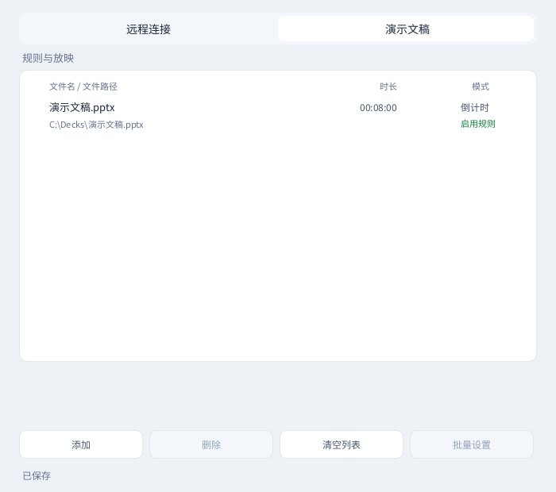

## 2. Behavior: automatic timing and reminders

### Global & Startup

| Setting | What enabling it does | When to use it |
|---|---|---|
| Auto-start for fullscreen apps | Starts timing when an application on the fullscreen list enters fullscreen. | Enable it to start with PowerPoint/WPS slide shows. Disable it for timing controlled only by F3. |
| Stop when leaving fullscreen | Stops the corresponding automatically started fullscreen timing session when fullscreen ends. | Useful when leaving a slide show should end that speaker's session. |
| Reset when leaving fullscreen | Returns the corresponding fullscreen timing session to its initial time. | Enable for a fresh start for each speaker; disable to retain the finishing time. |
| Flash current time when paused | Makes the paused time flash. | Useful when you might otherwise forget to resume. |

Automatic fullscreen detection also includes certain browsers and PDF readers. Disable automatic start and use a shortcut when those applications should not start timing. Presentation rules and the phone's controlled-file list are for PPT files.

### Alert 1, Alert 2, and Time Up

Alert 1 and Alert 2 are advance reminders. Time Up is the reminder at the preset duration. Each group has its own enable switch, speech, sound, and flash settings.

**Example: an eight-minute talk.** Set Alert 1 to `120` for a reminder after six minutes and Alert 2 to `30` for a second reminder after seven minutes thirty seconds. Time Up occurs at eight minutes. Enter the amount of time remaining, not the amount already elapsed.

| Setting | Meaning and use |
|---|---|
| Enabled | The master switch for that alert group. A disabled group does not trigger. |
| Seconds before the preset time | The advance reminder threshold, such as `120` or `30`. Use a value below the planned duration. Time Up does not have this field. |
| Voice announcement | Uses the computer's speech feature to announce the reminder through its current audio output. |
| Sound | Shows the selected audio path. Use the file chooser below to change it. |
| Choose file | Select a short `.mp3`, `.wav`, `.wma`, or `.m4a` sound. |
| Restore default | Clears this group's custom sound. It does not reset the whole application; speech and flashing keep their own settings. |
| Flash style | Chooses flashing text, background, border, or no visual flashing. |
| Visible interval (ms) | How long each flash stays visible. `350` means 0.35 seconds. |
| Hidden interval (ms) | The gap between flashes. A larger value makes the rhythm slower. |
| Flash duration (seconds) | How long the visual reminder runs overall; for example, `3` means approximately three seconds. |

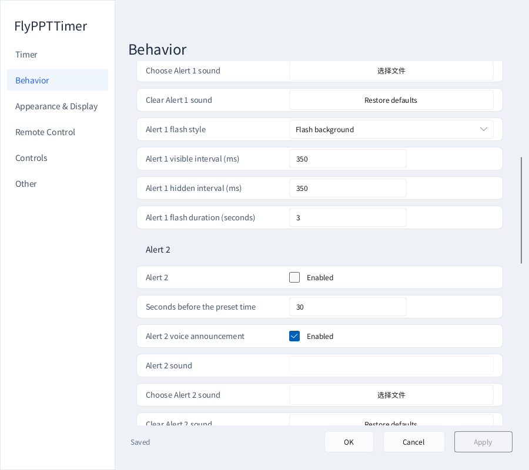

| Flash style | Typical use |
|---|---|
| None | Keep sound or speech without a flashing visual reminder. |
| Flash text | A relatively restrained change to the time readout. |
| Flash background | A more noticeable background change. |
| Solid border | A border-based reminder without changing a large background area. |
| Border + background | A stronger visual reminder. |

Show Alert 2 and Time Up settings

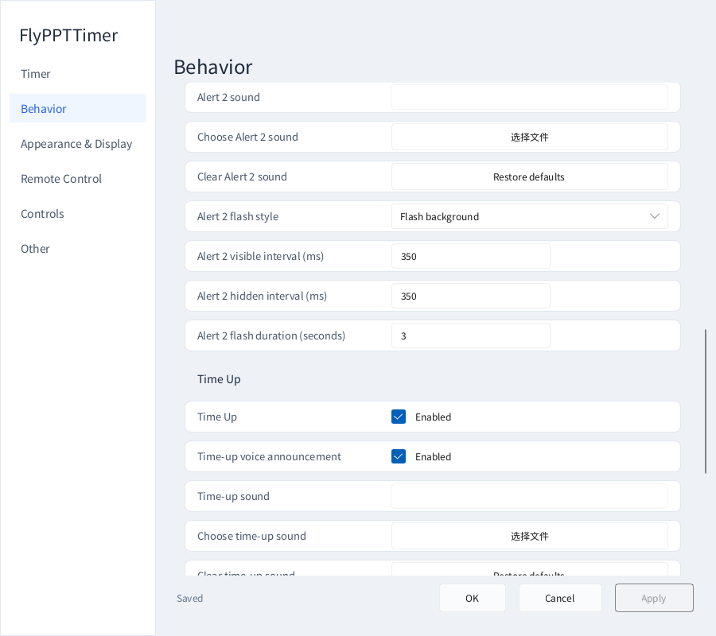

For quiet visual reminders, turn speech off, clear the custom sound, and select a flash style. For audible reminders, check the computer's mute state and selected speakers or headphones.

### Overtime colors and prefix

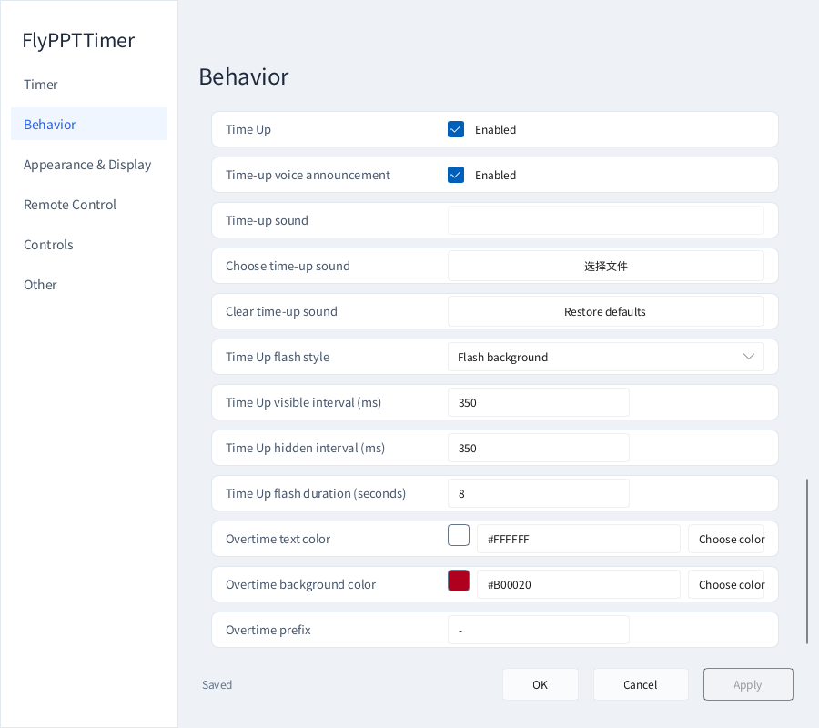

Overtime text color and Overtime background color distinguish an overrun from normal timing. Overtime prefix is the text placed before the overtime readout; `-` makes an overrun easy to recognize.

Use these settings with **Timer → Continue into overtime + Alert only**. The background color used for advance flashing reminders is configured separately under **Appearance & Display → Flash background color**.

## 3. Appearance & Display: readable and unobtrusive timing

### Interface theme, visibility, and colors

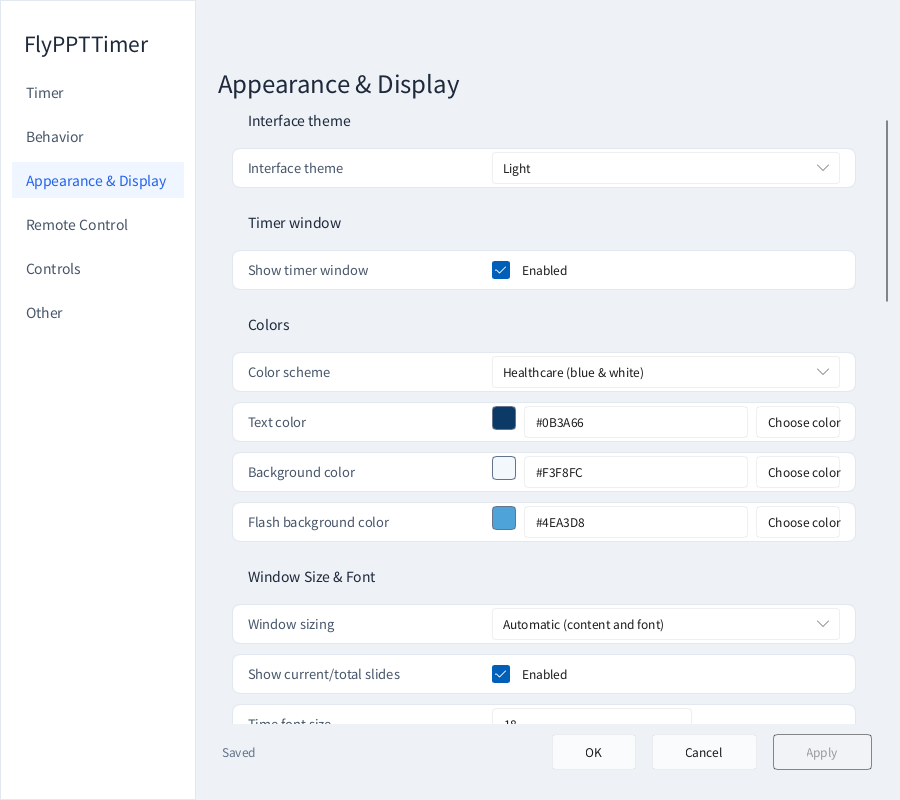

| Setting | Purpose |
|---|---|
| Interface theme | System, Light, or Dark for Settings, desktop Remote, and other application surfaces. |
| Show timer window | Shows/hides the ordinary floating timer without stopping timing. The timer is shown again each time the application starts. |
| Color scheme | Provides healthcare, education, business, technology, and high-contrast palettes. Start with a preset and adjust individual colors as needed. |
| Text color | The normal time readout color. |
| Background color | The normal floating timer background. |
| Flash background color | The background used during visual reminders. |

Click a color swatch or Choose color, or type a hexadecimal color such as `#0B3A66`. Interface theme and timer colors are separate: selecting Dark does not overwrite your timer's chosen colors.

### Window size and slide-number layout

| Setting | Purpose and operation |
|---|---|
| Automatic (content and font) | Fits the timer to its readout and font sizes. Appropriate for most uses; no width/height entry is needed. |
| Custom window size | Reveals Width and Height. Leave enough space after increasing fonts to avoid clipped text. |
| Time font size | Changes the main time readout size. |
| Show current/total slides | Shows progress such as `3 / 20` for a recognized PowerPoint/WPS presentation. |
| Match time font size | Uses the time font size for slide numbers. Turn it off to reveal Slide-number font size. |
| Match time color | Uses the time color for slide numbers. Turn it off to reveal Slide-number color. |
| Italic slide numbers | Visually separates slide numbers from the main time. |

The default slide-number size is **12**, fixed below the main time on the right. The slide stopwatch occupies the left of the same row. Position/alignment choices have been removed. Idle placeholders are `-/-` and `00`; enabling either reserves the row. Either readout can be enabled independently.

For a prominent time and smaller slide counter, disable Match time font size, increase the time font, keep slide numbers at 12, and use Automatic window sizing.

### Shape and opacity

Window shape offers a rectangle or a small, medium, or large rounded rectangle. Small corners look more square; large corners are more rounded.

**Background opacity** ranges from **0–100%**. At 100% the background is opaque; lower values reveal more of the content behind it. This adjusts the background, not the time text itself.

| Adjustment method | Operation |
|---|---|
| Drag | Hold the slider and move it left/right. The value and floating timer preview update together. |
| Wheel | Hover over the slider. Each wheel notch changes the value by one percentage point, such as 88% to 89%. |
| Type | Click the adjacent number box and enter a precise value. Enter or click elsewhere to finish. |

Click Apply to save. Horizontal and vertical position offsets use the same interactions. Position offsets support 0.1-percentage-point precision; background opacity uses whole percentages.

### Multiple displays and full-screen timing

| Setting | Purpose |
|---|---|
| Show on all displays | Shows a small floating timer for the same session on each applicable display. |
| Single-display target | Turn off Show on all displays, then select the one display for the timer. |
| Enable full-screen timer | Uses an extended display for a large full-screen time readout. |
| Full-screen timer display | Selects the extended screen for that readout. An ordinary small timer is not duplicated on the same screen. |

**A speaker-only timer:** turn off Show on all displays and select the speaker's monitor.

**A dedicated moderator screen:** select Extend these displays in Windows display settings, enable the full-screen timer, and choose the moderator's display. It occupies that screen, so do not select the audience's slide-show screen unless that is intentional.

When the full-screen option is disabled or says Extended display required, check the external monitor connection and Windows display mode first.

### Default position and offsets

With v1.14.1, Top-center at 0% touches the actual screen top and Bottom-center the actual bottom, including the taskbar region. [Detailed steps](#edge-placement).

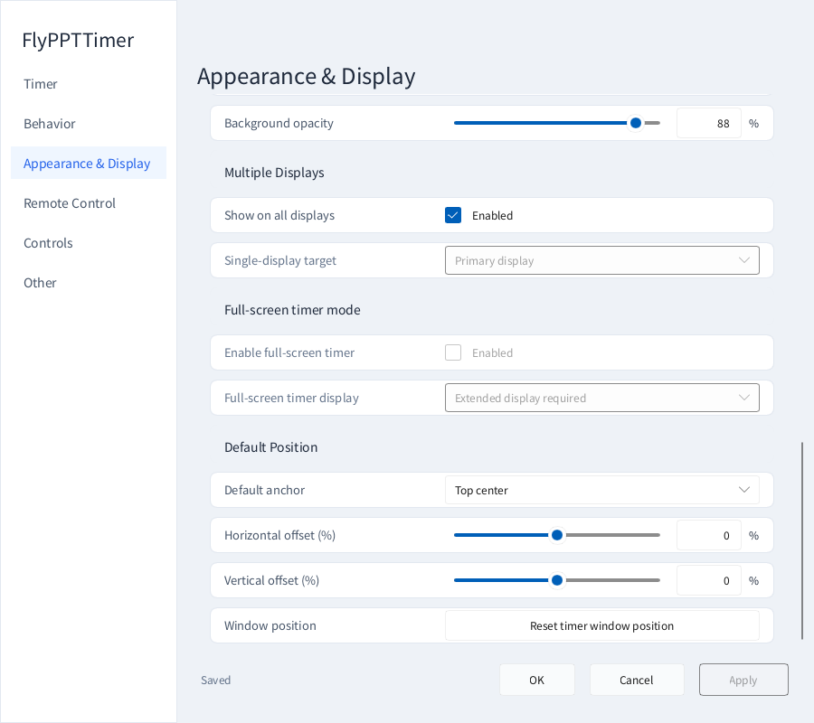

| Setting | Purpose |
|---|---|
| Default anchor | Selects one of nine positions, including top left, top center, and bottom right. |
| Horizontal offset (%) | Moves relative to that position. Positive means right; negative means left. |
| Vertical offset (%) | Positive means down; negative means up. |
| Reset timer window position | Clears manually dragged placement and repositions using the current anchor and offsets. |

Offsets are relative to the selected display's work area and range from **-50% to 50%**. Choose a nearby anchor first, then make small adjustments. You can also drag the floating timer when click-through and position locking are off.

## 4. Remote Control: connect a phone

### Local Web Remote and ports

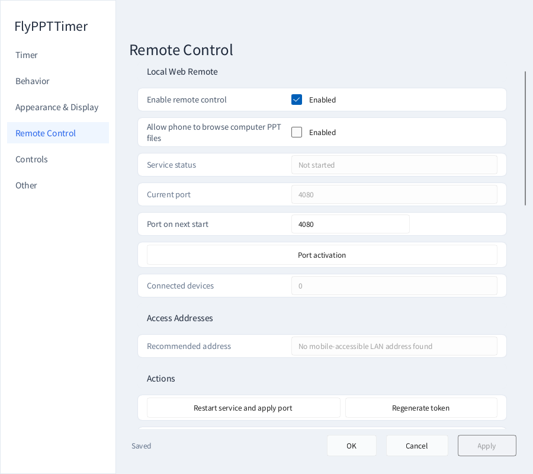

| Setting | Meaning |
|---|---|
| Enable remote control | Allows browser control over the local network. Save after changing it. |
| Service status | Shows whether the service has started. |
| Current port | The port currently used for connections. |
| Port on next start | The desired port. After editing, use Restart remote service and apply port. |
| Connected devices | Shows the current connection count. |
| Recommended address | The phone's entry point. Use the copy action or the live QR code to connect. |

The application reuses the saved port when available. When it cannot use that port, it selects and saves an available one. Use the address currently shown in the window. Scan again after changing networks, ports, or the connection token.

### Actions and firewall help

| Button | When to use it | What happens next |
|---|---|---|
| Restart remote service and apply port | After editing the port or when the service needs a restart. | Applies settings and restarts remote control. Reconnect the phone. |
| Regenerate token | To replace the connection credentials and stop using the previous QR code. | Old URLs become invalid. Use the new QR code or URL. |
| Disconnect all remote devices | To end current remote-control sessions. | Devices must reconnect using new connection information. |
| Copy recommended URL | To open the page on a phone or another computer on the same network. | Share the complete copied value only with trusted people. |
| Open local control page | To check the control page in this computer's browser. | When local access works but phone access does not, inspect the network and firewall. |
| Copy firewall repair command | When Windows Firewall blocks the phone. | Copying does not change the system. Check the current port before executing it in an administrator terminal. |

Allow only the required application/port; do not turn off the entire firewall. Guest networks may prevent connected devices from communicating. Use a network that permits communication between the phone and computer.

### Connect step by step

1. Connect the phone and computer to the same Wi-Fi, or connect the computer to the phone's hotspot.
2. Open **desktop Remote Control → Remote connection** from the context menu.
3. Confirm the service has started and scan the **live QR code on your own computer**.
4. Open the page in the phone browser. Try starting/pausing the timer before using presentation controls.

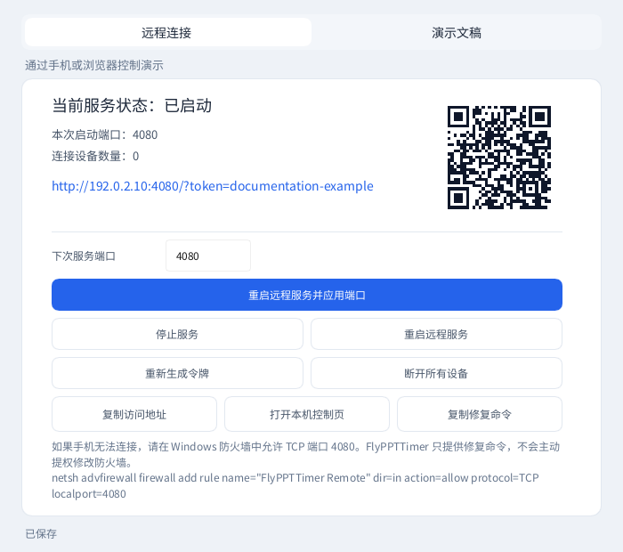

The URL's IP address identifies the computer on the local network. Do not replace it with the hotspot gateway address. The full URL and QR code contain connection credentials; keep them private.

## 5. Controls: shortcuts and window behavior

### Main shortcuts

Choose **F1–F12** for Start/Pause, Stop/Reset, and Show/Hide using the three dropdowns, then save. Use distinct keys and avoid shortcuts you need in other applications. Some laptops require Fn with the function key.

| Default shortcut | Action |
|---|---|
| F3 | Start, pause, or continue timing. |
| F4 | Stop and reset. |
| F5 | Show/hide the ordinary floating timer. |
| F7 | Trigger a visual reminder. |
| F8 | Toggle the computer's main audio output mute, not just this application's sound. |
| Ctrl+Alt+Up / Ctrl+Alt+Down | Add/subtract one minute. |
| Ctrl+Alt+1 / 2 / 3 / 4 / 5 | Select a 3/5/8/10/15-minute preset. |

### Window behavior

| Setting | Purpose |
|---|---|
| Click-through | Sends clicks through the floating timer to the presentation or window behind it. Use the notification-area icon to reopen Settings. |
| Lock window | Prevents accidental movement. Turn it off before repositioning. |
| Minimize to tray | Hides the minimized Settings window in the notification area to reduce taskbar clutter. |
| Close button behavior | Chooses whether closing the timer window exits the application or hides it to the tray. This is separate from OK in Settings. |

Click-through prevents the timer from blocking clicks. Lock window prevents accidental dragging. Enable either or both according to your needs.

Closing Settings leaves timing and remote control available. To end the application entirely, use **Exit** in the notification-area menu.

## 6. Scenarios: switch a complete working configuration

Save up to eight snapshots. Names identify them, hotkeys switch them globally, badge colors mark the active scenario on the tray icon, and Overwrite with current configuration refreshes an existing snapshot. Switching applies timer, alert, appearance, display, control and presentation-rule settings together.

See the [v1.15.0 scenario section](#scenarios) above for the complete workflow.

## 7. Other: language, updates, backups, and file locations

### Language and updates

| Setting | How to use it |
|---|---|
| Interface language | Select System, English, or Simplified Chinese. Save and restart when prompted. |
| Check for updates on startup | On by default. Checks GitHub/Gitee stable releases and only prompts for a newer version. No-update and temporary network failures stay silent. |
| Check for updates now | Checks GitHub/Gitee immediately; full release notes appear in a resizable, scrollable window. |

For a ZIP update, extract it first. Run the installer inside a setup ZIP, or extract the complete portable edition and migrate your configuration.

### Configuration management

| Button | Purpose | Example |
|---|---|---|
| Export configuration | Saves settings and presentation rules to JSON. | Back up before an event or move your setup to another computer. Apply your current edits before exporting. |
| Import configuration | Reads a chosen JSON file and applies its configuration. | Restore your settings on another computer, then check file paths and display selection. |
| Restore defaults | Replaces the settings with defaults. | Start a fresh configuration. Export anything you need to keep first. |

An exported configuration **does not contain the actual PPT files or custom sound files**. Copy presentations and the `alert-sounds` folder separately when moving computers. Register new file paths when their locations change.

### File locations, About, and contact actions

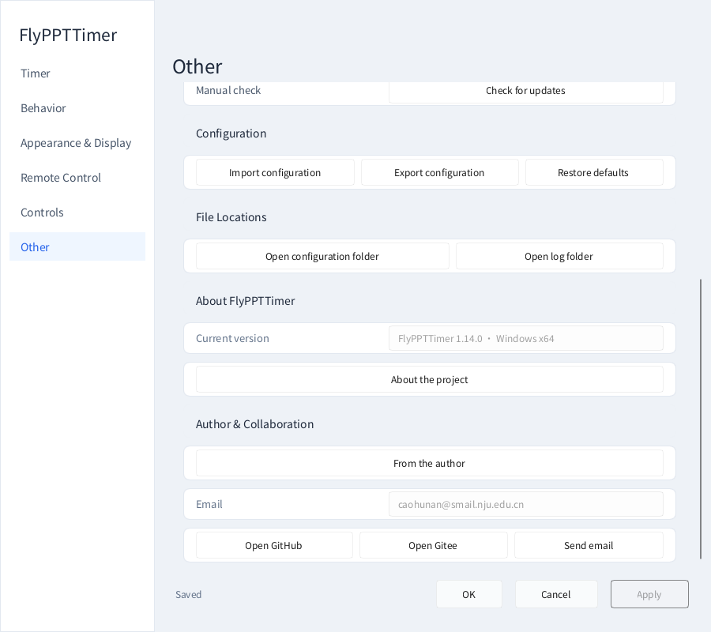

| Entry | Purpose |
|---|---|
| Open configuration location | Finds `FlyPPTTimer.config.json` for backup or migration. |
| Open log location | Finds the logs; use the relevant time range when reporting a problem. |
| Current version | Identifies the running version for support requests. |
| Project introduction | Describes the application's main uses. |
| From the author | Introduces the project and its author. |
| Open GitHub / Open Gitee | Opens the project pages, downloads, and related information. |
| Send email | Contacts the author by email. |

### Upgrade, move, or uninstall

**Portable:** exit the old program, extract the new edition into a new folder, copy your `FlyPPTTimer.config.json` and `alert-sounds`, then run the new application. Do not overwrite personal settings with the default configuration from a new ZIP.

**Installed:** exit the application and run the setup wizard against the existing installation directory. Existing configuration is retained.

**Uninstall:** use Windows' application list for the installed edition. For the portable edition, exit and remove its folder. Export settings and back up sounds first when you intend to reuse them.

## Phone controls: Timer and Presentation

Switch between **Timer** and **Presentation** at the top. You can also swipe left/right on ordinary content and inside the file list. The phone theme can follow the computer or be chosen separately. The browser's language environment determines the phone interface language.

### Timer page

| Control | Purpose |
|---|---|
| Duration, mode, and Apply | Sets the timing target and mode. Apply confirms the edit. |
| Start, Pause, Resume | Controls the current session. Resume retains progress after a pause. |
| Stop and reset | Stops the session and returns to its initial time. |
| Restart timer | Starts a fresh session instead of continuing previous progress. |
| Show/hide | Changes the small timer's visibility without stopping timing. |
| Flash | Gives the speaker a visual reminder. |
| Computer audio | Toggles the computer's main audio output mute. |
| Dismiss Time's up blackout | Closes FlyPPTTimer's full-screen Time's up message. |

### Presentation page

1. Add files to the computer's presentation rules and save. For a document already open on the computer, you can also use **Add open presentation → Add to list** on the phone.
2. Select a listed presentation and use **Open**. Its editing window opens on the computer.
3. Choose **Start from beginning** or **Start from current slide**.
4. Use Previous/Next, or enter a slide number and choose Go to slide.
5. Finish with **End slide show**.

Black screen/Restore and White screen/Restore temporarily conceal the slide-show content for discussion. They are separate from dismissing the timer's Time's up message.

### Order, hide, and remove files

| Action | Use |
|---|---|
| Sort | Arrange by name, file size, modification time, or manual order. |
| Ascending/descending | Reverse the selected ordering direction. |
| Long-press drag, Move up/down | Arrange the speaking order yourself. Moving an item switches to manual ordering. |
| Hide | Temporarily remove a finished presentation from the ordinary list. |
| Show hidden / Restore | Find hidden files and return them to the list. |
| Remove file | Removes control-list membership; it does not delete or close the document. |

Vertical swipes scroll the file list first, then continue scrolling the page at its boundaries. A short list scrolls the page directly. Swipe normally to browse; long-press before dragging to reorder.

### Closing presentations

End slide show stops the presentation playback. Close active presentation closes the current document. Close last-opened presentation closes the last file opened through control operations. Exit presentation software exits the relevant presentation applications. Save any changes you need before closing documents or exiting the presentation software.

## Troubleshooting

| Problem | What to do |
|---|---|
| Phone connected but file browsing denied | Check the permission on the computer and Apply. If no new notice appears, open Remote Control settings manually. [Illustrated steps](#file-access) |
| Top/bottom anchor not flush | Confirm v1.14.1, the correct display and anchor, set both offsets to 0 and Apply; saved nonzero offsets remain preferences. |
| Cannot find the timer | Press F5 or open Settings from the notification area. Check visibility, target display, text color/font size, and reset its position. |
| Cannot click or drag the timer | Check Click-through and Lock window under Controls. |
| Edits are not retained | Check the unsaved indicator. Use Apply or OK after previewing changes. |
| Time text is clipped | Choose Automatic sizing or increase custom width/height. |
| Slide numbers are missing | Enable slide numbers and open a supported desktop PowerPoint/WPS document. |
| Automatic timing starts unexpectedly | Adjust fullscreen automatic start, stop, and reset separately, or disable automatic start and use F3. |
| No alert sound | Check the group enable switch, speech/sound, output device, and mute state. F8 toggles computer mute. |
| Phone will not connect | Confirm the service is running and both devices share a network; scan again and check guest-network isolation, VPNs, and the current port's firewall rule. |
| Phone file list is empty | Add and save rules on the computer, or use Add open presentation on the phone. |
| Timer works remotely but slide navigation does not | Confirm the target file is open and presenting in desktop PowerPoint/WPS; check the current presentation status on the phone. |
| Full-screen timer cannot be selected | Configure the external display as an extended display in Windows. |
| Need configuration or logs | Use the corresponding location buttons on Other. |

Before an event, check presentation order, timing allowances, displays, sound, and the phone connection. Share remote-control credentials only with trusted people; do not publish QR codes or forward the control port to the public internet.

For further help, open a [GitHub issue](https://github.com/Hona-Cao/FlyPPTTimer/issues) with the application version, Windows and presentation-software versions, steps, and screenshots. Remove tokens, private paths, and sensitive presentation content first.

## 1.14.1 connection guidance and edge placement

A newly connected phone opens desktop Remote settings at the highlighted file-browsing checkbox. Check it and Apply; connection alone never grants access. Polling from the same device does not reopen Settings.

The timer uses tighter rows/padding. Zero-offset top/bottom anchors now meet the full screen edge with no baseline inset, using actual window dimensions. Saved custom offsets remain unchanged. [Full notes](RELEASE_NOTES_v1.14.1.md).
