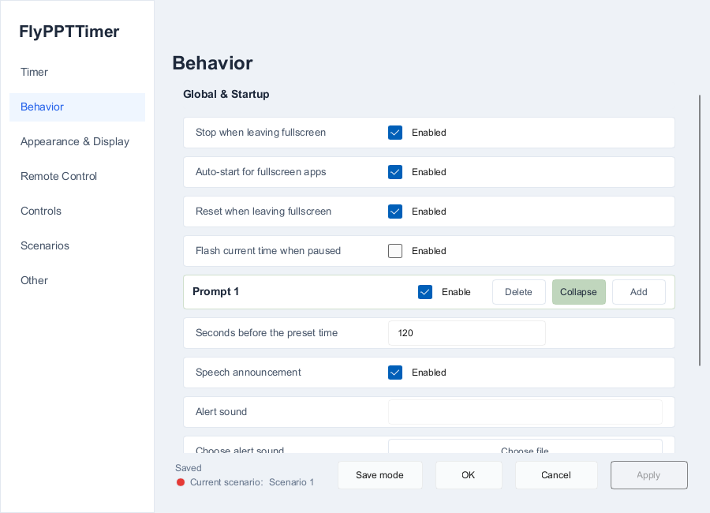
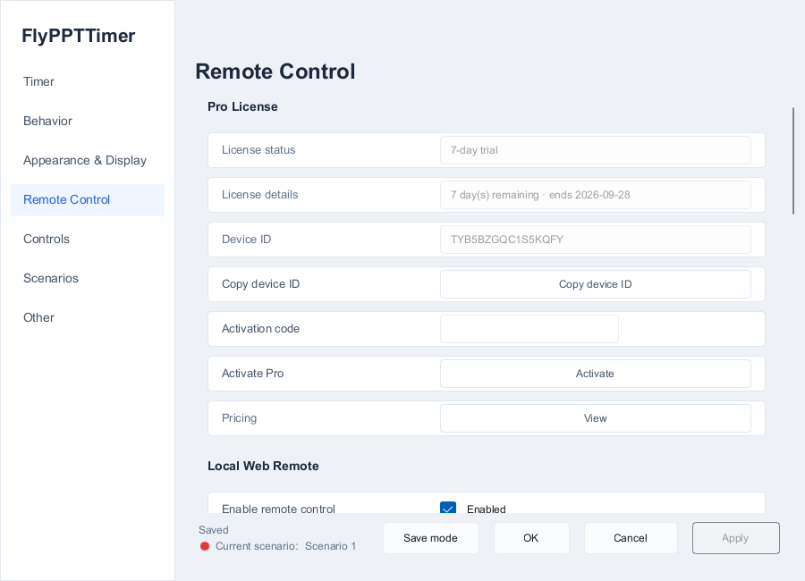
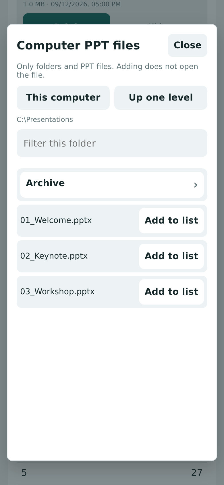
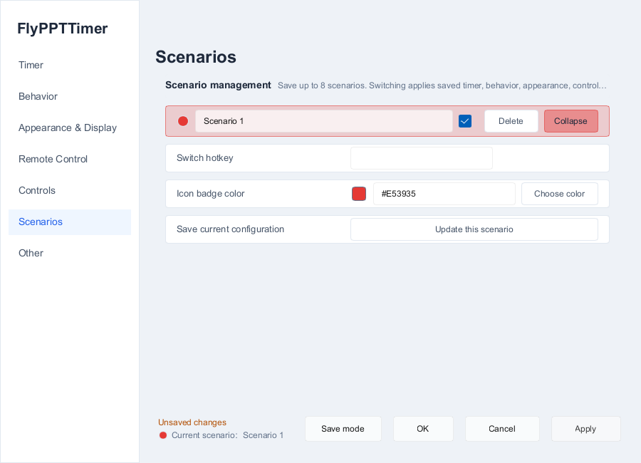
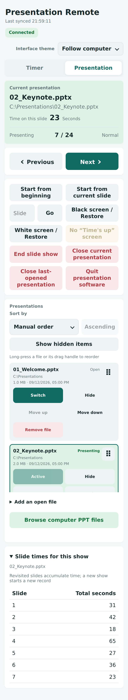
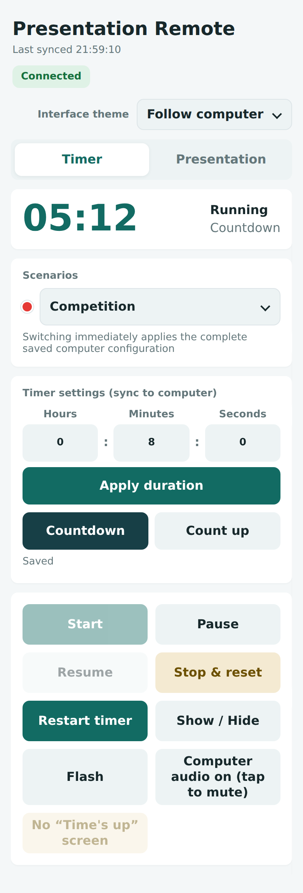
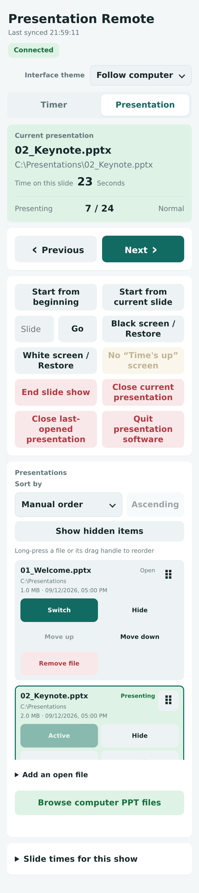

# FlyPPTTimer User Guide

[Home](../README.md) · [简体中文](USER_GUIDE.zh-CN.md)

Applies to **FlyPPTTimer v1.17.0 · Windows 10 / 11 x64**.

This guide documents the current product workflow only. For historical changes, see [GitHub Releases](https://github.com/Hona-Cao/FlyPPTTimer/releases).

FlyPPTTimer works as a standalone speaking timer and can also integrate with desktop Microsoft PowerPoint / WPS Presentation to show slide numbers, track per-slide time, apply presentation-specific timing rules, and control timing or presentations from a phone browser.

## Contents

[Quick start](#quick-start) · [Windows and saving](#windows-and-saving) · [1. Timer](#timer) · [2. Behavior](#behavior) · [3. Appearance & Display](#appearance--display) · [4. Remote Control](#remote-control) · [5. Controls](#controls) · [6. Scenarios](#scenarios) · [7. Other](#other) · [PowerPoint / WPS integration](#powerpoint--wps-integration) · [Phone Remote](#phone-remote) · [Troubleshooting](#troubleshooting)

## Quick start

1. Download the portable or installer package from the [latest Release](https://github.com/Hona-Cao/FlyPPTTimer/releases/latest).
2. Launch FlyPPTTimer. The normal timer overlay appears.
3. Right-click the timer or notification-area icon and open **Settings**.
4. Under **Timer**, set a duration such as <code>00:08:00</code>, choose Countdown, and click **Apply**.
5. With the default shortcuts, **F3** starts/pauses, **F4** stops and resets, and **F5** shows/hides the normal timer overlay.
6. Open a compatible PowerPoint / WPS presentation and start the slideshow to use slide-aware features.
7. For phone control, open **Remote Control**, connect the phone and PC to the same trusted local network, then use the address or QR code shown on the computer.

Standalone timing does not require Microsoft Office. Slide numbers, slideshow control, and other presentation-aware features require a compatible desktop PowerPoint or WPS Presentation installation. The phone only needs a modern browser.

## Windows and saving

FlyPPTTimer normally uses four kinds of UI:

| Window | Purpose |
|---|---|
| **Normal timer overlay** | Shows the main time plus optional per-slide stopwatch and current/total slide count. |
| **Settings** | Configures timing, alerts, appearance, displays, Remote, hotkeys, scenarios, and other options. |
| **Desktop Remote Control window** | Shows Remote connection information and manages controlled presentations and presentation rules. |
| **Phone / browser Remote** | Controls timing, presentations, slide navigation, slide-time statistics, and scenario switching. |

### Saving settings

| Action | Result |
|---|---|
| **Apply** | Saves changes and keeps Settings open. |
| **OK** | Saves changes and closes Settings. |
| **Cancel** | Discards unapplied changes and closes Settings. |

When the footer reports unapplied changes, the current edit has not been saved yet. Some appearance controls preview immediately, but you should still use **Apply** or **OK** once the result is correct.

---

## 1. Timer

This page defines how a timing session works and whether different presentations use different rules.

### Basic timing

| Setting | Purpose |
|---|---|
| **Default duration (HH:mm:ss)** | Duration used when no enabled presentation-specific rule matches. |
| **Countdown** | Counts down from the target time. Useful for defenses, contests, pitches, and other fixed-length talks. |
| **Count up** | Counts upward from zero and can still use the preset time as a reminder threshold. |
| **Unlimited** | Counts upward from zero without a target duration, advance prompts, or overtime logic. |
| **At the preset time** | Stop or continue into overtime. |
| **Time-up action** | Alert only, or perform the currently configured end-of-presentation action. |

**Unlimited** is useful for teaching, open discussion, duty timing, or any session where elapsed time matters more than a target. Disabling Unlimited restores the normal default duration and presentation rules.

### Presentation rules: different timing for different decks

Example:

| Presentation | Rule |
|---|---:|
| Opening.pptx | 05:00 countdown |
| Product Demo.pptx | 15:00 countdown |
| Defense.pptx | 08:00 countdown |

To create a rule:

1. Under **Presentation Rules**, choose **Add files**.
2. Select <code>.ppt</code>, <code>.pptx</code>, or <code>.pptm</code> files.
3. Set duration and timer mode, and make sure the rule is enabled.
4. Click **Apply** or **OK**.
5. When that presentation is used, the enabled rule overrides the global default duration.

Rules identify presentations by their full file path. Two same-named files in different folders are different rules; if a file is moved or renamed, add its new path.

The desktop **Remote Control → Presentations** page can edit the same rules. In v1.17, add/delete, duration, mode, and batch edits there are reflected in an already-open **Settings → Timer → Presentation Rules** view without reopening Settings.

---

## 2. Behavior

Behavior controls automatic start/stop behavior and how the speaker is prompted before and at the target time.

  

### Fullscreen behavior

Common options include:

- **Auto-start for fullscreen apps**: start timing when a supported fullscreen presentation state begins.
- **Stop when leaving fullscreen**: stop timing when the corresponding fullscreen session ends.
- **Reset when leaving fullscreen**: return to the initial session time after leaving fullscreen.
- **Flash current time when paused**: make a paused timer more noticeable.

If you do not want fullscreen applications to start timing automatically, disable auto-start and use F3 manually.

### Advance prompt points

Advance prompts warn the speaker before time actually runs out.

For an 8-minute talk, for example:

- 120 seconds remaining: prompt at 6:00;
- 30 seconds remaining: prompt at 7:30;
- Timer end: final prompt at 8:00.

Each prompt point can have its own:

- enabled state;
- number of seconds before the target time;
- voice announcement;
- custom alert sound;
- text/background/border visual flash style;
- visible, hidden, and total flash timing.

The current interface can manage multiple prompt points. Leave prompts disabled when they are not needed.

### Timer end and overtime

Timer end is configured separately from advance prompts. A continued-overtime workflow can combine:

- **Continue into overtime**;
- **Alert only**;
- overtime text color;
- overtime background color;
- overtime prefix.

If the configured time-up action ends the slideshow or displays the Time's up screen, the actual behavior follows that end action.

---

## 3. Appearance & Display

This page controls how the normal timer looks, where it appears, and whether a dedicated large-screen timer is enabled.

### Normal timer overlay

You can configure:

- interface theme;
- whether the normal timer window is visible;
- color schemes, text/background colors, and alert color;
- automatic sizing or custom width/height;
- main time font size;
- window shape and corner radius;
- background opacity.

**Automatic sizing** adapts to the current time text, slide metadata, and font sizes, and is normally the best choice for presentation use. Use fixed dimensions only when you specifically need them.

### Slide numbers and per-slide stopwatch

The normal overlay can show both:

- **current slide / total slides**, such as <code>7 / 24</code>;
- **seconds spent on the current visit to this slide**, such as <code>23</code>.

The overlay stopwatch measures the current visit. Changing slides resets the visible per-slide counter; revisiting the same slide starts that visible counter from zero again. The phone Remote's slide-time view accumulates repeated visits to the same slide during the current presentation session.

When enabled but no readable presentation state is available, the slide number uses a placeholder and the stopwatch shows <code>00</code>.

### Multiple displays

You can choose:

- show the normal overlay on all displays;
- show it only on a selected display;
- select a default nine-position anchor;
- fine-tune horizontal and vertical offsets;
- reset the timer position.

Zero offsets are calculated using the actual window size and target display bounds. Different DPI scales and extended displays with negative coordinates are handled relative to the selected display.

### Dedicated full-screen timer

Enable the **full-screen timer** to place a much larger time display on an extended monitor.

A common setup is:

- primary display: PowerPoint;
- speaker display: compact normal overlay;
- second display: large main timer.

Fresh configurations use the full-screen timer primarily for the main time. If needed, enable the option to also show slide numbers and per-slide stopwatch metadata on that display.

---

## 4. Remote Control

FlyPPTTimer Remote provides a browser-based controller over the local network.

  

This page can:

- enable/stop the local browser Remote;
- show the current service state and port;
- configure the port for the next start or use a random port;
- show recommended and LAN access addresses;
- display the QR code;
- restart the Remote service;
- regenerate the access token;
- disconnect all connected devices;
- open the local control page;
- copy the firewall troubleshooting command;
- control whether phones may browse PPT files on the computer.

### Connect a phone

1. Put the PC and phone on the same reachable, trusted local network.
2. Open **Remote Control** on the PC.
3. Scan the current QR code or open the recommended address in the phone browser.
4. Wait for the phone page to report that it is connected.

Treat live QR codes, full Remote URLs, and tokens as control credentials. Do not publish them in screenshots, issues, social media, or public documentation, and do not forward the Remote port directly to the public internet.

### Allow phone browsing of computer PPT files

Remote connection and computer-file browsing are separate permissions.

To find and add local PPT files from the phone:

1. On the PC, enable **Allow phone to browse computer PPT files** under **Settings → Remote Control**.
2. Click **Apply**.
3. Return to the phone **Presentation** page and choose **Browse computer PPT files**.
4. Navigate local folders and add the needed presentation to the controlled list.

  

This feature provides local folder navigation and presentation-list enrollment only. It is not remote desktop and does not provide general file upload, download, deletion, or editing. Disable the permission again when it is no longer needed.

---

## 5. Controls

Controls manages global hotkeys and normal timer-window behavior.

Default common shortcuts:

| Default shortcut | Action |
|---|---|
| **F3** | Start, pause, or resume timing. |
| **F4** | Stop and reset. |
| **F5** | Show/hide the normal timer overlay. |

Other action shortcuts are shown on the current **Controls** page and can be changed for your event workflow.

Window behavior includes:

- **Click-through**: sends mouse input to content behind the timer.
- **Lock window**: prevents accidental dragging.
- **Minimize to tray**.
- **Close button behavior**: exit the application or minimize to tray.

If the timer is visible but cannot be clicked, check Click-through. If it can be clicked but not dragged, check Lock window.

---

## 6. Scenarios

A scenario stores a complete applied working configuration rather than just a duration preset.

  

A scenario can capture the current:

- timing mode and duration;
- alert behavior;
- appearance and display settings;
- control settings;
- multi-display setup;
- presentation rules.

Up to 8 scenarios can be stored. Language, software-update source, and Remote credentials do not switch with a scenario.

### Save a scenario

1. Configure the other pages and click **Apply** first.
2. Open **Scenarios**.
3. Use **Save mode** in the Settings footer.
4. Enter a name and confirm.

### Maintain and switch

Expanding a scenario lets you:

- rename it;
- assign a switch hotkey;
- change its badge color;
- overwrite the snapshot from the current configuration;
- delete it;
- switch to it.

Switching applies the saved working configuration as a group.

Saved scenarios can also be selected from the phone Timer page:

  

---

## 7. Other

### Language

Choose:

- Follow system;
- Simplified Chinese;
- English.

After changing the display language, follow the application's restart prompt so all windows use the same language.

### Presentation application

By default, FlyPPTTimer uses the current Windows file association when opening a presentation. You can instead select and validate a Microsoft PowerPoint or WPS Presentation executable. Desktop and phone-initiated opens use the same preference.

### Software updates

Choose GitHub or Gitee as the update source, enable/disable startup checks, or run a manual update check.

Both installed and portable editions support the in-app update workflow. Save unsaved PowerPoint/WPS work before updating.

### Configuration

You can:

- export configuration;
- import configuration;
- restore defaults;
- open the configuration-file location;
- open the log-file location.

Export a configuration before moving computers, reinstalling Windows, or preparing an important event.

### Version and project information

Other also shows the current version and project information. When reporting a problem, confirm the FlyPPTTimer version shown here first.

---

## PowerPoint / WPS integration

When FlyPPTTimer can communicate with the presentation application, the integration mainly provides four capabilities.

### 1. Slide numbers

During a readable slideshow, the normal overlay can show current slide / total slides.

### 2. Per-slide timing

The overlay shows the current visit duration, while the phone displays accumulated per-slide time for the current show.

  

Example:

- slide 3 is shown for 20 seconds;
- you move elsewhere;
- you return to slide 3 for another 12 seconds.

The overlay shows roughly 12 seconds for the current visit, while the phone's accumulated value for slide 3 is roughly 32 seconds.

These statistics belong to the current presentation session and are not written into the PPT file.

### 3. Presentation rules

Each presentation can have its own duration and timer mode, avoiding repeated global changes between speakers.

### 4. Presentation controls

Desktop Remote and phone Remote can perform supported operations such as open, start slideshow, previous, next, go to slide, and end slideshow.

---

## Phone Remote

The phone interface is centered around **Timer** and **Presentation** pages.

### Timer page

  

Common actions include:

- edit duration and mode, then apply;
- start / pause / resume;
- stop and reset;
- restart a timing session;
- show/hide the PC timer overlay;
- trigger a visual reminder;
- control main PC output mute;
- dismiss FlyPPTTimer's Time's up screen;
- switch scenarios.

### Presentation page

  

Typical workflow:

1. Select a presentation from the controlled list.
2. If it is not open, choose **Open**.
3. Start from the beginning or from the current slide.
4. Use Previous / Next, or enter a slide number and jump to it.
5. Use black/white screen and restore operations when you want to conceal slide content temporarily.
6. Finish with **End slide show**.

The phone can also:

- sort by name, file size, modification time, or manual order;
- long-press to arrange manual order;
- hide finished presentations;
- add an already-open presentation to the controlled list;
- browse and add local PPT files after PC permission is enabled;
- review per-slide timing for the current show.

### Closing presentations and presentation software

These actions have different scopes:

- **End slide show**: stops slideshow playback only.
- **Close active presentation**: closes the corresponding document.
- **Close last-opened presentation**: closes the document most recently opened through the control workflow.
- **Exit presentation software**: asks the relevant PowerPoint/WPS instance to exit normally and preserves the presentation application's own save-confirmation behavior.

Before a live event, rehearse the close/exit workflow once with a test presentation so you know exactly which operation matches your setup.

---

## Suggested live setups

### Thesis defense

- 8–15 minute countdown;
- one or two advance prompts;
- slide number and per-slide stopwatch on the normal overlay;
- compact overlay on the speaker display;
- phone control for a moderator or event operator.

### Speech contest

- presentation-specific rules for each deck;
- prominent advance and overtime visuals;
- large timer on a second display;
- scenarios for different competition stages.

### Classroom / training

- Unlimited count up for open discussion;
- keep per-slide timing when pacing analysis is useful;
- save different class layouts as scenarios.

### Multi-speaker meeting

- assign a duration to each speaker's presentation;
- use manual ordering to prepare the running order;
- let event staff operate timing and the next presentation from the phone Remote.

---

## Troubleshooting

| Problem | What to do |
|---|---|
| **Cannot find the timer** | Press F5; check Show timer window, target display, text color, and window position, then reset its position if needed. |
| **Timer cannot be clicked** | Check **Controls → Click-through**. |
| **Timer cannot be dragged** | Check **Controls → Lock window**. |
| **Time text is clipped** | Use Automatic sizing or increase custom width/height. |
| **No slide numbers** | Confirm slide-number display is enabled, a compatible desktop PowerPoint/WPS is in use, and a readable presentation state exists. |
| **Per-slide stopwatch does not move** | Confirm an actual slideshow is running and FlyPPTTimer can read the current slide. |
| **Automatic start is not appropriate** | Disable fullscreen auto-start and use F3, or separately adjust stop/reset when leaving fullscreen. |
| **No alert sound** | Check whether the prompt is enabled, speech/sound settings, the Windows output device, and system mute. |
| **Phone cannot connect** | Confirm Remote is running, both devices share a reachable network, guest isolation/VPN is not blocking traffic, and Windows Firewall allows the current port. |
| **Phone connected but cannot browse files** | Enable **Allow phone to browse computer PPT files** on the PC and Apply, then reopen the browser panel on the phone. |
| **Phone can time but cannot change slides** | Confirm the target presentation is open, currently presenting, and reported as controllable. |
| **Full-screen timer cannot be selected** | Configure the external Windows display as an extended display. |
| **Settings changed but were not retained** | Check the unapplied-changes indicator and use Apply or OK. |
| **Need to move configuration to another computer** | Export the configuration under Other and back up any custom alert sounds you need. |
| **Need logs** | Use the log-location action under Other. |

## Before an event

Run one complete rehearsal and verify:

- presentations open correctly;
- every presentation uses the intended duration;
- slide numbers and per-slide timing work;
- advance and time-up prompts match the event rules;
- the normal overlay appears on the correct display and position;
- the full-screen timer appears on the intended extended display;
- the phone Remote can connect, navigate slides, and control timing;
- PC audio and alert sounds are correct;
- important configuration changes have been applied and backed up.

For further help, open a [GitHub Issue](https://github.com/Hona-Cao/FlyPPTTimer/issues) with the FlyPPTTimer version, Windows version, PowerPoint/WPS version, reproduction steps, and necessary screenshots. Remove live QR codes, Remote URLs, tokens, private paths, and sensitive presentation content before posting.
