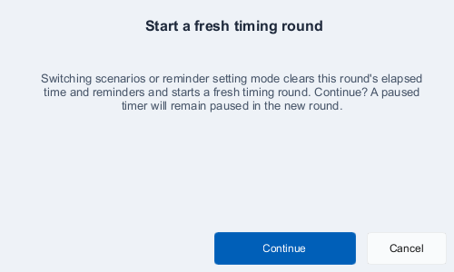
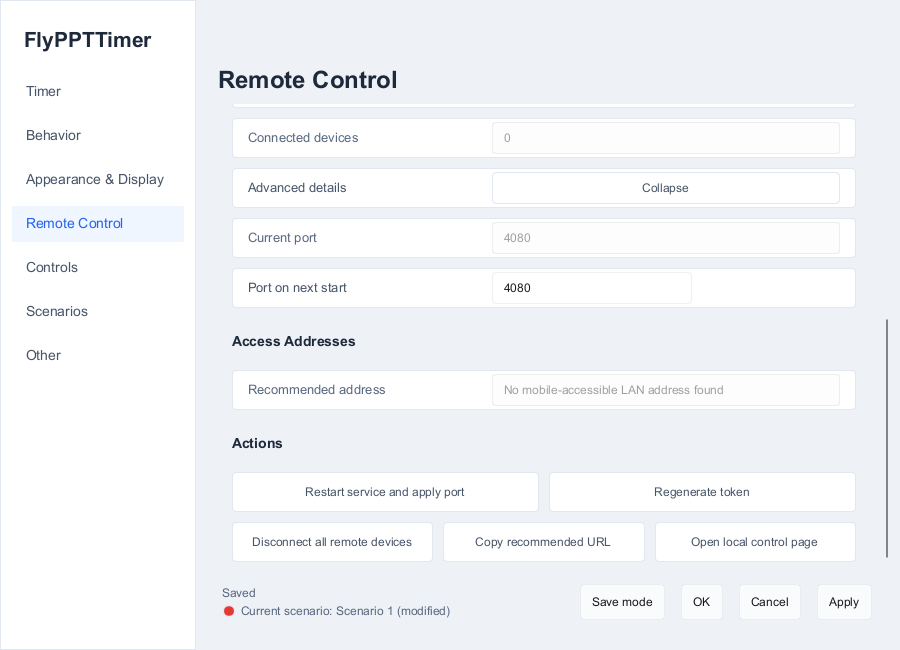
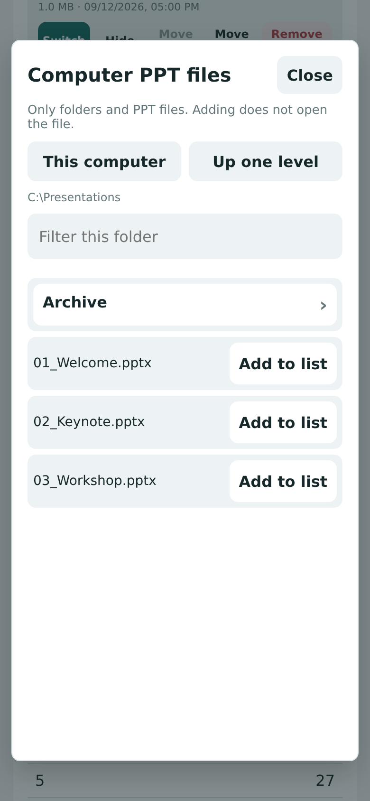

# FlyPPTTimer v1.18.0 User Guide

[Home](../README.md) · [简体中文](USER_GUIDE.zh-CN.md) · [Release notes](RELEASE_NOTES_v1.18.0.md)

This manual covers the current **v1.18.0 for Windows 10 / 11 x64**. You can use the local timer on its own, or connect it to desktop Microsoft PowerPoint / WPS Presentation. Features marked **Pro** require an active Pro license or explicitly confirmed trial.

## Contents

1. [Requirements and installation](#install)
2. [Quick start: an eight-minute talk](#quick-start)
3. [The three desktop windows and your first timer](#windows)
4. [PowerPoint / WPS, timing modes and file rules](#presentation)
5. [Simple / Custom reminders and overtime](#reminders)
6. [Optional rehearsal hover controls — Free](#hover-controls)
7. [Phone / browser Remote and file-browsing permission — Pro](#remote)
8. [Displays, appearance, positioning and shortcuts](#appearance)
9. [Scenarios](#scenarios)
10. [Presentation Review and rehearsal baselines](#review)
11. [Diagnostics and connection recovery](#diagnostics)
12. [Free, Pro, licenses and the seven-day trial](#pro)
13. [Settings, upgrades, migration and backups](#maintenance)
14. [Troubleshooting](#troubleshooting)
15. [Feedback, privacy and legal terms](#privacy)

## 1. Requirements and installation

Standalone timing does not require Office or .NET. Slide recognition and presentation control require a compatible **desktop** PowerPoint or WPS Presentation installation. A phone needs a browser; Remote and Browser Display use a local network and require Pro.

Download v1.18.0 from the [GitHub release](https://github.com/Hona-Cao/FlyPPTTimer/releases/tag/v1.18.0) or [Gitee releases](https://gitee.com/hona-cao/fly-ppttimer/releases). Choose the official Windows x64 package.

| Package | Installation |
|---|---|
| Portable, `portable-win-x64.zip` | Extract the entire ZIP into a writable folder, then run `FlyPPTTimer.exe`. Keep the accompanying DLLs and other application files. |
| Installer, `setup-win-x64.zip` | Extract the ZIP, run the installer EXE, and follow the language and location choices in the wizard. |

Before upgrading an existing installation, follow [the backup and upgrade steps](#maintenance). Save any unsaved presentation work before closing applications or updating.

## 2. Quick start: an eight-minute talk

1. **Launch FlyPPTTimer.** Find the floating timer and its icon in the Windows notification area; the icon may be inside the hidden-icons menu.
2. **Set the allowance.** Right-click the timer or notification-area icon → **Settings → Timer**. Leave Unlimited off, enter `00:08:00`, select **Countdown**, and click **Apply**.
3. **Choose one reminder.** Open **Behavior**, select **Simple**, enable **Pre-end reminder**, and set **Before end HH:mm:ss** to `00:01:00`. Choose the shared Sound / Flash / Speech effects you want, then **Apply**.
4. **Try the controls.** With the default shortcuts, press **F3** to start, press it again to pause, and again to resume. **F4** stops and resets. If testing without slideshow automation, turn off **Auto-start for fullscreen apps** under Behavior.
5. **Rehearse with your slides.** Open the presentation in desktop PowerPoint/WPS. Enable automatic start if desired, begin the slideshow, and check the timer, slide number, sound output and display placement before the event.

This local workflow is Free. A phone connection is optional; set it up in [Remote](#remote) when needed.

## 3. The three desktop windows and your first timer

| Window | What you use it for |
|---|---|
| Floating timer | Main time, current-slide seconds and current/total slide number. Drag it when mouse pass-through and position locking are off. |
| Settings | Seven pages: Timer, Behavior, Appearance & Display, Remote Control, Controls, Scenarios and Other. |
| Desktop Remote Control | Connection information and QR code, plus a Presentations page for file rules and presentation operations. |

The phone/browser control page is a separate view with **Timer** and **Presentation** tabs. [Presentation Review](#review) and [Diagnostics Center](#diagnostics) have their own windows.

### Understand the readout and controls

The main readout is the speaking time. The lower row can show current-slide seconds on the left and slide progress such as `3 / 20` on the right. Fresh configurations enable the slide stopwatch; without a recognized slideshow, the enabled fields show `00` and `-/-`. Each field can be enabled independently under **Appearance & Display**.

**Pause / Resume** keeps the current round's progress. **Reset** clears the round and stops it; **Restart** clears it and starts again. Hiding the timer does not stop timing. Closing Settings leaves the application running; use **Exit** in the notification-area menu to quit.

### Save what you change

**Apply** saves and keeps Settings open; **OK** saves and closes it. **Cancel** discards unapplied edits. Enter or leaving an input finishes the edit, but does not replace Apply/OK.

The footer identifies unsaved edits. Appearance changes can preview immediately; Cancel restores the last applied state. Action buttons such as Import configuration or Regenerate token carry out their own operation, so read their confirmation before proceeding.

## 4. PowerPoint / WPS, timing modes and file rules

### Connect a slideshow to the timer

1. Open a local `.ppt`, `.pptx` or `.pptm` in desktop PowerPoint/WPS.
2. In **Settings → Behavior**, choose whether **Auto-start for fullscreen apps** should start timing when a recognized application enters fullscreen.
3. Set **Stop when leaving fullscreen** and **Reset when leaving fullscreen** separately, then Apply. These govern the automatically started fullscreen session: stop ends timing; reset returns its readout to the initial value. Disable both if timing should continue after leaving fullscreen.
4. Start the slideshow. Verify the current/total slide number. For a deliberate break, pause with F3 or a Pause control, then resume.

Fullscreen automation also recognizes some browsers and PDF readers. Turn off automatic start when those fullscreen apps should not start the timer. A temporary loss of readable presentation status is not proof that the slideshow has ended.

When opening a file through FlyPPTTimer, the current Windows `.ppt/.pptx/.pptm` file association determines the application. Set that association in Windows if you want PowerPoint or WPS to open the file. Browser-based presentation editors do not provide the same desktop slide-control integration.

  
   
  <em>Actual PPT slideshow with the timer at the top center. This is the placement used for this presentation; customize the monitor, anchor and offsets for your setup. The Chinese slide is shared with the Chinese documentation.</em>

### Countdown, count up and Unlimited

**Countdown** counts down from the finite target. **Count up** shows elapsed time from zero but still uses the finite target for reminders and time-up behavior.

**Unlimited**, beside Default duration, is for open-ended teaching or discussion. Apply it to count up without a target. Countdown, target reminders, time-up actions and overtime styling are inactive. The one-minute adjustments and duration presets do not act while Unlimited is enabled. File rules remain stored and can apply again after Unlimited is turned off.

**Automatic (content and font)** is a window-sizing choice under Appearance & Display. It fits the readout; it is separate from timing mode and automatic slideshow start.

### What happens at the target

On **Timer**, choose **Time-up action**:

| Action | Result |
|---|---|
| Alert only | Uses the active reminder profile. The timer stops at the target or continues into overtime according to that profile's overtime setting. |
| Black screen with Time's up | Ends the slideshow, stops/resets timing, and shows a fullscreen Time's up message. Dismiss it with Esc or the phone's corresponding control. |
| End slide show | Ends the slideshow and stops/resets timing. The document stays open. |

For continued overtime, use **Alert only** and enable the appropriate [continue-overtime setting](#overtime). Ending the slideshow or showing the Time's up screen prevents post-overtime reminders.

### Give each presentation its own allowance

1. Open **Settings → Timer → Presentation Rules** and choose **Add files**.
2. Select one or more supported PPT files. Select a rule, enter its duration, choose Countdown / Count up, and enable it.
3. Click **Apply** or **OK**.
4. Use that file's slideshow; its enabled rule takes precedence over the default duration and mode.

Rules match full paths. After moving or renaming a file, register its new path. Deleting a rule removes the entry, not the document.

For several rules, use Ctrl+click or Shift+click, then **Batch settings** to set a shared duration and mode. You can also edit rules in **desktop Remote Control → Presentations**; use **Save** in that window.

### Current-slide seconds versus accumulated time

The floating stopwatch shows seconds for the **current visit** to a slide: `09`, `65`, `123`. Changing slides resets that visit's readout. Returning to slide 1 after spending 20 seconds there and then spending another 10 seconds adds up to 30 seconds in the per-slide totals, while the floating stopwatch shows 10.

Pause/Resume controls suspend/resume slide timing; Reset/Restart clear its current timing feedback. Only valid observed slideshow time is counted. Missing or unreadable samples are not filled with guessed time.

On the phone, expand **Presentation → Slide times for this show** for accumulated totals. Ending a show retains its last table and clears the current-visit readout. Completed-show history is available in [Presentation Review](#review); timing does not modify the PPT itself.

## 5. Simple / Custom reminders and overtime

Open **Settings → Behavior → Reminder setting mode**. **Simple** provides a small set of shared choices; **Custom** lets you edit individual reminder points and effects. Both are available in Free.

Fresh installations use Simple. Existing settings and scenario snapshots without a profile marker open as Custom to retain their detailed reminders. **The profiles are saved independently**: switching or editing one does not overwrite the other. Scenarios retain both.

### Set up Simple reminders

1. Select **Simple**.
2. Enable **Pre-end reminder** and enter a positive **Before end HH:mm:ss** value. For an eight-minute talk, `00:01:00` means remind at seven minutes, not one minute after starting. The enabled offset cannot exceed the configured finite default duration.
3. Enable **Timer end** if you want a reminder at the target.
4. For a reminder after the target, use the [overtime steps below](#overtime), enable **Post-overtime reminder**, and enter a positive **After end HH:mm:ss**, such as `00:00:30`.
5. Select shared **Sound / Flash / Speech** effects and click Apply.

Simple uses shared effects for its enabled reminders. Use Custom when you need different sounds, speech choices or flash patterns for different points.

### Configure Custom reminder points

1. Select **Custom**. Enable a pre-end **Prompt**, then expand its row.
2. Enter **Seconds before the preset time**. For an eight-minute talk, `120` means remind at six minutes and `30` means remind at seven minutes thirty seconds. Prefer offsets within the planned allowance.
3. Set Speech announcement, choose an alert sound if needed, and select a Flash style. Expand **Timer end** to set its own effects.
4. To add an after-end point, first enable continued overtime, then choose **Add post-overtime reminder**. Expand it and enter **After end HH:mm:ss**. Each after-end offset must be positive and distinct.
5. Apply, then rehearse the full reminder sequence.

Free runs **one enabled pre-end point nearest the endpoint**, Timer end, and **one enabled post-overtime point nearest the endpoint**. For example, with enabled pre-end points at 120 and 30 seconds, Free runs the 30-second point; with post points at 30 and 60 seconds, it runs the 30-second point. Pro runs multiple enabled points. Extra stored points are preserved when Pro is unavailable.

Custom sounds can use short `.mp3`, `.wav`, `.wma` or `.m4a` files. Clearing a point's custom sound restores its sound choice without resetting the whole application.

Flash styles include None, text, background, solid border, or border plus background. On/off intervals are in milliseconds; total flash duration is in seconds. For example, 350 ms is 0.35 seconds. Speech and sounds play through the computer's output device. Test that device and its mute state.

### Enable overtime and post-overtime reminders

1. On **Timer**, set **Time-up action → Alert only**.
2. With **Simple**, open **Behavior** and enable **Continue overtime**. With **Custom**, open **Timer → At the preset time → Continue into overtime**.
3. Return to Behavior, enable the post-overtime reminder point, set its positive after-end offset, and Apply.
4. Let a finite rehearsal pass its target. A `00:00:30` after-end point fires only after 30 seconds of actual overtime.

Unavailable post-overtime controls retain their saved settings. They do not fire when timing stops at the endpoint, in Unlimited, or while paused.

In Custom, expand **Timer end** for overtime text/background colors and the overtime prefix. Reminder flash colors are separate from normal timer colors. Reset/Restart prepares the reminder sequence for a new round; Pause/Resume retains progress and already-fired reminders.

### Confirm before changing an active round

While **Running or Paused**, switching reminder profiles or applying **any scenario**, including the current one again, requires fresh-round confirmation on the desktop.

- **Cancel:** keeps elapsed time and the current reminder/slide feedback.
- **Confirm:** clears the current elapsed time, reminder and slide feedback, and starts a fresh round with the selected settings. A running round remains running; a paused round remains paused.
- **Stopped:** the change applies directly.

If a phone initiates an active-round scenario change, complete the confirmation on the computer. Switch profiles and scenarios before a talk whenever possible.

## 6. Optional rehearsal hover controls — Free

1. Open **Settings → Controls**.
2. Enable **Show rehearsal controls**, then Apply. It is **off by default** and available in Free.
3. Move the pointer over the timer to reveal the compact menu. Move between the timer and menu to use it.
4. Move away from both; the menu retracts after about **700 ms**.

<table>
  <tr>
    <td width="50%" align="center"></td>
    <td width="50%" align="center"></td>
  </tr>
  <tr>
    <td align="center"><strong>Menu retracted: main time, current-slide seconds and slide number</strong></td>
    <td align="center"><strong>Menu expanded: Reset, Restart, Pause and Resume</strong></td>
  </tr>
</table>

<em>Top-area crops of actual screenshots, captured at different timer moments. Click either crop to view its complete slideshow screenshot.</em>

| Control | Effect |
|---|---|
| Reset, rounded-square icon | Clears and stops the round. |
| Restart, circular-arrow icon | Clears and starts a new round. |
| Pause, pause icon | Available while Running; preserves progress. |
| Resume, play icon | Available while Paused; continues that round. |

The menu is an independent window with its own rounded corners and a **2 DIP** gap (a small spacing that scales with Windows display scaling). It normally appears to the right and can attach to the left near the screen's right edge. Showing it does not move, shrink or change the timer readout.

Colors, opacity, theme, shape and automatic/custom height follow the timer. It accompanies ordinary timer overlays; the dedicated fullscreen timer keeps its time-display role.

**With mouse pass-through enabled, the menu is completely hidden and cannot be clicked.** Open Settings from the notification-area icon and disable pass-through before using it.

## 7. Phone / browser Remote and file-browsing permission — Pro

Remote runs on the computer and serves a local browser page. Internet access is needed for trial confirmation or online activation, but a working local connection depends on devices reaching each other on the LAN.

### Pair a phone

1. Confirm an active Pro license or explicitly start the [trial](#trial).
2. Connect the phone and computer to the same Wi-Fi, or connect the computer to the phone's hotspot.
3. Enable Remote under **Settings → Remote Control** and Apply. Open **Remote Control → Remote connection** from the timer/notification-area menu.
4. Check that the service is running. Scan **your computer's live connection QR code**, then open the link in the phone browser.
5. Wait for a connected status and test Start/Pause before controlling a slideshow.

Use the displayed computer LAN address; do not replace it with the hotspot gateway. Scan again after changing networks, ports or tokens. No phone app is required. The browser's language environment determines the phone UI language; its theme can follow the computer or be selected separately.

### Network and Advanced details

On the desktop, **Advanced details** starts collapsed. Expand it when you need addresses, ports, service restart, token actions or firewall help.

The service reuses its saved port when possible and chooses an available one if necessary. Use the **current** address, not a remembered port. After editing the next-start port, choose **Restart service and apply port**, then reconnect.

If the phone cannot connect, try **Open local control page** on the computer. If local access works, check guest-Wi-Fi device isolation, VPN routing and Windows Firewall. Use the provided firewall repair command only after checking its current port; copying it does not change Windows. Run a reviewed command in an administrator terminal when necessary. Allow the required application/port instead of disabling the firewall.

**Regenerate token** invalidates old control URLs. **Disconnect all remote devices** ends current access; use the new connection information to reconnect. Keep full control URLs and live QR codes private.

### Use the browser Timer page

Start, Pause, Resume, Stop/Reset and Restart control the computer's timer. Show/Hide changes visibility without stopping it. Flash triggers a visual reminder; Computer audio changes the computer's main output mute state. Dismiss Time's up closes FlyPPTTimer's fullscreen time-up message.

**+30 seconds / +1 minute — Pro:** during a **Running or Paused finite round**, tap either button to extend that round. Repeated taps accumulate, and a paused round stays paused. Stopped, Finished and Unlimited rounds cannot be extended.

These buttons change **only the current round**, leaving default duration, file rules and scenario snapshots intact. Reset/Restart clears the added time. Countdown and finite count-up both use the extended endpoint. A reminder moved back into the future by an extension can become eligible again.

To change the **saved default duration**, use the directly visible **Time adjustment** card on the phone's Timer page. Edit Hours / Minutes / Seconds, then choose **Apply duration**. This is separate from adding time to the current round.

If file rules exist, the phone asks whether to use **Global only** (change the default duration and leave file rules unchanged) or **Sync all** (also set every presentation rule to the new duration). With no file rules, the duration applies directly without that choice.

Applying the saved duration during Running/Paused restarts the current round from its initial time with the new duration, clearing temporary extension and timing feedback. A running round remains running; a paused round is paused again after the restart. This does not require the desktop fresh-round confirmation used for scenario/profile switches; the phone choice above concerns only whether to synchronize file rules.

*This screen uses isolated example data. It is not evidence of testing with a physical phone and a live PowerPoint/WPS slideshow.*

### Separately authorize browsing computer PPT files

Connecting to Remote **does not grant folder browsing**. **Allow phone to browse computer PPT files** is off by default. Leave it off when you only need timing or navigation.

1. Connect the phone. If browsing is not allowed, a newly announced phone connection can open desktop Remote settings with the permission highlighted.
2. On the computer, check **Allow phone to browse computer PPT files**, then click **Apply** or **OK**. Checking the box, pressing Enter or dismissing the notice alone does not save permission.
3. On the phone, open **Presentation → Browse computer PPT files**. Close and reopen an already-open browser panel if it still shows a permission message.
4. Open Home or a local drive, navigate folders, and filter names in the current folder. The filter does not search the whole disk.
5. Choose **Add to list** beside a PPT, close the browser, then select/open/start that file from the controlled list. Adding a file does not open it or modify its contents.

*This compatible phone file-browser view comes from an earlier release. Use the current steps above for desktop authorization and button placement.*

If no notice appears, open **Settings → Remote Control** manually. Already announced phones and local computer-browser access do not repeatedly open the guidance. To revoke browsing, uncheck the permission and Apply; this does not delete file rules or close documents.

This is a shared permission for devices holding a valid Remote URL/token, not approval for only the phone named in the notice. It reveals folder/PPT names and allows adding local presentations. It does not provide arbitrary downloads, uploads, editing, deletion or network-share browsing.

### Run a presentation from the browser

1. Add and save file rules on the computer, use the authorized file browser, or use **Add open presentation → Add to list** for a presentation already open on the computer.
2. Select the listed file and choose **Open**. Wait for the operation to complete.
3. Choose **Start from beginning** or **Start from current slide**.
4. Use Previous/Next, or enter a slide number and choose Go to slide.
5. Choose **End slide show** when finished.

Black screen/Restore and White screen/Restore temporarily conceal slideshow content. They are separate from FlyPPTTimer's Time's up message.

Sort by name, size, modification time or manual order. Long-press before dragging to reorder; Move up/down also selects manual order. Hide removes a finished item from the ordinary list; Show hidden/Restore returns it. Remove file removes list membership, not the disk file.

End slide show ends playback. Close active presentation closes the current document; Close last-opened presentation closes the last file opened through control operations. Exit presentation software is available only when a controllable application is attached and contains no uncontrolled presentations. Save needed edits first; handle the presentation application's save prompts on the computer.

### Show the timer in another browser — Pro

1. Enable Remote and establish a working local connection.
2. In desktop Remote connection, expand Advanced details and choose **Open browser display** locally, or **Copy display URL** for another device on the same network.
3. Open that display address in the target browser and use the browser's fullscreen mode if appropriate.

Use the display URL for a display view and the control URL for operator controls. Keep both private. During a disconnection, Browser Display retains its **last valid picture**, shows a reconnecting indicator and retries automatically. That picture may be stale; check the computer's live timer before relying on it.

## 8. Displays, appearance, positioning and shortcuts

### Make the timer readable

Open **Settings → Appearance & Display**. Choose System / Light / Dark for application surfaces, then select a timer color scheme or edit colors individually. Interface theme does not replace your chosen timer colors.

Choose **Automatic (content and font)** for sizing that fits the readout. With Custom window size, allow enough width/height after increasing fonts. Current/total slides and slide stopwatch can be enabled separately; their font/color follow options let you use smaller metadata below a larger time readout.

Shapes include rectangular and small/medium/large rounded rectangles. New configurations use **RoundedSmall**; upgrading preserves an existing saved shape. Background opacity ranges from 0–100% and changes the background rather than hiding the text. Use the slider, wheel or adjacent number input, then Apply.

### Place the timer and prevent accidental movement

1. Turn off mouse pass-through and position locking under **Controls** if you need to drag the timer.
2. Drag it, or choose a default anchor under Appearance & Display and adjust horizontal/vertical offsets.
3. To restore anchor-based placement, choose **Reset timer window position**.
4. Apply, then enable **Lock window** if the position should stay fixed.

Offsets range from -50% to 50%, with 0.1-percentage-point precision: positive horizontal moves right, positive vertical moves down. At zero offsets, top/bottom anchors meet the actual full-screen edge. Center anchors use full screen width, including with a side taskbar. Saved nonzero offsets are retained.

**Mouse pass-through** sends clicks to the application behind the timer and hides the rehearsal menu. **Lock window** prevents dragging. To change either when you cannot click the timer, use its notification-area icon.

### Multiple monitors and a time-only big screen

For a speaker-only overlay, turn off **Show on all displays** and select the speaker's monitor. Enable it to show the same round on applicable displays.

For a dedicated fullscreen timer:

1. In Windows display settings, select **Extend these displays**.
2. In FlyPPTTimer Appearance & Display, enable the fullscreen timer and choose its extended display.
3. Check the selected screen before the event; the timer occupies it.
4. Leave big-screen metadata off for **time only**. Enable that option if this screen also needs slide numbers and slide seconds.

The ordinary overlay and big-screen metadata choices are separate. The fullscreen-timer screen does not receive a duplicate small overlay.

### Default shortcuts

| Shortcut | Action |
|---|---|
| F3 | Start / Pause / Resume. |
| F4 | Stop and reset. |
| F5 | Show / Hide the ordinary timer. |
| F7 | Trigger visual flashing. |
| F8 | Toggle the computer's main audio output mute. |
| Ctrl+Alt+Up / Down | Increase / decrease the configured duration by one minute. |
| Ctrl+Alt+1 / 2 / 3 / 4 / 5 | Select a 3 / 5 / 8 / 10 / 15-minute duration preset. |

The three main shortcuts can be assigned F1–F12 under Controls. Use distinct keys and check conflicts with other software; some laptops need Fn. Duration shortcuts edit the configured allowance; they are different from Remote's temporary round extension and do not act in Unlimited.

Minimize to tray and Close button behavior determine whether windows hide to the notification area or exit. Use the tray **Exit** action when you intend to quit completely.

## 9. Scenarios

A scenario saves timing, both reminder profiles, timer appearance, displays, positioning, controls and file rules as a working setup. Language, application interface theme, update settings, Remote credentials, licensing and Review history are outside that snapshot.

Free has **one available scenario**; Pro supports up to **eight**. A fresh configuration includes Scenario 1, which you can rename and overwrite. Extra saved scenarios remain stored when Pro is unavailable.

### Save or update a setup

1. Configure your working settings and click Apply.
2. To create a new snapshot when a slot is available, use **Save mode** in the Settings footer, enter a name and confirm.
3. For an existing snapshot, open **Scenarios**, expand its row and choose **Overwrite with current configuration**.
4. In the expanded row, adjust its name, global switch hotkey or badge color as needed.

Rows are newest-first and collapsed initially. A modified indicator means the current snapshot-owned settings differ from the saved scenario; edits do not silently overwrite it. Deleting a scenario requires confirmation and does not delete PPT files.

### Switch a setup

Select its row, assigned hotkey, timer/tray scenario submenu, or phone Timer-page selector. The footer identifies the active scenario; its color briefly highlights the timer border.

During Running/Paused, **every scenario application**, even reapplying the current one, needs [fresh-round confirmation](#fresh-round). Phone-initiated changes are confirmed on the desktop. Cancel keeps the current round; confirm clears feedback and preserves running/paused intent.

## 10. Presentation Review and rehearsal baselines

### Read a completed show — Free

1. Complete a recognized desktop PowerPoint/WPS slideshow and end it.
2. Open **Presentation Review** from the timer/notification-area menu.
3. Select a history entry and read its summary, then scroll for slide details.

**Effective time used** is accumulated valid recorded slide time. It is not simply the wall-clock interval between starting and ending the show. Pauses and gaps without valid observations can make those values differ.

For finite timing, the summary compares effective time with the **final target**, showing ahead, overtime or on-target. It also identifies the slide with the longest **accumulated** time, including revisits.

After a temporary extension, the summary shows **original plan + added time + final target**. For example, eight minutes plus one minute gives a nine-minute final target; target comparison uses nine minutes. Unlimited records omit target comparison.

Visited/total slides, average time, the longest slides and per-slide bars remain available below the summary. History keeps up to 20 completed records; delete entries or clear history only when you no longer need them. Older records remain readable.

### Select a rehearsal baseline — Pro

1. Complete a rehearsal of the presentation.
2. In Review, select that entry and choose **Use as rehearsal baseline**.
3. Present the **same file** again. Review can show live pace information and, after completion, a faster/slower comparison with the selected rehearsal.
4. Use **Clear rehearsal baseline** to remove the selection.

No baseline is selected automatically. The completed comparison uses effective time against the baseline's effective time; it is separate from comparison with the planned target. Baselines match the presentation path, so moving the file can prevent a match. Deleting its record also removes that baseline.

Base Review remains complete in Free. Baseline selection and pace comparison require Pro.

## 11. Diagnostics and connection recovery

### Collect a safe status report — Free

1. Open **Settings → Other → Diagnostics Center**, or its notification-area menu entry.
2. Choose **Refresh** to update the local status snapshot.
3. Use **Copy safe summary** for a support message, or **Export diagnostic report** to save a UTF-8 report.
4. Describe the problem and relevant steps alongside that report.

Diagnostics covers the app, presentation observer, displays, Remote/Browser Display, license summary and updater. Its report excludes tokens, activation material, presentation paths/content, personal data, raw configuration and raw logs. Refresh does not start a trial, validate a license online or check for updates.

### Recover Remote or Browser Display

If Remote reports a stopped/failed listener, open Remote Advanced details and use **Restart service and apply port**. Check the new status and scan the current QR again if the address changed.

Browser Display retries automatically and keeps its last valid picture while disconnected. Allow a few seconds after a service restart; if it remains disconnected, verify the network and reopen the current display URL.

### Share logs carefully

**Other → Open log location** opens raw log files. Diagnostic export does **not** include them and is not a log-sanitizing tool.

If support needs logs, reproduce the issue, note the time, copy only the relevant excerpt and remove private paths, presentation names, credentials and activation material before sharing. Do not upload your full configuration or log folder by default.

## 12. Free, Pro, licenses and the seven-day trial

| Capability | Free | Pro |
|---|---|---|
| Local countdown/count up, Unlimited, slideshow automation and file rules | Included | Included |
| Multi-monitor overlays, fullscreen timer, appearance, shortcuts and backups | Included | Included |
| Simple reminders; Custom Timer end and nearest enabled point before/after end | Included | Included |
| Multiple enabled Custom reminder points | Extra points preserved but inactive | Available |
| Scenarios | One available | Up to eight |
| Rehearsal hover controls, Diagnostics and base Review | Included | Included |
| Remote, temporary phone extension and Browser Display | Requires Pro | Included |
| Rehearsal baseline and pace comparison | Requires Pro | Included |

Losing Pro availability does not delete extra reminders, scenarios or history. The extra Pro settings remain stored and become available again with Pro; Free continues to provide local timing.

### Start or reconfirm the trial

1. Open **Settings → Other → Pro License**.
2. Read the license status and choose **Start trial** only when you are ready to try Pro.
3. Explicitly accept the trial confirmation and connect to the internet for the service response.
4. Check the displayed status/expiry before relying on Pro at an event.

Installation, launch, checking updates and opening Diagnostics do not start a trial. The trial lasts **168 hours (seven days) from the first server-side claim**. Reinstalling, restarting, re-extracting the portable edition or resetting/importing configuration does not restart that period.

**An unexpired trial requires online reconfirmation after the application restarts.** Use **Confirm trial online** when offered; offline cached trial data alone is insufficient after restart. Reconfirmation retains the original expiry and does not grant another seven days.

### Buy and activate Pro

Use the purchase actions in **Pro License** for current plans and per-device prices.

- **Patreon / International:** open the shop from Settings, purchase the one-device permanent license, copy the Patreon activation message containing your Device ID, and send it to the creator in a Patreon direct message. The activation code is returned there after payment verification.
- **Alipay / Mainland China:** use the built-in payment information, include your receiving email in the payment remark, then email your full Device ID and chosen plan to the activation address shown in Settings. The activation code is returned after payment verification.

Enter the issued activation code in Pro License. A supplied **FPTL1 device-bound signed offline license** uses the offline-license input; a purchase receipt alone is not an activation code. Check that the Device ID matches the intended computer. A license for another device cannot be used as a configuration backup.

Annual licenses expire according to their entitlement; permanent licenses follow their issued terms. For activation, expiry, clock or damaged-state errors, read the exact message and contact support if needed. Do not change the system clock or delete license files to attempt to reset entitlement. Configuration import/export, scenarios and Restore defaults do not transfer or reset license state.

## 13. Settings, upgrades, migration and backups

### Language and software updates

Under **Other**, choose System / English / Simplified Chinese for the interface and restart when prompted.

Choose **Gitee** or **GitHub** under Software Updates. With no saved choice, the Windows geographic-region setting selects Gitee for mainland China and GitHub elsewhere; this does not use GPS. An explicit saved choice is retained.

Startup update checks are on by default. Manual checks report their result; startup checks stay quiet when no newer version is found or a temporary network error occurs. Read the complete release notes before accepting **Download and install**. Installation requires confirmation and restarts the application.

The installed updater downloads/extracts the setup package and runs the installer. The portable updater replaces application files and preserves `FlyPPTTimer.config.json` and `alert-sounds`. Back up first and ensure the target folder is writable.

### Back up and move your settings

1. Apply any edits you want to keep.
2. Use **Other → Export configuration** to save JSON.
3. Use **Open configuration location** to find `FlyPPTTimer.config.json`; back it up and copy your `alert-sounds` folder separately.
4. Copy presentation files separately. On another computer, import the JSON, check display selections and file paths, and test reminders.

Export includes settings, scenarios and file rules. It does not bundle PPT files, custom sound files, licenses or Review history. If you need to retain Review history, back up its local history file separately before moving; **Open configuration location** helps locate the application's data.

Restore defaults replaces settings. Export anything needed first; it does not create a new trial.

### Upgrade manually

**Portable:** exit the old application, extract the complete new package into a new writable folder, copy your saved configuration and `alert-sounds` into it, and launch the new executable. Keep a separate copy of the old data. Do not overwrite personal settings with a ZIP's default configuration.

**Installed:** exit the application and run the new installer against the existing installation directory. Existing configuration is retained; keep a backup and verify the result afterward.

On migration to v1.18.0, existing unmarked reminder settings/scenarios use **Custom**, saved shapes remain unchanged, and rehearsal controls remain off unless saved as enabled. New configurations use **Simple** and a small rounded rectangle. Review reads existing history with no extension recorded where older entries lack that field.

After either upgrade, verify duration, reminder profile, overtime policy, file paths, selected displays and any Remote connection. To uninstall, use Windows' application list for the installed edition; for portable, exit and remove its application folder after backing up data you need.

## 14. Troubleshooting

| Problem | What to check |
|---|---|
| Timer is missing | Try the configured Show/Hide key (default F5). Open Settings from the notification area; check visibility, target monitor, colors, size and Reset timer window position. |
| Timer cannot be clicked or dragged | Disable mouse pass-through; disable Lock window to move it. Use the notification-area icon to reach Settings. |
| Rehearsal menu does not appear | Enable Show rehearsal controls and Apply, then hover over the ordinary timer. Mouse pass-through hides the menu completely. |
| Text or metadata is clipped | Use Automatic sizing or increase custom dimensions after changing fonts. |
| Settings revert | Finish the input and click Apply/OK; check the unsaved indicator. |
| Slide numbers/times are missing | Enable the fields and use a supported desktop PowerPoint/WPS slideshow. Check presentation-observer status in Diagnostics. |
| A file uses the wrong duration | Check the enabled full-path rule, saved edits and whether Unlimited is on. Moving/renaming a file changes its identity. |
| Timing starts unexpectedly | Check Auto-start for fullscreen apps; browser/PDF fullscreen can also qualify. Use manual F3 control when appropriate. |
| Ending a show stops/resets timing unexpectedly | Review the separate stop/reset-on-leaving-fullscreen options. |
| Reminder does not fire | Check the active profile, point enable switch, offsets, effects and finite target. Free uses the nearest enabled Custom point on each side of the endpoint. |
| No sound or speech | Check the computer's mute state/output device and the chosen effect. Default F8 toggles system mute. |
| Post-overtime controls are unavailable | Use Alert only and the active profile's continue-overtime setting. Unlimited and ending actions do not run post-overtime reminders. |
| Phone cannot connect | Check Pro status, running service, current QR/URL, same-LAN reachability, guest isolation, VPN and the current firewall port. Test the local control page. |
| Phone connects but cannot browse files | Enable the separate desktop browsing permission and Apply; reopen the phone browser panel. |
| Browser file list is empty | Add and save rules or use Add open presentation / authorized computer browsing. |
| Timer works remotely but slides do not | Check that the intended file is open in supported desktop PowerPoint/WPS and a slideshow is running; wait for pending operations. |
| Phone extension is unavailable | It requires a Running/Paused finite round and Pro. Finished, Stopped and Unlimited cannot be extended. |
| A scenario/profile change asks to reset | Running/Paused changes require a fresh round; Cancel preserves the current one. Phone scenario changes need desktop confirmation. |
| Fullscreen timer is unavailable | Connect an external display and select Extend these displays in Windows. |
| Browser Display appears frozen | It may be showing the last valid picture while reconnecting. Check service/network status and reopen the current display URL. |
| Trial does not work offline after restart | Reconnect and explicitly confirm the unexpired trial online. The original expiry remains unchanged. |
| Review time differs from total event time | Review sums valid recorded slide time, including revisits, and excludes unrecorded gaps; use its final target for target comparison. |

Before an event, rehearse with your own Office/WPS version, actual monitors/scaling, sound output and phone network. Software and isolated checks do not establish that every physical setup has been tested. If a duplicate timer region, pale overlay or unexpected hover artifact appears, record the monitor/scaling/state and report it with a redacted screenshot.

## 15. Feedback, privacy and legal terms

For help, open a [GitHub issue](https://github.com/Hona-Cao/FlyPPTTimer/issues) or use the contact actions under Other. Include v1.18.0, Windows and PowerPoint/WPS versions, steps, expected/actual behavior and a safe diagnostic summary. Include monitor scaling or network details when relevant.

Keep full Remote/display URLs, QR codes, activation material, Device IDs, private paths and presentation content out of public reports. Use trusted LANs and devices; do not forward the Remote port to the public internet. Revoke file browsing when no longer needed and regenerate the token if connection credentials were exposed.

File rules and Review history can identify local presentations; raw configuration and logs are not automatically safe to publish. Diagnostics export deliberately omits those sensitive inputs.

FlyPPTTimer v1.18.0 is governed by its [license](../LICENSE), with separate [third-party notices](../THIRD_PARTY_NOTICES.md) and [trademark terms](../TRADEMARKS.md). Free/Pro feature availability does not grant redistribution rights. Microsoft PowerPoint and WPS are trademarks of their respective owners; FlyPPTTimer is an independent companion application.
