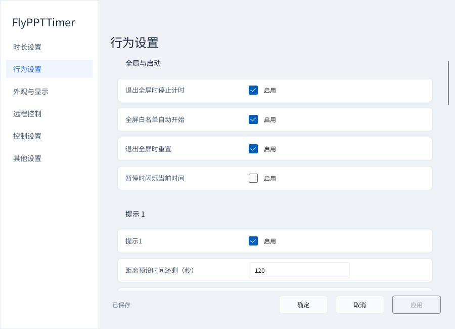
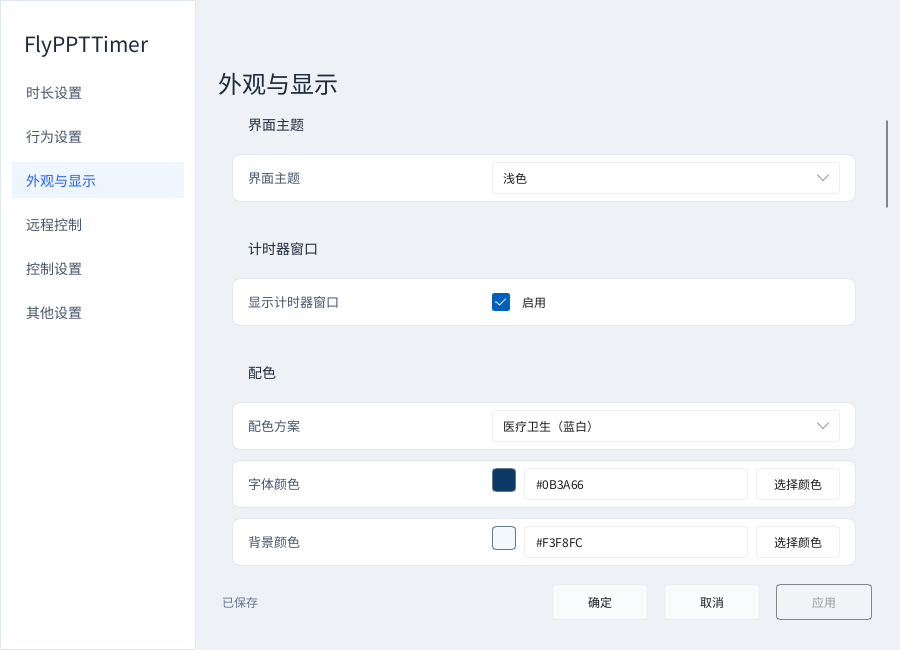
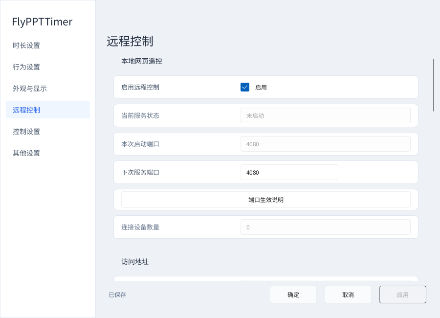
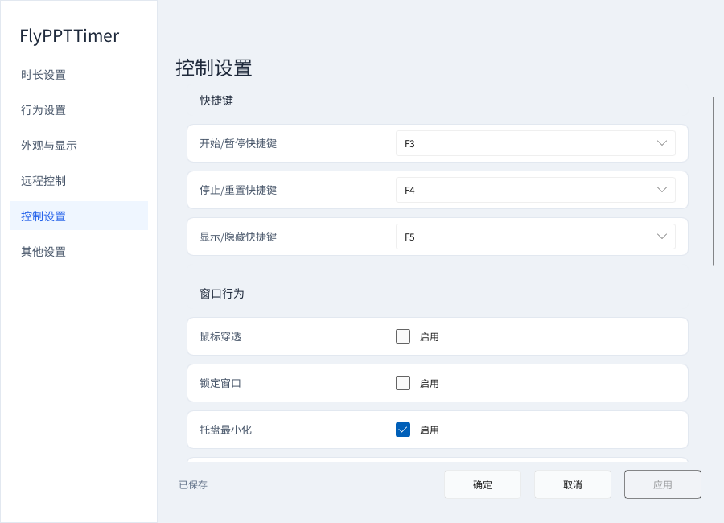
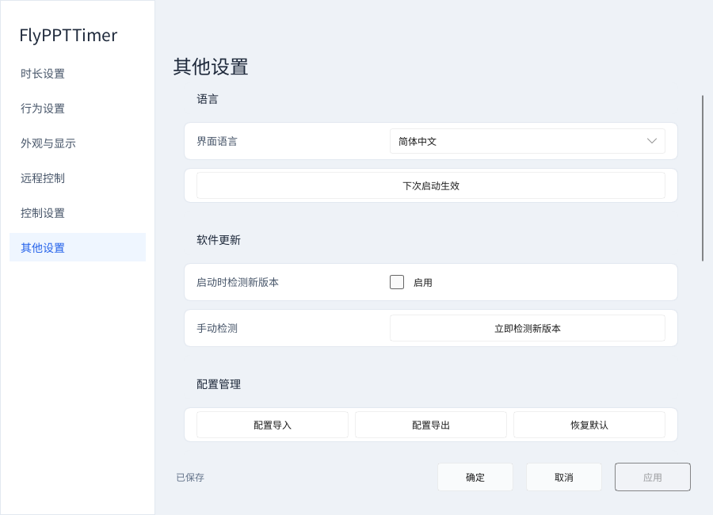

# FlyPPTTimer v1.13.1 中文完整使用指南

[返回项目首页](../README.zh-CN.md) · [English guide](USER_GUIDE.en.md) · [版本更新](../CHANGELOG.md)

本指南对应 **Windows x64 的 v1.13.1**，包括电脑端计时器、设置和 Remote，以及手机浏览器遥控页面。旧版 v0.30.2 的图片、.NET 构建方法不适用于当前程序。这里的“文稿”指 PowerPoint / WPS 演示文件；“规则”只是计时与受控列表记录，不是对 PPT 内容的修改。

## 目录

[安装与第一次启动](#安装与第一次启动) · [计时控制](#计时控制) · [文件规则与批量设置](#文件规则与批量设置) · [提前提醒与时间到操作](#提前提醒与时间到操作) · [浮窗外观与百分比调整](#浮窗外观与百分比调整) · [多显示器与大屏计时](#多显示器与大屏计时) · [手机与浏览器遥控](#手机与浏览器遥控) · [手机文稿列表排序与滑动](#手机文稿列表排序与滑动) · [主题与语言](#主题与语言) · [快捷键](#快捷键) · [配置备份升级与卸载](#配置备份升级与卸载) · [排查常见问题](#排查常见问题) · [典型场景](#典型场景)

## 安装与第一次启动

### 选哪一个包

**偶尔使用、拷到另一台电脑：选便携版。** 下载 `FlyPPTTimer-v1.13.1-portable-win-x64.zip`，右键“全部解压”，放在你有写入权限的文件夹中，再运行 `FlyPPTTimer.exe`。不要在压缩包预览窗口里直接运行，也不要只拿走 EXE：三个 Microsoft 运行库 DLL、配置和说明应一起保留。

**经常在同一台电脑使用：选安装版。** 下载 `FlyPPTTimer-v1.13.1-setup-win-x64.zip`，先解压，再运行里面的安装 EXE。选择中文或英文，按向导操作。默认安装到当前用户的本地应用目录，可创建桌面快捷方式；一般安装不需要管理员权限。安装器不是 PPT 文稿，双击它不会开始放映。

两个包都使用同一份已验收的 v1.13.1 应用 EXE，带有应用本地的 VC 运行库；无需 .NET。不要把 GitHub 自动生成的 “Source code” 当成可运行安装包。软件面向 Windows 10 / 11 x64；PowerPoint / WPS 联动需要对应桌面软件，独立计时则不需要。

### 先认识三个界面

| 界面 | 用途 | 怎样打开 |
|---|---|---|
| 小计时浮窗 | 在其他内容上方显示时间；演示联动时可显示页数 | 启动程序自动出现 |
| 设置窗口 | 时长、规则、提醒、外观、多屏、遥控、快捷键、语言和配置 | 右键计时器或通知区图标 → 设置 |
| 电脑 Remote 窗口 | 显示连接地址和二维码，管理文件规则 | 同一右键菜单 → 远程控制 |
| 手机／浏览器 Remote | 遥控计时、选择文稿、放映和翻页 | 扫描电脑 Remote 的二维码，或打开复制的 URL |

通知区图标可能收在任务栏的“显示隐藏的图标”里。设置与电脑 Remote 可以同时打开。**关闭设置不是退出软件**；彻底结束程序用通知区菜单中的“退出”。

### 保存与预览怎样区分

设置窗口中的“应用”保存但不关闭窗口，“确定”保存并关闭，“取消”放弃尚未应用的编辑并恢复已应用状态。底部显示“有未保存的修改”或“已保存”；把值改回已保存值后，未保存提示会清除。

字号、页数排版、尺寸、形状、位置、透明度和主题等外观选项可以预览，但预览不代表已经写入配置。单行输入框按回车，或点击其他位置，会结束当前输入并退出闪烁光标；**结束输入不等于按了“应用”**。

导入配置、恢复默认、重新生成令牌、重启服务等是明确的操作按钮，部分会立即执行或要求确认，不能把它们当作普通文字框。执行前看清弹窗说明。

## 计时控制

### 设置时长和模式

打开“设置 → 时长设置”，在默认时长中填 `HH:mm:ss`，例如三分钟 `00:03:00`、八分钟 `00:08:00`、一小时 `01:00:00`。选择计时模式，再点“应用”。

- **倒计时**：从预设时长向零减少，适合明确的发言限时。
- **正计时**：从零累计，适合记录已经讲了多久。预设时长仍是提醒与到时判断的参考。
- **到达预设时间后**：可停止计时，或继续显示超时。超时的文字、背景颜色和前缀在行为设置中调整。

全新配置默认八分钟倒计时，允许继续超时。软件基于实际经过的时间计时，不要求 PPT 中有特殊页面、宏或动画。

### 开始、暂停、重置不是一回事

| 动作 | 实际用途 |
|---|---|
| 开始／继续 | 开始一轮计时；暂停后继续已有进度 |
| 暂停 | 暂停累计，适合讨论、设备调整或临时中断 |
| 停止并重置 | 停止当前计时并回到这一轮的初始显示 |
| 重新计时 | 重新开始一轮，不是继续暂停进度 |
| 显示／隐藏 | 只改变普通计时浮窗的可见性，不等于停止计时 |
| 闪烁 | 给讲者一个视觉提示，不改变文稿内容 |
| 静音 | 切换电脑主输出静音，**不只影响 FlyPPTTimer** |

默认 F3 是开始／暂停，F4 是停止重置，F5 是显示／隐藏。手机计时页也提供主要计时操作。未绑定热键的动作不代表不存在，具体以菜单和手机按钮为准。

### 与全屏演示联动

“设置 → 行为设置”有三个独立选项：全屏白名单自动开始、退出全屏时停止、退出全屏时重置。默认启用。通常进入 PowerPoint / WPS 放映后计时开始，退出后停止并重置。手工开始的普通计时与自动演示计时应按各自操作使用。

不希望浏览器等进入全屏时影响计时，或只想手动控制，可关闭自动开始；不希望退出放映就丢失当前显示，可关闭相应停止／重置选项。配置中的全屏白名单也包含部分浏览器和 PDF 阅读器，这不表示 PDF 能加入 PPT 受控列表。

## 文件规则与批量设置

### 给不同文稿分配不同时间

例如开场三分钟、主题报告八分钟、讨论五分钟：

1. 打开“设置 → 时长设置 → 文件规则”，点击“添加文件”。
2. 在现代 Windows 文件选择窗口中选一份或多份 `.ppt`、`.pptx`、`.pptm`。可使用地址栏、常用位置和系统导航；没有“所有文件”回退项。
3. 单击要编辑的规则，填写该文件时长，选择倒计时／正计时和启用状态。
4. 点击设置窗口的“应用”或“确定”。在电脑 Remote 中操作时，使用对应的“保存”。

规则按**完整文件路径**匹配，同名但不同目录的 PPT 是不同文件。移动或重命名后，应更新列表中的登记。添加规则不会修改幻灯片、复制演示内容或自动开始放映。

### 多选和批量修改

单击选择一行，Ctrl+单击选择多个不连续项目，Shift+单击选择一段。点击“批量设置”，填写统一时长、模式并应用，再保存所在窗口。用在多人会议时，可以先批量给所有讲者十分钟，再单独调整特邀报告。

电脑 Remote 的列表按“文件名 / 文件路径”“时长”“模式”排列，文件名和路径分成两行；状态也会保留。该窗口是管理入口，**没有手机端的翻页和放映控制按钮**。

### 禁用、隐藏、移除各自意味着什么

| 操作 | 影响 |
|---|---|
| 禁用文件规则 | 不使用该规则覆盖全局计时时长／模式；不等同于从受控列表撤销文件 |
| 在手机中隐藏 | 暂时不在普通手机列表显示，之后可恢复；文件仍在受控范围 |
| 删除规则／移除文件 | 移出本软件的列表和控制范围，不删除磁盘文件 |
| 关闭文稿 | 对演示软件中的打开文稿执行关闭；与删除规则完全不同 |

设置和 Remote 同时打开时，对不同字段的修改会尽量保留。完成一组编辑后明确保存，比在多个窗口中同时修改同一参数更容易确认结果。

## 提前提醒与时间到操作

打开“设置 → 行为设置”。这里有“提示 1”“提示 2”“计时结束”三组提醒，可以分别启用。

| 参数 | 怎样理解 |
|---|---|
| 距离预设时间还剩（秒） | 提前多久提醒，例如 `120` 是还剩两分钟，`30` 是还剩半分钟 |
| 语音播报 | 使用电脑上的语音功能播报提醒；听感取决于系统语音和输出设备 |
| 提示音／选择文件 | 选择 `.mp3 / .wav / .wma / .m4a` 音频，使用 Windows 原生音频播放 |
| 恢复默认 | 清除该组自选提示音，并非恢复整个软件的默认配置 |
| 闪烁样式 | 无、文字、背景、实线边框、边框加背景 |
| 闪现／隐藏时长 | 闪烁每次亮起、间隔的时间，单位毫秒，例如 `350` 是 0.35 秒 |
| 闪烁持续 | 这一轮提示总共持续几秒 |

新配置的提示1默认提前120秒，提示2默认不启用、阈值30秒，到时提示默认启用。自选提示音会保存到程序目录的 `alert-sounds`；搬电脑时一起备份。单次自选提示音播放有时长上限，不要依赖超长音频播完整段通知；语音播报独立处理。

“时长设置 → 时间到后的操作”与提示声音不是同一项：

**仅提示**适合不打断讲者；**黑屏并显示“时间到”**是本软件的全屏覆盖层，不是小浮窗；**退出放映**让演示软件结束放映，但不等同于关闭文稿或退出 Office。

全屏到时覆盖层可用 Escape、手机的解除按钮等明确操作恢复。它与手机“黑屏／恢复”“白屏／恢复”控制的 **PPT 放映颜色屏**不同。正式演讲前请用实际投影屏和输出音箱试一次，确认提醒、显示屏和音量正确。

## 浮窗外观与百分比调整

打开“设置 → 外观与显示”。所有展示的颜色都可用可视颜色选择器，也可直接填写 HEX，例如 `#F3F8FC`。可先选医疗蓝白、教育深蓝金、商务石墨蓝、科技深色青蓝或高对比黑红方案，再按需要自定义。

### 尺寸、时间和页数

| 选项 | 用法 |
|---|---|
| 自动尺寸 | 根据实际时间和页数内容、字号计算大小；默认模式，宽高输入框会隐藏 |
| 自定义尺寸 | 使用保存的明确宽高，不会悄悄自动撑大；太小可能裁切文字 |
| 时间字号 | 调整主要时间大小 |
| 页数字号跟随时间 | 勾选后两者字号一致；取消后可以独立输入页数字号 |
| 页数颜色跟随时间 | 勾选使用时间颜色；取消后可设置独立页数颜色 |
| 页数斜体／对齐／位置 | 控制页数斜体、左中右对齐，以及时间上方或下方 |

全新配置默认显示页数，独立字号12、时间下方、右对齐。没有可用演示状态时，不应把未显示实际页码误认作字号设置失效。更换主题不会重写自定义计时器配色。

### 真正的小圆角

外观形状提供直角、小圆角、中圆角、大圆角。小／中／大对应约3／7／14个逻辑像素半径；实际屏幕像素随缩放变化。以前叫“小”的圆角保留原来的视觉大小，改叫“中”，因此旧配置不会被突然变形。

### 拖动、滚轮或精确输入百分比

背景不透明度范围0–100%，水平／垂直微调范围−50%到50%。背景不透明度越高越不透明；0%可能让浮窗难以发现，可用 F5、托盘或设置恢复。

- 按住拖条拖动，数值和浮窗同步预览。
- 鼠标悬停在拖条上，滚轮每格增加或减少 **1个百分点**，例如88%→89%，不是把88乘以1.01。
- 点击右侧数值直接输入，回车或移开焦点结束输入。不透明度按整数，位置微调保留0.1%的精度。
- 点击“应用”保存；取消未应用的编辑会恢复。

### 位置、锁定和鼠标穿透

九个默认点位是屏幕的左上／上中／右上、左中／正中／右中、左下／下中／右下，再配合百分比微调。也可以在未锁定、未穿透时拖动小浮窗。位置异常时用“重置计时窗口位置”。

“锁定窗口位置”防止误拖；“鼠标穿透”让鼠标操作落到浮窗下面的内容。打开穿透后直接点浮窗没反应是预期行为，仍可用通知区菜单和快捷键关闭穿透。隐藏只对当前进程有效，下一次启动重新显示。

## 多显示器与大屏计时

Windows 中先正确配置屏幕，再在“外观与显示”选择显示方式：

**所有屏幕同时显示**在各屏显示普通小浮窗；关闭后可以选择单一目标屏幕。适合讲者和观众分别看到计时。

**大屏计时器**把指定的扩展屏作为全屏计时显示。需要 Windows 的“扩展”模式；“复制”不是独立扩展屏，因此控件可能不可用。启用后，承载大屏计时器的那一块屏幕不会再叠加小浮窗；关闭大屏后恢复相应普通浮窗。

给投影放 PPT，同时把另一块独立显示器作为主持人计时屏，是一个典型用法。正式使用前核对屏幕名称、缩放比例和位置；不要只看笔记本小屏就认为外接投影显示正确。

## 手机与浏览器遥控

### 第一次连接

1. 在电脑启动 FlyPPTTimer，打开电脑 Remote 的“远程连接”页。
2. 手机和电脑接同一个局域网。可以都连接路由器 Wi-Fi，也可以电脑连接手机热点。
3. 确认服务显示已启动。扫描二维码，或把“复制访问地址”取得的完整 URL 发给自己的手机浏览器。
4. 手机出现“已连接”后，先暂停／继续一次计时，再测试文稿控制。

推荐入口使用**电脑在当前网络的地址**，不是手机热点网关，不是`127.0.0.1`。二维码和复制地址应一致；切换 Wi-Fi／热点之后要重新打开当前地址。界面中显示的令牌可能被遮盖，不能直接照着遮盖后的文本输入。

### 端口、令牌与服务

默认优先使用保存的固定端口4080。如果不可用，会选择可用端口并保存，连接地址随之改变。手动修改“下次服务端口”后，要点击“重启远程服务并应用端口”，手机重新连接。

URL 中的令牌相当于本次遥控入口的钥匙。不要公开分享真实二维码或带令牌的地址。“重新生成令牌”会改变入口，“断开所有远程设备”用于撤销当前会话连接，之后按新入口重连。

本软件不使用云账户，也不会上传 PPT 内容，但 Remote 是普通 HTTP 局域网服务，不是公网加密会议服务。只在可信网络使用；不用时停止服务，不要做公网端口映射。

### 计时页

计时页显示当前时间和运行状态，可开始、暂停／继续、重置、重新计时、显示／隐藏计时浮窗、闪烁，以及电脑静音。修改时长时输入时、分、秒，再应用；出现是否同步文件规则的选择时，按需要选仅全局或同步规则，不要无意覆盖所有讲者的时长。

### 演示页操作顺序

先在受控列表选文件并“打开”或“切换”，再放映。打开操作会尝试把对应文稿编辑窗口最大化并前置，**不会直接自动开始放映**。已经在放映的文稿重复打开，不应让编辑窗口盖住原放映。

| 控件 | 作用 |
|---|---|
| 从头放映 | 从第一张开始这一份文稿 |
| 从当前页放映 | 从演示软件的当前页开始 |
| 上一页／下一页 | 对当前受控放映翻页 |
| 页码＋跳转 | 输入有效页码并跳转 |
| 黑屏／恢复、白屏／恢复 | 暂时用黑色或白色覆盖 PPT 放映，再恢复；不改幻灯片 |
| 结束放映 | 退出放映，保留打开的文稿 |
| 关闭当前文稿 | 关闭演示软件中的当前受控文稿 |
| 关闭最后打开的文稿 | 关闭本软件最近管理打开的文稿 |
| 退出演示软件 | 退出可安全确定的受控演示进程；存在其他不受控文稿时可能拒绝 |

**关闭或退出可能涉及尚未保存的编辑，操作前先在 PowerPoint / WPS 保存。** “移除文件”不是关闭；“结束放映”不是退出 Office。按钮不可用时先看页面状态和提示，不要反复点造成多个重叠动作。

软件不会把任意打开的文稿都默认为受控文件；没有进入受控列表的文件，需要先添加。

## 手机文稿列表排序与滑动

演示文稿列表提供手动、名称、大小、修改时间排序以及方向切换。名称排序会按数字友好的方式处理，例如第2份在第10份前；大小与修改时间来自文件信息，读不到信息的项目排后。

**长按文件或拖动手柄**调整顺序，也可用“上移／下移”。放开后提交新顺序；普通快速上下滑是滚动，不是重新排序。手动移动后会转为手动排序。

在列表中左右滑动，和其他非输入区域一样可以切换“计时／演示”。上下滑先滚动内部文件列表，到边界后接着滚动整个页面。文件很少、不需要内部滚动时，直接滚动整个页面。

“隐藏”临时收起项目；点“显示隐藏项”再恢复。“添加已打开文件”从已经被检测到的打开文稿中添加受控成员，不是从手机上传 PPT。“移除文件”会请求确认，只取消规则与控制成员资格，不删除磁盘文件、不保存也不关闭 Office 文稿。

## 主题与语言

桌面“外观与显示 → 界面主题”可选跟随系统、浅色、深色；覆盖设置、电脑 Remote 和应用内弹窗。系统提供的文件／颜色选择器等仍受 Windows 主题管理，不应把它们的浅色外观理解为应用内暗黑模式没有保存。

手机页顶部有主题选择，默认跟随电脑，也可单独选择浅色或深色。手机浏览器的语言环境决定手机页面文字，不必和电脑固定相同。

桌面语言在“其他设置”选择跟随系统、English或简体中文；语言变更需要重启。确认后保存并重启，设置会重新出现。之后点击确定或取消只关闭设置，不会退出计时器和遥控服务。

## 快捷键

| 默认按键 | 操作 |
|---|---|
| F3 | 开始／暂停／继续 |
| F4 | 停止并重置 |
| F5 | 显示／隐藏普通计时浮窗 |
| F7 | 闪烁提示 |
| F8 | 切换电脑主输出静音 |
| Ctrl+Alt+↑ / Ctrl+Alt+↓ | 增加／减少一分钟 |
| Ctrl+Alt+1 / 2 / 3 / 4 / 5 | 3／5／8／10／15分钟预设 |
| Escape | 解除本软件到时黑屏覆盖层；PowerPoint 自己也会处理 Escape |

三个主要功能键可在“控制设置”里改为F1–F12。其他键位记录在配置的 `Controls.Hotkeys` 中，并非都有图形编辑器。快捷键被系统或其他软件占用时，请换一个键，不要把重复注册当成输入故障；笔记本可能需要按Fn组合才能发出F键。

“最小化到托盘”和“关闭按钮行为”决定支持这些操作的窗口怎样处理关闭／最小化。日常要只收起窗口，选最小化到托盘；要停止整个软件，用明确的退出命令。

## 配置备份升级与卸载

### 本地保存什么

| 内容 | 默认位置／操作 |
|---|---|
| 设置和文件规则 | EXE旁的`FlyPPTTimer.config.json`；“其他设置 → 打开配置文件位置” |
| 日志 | 程序本地`logs`；“打开日志文件位置” |
| 导入的提示音 | 程序本地`alert-sounds` |
| 导出配置 | “配置导出”选择的JSON文件 |

导出的是配置，不会把所有 PPT 文件或音频自动打成一个包。换电脑时还要复制需要的文稿、`alert-sounds`，检查规则中的绝对路径。导入配置后核对时长、屏幕和连接入口；恢复默认会影响自定义设置，先备份。

### 从旧便携版升级

完全退出旧程序；把新包解压到新目录；复制自己的配置及导入提示音到新目录，再启动检查。不要把新包的默认配置覆盖到旧配置上，也不要只替换一个EXE而遗漏运行库。v1.13.1会保留明确保存的参数，但启动可见性按新规则重新显示。

从v0.30.2升级时可以导入旧JSON配置，但先留备份，检查文件路径、屏幕、提醒和新页数选项。自动尺寸／大屏和手机列表等已有新行为，见[开发记录](DEVELOPMENT_HISTORY.md)。

安装版用安装向导升级到同一个安装目录；既有配置不会被默认文件覆盖。卸载后个人配置可能保留，完整清理前先导出。portable版先退出，再自行删除其目录即可。

### GitHub 下载与软件内更新不是同一渠道

**当前已验收的应用内更新器仍查询 Gitee 发布渠道，并识别独立安装 EXE。** 本次 GitHub Release 按要求只提供两个 ZIP，没有同步发布到 Gitee。因而在软件内点“检测新版本”，不等于已检查 GitHub 的这个 Release；也不保证能自动安装 ZIP。升级本版请使用[GitHub 下载页](https://github.com/Hona-Cao/FlyPPTTimer/releases/latest)，解压后手动运行安装器。启动检查默认关闭，可在其他设置启用。

## 排查常见问题

| 现象 | 先检查这些地方 |
|---|---|
| 启动后找不到计时器 | v1.13.1每次启动会显示。检查不透明度是否为0、字号和自定义尺寸、目标显示器；用托盘设置重置位置；确认没有运行旧EXE |
| 浮窗点不到／拖不动 | 关闭鼠标穿透或位置锁定；穿透时改用托盘菜单 |
| 页码没显示／不对 | 开启显示页数；打开受支持演示软件和文稿；检查当前受控目标；独立计时不提供PPT页数 |
| 改了设置又恢复 | 看底栏是否仍有未保存修改；回车退出输入不等于应用；取消会撤销预览 |
| 手机扫不出来 | 扫自己的电脑实时二维码，不是本文截图；确认手机能访问电脑的局域网地址 |
| 扫了码但无法连接 | 同网、服务启动、端口正确；检查Wi-Fi客户端隔离／访客网络、VPN、多网卡和Windows入站规则；换网络后重扫 |
| 手机能计时但不能翻页 | 先在受控列表登记文稿；检查桌面PowerPoint/WPS、文稿权限和状态；状态过期时等待刷新；不把网页版Office当桌面COM |
| 文件列表为空 | 在电脑添加PPT规则并保存，或在手机“添加已打开文件”；打开Office本身不会自动把所有文件纳入控制 |
| 文件删了却还开着 | 移除规则不关闭文稿、不删除磁盘；确实要关请先保存，然后用关闭文稿 |
| 大屏选项不可用 | 需要真正的扩展屏，不是复制屏；先在Windows设置里启用扩展 |
| 没有提示音 | 检查提醒开关、音频路径、系统输出设备、系统音量／静音和系统语音；F8影响整台电脑主输出 |
| 改语言后设置又打开 | 这是重启后重新显示设置的行为；确定只关闭设置，不退出软件 |
| 提示运行库缺失 | 完整解压或重新安装，不要从不明网站下载单个DLL |
| 下载被系统询问来源 | 从本项目Release下载并核对发布者／版本；不要关闭安全软件或忽略明确恶意检测 |

防火墙修复命令可以从软件复制；它可能需要管理员权限。**不要关闭整个防火墙**，只为所需应用和当前端口配置适当的可信网络访问。当前服务不是公网远程桌面，不应用于不可信网络。

仍有问题时，在[Issues](https://github.com/Hona-Cao/FlyPPTTimer/issues)说明软件版本、Windows版本、PowerPoint/WPS版本、操作步骤、预期结果和实际结果，附裁掉私人信息的截图与相关日志。不要贴真实访问令牌、未遮盖二维码或敏感文稿内容。

## 典型场景

**个人答辩，8分钟。** 设置八分钟倒计时、两分钟前提醒、仅提示；把答辩PPT加入规则；在讲者屏右上显示时间和页数。正式开始前按F4重置，再放映。

**多人会议。** 先登记每份PPT，用批量设置统一时长，再单独调整特殊报告。手机按议程排序，完成的报告隐藏而不是删除。下一位需要时切换文稿并从头放映，结束后恢复隐藏项可准备下一场。

**主持人远程提醒。** 手机和电脑同网，使用计时页暂停／恢复或闪烁提示；不必动演示文件。提醒音会从电脑输出，不是从手机扬声器播放。

**扩展屏大字计时。** Windows先设扩展屏，在大屏计时模式选主持人专用屏；不要选正在给观众显示PPT的屏幕，除非你确实希望那个屏幕显示全屏计时。

正式活动前，花一分钟检查“文件顺序、每份时长、显示屏、音频输出、手机连接”。本指南描述功能，不取代你的具体设备与网络上的最后确认。

## 设置页面索引

以下是各页顶部的界面示例，长页面请在软件中继续下滚；完整选项的含义见前文。

Behavior / 行为设置

Appearance / 外观与显示

Remote / 远程控制

Controls / 控制设置

Other / 其他设置

