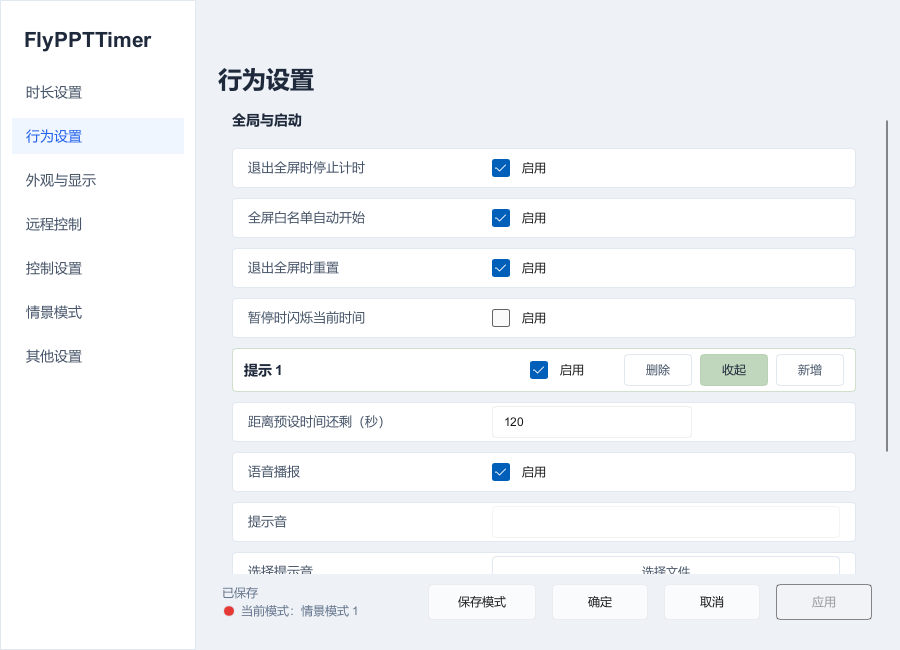
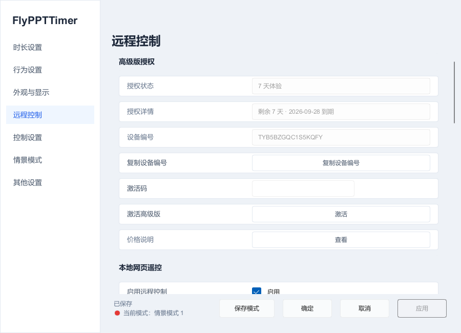
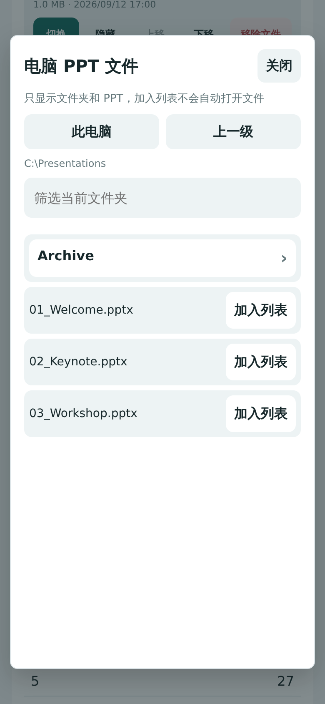
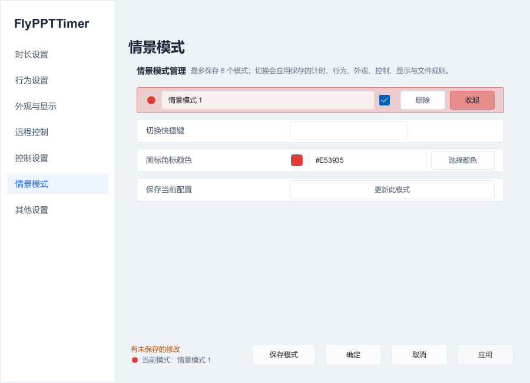
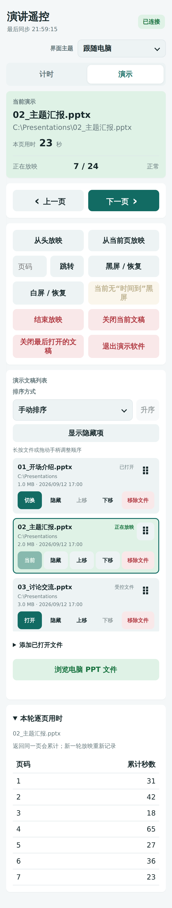
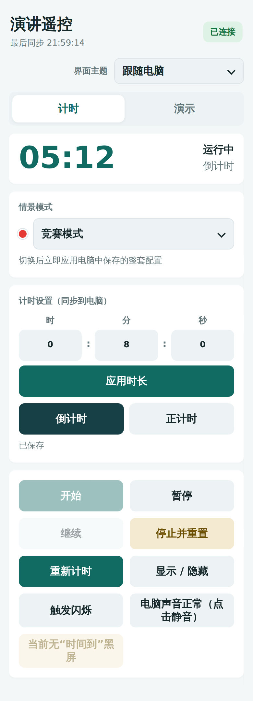
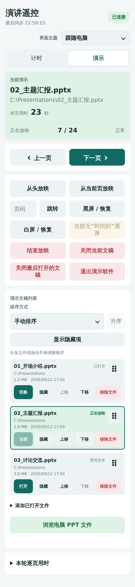

# FlyPPTTimer 使用指南

[中文首页](../README.zh-CN.md) · [English Guide](USER_GUIDE.en.md)

适用于 **FlyPPTTimer v1.17.0 · Windows 10 / 11 x64**。

这份指南只说明当前版本的实际使用方式，不再按 v1.14、v1.15、v1.16 逐版本叠加说明。历史变化请查看 [GitHub Releases](https://github.com/Hona-Cao/FlyPPTTimer/releases)。

FlyPPTTimer 可以独立作为演讲计时器，也可以配合桌面版 Microsoft PowerPoint / WPS 演示显示页码、记录逐页用时、按文稿切换计时规则，并通过手机浏览器控制计时和演示。

## 目录

[快速开始](#快速开始) · [界面与保存方式](#界面与保存方式) · [① 时长设置](#时长设置) · [② 行为设置](#行为设置) · [③ 外观与显示](#外观与显示) · [④ 远程控制](#远程控制) · [⑤ 控制设置](#控制设置) · [⑥ 情景模式](#情景模式) · [⑦ 其他设置](#其他设置) · [PowerPoint / WPS 联动](#powerpoint--wps-联动) · [手机 Remote](#手机-remote) · [常见问题](#常见问题)

## 快速开始

1. 从 [最新 Release](https://github.com/Hona-Cao/FlyPPTTimer/releases/latest) 下载便携版或安装版。
2. 启动 FlyPPTTimer。普通计时浮窗会出现。
3. 右键计时浮窗或通知区图标，打开 **设置**。
4. 在 **时长设置** 中设置例如 <code>00:08:00</code>，选择“倒计时”，点击 **应用**。
5. 默认快捷键 **F3** 开始 / 暂停，**F4** 停止并重置，**F5** 显示 / 隐藏普通计时浮窗。
6. 打开兼容的 PowerPoint / WPS 演示并开始放映，即可使用页码与逐页计时。
7. 需要手机控制时，打开 **远程控制**，让手机和电脑处于同一可信局域网，再按电脑显示的地址或二维码连接。

无需安装 Microsoft Office 也能使用独立计时；PowerPoint / WPS 页码、放映控制等功能需要电脑安装兼容的桌面演示软件。手机只需要现代浏览器。

## 界面与保存方式

FlyPPTTimer 日常主要有四类界面：

| 界面 | 用途 |
|---|---|
| **普通计时浮窗** | 显示主时间，以及可选的逐页秒表与当前页 / 总页数。 |
| **设置** | 配置时长、提醒、外观、多显示器、Remote、快捷键、情景与其他选项。 |
| **电脑端远程控制窗口** | 显示 Remote 连接信息，并管理受控演示文稿及文件规则。 |
| **手机 / 浏览器 Remote** | 控制计时、演示文稿、翻页、逐页统计与情景切换。 |

### 设置怎么保存

| 操作 | 结果 |
|---|---|
| **应用** | 保存修改，但继续停留在设置窗口。 |
| **确定** | 保存修改并关闭设置窗口。 |
| **取消** | 放弃尚未应用的修改并关闭窗口。 |

底部出现“有未应用的更改”时，说明当前编辑还没有保存。部分外观项可以即时预览，但仍应在确认后点击 **应用** 或 **确定**。

---

## ① 时长设置

这里决定一轮演讲怎样计时，以及不同演示文稿是否使用不同规则。

### 基础计时

| 设置项 | 作用 |
|---|---|
| **默认时长 HH:mm:ss** | 没有匹配专用文稿规则时使用的时长。 |
| **倒计时** | 从预设时长减到 0，适合答辩、比赛、路演等明确限时场景。 |
| **正计时** | 从 0 开始累计，也可以在达到预设时间时触发提醒。 |
| **无限制** | 从 0 持续正计时，不使用目标时长、提前提示或超时逻辑。 |
| **到达预设时间后** | 可停止，也可继续显示超时。 |
| **时间到后的操作** | 可仅提示，也可按当前设置结束放映或显示“时间到”画面。 |

**无限制**适合课堂、开放讨论、值守或只关心“已经进行了多久”的场景。关闭无限制后，原来的默认时长与文件规则继续保留。

### 文件规则：不同 PPT 使用不同时间

例如：

| 演示文稿 | 规则 |
|---|---:|
| 开场介绍.pptx | 05:00 倒计时 |
| 产品介绍.pptx | 15:00 倒计时 |
| 答辩.pptx | 08:00 倒计时 |

操作方法：

1. 在 **文件规则** 中点击 **添加文件**。
2. 选择 <code>.ppt</code>、<code>.pptx</code> 或 <code>.pptm</code> 文件。
3. 为规则设置时长和计时模式，并确认它处于启用状态。
4. 点击 **应用** 或 **确定**。
5. 使用对应文稿时，启用的文件规则优先于全局默认时长。

规则按完整文件路径识别。同名文件位于不同目录时属于不同规则；文件移动或改名后应重新添加。

电脑端 **远程控制 → 演示文稿** 也可以修改这些规则。v1.17 中，那里发生的新增、删除、时长、模式或批量修改，会同步刷新已经打开的 **设置 → 时长设置 → 文件规则**，不需要关闭设置窗口重新打开。

---

## ② 行为设置

这里控制自动开始 / 停止，以及演讲过程中何时、怎样提醒。

  

### 全屏联动

常用选项包括：

- **全屏白名单自动开始**：进入受支持的全屏演示状态时自动开始计时。
- **退出全屏时停止计时**：结束相应全屏过程时停止本轮计时。
- **退出全屏时重置**：退出后恢复到本轮初始时间。
- **暂停时闪烁当前时间**：提醒演讲者当前处于暂停状态。

如果现场不希望任何应用进入全屏就自动开始，可以关闭自动开始，统一使用 F3 手动控制。

### 提前提示点

提前提示用于在真正到时前提醒演讲者调整节奏。

例如 8 分钟演讲：

- 提前 120 秒：6:00 时提醒；
- 提前 30 秒：7:30 时再次提醒；
- 计时结束：8:00 时触发最终提醒。

每个提示点可以独立设置：

- 是否启用；
- 距离预设时间还剩多少秒；
- 语音播报；
- 自定义提示音；
- 文字 / 背景 / 边框等视觉闪烁方式；
- 闪现、隐藏和持续时间。

当前界面支持管理多个提示点；不需要的提示可以保持关闭。

### 计时结束与超时

“计时结束”与普通提前提示分开配置。需要继续显示超时时，可以配合：

- **继续显示超时**；
- **仅提示**；
- 超时文字颜色；
- 超时背景颜色；
- 超时前缀。

如果设置为结束放映或显示“时间到”画面，则实际结束行为以当前“时间到后的操作”为准。

---

## ③ 外观与显示

这里决定普通计时浮窗长什么样、显示在哪块屏幕，以及是否开启专用大屏计时。

### 普通计时浮窗

可以调整：

- 界面主题；
- 是否显示普通计时器窗口；
- 配色方案、文字颜色、背景颜色和提醒颜色；
- 自动尺寸或自定义宽高；
- 主时间字号；
- 窗口形状与圆角；
- 背景不透明度。

**自动尺寸**会根据当前文字、页码和字号自动留出空间，通常最适合演示现场。只有确实需要固定尺寸时再使用自定义宽高。

### 页码与逐页秒表

普通浮窗可以同时显示：

- **当前页 / 总页数**，例如 <code>7 / 24</code>；
- **当前页本次停留秒数**，例如 <code>23</code>。

逐页秒表记录的是当前一次停留时间：切换到其他页后归零；重新回到同一页时，本次浮窗显示会重新从 0 开始。手机 Remote 的“本轮逐页用时”则会累计同一页在本轮演示中的多次停留。

启用后但暂时没有可读文稿时，页码会显示占位状态，逐页秒表显示 <code>00</code>。

### 多显示器

可以选择：

- 所有屏幕同时显示普通浮窗；
- 只在指定显示器显示；
- 默认九宫格点位；
- 水平 / 垂直百分比微调；
- 重置计时窗口位置。

0% 偏移以实际窗口尺寸和目标显示器边界计算。不同 DPI、扩展屏负坐标等情况会按对应屏幕处理。

### 专用大屏计时

开启 **大屏计时器** 后，可以把一个更大的计时界面放到扩展屏。

常见用法：

- 主屏：PPT；
- 演讲者屏：普通小浮窗；
- 第二屏：大号主时间。

新配置下，大屏主要用于显示主时间；需要时可以额外打开“大屏显示页数与逐页秒表”。

---

## ④ 远程控制

FlyPPTTimer Remote 是局域网浏览器控制界面。

  

这里可以：

- 启用 / 停止本地网页 Remote；
- 查看当前服务状态和端口；
- 设置下次服务端口或使用随机端口；
- 查看推荐访问地址与局域网地址；
- 显示二维码；
- 重启 Remote 服务；
- 重新生成访问令牌；
- 断开所有已连接设备；
- 打开本机控制页；
- 复制防火墙排障命令；
- 控制是否允许手机浏览电脑中的 PPT 文件。

### 连接手机

1. 确认电脑和手机处于同一可互通的可信网络。
2. 在电脑打开 **远程控制**。
3. 用手机扫描当前二维码，或在浏览器中打开推荐地址。
4. 等待手机顶部显示已连接状态。

真实二维码、完整访问 URL 和访问令牌都应视为控制凭据，不要公开到截图、Issue、社交媒体或公共文档中，也不要把 Remote 端口直接映射到公网。

### 允许手机浏览电脑 PPT

连接 Remote 与允许浏览电脑文件是两件不同的事。

如果需要在手机上寻找并加入本机 PPT：

1. 在电脑 **设置 → 远程控制** 开启 **允许手机浏览电脑 PPT 文件**。
2. 点击 **应用**。
3. 回到手机 **演示** 页，点击 **浏览电脑 PPT 文件**。
4. 浏览本地目录并把需要的 PPT 加入受控列表。

  

此功能只提供本地目录导航与演示文件加入列表，不是远程桌面，也不是通用文件上传、下载、删除或编辑工具。使用完毕后可以关闭该权限。

---

## ⑤ 控制设置

这里管理全局快捷键和普通计时窗口行为。

默认常用快捷键：

| 默认快捷键 | 作用 |
|---|---|
| **F3** | 开始、暂停或继续当前计时。 |
| **F4** | 停止并重置。 |
| **F5** | 显示 / 隐藏普通计时浮窗。 |

其他操作的快捷键以当前 **控制设置** 页面显示为准，可以按现场习惯调整。

窗口行为包括：

- **鼠标穿透**：让鼠标事件直接传给浮窗后方内容；
- **锁定窗口**：避免现场误拖动；
- **托盘最小化**；
- **关闭按钮行为**：退出应用或最小化到托盘。

如果浮窗“看得到但点不到”，优先检查鼠标穿透；如果“点得到但拖不动”，检查窗口锁定。

---

## ⑥ 情景模式

情景模式用于保存一整套已经应用的工作配置，而不仅仅是一个时长。

  

一个情景可以保存当前的：

- 计时方式与时长；
- 提醒行为；
- 外观与显示；
- 控制设置；
- 多显示器设置；
- 文件规则。

最多保存 8 个情景。语言、软件更新来源和 Remote 访问凭据不会跟着情景切换。

### 保存

1. 先把其他设置页面调整好并点击 **应用**。
2. 进入 **情景模式**。
3. 使用底栏 **保存模式**。
4. 输入名称并确认。

### 维护与切换

展开情景后可以：

- 重命名；
- 设置切换快捷键；
- 设置角标颜色；
- 用当前配置覆盖已有快照；
- 删除该情景；
- 切换到该情景。

切换时会把该快照中的整套工作配置一起应用。

手机计时页也可以切换已经保存的情景：

  

---

## ⑦ 其他设置

### 语言

可以选择：

- 跟随系统；
- 简体中文；
- English。

修改界面语言后按程序提示重启，使全部界面统一切换。

### 演示软件

默认使用 Windows 当前文件关联打开 PPT。也可以指定并校验 Microsoft PowerPoint 或 WPS 演示的可执行文件。电脑端与手机端发起“打开文稿”时使用同一选择。

### 软件更新

可以选择 GitHub 或 Gitee 作为更新来源，并设置是否启动时检查新版本，也可以手动检查。

安装版和便携版都支持应用内更新流程。更新前建议先保存 PowerPoint / WPS 中尚未保存的文稿。

### 配置管理

可以：

- 导出配置；
- 导入配置；
- 恢复默认；
- 打开配置文件所在位置；
- 打开日志文件所在位置。

更换电脑、重装系统或准备重要活动前，建议先导出一次配置。

### 版本与项目信息

“其他设置”中可以查看当前版本、项目介绍和相关入口。遇到问题时，提交反馈前先确认这里显示的 FlyPPTTimer 版本。

---

## PowerPoint / WPS 联动

FlyPPTTimer 与演示软件联动时，主要提供四类能力：

### 1. 页码

正在放映且状态可读取时，普通浮窗可以显示当前页 / 总页数。

### 2. 逐页用时

浮窗显示当前一次停留秒数；手机端显示本轮演示每页累计时间。

  

例如：

- 第 3 页第一次停留 20 秒；
- 切到其他页；
- 再回第 3 页停留 12 秒。

此时浮窗本次访问显示约 12 秒，而手机端第 3 页累计约 32 秒。

记录只属于当前演示会话，不会写入 PPT 文件。

### 3. 文稿规则

每个文稿可以有自己的时长和计时模式，避免换讲者时反复修改全局时长。

### 4. 演示控制

在电脑端 Remote 或手机 Remote 中，可以对当前可控演示执行打开、开始放映、上一页、下一页、跳转、结束放映等操作。

---

## 手机 Remote

手机界面主要分为 **计时** 和 **演示** 两页。

### 计时页

  

常用操作包括：

- 修改时长与模式并应用；
- 开始 / 暂停 / 继续；
- 停止并重置；
- 重新开始一轮；
- 显示 / 隐藏电脑计时浮窗；
- 触发视觉提醒；
- 控制电脑主输出静音；
- 解除 FlyPPTTimer 显示的“时间到”画面；
- 切换情景模式。

### 演示页

  

典型流程：

1. 从受控列表选择演示文稿。
2. 如尚未打开，点击 **打开**。
3. 选择从头放映或从当前页放映。
4. 使用上一页 / 下一页，或输入页码后跳转。
5. 需要讨论时，可以使用黑屏 / 白屏及恢复操作。
6. 完成后点击 **结束放映**。

手机还可以：

- 按名称、大小、修改时间或手动顺序排序；
- 长按调整手动顺序；
- 隐藏已经讲完的文稿；
- 把当前已打开文稿加入受控列表；
- 在电脑允许后浏览并加入本机 PPT；
- 查看本轮逐页用时。

### 关闭文稿与退出演示软件

这些操作含义不同：

- **结束放映**：只停止幻灯片播放；
- **关闭当前文稿**：关闭对应文档；
- **关闭最后打开的文稿**：关闭由控制操作最近打开的文档；
- **退出演示软件**：请求对应 PowerPoint / WPS 实例正常退出，并保留演示软件自己的保存确认。

正式活动前，建议先用一份测试 PPT 演练关闭流程，避免现场误关仍需使用的文稿。

---

## 推荐现场配置

### 论文答辩

- 8–15 分钟倒计时；
- 开启 1–2 个提前提示；
- 普通浮窗显示页码与逐页秒表；
- 演讲者屏显示小浮窗；
- 手机用于主持人或工作人员控制。

### 演讲比赛

- 每份 PPT 使用独立文件规则；
- 开启明显的提前提醒与超时样式；
- 第二屏使用大屏计时；
- 为不同比赛流程保存情景模式。

### 课堂 / 培训

- 开放讨论使用无限制正计时；
- 需要节奏分析时保留逐页秒表；
- 多种课程布局可以保存为不同情景。

### 多人会议

- 为每位讲者的 PPT 设置独立时长；
- 使用手动排序确定出场顺序；
- 会务人员通过手机 Remote 控制下一位演示。

---

## 常见问题

| 问题 | 处理方法 |
|---|---|
| **找不到计时器** | 按 F5；检查“显示计时器窗口”、目标显示器、文字颜色和窗口位置，必要时重置位置。 |
| **计时器点不到** | 检查“控制设置 → 鼠标穿透”。 |
| **计时器不能拖动** | 检查“控制设置 → 锁定窗口”。 |
| **时间文字被截断** | 使用自动尺寸，或增大自定义宽高。 |
| **没有 PPT 页码** | 确认页码显示已开启、正在使用兼容的桌面 PowerPoint / WPS，并且有可读取的演示状态。 |
| **逐页秒表没有变化** | 确认正在实际放映，并且 FlyPPTTimer 能读取当前页。 |
| **自动开始不符合现场习惯** | 关闭全屏自动开始，统一使用 F3；或分别调整退出全屏时停止 / 重置。 |
| **提醒没有声音** | 检查该提示点是否启用、语音 / 音频设置、Windows 输出设备与系统静音。 |
| **手机无法连接** | 确认 Remote 已启动、两端同网、没有访客网络隔离或 VPN 阻断，并检查 Windows 防火墙。 |
| **手机已连接但不能浏览文件** | 在电脑启用“允许手机浏览电脑 PPT 文件”并点击应用，然后重新打开手机文件浏览。 |
| **手机可以计时但不能翻页** | 确认目标文稿已经打开并进入放映，且当前演示状态可控。 |
| **大屏计时不可选** | 在 Windows 显示设置中把外接屏设为扩展显示器。 |
| **设置改了但没保存** | 查看底部是否提示有未应用修改，并点击应用或确定。 |
| **换电脑想保留配置** | 在“其他设置”导出配置，并备份需要继续使用的自定义提示音。 |
| **需要日志** | 在“其他设置”打开日志文件位置。 |

## 活动前检查

正式活动前建议完成一次完整彩排：

- 文稿能否正确打开；
- 每份 PPT 的时长是否正确；
- 页码与逐页秒表是否正常；
- 提前提示和到时提醒是否符合现场要求；
- 普通浮窗是否在正确屏幕与位置；
- 大屏计时是否出现在正确扩展屏；
- 手机 Remote 是否能连接、翻页和控制计时；
- 电脑声音与提示音是否正常；
- 重要配置是否已经应用并备份。

遇到问题可以在 [GitHub Issues](https://github.com/Hona-Cao/FlyPPTTimer/issues) 提交反馈。请提供 FlyPPTTimer 版本、Windows 版本、PowerPoint / WPS 版本、复现步骤和必要截图；发送前移除真实二维码、Remote URL、访问令牌、私人路径和敏感演示内容。
