# FlyPPTTimer 使用教程

[中文首页](../README.zh-CN.md) · [English guide](USER_GUIDE.en.md)

适用于 **v1.13.1 · Windows 10 / 11 x64**。

FlyPPTTimer 可以独立显示演讲时间，也可以配合 PowerPoint / WPS 显示页数、按文稿切换时长，并通过手机浏览器控制演示。下面按设置窗口的六个页面介绍，再说明手机操作和日常维护。

## 目录

[安装与快速开始](#start) · [设置怎么保存](#save) · [① 时长设置](#timer) · [② 行为设置](#behavior) · [③ 外观与显示](#appearance) · [④ 远程控制](#remote) · [⑤ 控制设置](#controls) · [⑥ 其他设置](#other) · [手机使用](#phone) · [常见问题](#faq)

## 安装与快速开始

### 下载和安装

到 [GitHub 下载页](https://github.com/Hona-Cao/FlyPPTTimer/releases/latest) 或 [Gitee 下载页](https://gitee.com/hona-cao/fly-ppttimer/releases)，选择适合自己的版本。

| 版本 | 适合谁 | 使用步骤 |
|---|---|---|
| 便携版 `portable-win-x64.zip` | 临时使用、U 盘携带、在不同电脑上使用 | 完整解压到可写入的文件夹，运行 `FlyPPTTimer.exe`。保留同目录的 DLL 文件。 |
| 安装版 `setup-win-x64.zip` | 经常在同一台电脑上使用 | 解压后运行安装 EXE，选择安装语言和位置，按向导完成安装。 |

无需安装 .NET。独立计时不需要 Office；显示 PPT 页数和控制放映，需要电脑装有兼容的桌面版 PowerPoint 或 WPS 演示。手机只需要浏览器。

### 第一次使用

1. 启动程序，屏幕上会出现计时浮窗。
2. 右键浮窗或任务栏通知区的 FlyPPTTimer 图标，打开 **设置**。
3. 在 **时长设置** 中输入 `00:08:00`，选择“倒计时”，点击“应用”。
4. 按 **F3** 开始／暂停；按 **F4** 停止并重置。
5. 需要手机遥控时，从右键菜单打开 **远程控制**，让手机和电脑连接同一网络，再扫码。

不添加文稿、不连接手机，也可以正常使用计时器。通知区图标可能收在任务栏的小箭头里。

### 各个窗口分别做什么

| 界面 | 用途 |
|---|---|
| 计时浮窗 | 显示时间和可用的文稿页数，可拖动到合适位置。 |
| 设置 | 配置时长、提醒、外观、多显示器、遥控、快捷键、语言等。 |
| 电脑“远程控制”窗口 | 显示地址与二维码，在“演示文稿”页管理文件规则。 |
| 手机／浏览器控制页 | 控制计时、打开文稿、放映、翻页和管理演示顺序。 |

## 设置怎么保存

| 操作 | 结果 |
|---|---|
| 应用 | 保存修改，继续留在设置窗口。 |
| 确定 | 保存修改并关闭设置，计时器继续运行。 |
| 取消 | 放弃尚未应用的修改，关闭设置。 |
| 回车或点击输入框外 | 结束当前输入；需要保存时，再点“应用”或“确定”。 |

底部出现 **“有未保存的修改”** 时，表示编辑尚未保存。字号、配色、位置、不透明度等可以立即预览；取消会恢复已应用的状态。

“配置导入”“恢复默认”“重新生成令牌”等按钮执行的是具体操作，不是等待最后统一保存的普通输入项。下文会说明它们的影响。

## ① 时长设置：决定一轮演讲计时多久

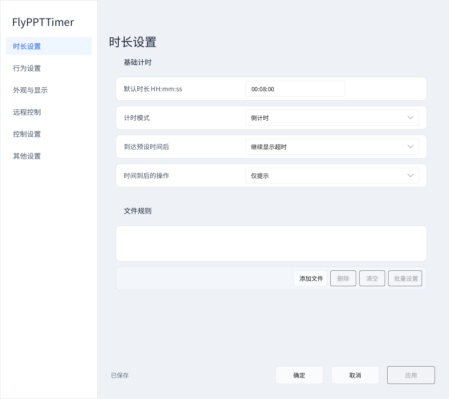

### 基础计时

| 设置项 | 作用 | 怎么选 |
|---|---|---|
| 默认时长 HH:mm:ss | 没有启用专用规则时使用的时长。格式是“小时:分钟:秒”。 | 3 分钟填 `00:03:00`；8 分钟填 `00:08:00`；1 小时填 `01:00:00`。 |
| 计时模式 | “倒计时”从预设时长减到零；“正计时”从零累计。 | 有明确发言限时用倒计时；想看已经讲了多久用正计时。正计时也可以按预设时长提醒。 |
| 到达预设时间后 | 选择停止，或继续显示超时。 | 允许讲者稍作收尾时选“继续显示超时”。 |
| 时间到后的操作 | 决定到时只提醒、显示全屏“时间到”，还是结束放映。 | 通常先选“仅提示”，再按会议规则决定是否自动中断演示。 |

**“是否继续超时”和“到时做什么”要一起看：** 需要持续显示超时，选择“继续显示超时”并将“时间到后的操作”设为“仅提示”。选择黑屏或退出放映时，到时会结束放映并停止重置计时，不再继续累计超时。

| 时间到后的操作 | 实际效果 |
|---|---|
| 仅提示 | 按行为设置播放提示或闪烁；计时是否继续由“到达预设时间后”决定。 |
| 黑屏并显示“时间到” | 结束当前放映、停止重置计时，并显示全屏“时间到”画面。按 Esc，或在手机控制页解除该画面。 |
| 退出放映 | 结束当前放映并停止重置计时，文稿仍保留在演示软件中。 |

### 文件规则：每份文稿用不同的时间

例如开场 3 分钟、主题报告 15 分钟、讨论 5 分钟，就不必在每次换讲者时重新设置默认时长。

1. 在“文件规则”下点击 **添加文件**，选择 `.ppt`、`.pptx` 或 `.pptm`，可以一次多选。
2. 选择一条规则，填写它的时长，选择倒计时／正计时，并勾选启用。
3. 点击 **应用** 或 **确定** 保存。
4. 使用对应文稿时，启用的规则优先于默认时长和模式。

规则按完整路径识别文稿。同名文件放在不同文件夹，是两条不同规则；移动或改名后，请重新添加对应路径。

| 列表操作 | 用途 |
|---|---|
| 添加文件 | 把文稿登记到列表，不修改 PPT 内容。 |
| 删除 | 移除选中的规则，不删除磁盘文件。 |
| 清空 | 清空规则列表；需要保留设置时可先导出配置。 |
| 批量设置 | 为多条已选规则统一设置时长和模式。 |
| 启用／停用 | 决定该规则是否覆盖默认计时设置，不是删除文件。 |

**多选方法：** Ctrl+单击选择不连续的多条规则，Shift+单击选择连续的一段，再点“批量设置”。例如先把所有讲者设为 10 分钟，再单独将主报告改为 20 分钟。

电脑 **远程控制 → 演示文稿** 也可以管理规则，修改后点该窗口的 **保存**。文件名和路径在左侧，时长与模式在右侧。

## ② 行为设置：自动计时、提前提醒和超时提示

### 全局与启动

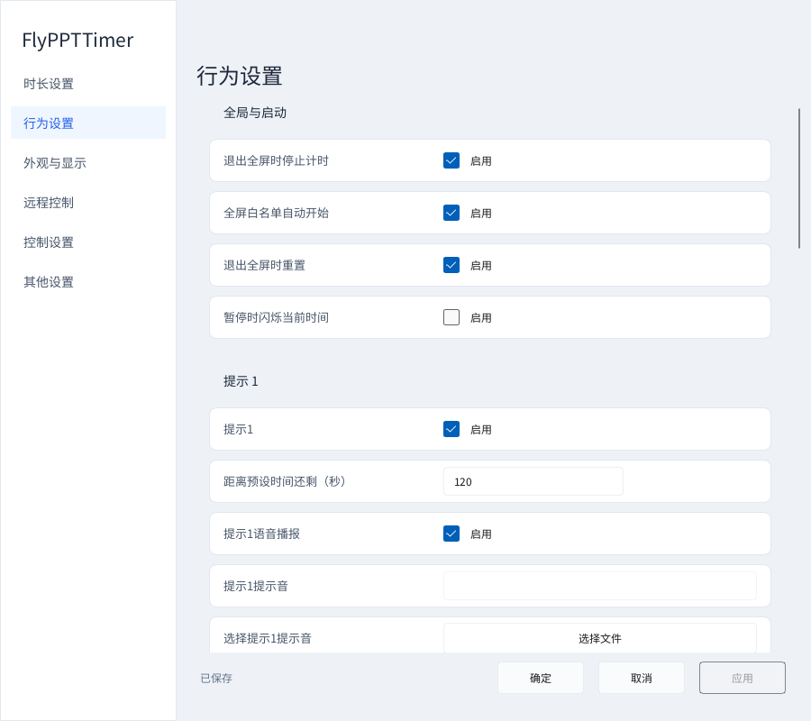

| 设置项 | 开启后的作用 | 使用建议 |
|---|---|---|
| 全屏白名单自动开始 | 名单内的程序进入全屏时自动开始计时。 | 希望进入 PowerPoint／WPS 放映就开始计时，可开启；只想按 F3 手动计时，可关闭。 |
| 退出全屏时停止计时 | 结束相应的自动全屏计时过程时停止计时。 | 退出放映就结束一轮时开启。 |
| 退出全屏时重置 | 相应全屏计时结束时回到初始时间。 | 每位讲者都要从头开始时开启；需要保留结束时的时间显示，可关闭。 |
| 暂停时闪烁当前时间 | 暂停后通过闪烁提醒当前没有继续计时。 | 经常临时暂停、怕忘记恢复时开启。 |

自动全屏识别还包括部分浏览器和 PDF 阅读器。若这些软件进入全屏不应触发计时，请关闭自动开始，改用快捷键。文件规则和手机文稿控制仍面向 PPT 文件。

### 提示 1、提示 2、计时结束：三组分别设置

“提示 1”和“提示 2”是提前提醒，“计时结束”是在到达预设时间时提醒。每组都有独立开关、语音、提示音和闪烁参数。

**8 分钟报告的例子：** 提示 1 填 `120`，就是讲到 6 分钟时提醒；提示 2 填 `30`，就是讲到 7 分 30 秒时再次提醒；“计时结束”在 8 分钟时提醒。这里只填提前量，不填已经讲过的时间。

| 设置项 | 含义与用法 |
|---|---|
| 提示 1／提示 2／计时结束的“启用” | 整组提醒的总开关。关闭后该组不触发。 |
| 距离预设时间还剩（秒） | 提前提醒的时间，例如 `120`、`30`。应小于这轮的预设时长；到时提醒没有这一项。 |
| 语音播报 | 通过电脑的语音功能播报提醒。声音从电脑当前输出设备播放。 |
| 提示音 | 显示当前选择的音频路径。通过下面的“选择文件”更换，不用手工修改路径。 |
| 选择文件 | 使用自己的 `.mp3`、`.wav`、`.wma` 或 `.m4a` 音频。适合短提示音。 |
| 恢复默认 | 清除这一组自选提示音。不会重置整个软件，语音和闪烁仍由各自选项控制。 |
| 闪烁样式 | 决定闪烁文字、背景、边框，或不闪烁。 |
| 闪现时长（毫秒） | 每次亮起持续多久，`350` 表示 0.35 秒。 |
| 隐藏时长（毫秒） | 相邻两次亮起之间的间隔。数值越大，节奏越慢。 |
| 闪烁持续（秒） | 整组视觉提醒持续多久，例如 `3` 表示持续约 3 秒。 |

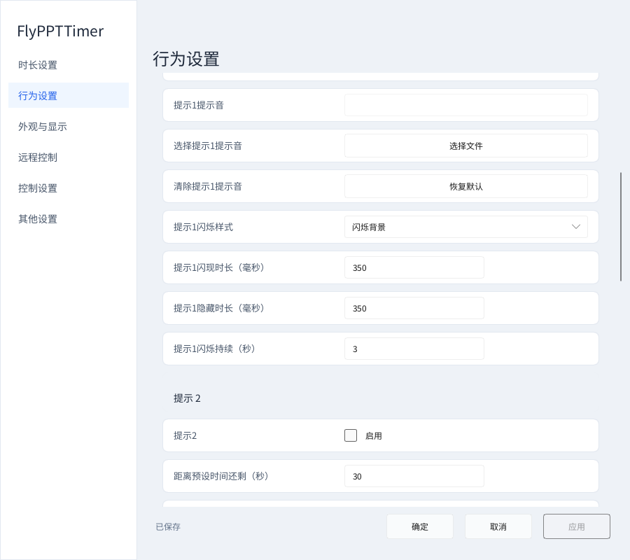

| 闪烁样式 | 适用情况 |
|---|---|
| 无 | 不需要视觉提醒，只保留声音或语音。 |
| 闪烁文字 | 让时间文字闪烁，提示较轻。 |
| 闪烁背景 | 让浮窗背景闪烁，更容易被注意到。 |
| 实线边框 | 用边框变化提醒，不大面积改变背景。 |
| 边框加背景 | 需要更明显的视觉提示。 |

查看提示 2 和计时结束的设置位置

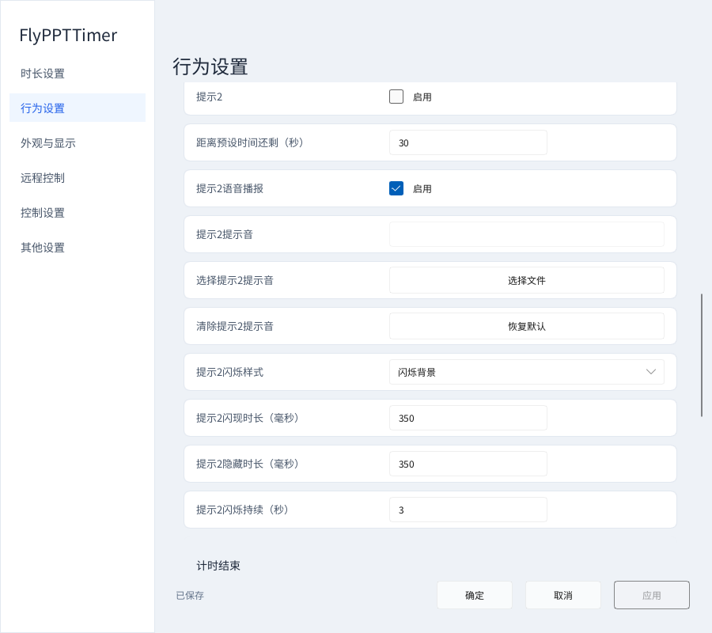

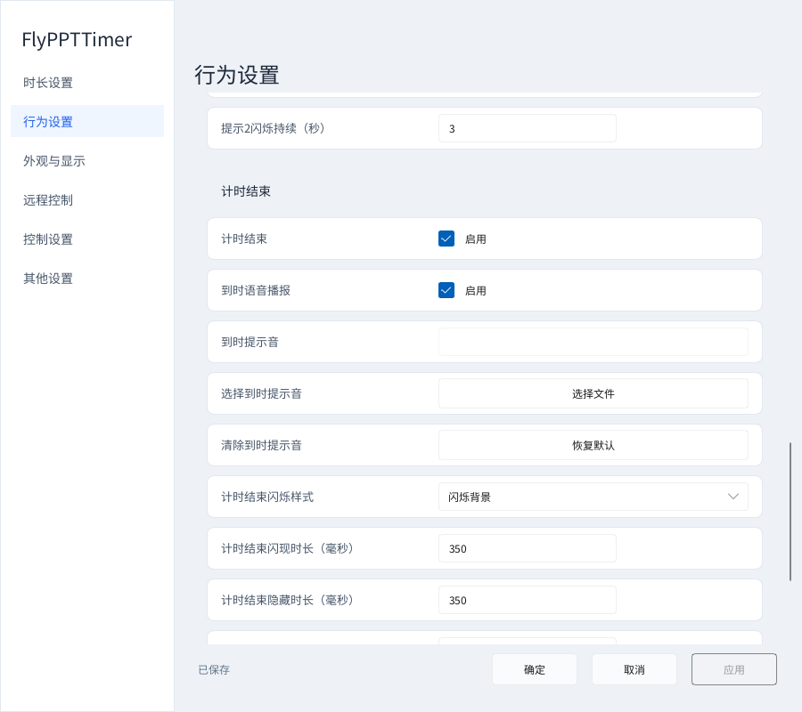

只需要安静的视觉提醒时，关闭语音播报、清除自选提示音，保留合适的闪烁样式。需要声音提醒时，先确认电脑没有静音，并选对音箱或耳机。

### 超时文字、背景和前缀

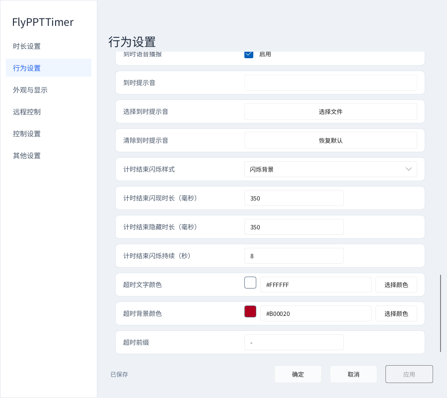

“超时文字颜色”和“超时背景颜色”用于区分正常计时与超时。“超时前缀”是超时读数前面的文字；例如使用 `-`，超时 12 秒时可以直观看出已经超过预定时间。

这些外观需要配合 **时长设置 → 继续显示超时 + 仅提示** 使用。提前提醒的背景颜色则在 **外观与显示 → 闪烁背景颜色** 中设置。

## ③ 外观与显示：让计时器清楚、合适、不遮挡内容

### 界面主题、窗口显示和配色

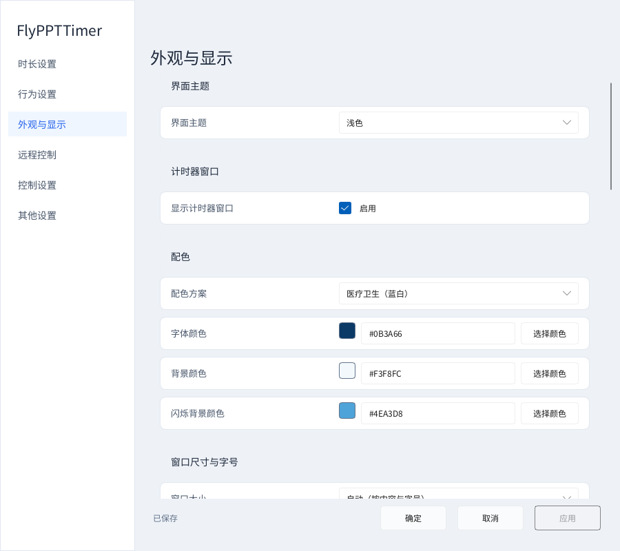

| 设置项 | 作用 |
|---|---|
| 界面主题 | 跟随系统、浅色或深色，改变设置、电脑 Remote 等应用界面。 |
| 显示计时器窗口 | 显示或隐藏普通计时浮窗，不停止计时。每次重新启动软件时，浮窗都会显示。 |
| 配色方案 | 提供医疗卫生、教育培训、商务会议、科技发布、高对比警示等配色，可选择后再调整具体颜色。 |
| 字体颜色 | 普通时间文字的颜色。 |
| 背景颜色 | 普通计时浮窗的背景色。 |
| 闪烁背景颜色 | 视觉提醒期间使用的背景色。 |

点击颜色块或“选择颜色”打开颜色选择器，也可在旁边输入 `#RRGGBB`，例如深蓝色 `#0B3A66`。界面主题与浮窗配色是两件事：选择深色界面，不会替你覆盖已经选好的计时器颜色。

### 窗口大小与页数排版

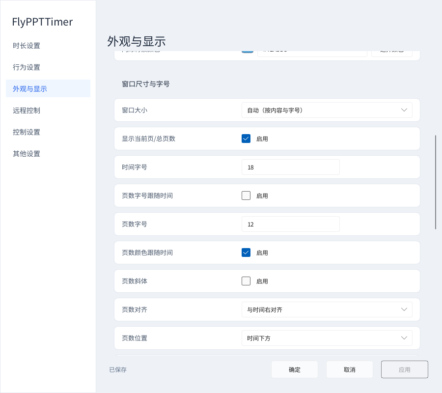

| 设置项 | 作用与操作 |
|---|---|
| 窗口大小：自动（按内容与字号） | 自动容纳时间和页数。适合大多数情况；无需填写宽高。 |
| 窗口大小：自定义窗口尺寸 | 显示“宽”“高”输入框，按指定尺寸显示。改大字号后也要留出足够空间，避免文字被截断。 |
| 时间字号 | 调整主要时间文字大小。 |
| 显示当前页/总页数 | 在时间旁显示文稿进度，例如 `3 / 20`。需要能识别的 PowerPoint／WPS 文稿。 |
| 页数字号跟随时间 | 开启后和时间使用相同字号；关闭后出现独立的“页数字号”。 |
| 页数颜色跟随时间 | 开启后和时间使用相同颜色；关闭后出现独立的“页数颜色”。 |
| 页数斜体 | 让页数与时间在样式上有所区分。 |
| 页数对齐 | 与时间左对齐、居中对齐或与时间右对齐。 |
| 页数位置 | 放在时间上方或下方。 |

默认页数字号是 **12**，在时间 **下方、右对齐**。关闭页数显示后，与页数有关的设置会收起。

**常见搭配：** 时间大、页数小，可以关闭“页数字号跟随时间”，把时间字号调大，页数保持 12；窗口大小选择“自动”，再根据投影距离调整。

### 形状与不透明度

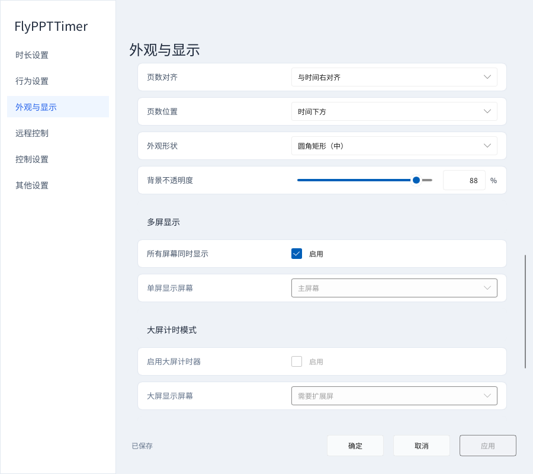

“外观形状”可选直角矩形，或小、中、大圆角矩形。小圆角接近规整的卡片，大圆角更柔和。

**背景不透明度**的范围是 **0–100%**：100% 完全不透明，数值越小越容易看到后方内容。它调整的是背景，不是把时间文字一起隐藏。

百分比可以用三种方式修改：

| 方式 | 怎么操作 |
|---|---|
| 拖动 | 按住滑块左右移动，数值与浮窗同步预览。 |
| 滚轮 | 鼠标停在滑块上，滚动一格增减 1 个百分点，例如 88% → 89%。 |
| 精确输入 | 点击右侧数值框直接输入；回车或点击别处结束输入。 |

调整满意后点击“应用”。水平、垂直位置的百分比也使用相同操作；位置支持到 0.1 个百分点，不透明度使用整数百分比。

### 多屏显示与大屏计时模式

| 设置项 | 作用 |
|---|---|
| 所有屏幕同时显示 | 每个适用屏幕显示同一轮计时的小浮窗。 |
| 单屏显示屏幕 | 关闭“所有屏幕同时显示”后，选择只在哪个屏幕显示。 |
| 启用大屏计时器 | 用一个扩展屏全屏显示大字时间，适合主持人或讲者查看。 |
| 大屏显示屏幕 | 指定大屏计时器所在的扩展屏。该屏不再重复叠加普通小浮窗。 |

**只让讲者看到时间：** 关闭“所有屏幕同时显示”，把单屏目标选为讲者的屏幕。

**单独给主持人一块大字计时屏：** 在 Windows 显示设置中选择“扩展这些显示器”，然后启用大屏计时器并选择主持人那块屏幕。大屏计时会占满目标屏幕，请不要误选正在向观众展示 PPT 的屏幕。

“大屏”选项灰色、提示“需要扩展屏”时，先检查外接显示器连接和 Windows 显示模式。

### 默认位置与微调

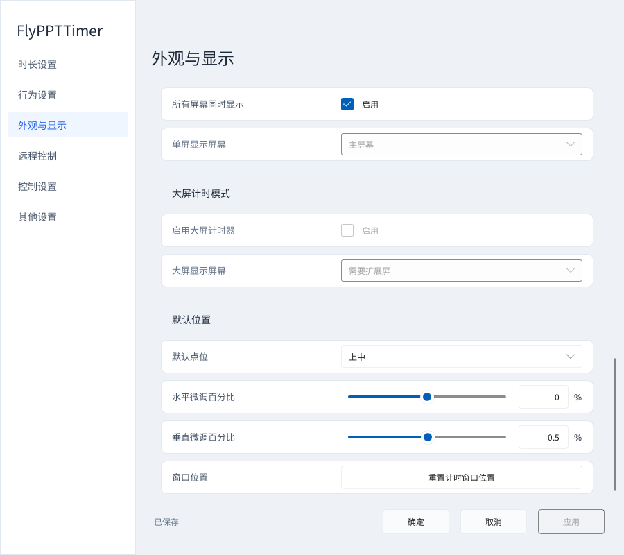

| 设置项 | 作用 |
|---|---|
| 默认点位 | 选择左上、上中、右上等九个基准位置。 |
| 水平微调百分比 | 相对基准位置左右移动；正数向右、负数向左。 |
| 垂直微调百分比 | 相对基准位置上下移动；正数向下、负数向上。 |
| 重置计时窗口位置 | 取消手动拖动的位置，按当前默认点位和微调值重新定位。 |

位置百分比相对于所选屏幕的可用区域，范围 **-50% 到 50%**。先选接近目标的位置，再小幅微调，比一次把偏移拉到很大更容易操作。没有开启鼠标穿透和锁定窗口时，也可以直接拖动浮窗。

## ④ 远程控制：让手机连接电脑

### 本地网页遥控和端口

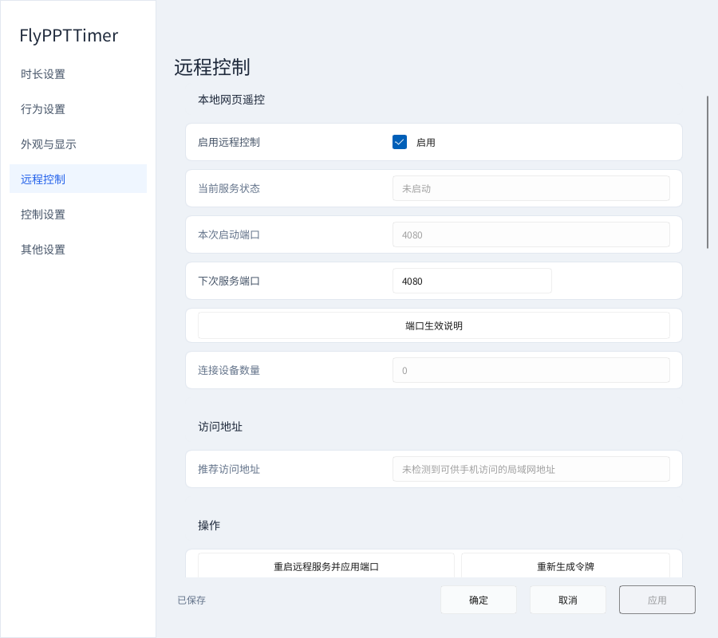

| 设置项 | 含义 |
|---|---|
| 启用远程控制 | 是否允许通过局域网浏览器控制软件。修改后保存。 |
| 当前服务状态 | 查看服务是否已经启动。 |
| 本次启动端口 | 当前手机连接正在使用的端口。 |
| 下次服务端口 | 填入希望服务使用的端口；修改后点击“重启远程服务并应用端口”。 |
| 连接设备数量 | 查看当前连接情况。 |
| 推荐访问地址 | 手机访问电脑的入口。连接时使用复制功能或实时二维码。 |

程序优先复用保存的端口。端口不可用时会选择并保存可用端口；以窗口里当前显示的地址为准。改端口、换网络或重置令牌后，应重新扫码。

### 操作按钮和防火墙

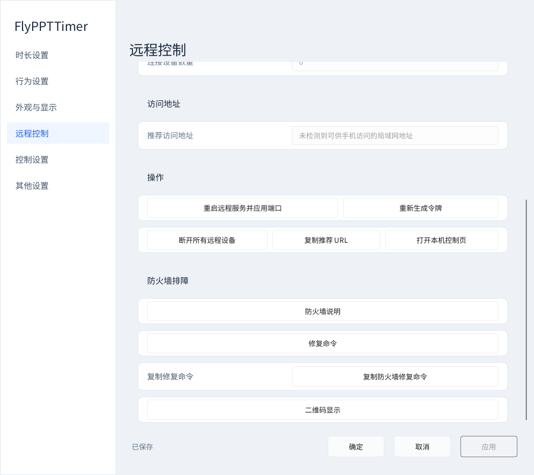

| 按钮 | 什么时候用 | 操作后要注意什么 |
|---|---|---|
| 重启远程服务并应用端口 | 修改端口，或需要重新启动服务时。 | 会应用设置并重新启动遥控服务；手机重新连接。 |
| 重新生成令牌 | 需要更换连接凭据，不再使用原二维码时。 | 原连接地址失效，使用新二维码／URL。 |
| 断开所有远程设备 | 结束当前手机控制会话。 | 已连接设备需要使用新的连接信息重新连接。 |
| 复制推荐 URL | 给同网的手机或另一台电脑打开。 | 分享完整复制结果；只发给可信的人。 |
| 打开本机控制页 | 先在这台电脑的浏览器里确认遥控页可用。 | 本机能打开但手机不能打开时，重点检查网络和防火墙。 |
| 复制防火墙修复命令 | 手机访问被 Windows 防火墙拦截时。 | 复制本身不会修改系统；确认使用当前端口后，在管理员终端执行。 |

只为需要的程序和端口放行，不要关闭整个防火墙。学校、酒店或单位的访客 Wi-Fi 可能禁止设备互相访问，这种情况下可以改用允许互访的网络。

### 手机连接步骤

1. 手机和电脑接入同一个 Wi-Fi；也可以开启手机热点，让电脑连接该热点。
2. 在电脑右键菜单打开 **远程控制 → 远程连接**。
3. 确认服务已启动，用手机扫描 **自己电脑窗口里的实时二维码**。
4. 打开手机浏览器页面，先试一次开始／暂停，再使用文稿控制。

网页地址中的 IP 是电脑在局域网里的地址。使用手机热点时，也不要自行把它换成热点网关。二维码和完整地址包含连接凭据，不要发到公开网站。

## ⑤ 控制设置：快捷键和窗口操作

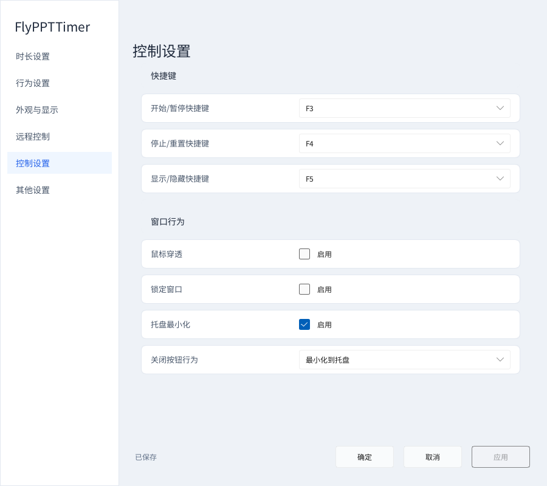

### 三个主要快捷键

开始／暂停、停止／重置、显示／隐藏三个快捷键可以在下拉框中选择 **F1–F12**，保存后使用。给不同动作分配不同按键，并避开演示软件常用的按键；笔记本可能需要同时按 Fn。

| 默认快捷键 | 作用 |
|---|---|
| F3 | 开始、暂停或继续当前计时。 |
| F4 | 停止并重置。 |
| F5 | 显示／隐藏普通计时浮窗。 |
| F7 | 触发闪烁提醒。 |
| F8 | 切换电脑主输出静音，影响电脑声音，不只影响本软件。 |
| Ctrl+Alt+↑ / Ctrl+Alt+↓ | 增加／减少一分钟。 |
| Ctrl+Alt+1 / 2 / 3 / 4 / 5 | 切换为 3／5／8／10／15 分钟预设。 |

### 窗口行为

| 设置项 | 实际用途 |
|---|---|
| 鼠标穿透 | 鼠标点击穿过浮窗，操作后面的 PPT 或其他窗口。开启后需要改设置时，从通知区图标打开。 |
| 锁定窗口 | 防止误拖动计时器位置。要重新摆放时先关闭。 |
| 托盘最小化 | 设置窗口最小化时收进通知区，减少任务栏占用。 |
| 关闭按钮行为 | 对计时浮窗的关闭操作，选择退出程序或收起到托盘。不是设置窗口“确定”按钮的行为。 |

**鼠标穿透**解决“挡住后面的操作”，**锁定窗口**解决“被不小心拖走”，可以按需要分别开启。

关闭设置后，计时器和遥控仍可继续工作。完全退出请使用通知区菜单中的 **退出**。

## ⑥ 其他设置：语言、更新、备份与文件位置

### 语言和软件更新

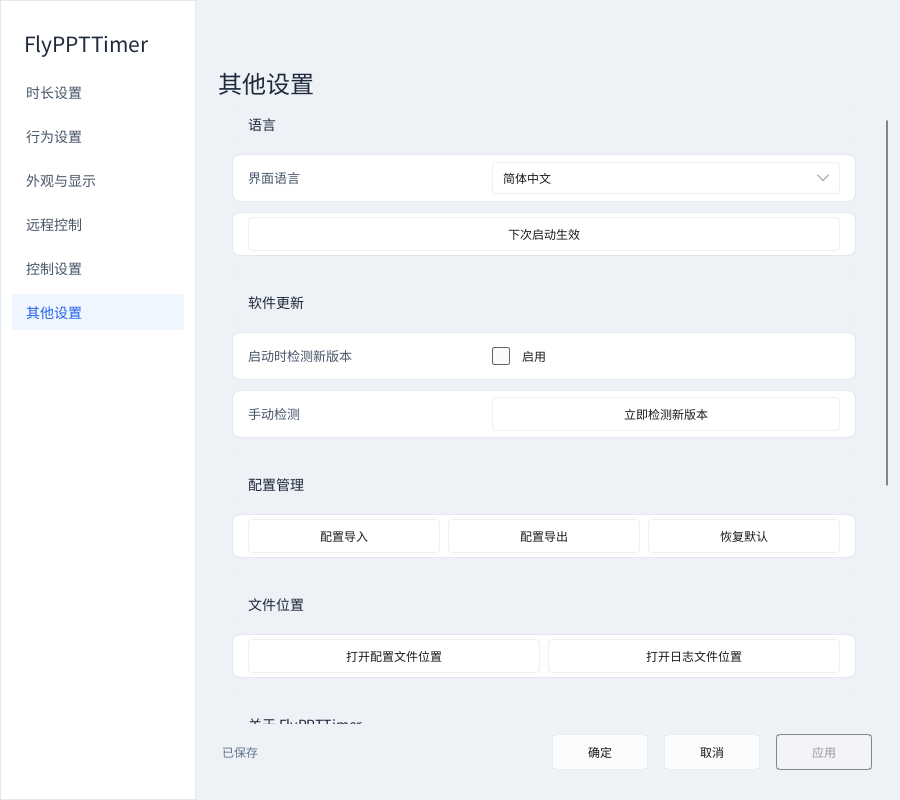

| 设置项 | 怎么用 |
|---|---|
| 界面语言 | 选择跟随系统、English 或简体中文。按提示保存并重启后生效。 |
| 启动时检测新版本 | 开启后在启动时检查更新，需要网络。 |
| 立即检测新版本 | 现在检查可用版本。更新检查使用 Gitee 发布页。 |

使用 ZIP 更新包时，先解压；安装版运行里面的安装程序，便携版完整解压后再迁移配置。

### 配置管理

| 按钮 | 作用 | 示例 |
|---|---|---|
| 配置导出 | 把设置和文件规则保存为 JSON。 | 会议前存一份备份，或给另一台电脑使用。建议先“应用”当前修改再导出。 |
| 配置导入 | 读取选中的 JSON 并应用其中的配置。 | 在新电脑恢复自己的设置；导入后检查文稿路径和显示屏选择。 |
| 恢复默认 | 将设置恢复为默认配置。 | 想重新配置时使用；先导出需要保留的个人设置。 |

导出的配置 **不包含 PPT 文件和自选提示音文件本身**。换电脑时，请一并复制文稿和 `alert-sounds` 文件夹。文稿路径变了，要重新登记对应文件规则。

### 文件位置、关于和联系作者

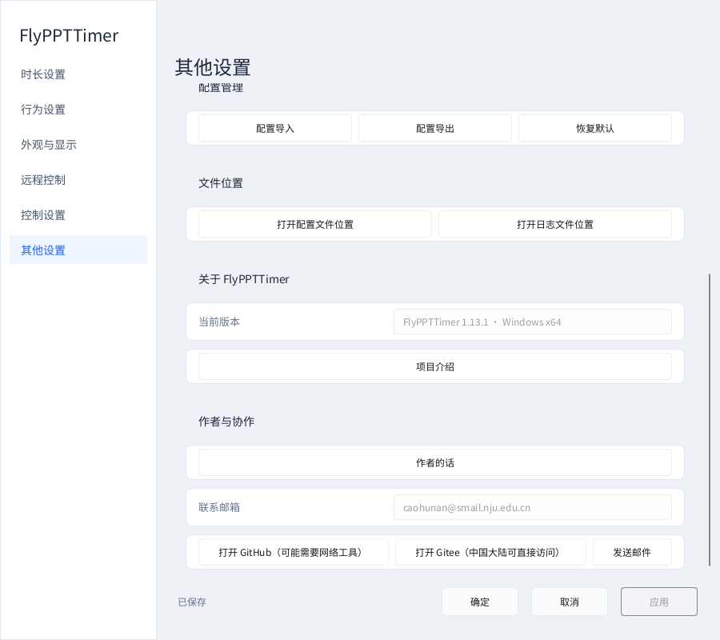

| 入口 | 用途 |
|---|---|
| 打开配置文件位置 | 找到 `FlyPPTTimer.config.json`，便于备份或迁移。 |
| 打开日志文件位置 | 找到运行日志；遇到问题时可提供相关时间段的记录。 |
| 当前版本 | 查看正在运行的版本，反馈问题时提供这个版本号。 |
| 项目介绍 | 查看软件的主要功能说明。 |
| 作者的话 | 了解项目和作者。 |
| 打开 GitHub／打开 Gitee | 打开项目主页、下载页及相关资料。 |
| 发送邮件 | 通过邮件联系作者。 |

### 升级、迁移和卸载

**便携版升级：** 退出旧程序，将新包完整解压到新目录，再复制自己的 `FlyPPTTimer.config.json` 和 `alert-sounds`，最后启动新程序。不要用新包的默认配置覆盖自己的配置。

**安装版升级：** 退出程序，运行安装向导，选择原安装目录。已有配置会保留。

**卸载：** 安装版从 Windows 的应用列表卸载；便携版退出后删除其文件夹。需要保留个性化设置时，先导出配置并备份自选提示音。

## 手机使用：计时与演示两个页面

手机顶部可切换 **计时／演示**，在一般内容区域和文件列表内也可左右滑动切换。主题可跟随电脑，或在手机端单独选择。手机界面语言随浏览器的语言环境显示。

### 计时页

| 按钮／输入项 | 作用 |
|---|---|
| 时长、模式与应用 | 调整计时目标和模式，点击应用确认。 |
| 开始、暂停、继续 | 控制当前这一轮计时。暂停后用“继续”保留已有进度。 |
| 停止并重置 | 停止这一轮，恢复初始时间。 |
| 重新计时 | 重新开始一轮，而不是继续上次进度。 |
| 显示／隐藏 | 切换电脑小计时浮窗的显示，不停止计时。 |
| 触发闪烁 | 从台下给讲者一个视觉提醒。 |
| 电脑声音 | 切换电脑主输出静音。 |
| 解除“时间到”黑屏 | 关闭本软件显示的全屏“时间到”画面。 |

### 演示页：打开文稿和放映

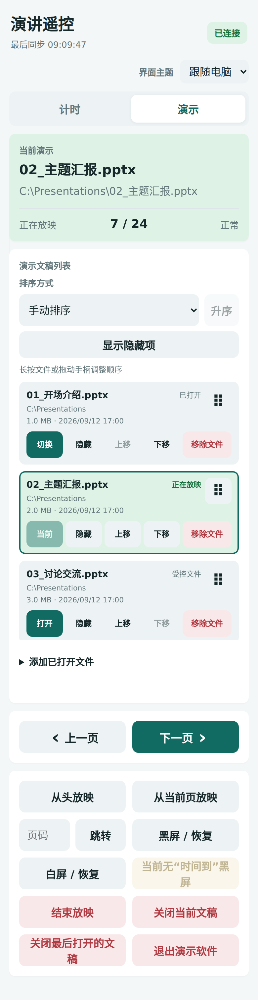

1. 先在电脑的文件规则中添加文稿并保存；已经打开的文稿也可通过手机 **添加已打开文件 → 加入列表** 登记。
2. 从列表选择文稿并点击 **打开**。电脑会打开并显示该文稿的编辑窗口。
3. 点击 **从头放映** 或 **从当前页放映**。
4. 用 **上一页／下一页** 翻页，或输入页码后点 **跳转**。
5. 结束时点击 **结束放映**。

“黑屏／恢复”和“白屏／恢复”用于临时隐藏 PPT 放映内容，适合现场讨论；它们与计时结束后显示的“时间到”画面分别控制。

### 列表排序、隐藏和移除

| 操作 | 用法 |
|---|---|
| 排序方式 | 按名称、文件大小、修改时间或手动顺序排列。 |
| 升序／降序 | 切换当前排序方向。 |
| 长按拖动、上移／下移 | 自己安排出场顺序；拖动后使用手动排序。 |
| 隐藏 | 暂时收起已经讲完的文件。 |
| 显示隐藏项、恢复 | 找回隐藏的文件，重新放回普通列表。 |
| 移除文件 | 从受控列表移除，不删除磁盘文件，也不关闭文稿。 |

上下滑动时，先翻动文件列表；列表到边界后继续滚动页面。文件少、不需要列表内部滚动时，直接滚动整个页面。普通滑动用于浏览，长按后拖动用于排序。

### 关闭和退出

“结束放映”只停止幻灯片播放；“关闭当前文稿”关闭当前文稿；“关闭最后打开的文稿”用于关闭由控制操作最后打开的那份文件；“退出演示软件”会退出相关演示程序。关闭文稿或退出软件前，先在电脑上保存需要保留的修改。

## 常见问题

| 问题 | 处理方法 |
|---|---|
| 找不到计时器 | 按 F5，或从通知区打开设置，检查显示开关、目标屏幕、文字颜色和字号，并重置窗口位置。 |
| 浮窗点不到、拖不动 | 从通知区进入“控制设置”，检查鼠标穿透和锁定窗口。 |
| 设置没有保留 | 看底部是否有未保存提示；预览满意后点应用或确定。 |
| 时间文字被截断 | 改成自动尺寸，或加大自定义宽高。 |
| 没有 PPT 页数 | 打开页数显示，确认电脑使用的是支持的桌面 PowerPoint／WPS，并已打开相应文稿。 |
| 自动计时不符合需要 | 在行为设置分别调整自动开始、退出全屏停止和重置；也可关闭自动开始，改用 F3。 |
| 提醒没声音 | 检查该组启用、语音／音频、音箱／耳机和系统静音；F8 会切换电脑静音。 |
| 手机无法连接 | 确认服务启动和同网，重新扫码，检查访客网络隔离、VPN 及当前端口的防火墙规则。 |
| 手机列表没有文件 | 在电脑添加文稿规则并保存，或通过手机“添加已打开文件”加入。 |
| 手机能计时、不能翻页 | 确认目标文稿已打开且正在放映，使用桌面 PowerPoint／WPS，并查看手机顶部的当前文稿状态。 |
| 大屏计时不可选 | 在 Windows 显示设置中把外接屏幕设为扩展屏。 |
| 需要找配置或日志 | 其他设置中有对应的打开位置按钮。 |

正式使用前，确认一次文稿顺序、时长、显示屏、声音和手机连接。局域网控制地址只分享给可信的人，不公开二维码，也不把遥控端口映射到公网。

仍需帮助时，在 [GitHub Issues](https://github.com/Hona-Cao/FlyPPTTimer/issues) 提供软件版本、Windows 和演示软件版本、操作步骤及截图。发送截图和日志前，遮住连接令牌、私人路径和敏感文稿内容。
