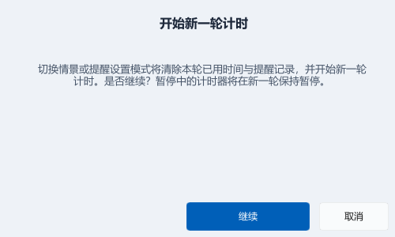
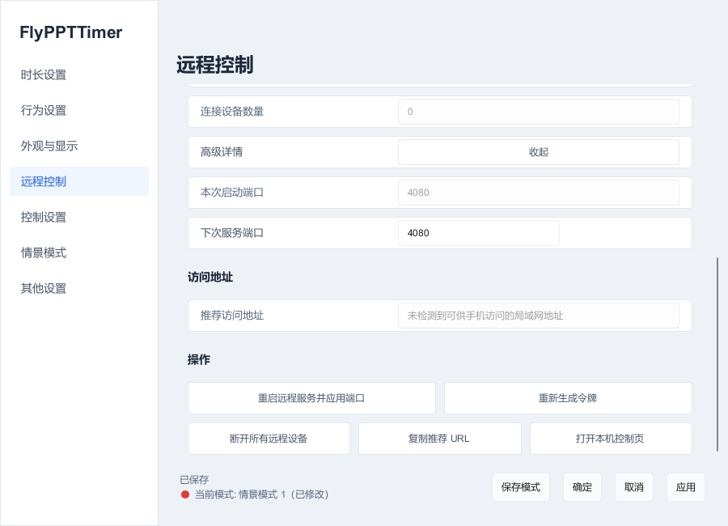
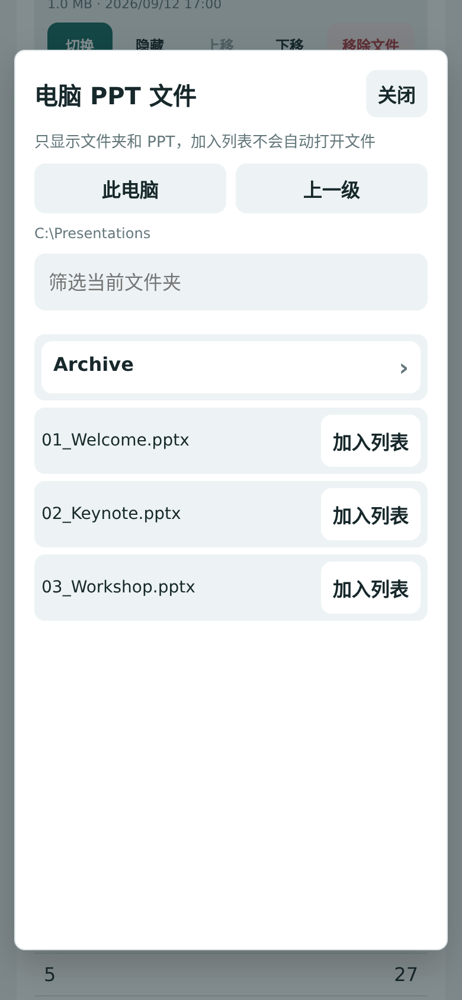

# FlyPPTTimer v1.18.0 用户指南

[首页](../README.zh-CN.md) · [English](USER_GUIDE.en.md) · [版本说明](RELEASE_NOTES_v1.18.0.zh-CN.md)

本手册适用于当前 **v1.18.0，Windows 10 / 11 x64**。你可以单独使用本地计时器，也可以配合桌面版 Microsoft PowerPoint／WPS 演示使用。标有 **Pro（高级版）** 的功能，需要有效高级版授权或经明确确认的体验授权。

## 目录

1. [系统要求与安装](#install)
2. [快速开始：一场八分钟报告](#quick-start)
3. [三个桌面窗口与第一次计时](#windows)
4. [PowerPoint／WPS 联动、计时模式与文件规则](#presentation)
5. [简单／自定义提醒与超时提醒](#reminders)
6. [可选排练悬停控制条——免费](#hover-controls)
7. [手机／浏览器遥控与文稿浏览授权——Pro](#remote)
8. [多屏、外观、位置与快捷键](#appearance)
9. [情景模式](#scenarios)
10. [演讲复盘与排练基准](#review)
11. [诊断中心与连接恢复](#diagnostics)
12. [免费版、高级版、许可与七天体验](#pro)
13. [设置、升级、迁移与备份](#maintenance)
14. [故障排除](#troubleshooting)
15. [反馈、隐私与法律说明](#privacy)

## 1. 系统要求与安装

独立计时不需要 Office 或 .NET。识别幻灯片、控制放映，需要电脑安装兼容的**桌面版** PowerPoint 或 WPS 演示。手机只需要浏览器；遥控与浏览器大屏通过局域网连接，均需 Pro。

从 [GitHub v1.18.0 发布页](https://github.com/Hona-Cao/FlyPPTTimer/releases/tag/v1.18.0)或 [Gitee 发布页](https://gitee.com/hona-cao/fly-ppttimer/releases)下载正式 Windows x64 软件包。

| 软件包 | 安装方法 |
|---|---|
| 便携版 `portable-win-x64.zip` | 完整解压到可写入的文件夹，运行 `FlyPPTTimer.exe`。保留同目录 DLL 和其他程序文件。 |
| 安装版 `setup-win-x64.zip` | 解压 ZIP，运行其中的安装 EXE，按向导选择语言和安装位置。 |

已有版本请先阅读[备份与升级步骤](#maintenance)。关闭演示软件或更新前，先保存尚未保存的文稿。

## 2. 快速开始：一场八分钟报告

1. **启动 FlyPPTTimer。** 找到计时浮窗和 Windows 通知区图标；图标可能收在任务栏的隐藏图标菜单里。
2. **设置限时。** 右键浮窗或通知区图标 → **设置 → 时长设置**。保持“无限制”关闭，填写 `00:08:00`，选择“倒计时”，点击“应用”。
3. **设置一条提醒。** 打开**行为设置**，选择“简单”，启用“结束前提醒”，在“结束前 HH:mm:ss”填写 `00:01:00`。选择需要的声音／闪烁／语音效果，再点“应用”。
4. **试用计时操作。** 使用默认快捷键时，按 **F3** 开始，再按一次暂停，再按一次继续；**F4** 停止并重置。如果先练习独立计时，请在行为设置关闭“全屏白名单自动开始”。
5. **配合幻灯片排练。** 在桌面版 PowerPoint／WPS 打开文稿，按需要启用自动开始，进入放映。正式使用前检查时间、页码、声音输出和浮窗位置。

以上本地流程免费。手机连接是可选项，需要时再按[遥控步骤](#remote)设置。

## 3. 三个桌面窗口与第一次计时

| 窗口 | 用途 |
|---|---|
| 计时浮窗 | 显示主时间、当前页秒数和当前页／总页数。关闭鼠标穿透与位置锁定后可以拖动。 |
| 设置 | 包含时长设置、行为设置、外观与显示、远程控制、控制设置、情景模式、其他设置七个页面。 |
| 电脑“远程控制”窗口 | 显示连接信息与二维码，并在“演示文稿”页管理文件规则和放映操作。 |

手机／浏览器控制页是另一个界面，分为**计时**和**演示文稿**两个页签。[演讲复盘](#review)与[诊断中心](#diagnostics)也各有独立窗口。

### 看懂读数和操作

主读数显示演讲时间。下方一行可在左侧显示当前页秒数，在右侧显示 `3 / 20` 这样的页码进度。新配置默认启用逐页秒表；尚未识别到放映时，已启用的两项分别显示 `00` 和 `-/-`。在**外观与显示**中可以分别开关。

**暂停／继续**保留本轮进度；**重置**清除本轮并停止；**重新开始**清除后开始新一轮。隐藏浮窗不会停止计时。关闭设置后程序仍在运行；完全退出请使用通知区菜单的“退出”。

### 保存设置

**应用**保存并保留设置窗口；**确定**保存并关闭；**取消**放弃尚未应用的编辑。回车或离开输入框只是结束输入，不能代替“应用／确定”。

底部会标记未保存的修改。外观调整可以立即预览；取消会恢复上次已应用的状态。配置导入、重新生成令牌等按钮会执行各自操作，请先阅读相关确认提示。

## 4. PowerPoint／WPS 联动、计时模式与文件规则

### 让放映与计时联动

1. 在桌面版 PowerPoint／WPS 打开本地 `.ppt`、`.pptx` 或 `.pptm` 文件。
2. 在**设置 → 行为设置**选择是否启用“全屏白名单自动开始”，让识别到的程序进入全屏时自动开始计时。
3. 分别设置“退出全屏时停止计时”和“退出全屏时重置”，再点“应用”。它们作用于自动开始的全屏计时过程：停止结束计时，重置让读数回到初始值。退出全屏后仍要继续计时，就关闭这两项。
4. 开始放映，确认当前页／总页数显示正确。需要中途休息时，用 F3 或“暂停”控件暂停，之后继续。

全屏自动识别还包括部分浏览器和 PDF 阅读器。若这些程序全屏时不应开始计时，请关闭自动开始。暂时无法读取演示状态，不代表放映已经结束。

通过 FlyPPTTimer 打开文稿时，使用 Windows 当前的 `.ppt/.pptx/.pptm` 文件关联。需要用 PowerPoint 或 WPS 打开，请先在 Windows 修改默认应用。浏览器中的演示编辑器不提供同样的桌面幻灯片控制联动。

  
   
  <em>真实 PPT 放映画面：计时器位于顶部中间。这里只是本次演示的位置，可按显示器、定位与偏移设置自定义。</em>

### 倒计时、正计时与无限制

**倒计时**从有限目标时长向下计时；**正计时**从零显示已用时间，但仍按有限目标触发提醒和到时操作。

默认时长旁的**无限制**适合开放式授课、讨论。应用后使用无目标正计时；倒计时、目标提醒、到时操作和超时样式不生效。无限制开启期间，一分钟增减和时长预设不执行。文件规则继续保存，关闭无限制后可以重新生效。

**自动（按内容与字号）**是“外观与显示”中的窗口大小选项，用来容纳读数；它与计时模式、放映自动开始是不同设置。

### 到达目标时做什么

在**时长设置**中选择“时间到后的操作”：

| 操作 | 结果 |
|---|---|
| 仅提示 | 使用当前提醒配置；按照该模式的超时设置，在目标处停止或继续超时。 |
| 黑屏并显示“时间到” | 结束放映、停止并重置计时，显示全屏“时间到”。按 Esc 或使用手机对应控件解除。 |
| 退出放映 | 结束放映、停止并重置计时；文稿仍保持打开。 |

需要持续超时，请选择“仅提示”，并启用当前提醒模式对应的[继续超时选项](#overtime)。结束放映或显示“时间到”全屏会阻止超时后提醒。

### 为每份文稿设置独立时长

1. 打开**设置 → 时长设置 → 文件规则**，点击“添加文件”。
2. 选择一份或多份支持的 PPT 文件。选中规则，填写时长，选择倒计时／正计时，并启用。
3. 点击“应用”或“确定”。
4. 使用对应文稿放映时，已启用规则优先于默认时长和模式。

规则按完整路径匹配。文稿移动或改名后，请登记新路径。删除规则只移除列表条目，不删除文稿。

多条规则可用 Ctrl+单击或 Shift+单击选中，再通过“批量设置”统一时长和模式。电脑**远程控制 → 演示文稿**也能编辑规则；在该窗口修改后点击“保存”。

### 当前页秒数与逐页累计用时

浮窗秒表显示这次停留在**当前页**的秒数，例如 `09`、`65`、`123`。切换页码后，本次停留读数归零。先在第 1 页停留 20 秒，返回后再停留 10 秒，逐页统计累计为 30 秒，而浮窗显示本次的 10 秒。

暂停／继续控件会暂停／恢复逐页计时；重置／重新开始会清除当前计时反馈。只有有效识别到的放映时间才计入；缺失或无法读取的采样不会用猜测时间补齐。

手机上展开**演示文稿 → 本次放映逐页用时**查看累计值。结束放映后保留最后的表格，当前停留读数清零。完成的放映历史可在[演讲复盘](#review)查看；计时不会修改 PPT 本身。

## 5. 简单／自定义提醒与超时提醒

打开**设置 → 行为设置 → 提醒设置模式**。“简单”提供少量共用选项；“自定义”允许逐条编辑提醒点和效果。两种模式免费版均可使用。

新安装默认使用简单模式。已有设置和未标记提醒模式的情景快照，以自定义模式打开，保留详细提醒。**两套配置独立保存**：切换或编辑一套，不会覆盖另一套；情景也保存两套。

### 设置简单提醒

1. 选择“简单”。
2. 启用“结束前提醒”，在“结束前 HH:mm:ss”输入正值。八分钟报告填写 `00:01:00`，表示讲到七分钟时提醒，不是开始后一分钟提醒。启用的提前量不能超过已配置的有限默认时长。
3. 需要到时提醒，启用“计时结束”。
4. 需要超时后提醒，先按[下方步骤](#overtime)允许继续超时，再启用“超时后提醒”，填写正值“结束后 HH:mm:ss”，例如 `00:00:30`。
5. 选择共用的**声音／闪烁／语音**效果，点击“应用”。

简单模式下，已启用的提醒使用共用效果。各提醒需要不同声音、语音开关或闪烁方式时，请使用自定义模式。

### 设置自定义提醒点

1. 选择“自定义”，启用一条结束前“提示”，展开该行。
2. 填写“距离预设时间还剩（秒）”。八分钟报告填 `120`，表示六分钟时提醒；填 `30`，表示七分三十秒时提醒。建议提前量设在计划时长内。
3. 设置语音播报、按需选择提示音和闪烁样式。展开“计时结束”，单独设置到时效果。
4. 要添加结束后的提醒，先允许继续超时，再点击“新增超时后提醒”。展开该行，填写“结束后 HH:mm:ss”；每个超时后偏移必须为正值，且不能重复。
5. 应用设置，再完整排练一次提醒顺序。

免费版运行**一个最接近结束时刻的已启用提前提醒点**、“计时结束”，以及**一个最接近结束时刻的已启用超时后提醒点**。例如提前 120 秒和 30 秒两点都启用时，免费版运行 30 秒点；超时后 30 秒和 60 秒都启用时，运行 30 秒点。Pro 运行多个已启用提醒点；没有 Pro 时，额外配置仍保留。

自定义提示音可选短的 `.mp3`、`.wav`、`.wma` 或 `.m4a` 文件。清除某条提醒的自选提示音，会恢复该条声音选择，不会重置整个程序。

闪烁样式可选无、文字、背景、实线边框或边框加背景。闪现／隐藏间隔单位为毫秒，整组持续时间单位为秒；350 毫秒就是 0.35 秒。语音与提示音从电脑的输出设备播放，请检查设备和静音状态。

### 开启超时与超时后提醒

1. 在**时长设置**将“时间到后的操作”设为“仅提示”。
2. 使用**简单模式**时，在**行为设置**启用“继续超时计时”；使用**自定义模式**时，在**时长设置 → 到达预设时间后**选择“继续显示超时”。
3. 回到行为设置，启用超时后提醒点，设置正值的结束后偏移，再点“应用”。
4. 让一次有限时长排练超过目标；`00:00:30` 的结束后提醒，会在实际超时 30 秒后触发。

超时后控件不可用时，已保存的设置仍保留。在目标处停止、无限制或暂停期间，不会触发超时后提醒。

自定义模式可展开“计时结束”，设置超时文字／背景颜色和超时前缀。提醒闪烁配色与普通计时配色分开。重置／重新开始会为新一轮准备提醒；暂停／继续保留进度及已触发状态。

### 更换本轮配置前确认

**运行或暂停时**，切换提醒模式，或应用**任意情景**（包括再次应用当前情景），都需要在电脑确认新一轮计时。

- **取消：**保留已用时间及当前提醒、逐页反馈。
- **确认：**清除当前已用时间、提醒和逐页反馈，按所选设置开始新一轮；原本运行的仍运行，原本暂停的仍暂停。
- **停止状态：**直接应用修改。

手机发起本轮情景切换时，请到电脑完成确认。建议在演讲开始前选好提醒模式和情景。

## 6. 可选排练悬停控制条——免费

1. 打开**设置 → 控制设置**。
2. 勾选“显示排练控制条”，点击“应用”。该功能**默认关闭**，免费版可用。
3. 将鼠标移到计时器上，展开小型菜单；在计时器与菜单之间移动即可操作。
4. 鼠标离开两者约 **700 毫秒**后，菜单收回。

<table>
  <tr>
    <td width="50%" align="center"></td>
    <td width="50%" align="center"></td>
  </tr>
  <tr>
    <td align="center"><strong>菜单收起：主时间、当前页秒数与页码</strong></td>
    <td align="center"><strong>菜单展开：重置、重新开始、暂停与继续</strong></td>
  </tr>
</table>

<em>真实截图的顶部局部裁切；两张拍摄于不同计时时刻。点击局部图可查看对应完整放映画面。</em>

| 控件 | 作用 |
|---|---|
| 重置，圆角方块图标 | 清除本轮并停止。 |
| 重新开始，圆形箭头图标 | 清除后开始新一轮。 |
| 暂停，暂停图标 | 运行时可用，保留进度。 |
| 继续，播放图标 | 暂停时可用，继续本轮。 |

菜单是独立窗口，有自己的圆角，与计时器保持 **2 DIP** 间距，即随 Windows 缩放适配的小间隙。通常出现在右侧，靠近屏幕右边缘时可改到左侧。展开菜单不会移动、压缩或改变主计时读数。

颜色、不透明度、主题、形状和自动／自定义高度会跟随计时器。控制条跟随普通计时浮窗；专用全屏计时器继续承担时间显示用途。

**开启鼠标穿透时，菜单完全不显示，也不可点击。** 要使用它，请从通知区图标打开设置，先关闭鼠标穿透。

## 7. 手机／浏览器遥控与文稿浏览授权——Pro

遥控服务运行在电脑上，提供局域网浏览器控制页。体验确认、在线激活需要互联网；局域网连接是否可用，则取决于手机和电脑能否相互访问。

### 连接手机

1. 确认高级版授权有效，或明确开始[七天体验](#trial)。
2. 手机和电脑接入同一个 Wi-Fi，也可以让电脑连接手机热点。
3. 在**设置 → 远程控制**启用遥控并应用，再从浮窗／通知区菜单打开**远程控制 → 远程连接**。
4. 确认服务已运行，扫描**自己电脑上的实时连接二维码**，在手机浏览器打开。
5. 等待显示已连接，先测试开始／暂停，再控制放映。

使用窗口显示的电脑局域网地址，不要改成热点网关。网络、端口或令牌改变后重新扫码。无需安装手机应用；手机界面语言由浏览器语言环境决定，主题可跟随电脑或另行选择。

### 网络与高级详情

电脑端“高级详情”默认折叠。需要查看地址、端口、重启服务、管理令牌或防火墙帮助时再展开。

服务尽量复用保存的端口，无法使用时选择可用端口。连接时以**当前**地址为准，不要只记旧端口。修改“下次服务端口”后，点击“重启远程服务并应用端口”，再重新连接。

手机打不开时，先在电脑点击“打开本机控制页”。本机正常则检查访客 Wi-Fi 的设备隔离、VPN 路由和 Windows 防火墙。使用提供的防火墙修复命令前核对当前端口；复制命令不会修改系统。确有需要时，在管理员终端执行检查过的命令。只放行所需程序／端口，不要关闭整个防火墙。

“重新生成令牌”会使旧控制地址失效；“断开所有远程设备”结束当前访问，之后使用新连接信息重连。完整控制地址与实时二维码应保密。

### 使用浏览器计时页

开始、暂停、继续、停止／重置和重新开始控制电脑计时器。显示／隐藏只改变可见性，不停止计时；闪烁触发视觉提醒；电脑音量控制影响电脑主输出静音状态。“解除时间到黑屏”关闭 FlyPPTTimer 的全屏到时提示。

**+30 秒／+1 分钟——Pro：**在**正在运行或暂停的有限时长本轮**点击即可延长。多次点击累计增加，暂停状态仍保持暂停。停止、结束和无限制状态不能延长。

这些按钮**只改变本轮**，不修改默认时长、文件规则或情景快照；重置／重新开始会清除增加的时间。倒计时和有限正计时都使用延长后的结束点；延长将某条提醒移回未来时，该提醒可能重新具备触发条件。

需要修改**保存的默认时长**，请使用手机计时页直接显示的**时长调整**卡片，修改时／分／秒，再点击**应用时长**。这与给本轮加时是两项操作。

已有文件规则时，手机会让你选择**仅修改全局**（修改默认时长，保留文件规则）或**同步全部**（同时将所有文稿规则设为新时长）。没有文件规则时直接应用，不出现这项选择。

运行／暂停期间应用保存时长，会按新时长从初始时间重开本轮，清除临时延长和计时反馈；原本运行的仍运行，原本暂停的在重开后再次暂停。这不需要切换情景／提醒模式所用的桌面新一轮确认；上面的手机选择只决定是否同步文件规则。

*本图使用隔离示例数据，不代表已完成真实手机与 PowerPoint／WPS 放映联动验收。*

### 单独允许浏览电脑 PPT 文件

连接遥控**不等于获得文件夹浏览权限**。“允许手机浏览电脑 PPT 文件”默认关闭。只需要计时、翻页时，可以保持关闭。

1. 连接手机。尚未允许浏览时，新识别到的手机连接可以打开电脑远程设置并突出该权限。
2. 在电脑勾选“允许手机浏览电脑 PPT 文件”，点击**应用**或**确定**。仅勾选、按回车或关闭提示，不会保存授权。
3. 手机打开**演示文稿 → 浏览电脑 PPT 文件**。已打开的浏览面板若仍提示无权限，关闭后重新打开。
4. 进入主目录或本地磁盘，逐层打开文件夹，在当前目录筛选名称。筛选不是全盘搜索。
5. 在 PPT 旁点击“加入列表”，关闭浏览面板，再从受控列表选择、打开、放映。加入列表不会打开文稿，也不会修改内容。

*这张手机文件浏览兼容视图来自较早版本；桌面授权与操作位置请以以上当前步骤为准。*

没有自动提示时，手动打开**设置 → 远程控制**。已经提示过的手机、本机浏览器访问不会反复打开引导。撤销时取消勾选并应用，不会删除规则或关闭文稿。

这是一项面向持有有效遥控地址／令牌设备的共用权限，不是只批准提示中那一部手机。它会显示文件夹／PPT 名称，并允许加入本地文稿；不提供任意下载、上传、编辑、删除或网络共享浏览。

### 在浏览器控制放映

1. 在电脑添加并保存文件规则，使用已授权文件浏览，或对电脑已打开文稿使用“添加已打开文稿 → 加入列表”。
2. 选中列表文件，点击“打开”，等待操作完成。
3. 选择“从头放映”或“从当前页放映”。
4. 使用上一页／下一页，或输入页码后跳转。
5. 完成后点击“结束放映”。

黑屏／恢复、白屏／恢复暂时遮住放映内容，与 FlyPPTTimer 的“时间到”画面不同。

文件可按名称、大小、修改时间或手动顺序排序。拖动排序前先长按；上移／下移也会切换为手动顺序。“隐藏”将已完成文稿从普通列表收起，“显示隐藏／恢复”可找回；移除文件只移除列表成员，不删除磁盘文件。

结束放映只结束播放；关闭当前文稿关闭当前文档，关闭上次打开文稿关闭最近通过控制操作打开的文件。只有已连接到可控演示软件，且其中没有未受控文稿时，才允许退出演示软件。先保存需要的修改；演示软件的保存提示需在电脑处理。

### 在另一台设备的浏览器显示计时——Pro

1. 启用遥控，确认局域网连接正常。
2. 在电脑远程连接窗口展开高级详情，点击“打开浏览器大屏”在本机查看，或“复制大屏地址”供同网其他设备使用。
3. 在目标浏览器打开大屏地址，按需使用浏览器全屏模式。

显示端使用大屏地址，操作端使用控制地址，两者都应保密。断线时浏览器大屏保留**最后有效画面**，显示重连提示并自动重试。该画面可能已经过时；使用前核对电脑的实时计时。

## 8. 多屏、外观、位置与快捷键

### 调整为清楚的计时显示

打开**设置 → 外观与显示**。应用界面可跟随系统、使用浅色或深色；计时器可选择配色方案或逐项调整颜色。界面主题不会覆盖计时器配色。

窗口大小选**自动（按内容与字号）**，可随读数自适应。使用自定义尺寸时，增大字号后要留足宽高。当前页／总页数和逐页秒表可以分别启用；字号／颜色跟随选项可让大字时间下方保持较小的辅助信息。

形状包括直角矩形和小／中／大圆角矩形。新配置默认 **RoundedSmall（小圆角矩形）**，升级保留旧配置形状。背景不透明度范围为 0–100%，改变背景而不是隐藏文字。可用滑块、滚轮或旁边输入框调整，再点“应用”。

### 摆放位置并防止误拖动

1. 需要拖动时，先在**控制设置**关闭鼠标穿透和位置锁定。
2. 直接拖动，或在外观与显示选择默认点位，再调水平／垂直微调。
3. 要恢复点位定位，点击“重置计时窗口位置”。
4. 应用后，按需要启用“锁定窗口”。

偏移范围 -50% 到 50%，支持 0.1 个百分点精度；水平正值向右，垂直正值向下。零偏移时，上／下点位贴齐实际完整屏幕边缘；居中点位使用完整屏幕宽度，不受侧边任务栏挤偏。已保存的非零偏移继续保留。

**鼠标穿透**让点击落到计时器后方程序，并隐藏排练菜单；**锁定窗口**防止拖动。无法点击浮窗时，从通知区图标修改这两项。

### 多屏与只显示时间的大屏

只让讲者看到小浮窗，关闭“所有屏幕同时显示”，选择讲者屏幕；开启后，在适用屏幕显示同一轮计时。

设置独立全屏计时器：

1. 在 Windows 显示设置选择“扩展这些显示器”。
2. 在 FlyPPTTimer 外观与显示启用大屏计时器，选择扩展屏。
3. 活动前核对目标屏幕，大屏计时会占满它。
4. 需要**只显示时间**，保持大屏辅助信息关闭；该屏也需要页码、逐页秒数时再启用。

普通浮窗与大屏辅助信息分别控制。大屏计时器所在屏幕不会重复叠加普通小浮窗。

### 默认快捷键

| 快捷键 | 作用 |
|---|---|
| F3 | 开始／暂停／继续。 |
| F4 | 停止并重置。 |
| F5 | 显示／隐藏普通浮窗。 |
| F7 | 触发视觉闪烁。 |
| F8 | 切换电脑主音频输出静音。 |
| Ctrl+Alt+↑／↓ | 将配置时长增加／减少一分钟。 |
| Ctrl+Alt+1／2／3／4／5 | 选择 3／5／8／10／15 分钟预设时长。 |

三个主要快捷键可在控制设置选择 F1–F12。不同操作请使用不同按键，并检查与其他软件冲突；部分笔记本需要 Fn。时长快捷键修改配置限时，与遥控的本轮临时加时不同；无限制期间不执行。

托盘最小化与关闭按钮行为决定窗口收进通知区还是退出。要彻底结束程序，使用托盘“退出”。

## 9. 情景模式

情景将计时、两套提醒、计时器外观、显示器、位置、控制和文件规则保存成一套工作配置。语言、应用界面主题、更新设置、遥控凭据、授权及复盘历史不属于该快照。

免费版有**一个可用情景**，Pro 最多支持**八个**。新配置包含“情景模式 1”，可以重命名并覆盖；没有 Pro 时，额外已保存情景继续保留。

### 保存或更新一套配置

1. 调整工作设置，点击“应用”。
2. 有可用名额时，在设置底部点击“保存模式”，输入名称并确认，创建新快照。
3. 更新已有快照时，打开**情景模式**，展开对应行，使用“用当前配置覆盖”。
4. 在展开行按需要修改名称、全局切换快捷键或角标颜色。

列表按新建时间倒序排列，初始折叠。“已修改”表示当前属于快照的设置与保存内容不同；编辑不会自动覆盖快照。删除情景需要确认，不会删除 PPT 文件。

### 切换一套配置

可从情景行、指定快捷键、浮窗／托盘情景菜单，或手机计时页的情景选择器切换。底部显示当前情景，切换后计时边框短暂显示该情景颜色。

运行／暂停时，**每一次应用情景**，包括重新应用当前情景，都需要[新一轮确认](#fresh-round)。手机发起切换时在电脑确认；取消保留本轮，确认清除反馈并保留运行／暂停状态。

## 10. 演讲复盘与排练基准

### 查看一次已完成放映——免费

1. 完成一次可识别的桌面 PowerPoint／WPS 放映并结束。
2. 从浮窗／通知区菜单打开**演讲复盘**。
3. 选择历史记录，先读摘要，再向下查看逐页详情。

**本次有效用时**是有效记录的逐页累计时间，不是简单计算开始到结束的钟表间隔。暂停、无法有效读取的时段会使两者不同。

有限时长的摘要按**最终目标**显示提前、超时或恰好达标，并标出**累计**用时最长的页，包含返回该页的多次停留。

发生本轮临时加时后，摘要显示**原计划 + 增加时间 + 最终目标**。例如八分钟加一分钟，最终目标九分钟，目标比较按九分钟计算。无限制记录不做目标比较。

下方仍可查看访问页数／总页数、平均用时、用时最长页和逐页条形图。历史最多保留 20 条完成记录；不再需要时才删除条目或清空。旧记录仍可读取。

### 选择排练基准——Pro

1. 完成该文稿的一次排练。
2. 在复盘中选中这条记录，点击“设为排练基准”。
3. 再次放映**同一文件**，复盘可显示实时节奏信息，并在完成后比较相对所选排练更快或更慢。
4. 点击“取消排练基准”可以解除选择。

不会自动选择基准。完成后的比较使用本次与基准各自的有效用时，与计划目标比较分开。基准按文稿路径匹配，移动文件可能无法匹配；删除基准记录也会移除该基准。

免费版保留完整基础复盘；基准选择与节奏比较需要 Pro。

## 11. 诊断中心与连接恢复

### 收集安全状态报告——免费

1. 从**设置 → 其他设置 → 诊断中心**或通知区菜单打开。
2. 点击“刷新”，更新本地状态快照。
3. 使用“复制安全摘要”写入求助信息，或“导出诊断报告”保存 UTF-8 报告。
4. 同时说明遇到的问题与相关步骤。

诊断包含程序、演示观察、显示器、遥控／浏览器大屏、授权摘要和更新状态。报告不包含令牌、激活材料、文稿路径／内容、个人数据、原始配置或原始日志。刷新不会开始体验、联网验证许可或检查更新。

### 恢复遥控或浏览器大屏

遥控报告监听停止／故障时，打开高级详情，点击“重启远程服务并应用端口”。检查新状态；地址变化后重新扫描当前二维码。

浏览器大屏断线期间保留最后有效画面并自动重试。服务重启后等几秒；仍未连接则核对网络，并重新打开当前大屏地址。

### 谨慎分享日志

**其他设置 → 打开日志目录**查看的是原始日志。诊断导出**不含**日志，也不是日志脱敏工具。

确需提交日志时，复现问题、记录时间，只复制相关片段，先移除私人路径、文稿名称、连接凭据和激活材料。不要默认上传整份配置或整个日志目录。

## 12. 免费版、高级版、许可与七天体验

| 能力 | 免费版 | Pro |
|---|---|---|
| 本地倒计时／正计时、无限制、放映联动与文件规则 | 包含 | 包含 |
| 多屏浮窗、大屏计时、外观、快捷键与配置备份 | 包含 | 包含 |
| 简单提醒；自定义到时提醒及结束前后各一个最近启用点 | 包含 | 包含 |
| 多个已启用自定义提醒点 | 额外点保留但不运行 | 可用 |
| 情景模式 | 一个可用 | 最多八个 |
| 排练悬停控件、诊断中心与基础复盘 | 包含 | 包含 |
| 手机／浏览器遥控、本轮手机加时与浏览器大屏 | 需要 Pro | 包含 |
| 排练基准与节奏比较 | 需要 Pro | 包含 |

Pro 不可用时，不会删除额外提醒、情景或历史。额外高级配置继续保存，恢复 Pro 后重新可用；免费版仍可进行本地计时。

### 开始或重新确认体验

1. 打开**设置 → 其他设置 → 高级版授权**。
2. 查看授权状态，准备好试用高级功能后再选择“开始体验”。
3. 明确接受体验确认，并联网获取服务响应。
4. 正式活动前检查显示的授权状态和截止时间。

安装、启动、检查更新、打开诊断中心都不会自动开始体验。体验从**首次服务端领取起持续 168 小时（七天）**；重装、重启、重新解压便携版、重置或导入配置，都不会重开这段期限。

**未到期体验在程序重启后仍需联网重新确认。** 出现“联网确认体验”时使用该操作；重启后仅有本地缓存不够。重新确认沿用原截止时间，不会再增加七天。

### 购买与激活高级版

在**高级版授权**使用购买入口，查看当前套餐与每台设备价格。

- **Patreon／国际：**从设置打开商店，购买单设备永久许可，复制包含设备编号的 Patreon 激活消息，在 Patreon 私信发给作者。付款核实后在该会话返回激活码。
- **支付宝／中国大陆：**使用软件内付款信息，在付款备注填写接收邮箱，再将完整设备编号与所选套餐发至设置中的激活邮箱。付款核实后返回激活码。

在高级版授权输入收到的激活码。若收到 **FPTL1 设备绑定签名离线许可**，使用离线许可输入；付款凭证本身不是激活码。确认设备编号对应要使用的电脑；其他设备许可不能作为配置备份使用。

年费授权按授权期限到期，永久授权按签发条款使用。遇到激活、到期、时钟或授权数据损坏错误，按具体提示处理，必要时联系支持。不要通过修改系统时钟或删除许可文件尝试重置授权。配置导入／导出、情景和恢复默认都不转移或重置许可状态。

## 13. 设置、升级、迁移与备份

### 语言与软件更新

在**其他设置**选择跟随系统、English 或简体中文，提示需要重启时再重启。

在软件更新选择 **Gitee** 或 **GitHub**。没有保存选择时，根据 Windows 地理区域：中国大陆选 Gitee，其他区域选 GitHub，不使用 GPS；用户明确保存的选择继续保留。

默认启用启动更新检查。手动检查会报告结果；启动时未发现新版或临时网络失败会保持安静。接受“下载并安装”前，阅读完整版本说明；安装需确认，并会重启程序。

安装版更新会下载、解压安装包并运行安装器；便携版更新替换程序文件，保留 `FlyPPTTimer.config.json` 和 `alert-sounds`。请先备份，并确认目标目录可写。

### 备份与迁移设置

1. 应用需要保留的编辑。
2. 使用**其他设置 → 配置导出**保存 JSON。
3. 通过“打开配置目录”找到 `FlyPPTTimer.config.json`，备份它，并另行复制 `alert-sounds` 文件夹。
4. 另行复制文稿；在新电脑导入 JSON，核对显示屏与文稿路径，测试提醒。

导出包含设置、情景和文件规则，不打包 PPT、自定义提示音、许可或复盘历史。需要保留复盘历史时，迁移前另行备份本地历史文件；“打开配置目录”可帮助找到程序数据。

恢复默认会替换设置，先导出需要的内容；该操作不会产生新的体验期。

### 手动升级

**便携版：**退出旧程序，将完整新版解压到新的可写文件夹，将保存的配置和 `alert-sounds` 复制进去，再运行新版。另留旧数据备份，不要用 ZIP 的默认配置覆盖个人设置。

**安装版：**退出程序，在原安装目录运行新版安装器。已有配置会保留，仍建议事先备份并在升级后核对。

迁移到 v1.18.0 时，未标记提醒模式的旧配置／情景使用**自定义**，保存的形状保持不变；排练控制条除非已保存为开启，否则仍关闭。新配置使用**简单**和小圆角矩形。旧复盘记录继续可读，缺少延长字段的记录按未加时处理。

升级后检查时长、提醒模式、超时策略、文稿路径、显示屏与遥控连接。卸载安装版使用 Windows 应用列表；便携版先退出，再删除程序目录，提前备份要保留的数据。

## 14. 故障排除

| 问题 | 检查方法 |
|---|---|
| 找不到计时器 | 尝试已设置的显示／隐藏键，默认 F5。从通知区打开设置，检查可见性、目标屏幕、颜色、尺寸，使用重置计时窗口位置。 |
| 不能点击或拖动计时器 | 关闭鼠标穿透；需要移动时也关闭锁定窗口。从通知区图标进入设置。 |
| 排练菜单不出现 | 启用显示排练控制条并应用，再把鼠标移到普通浮窗上；鼠标穿透会完全隐藏菜单。 |
| 时间或辅助信息被截断 | 选择自动尺寸，或增大自定义宽高，尤其是改大字号后。 |
| 设置恢复旧值 | 结束输入后点击应用／确定，检查未保存提示。 |
| 没有页码／逐页用时 | 启用相应显示，使用支持的桌面 PowerPoint／WPS 放映，在诊断中心检查演示观察状态。 |
| 文件使用了错误时长 | 核对完整路径规则、启用状态、是否保存及无限制开关；移动／改名会改变文件匹配。 |
| 计时意外开始 | 检查全屏白名单自动开始；浏览器／PDF 全屏也可能触发，需要时改用手动 F3。 |
| 结束放映后意外停止／重置 | 分别检查退出全屏时停止和重置选项。 |
| 提醒未触发 | 检查当前模式、启用、时间偏移、效果与有限目标；免费版运行结束前后各一个最近的自定义启用点。 |
| 没有声音或语音 | 检查电脑静音、输出设备和所选效果；默认 F8 切换系统静音。 |
| 超时后控件不可用 | 选择仅提示，并开启当前模式的继续超时；无限制与结束放映类到时操作不触发超时后提醒。 |
| 手机不能连接 | 检查 Pro 状态、服务、当前二维码／地址、同网互访、访客隔离、VPN 和当前防火墙端口；先试本机控制页。 |
| 手机已连接但不能浏览文件 | 在电脑启用独立浏览权限并应用，重新打开手机浏览面板。 |
| 手机文件列表为空 | 添加并保存规则，或使用添加已打开文稿／已授权电脑文件浏览。 |
| 遥控计时正常但不能翻页 | 核对目标文稿已在支持的桌面 PowerPoint／WPS 打开且正在放映，等待进行中的操作完成。 |
| 手机不能延长 | 需要 Pro 和运行／暂停的有限时长本轮；结束、停止和无限制不能延长。 |
| 切换情景／提醒要求重开 | 运行／暂停时需要新一轮；取消保留本轮，手机情景切换在电脑确认。 |
| 大屏计时不可用 | 接入外屏，在 Windows 选择扩展这些显示器。 |
| 浏览器大屏像是停住了 | 可能正在重连并保留最后有效画面；检查服务与网络，重新打开当前大屏地址。 |
| 重启后体验不能离线使用 | 联网明确确认未到期体验，原截止时间不变。 |
| 复盘时间与活动总时长不同 | 复盘累计有效逐页用时，包含返回页的停留，不计未记录间隔；目标比较使用最终目标。 |

活动前，请用自己的 Office／WPS 版本、实际显示器及缩放、声音输出和手机网络完整排练。软件与隔离检查不代表所有真实设备组合均已验证。若出现重复计时区域、浅色遮罩或异常悬停显示，请记录屏幕、缩放和当时状态，附脱敏截图反馈。

## 15. 反馈、隐私与法律说明

可提交 [GitHub Issue](https://github.com/Hona-Cao/FlyPPTTimer/issues)，或使用其他设置中的联系入口。提供 v1.18.0、Windows 与 PowerPoint／WPS 版本、复现步骤、预期／实际结果及安全诊断摘要；相关时补充屏幕缩放、网络情况。

公开反馈前移除完整遥控／大屏地址、二维码、激活材料、设备编号、私人路径和文稿内容。只在可信局域网与设备使用，不要把遥控端口转发到公网；不需要浏览时撤销权限，连接凭据泄露后重新生成令牌。

文件规则与复盘历史可能标识本地文稿；原始配置和日志并不自动适合公开。诊断导出会有意排除这些敏感输入。

FlyPPTTimer v1.18.0 适用其[许可条款](../LICENSE)，另见[第三方声明](../THIRD_PARTY_NOTICES.md)与[商标说明](../TRADEMARKS.md)。免费／高级功能可用性不代表获得再分发权。Microsoft PowerPoint 与 WPS 商标归各自权利人所有；FlyPPTTimer 是独立的配套应用。
